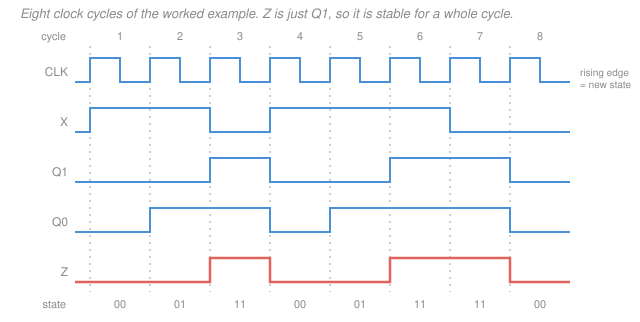

# Digital Logic Design · Lesson 3.3: Analysis of synchronous circuits

> ⏱ ~15 min · Module 3: Sequential logic and finite-state machines · Builds on: [3.2 Flip-flops and clocking](03-02-flip-flops-and-clocking.md), [1.3 Boolean algebra and logic gates](01-03-boolean-algebra-logic-gates.md) · Unlocks: [3.4 Design of finite-state machines](03-04-design-of-finite-state-machines.md), [4.2 Counters](04-02-counters.md)

## Why this matters

Someone hands you a schematic: a few flip-flops, a tangle of gates, one clock. What does it *do*? You cannot answer by staring at it — combinational circuits you can read off a truth table, but a clocked circuit's behaviour depends on where it has *been*. This lesson gives you the mechanical procedure that turns that tangle into two artifacts you can actually reason about: a **state table** and a **state diagram**. Every counter you meet in [4.2](04-02-counters.md), every controller in [4.4](04-04-datapaths-and-a-simple-cpu.md), and every debugging session where a chip "sometimes locks up" gets settled with this procedure.

This is **analysis**: circuit in, behaviour out. [3.4](03-04-design-of-finite-state-machines.md) runs the arrow the other way — behaviour in, circuit out. Analysis comes first because it is the only way to *check* a design, and because both directions pass through the same two artifacts.

## The idea

Every synchronous circuit, no matter how big, has the same three-part anatomy:

1. **Flip-flops hold the state.** They are the machine's entire memory — the only thing that survives a clock tick. With $k$ flip-flops, the state is a $k$-bit pattern, so there are $2^k$ possible states.
2. **Combinational logic computes what happens next.** One pile of gates looks at the present state and the present inputs and produces the *next state*; another pile produces the *outputs*. Neither pile remembers anything — they are pure functions, exactly the objects of Module 2.
3. **The clock makes it all happen at once.** Every flip-flop is wired to the same clock. On the active edge they all swallow whatever their inputs happen to be, simultaneously. Between edges the state is frozen while the gates settle.

That's the whole model. The loop — state feeds gates, gates feed state, clock closes the loop once per tick — is drawn in the Picture below, and it is the mental model for the rest of this course.

The consequence worth internalizing: **the machine's behaviour is completely captured by a finite table**. Present state plus inputs determines next state plus outputs, with no history beyond the state itself. That is what "finite-state machine" means, and it is why a picture with circles and arrows can be a *complete* specification of a circuit.

## The formal version

**Notation for this lesson.** Complement is $\overline{A}$ (some books write $A'$). AND is juxtaposition or $\cdot$, OR is $+$, XOR is $\oplus$. For a flip-flop output $Q$, write $Q^+$ for the value $Q$ takes *after the next active clock edge* — the **next state**. (Mano writes $Q(t{+}1)$; same thing.) When several flip-flops name a state, the leftmost is the most significant bit: state `01` means $Q_1 = 0,\ Q_0 = 1$.

A synchronous machine with state vector $Q$, inputs $X$, and outputs $Z$ is fully described by two functions:

$$Q^+ = G(Q, X), \qquad Z = H(Q, X).$$

*In words: the gates compute where to go next and what to say, from where you are and what you're being told.*

### The analysis procedure

1. **Identify the state variables.** One per flip-flop. Name them $Q_1, Q_0, \ldots$ (or $A$, $B$). With $k$ flip-flops the circuit has $2^k$ states.
2. **Write the next-state equations.** For each flip-flop, read the gates feeding its *input* to get a Boolean expression in $Q$ and $X$ — then push that through the flip-flop's **characteristic equation** from [3.2](03-02-flip-flops-and-clocking.md) to get $Q^+$:
   - D flip-flop: $Q^+ = D$
   - JK flip-flop: $Q^+ = J\overline{Q} + \overline{K}Q$
   - T flip-flop: $Q^+ = T \oplus Q$
   
   With a D flip-flop the two steps collapse, which is exactly why D is the easy one. With JK or T, skipping the characteristic equation is the single most common way to get an analysis wrong.
3. **Write the output equations.** Read the gates feeding each output.
4. **Build the state table.** One row per present state ($2^k$ rows), one column group per input combination, each entry giving the next state and the output.
5. **Draw the state diagram.** One circle per state, one arrow per transition, labelled with the input that causes it.

### Mealy vs. Moore

The two machine styles differ in exactly one place: **what the output logic is allowed to look at.**

| | **Moore** | **Mealy** |
|---|---|---|
| Output depends on | state only, $Z = H(Q)$ | state **and** input, $Z = H(Q,X)$ |
| Drawn | inside the state circle | on the arrow, as `input/output` |
| Changes | only just after a clock edge | any time the input changes |
| Glitches | none — the output is effectively registered | yes — an input glitch passes straight through |
| Timing | responds the cycle **after** the triggering input | responds in the **same** cycle |
| State count | usually more | usually fewer |

*In words: Moore says "here is what I am"; Mealy says "here is what I am, given what you just told me".*

The timing line is the one people get wrong. A Moore output is a function of flip-flop outputs only, so it cannot change until the flip-flops do — one full cycle after the input that caused the transition. A Mealy output is combinational from the input, so it reacts immediately, a cycle earlier. Example 2 below shows the *same* behaviour built both ways, and the two output waveforms are one cycle apart.

**When to pick which.** Choose **Moore** when the output drives something timing-critical — another clocked block, a chip-select, a write-enable, anything where a half-nanosecond spike causes real damage. Choose **Mealy** when you need the response one cycle sooner, or when the state count matters (fewer flip-flops, less next-state logic). A common compromise: design a Mealy machine, then pass its output through one extra flip-flop. You get glitch-free edges back — at the cost of the cycle you were trying to save.

## Picture

## Worked examples

### Example 1 — a full analysis, start to finish

Here is the circuit. Two D flip-flops share one clock; one AND gate is the entire next-state logic; the output is a bare wire.

**Step 1 — state variables.** Two flip-flops, so state is $Q_1Q_0$ and there are $2^2 = 4$ states.

**Step 2 — next-state equations.** Read the gates: $D_1 = X\,Q_0$ and $D_0 = X$. Both are D flip-flops, so the characteristic equation $Q^+ = D$ applies directly:

$$\boxed{\,Q_1^+ = X\,Q_0, \qquad Q_0^+ = X\,}$$

**Step 3 — output equation.** $Z = Q_1$. No input appears, so this is a **Moore** machine.

**Step 4 — state table.** Four rows, two input columns:

*State table (Moore: the output column depends on the present state alone)*

| present $Q_1Q_0$ | $Q_1^+Q_0^+$ if $X{=}0$ | $Q_1^+Q_0^+$ if $X{=}1$ | $Z$ |
|---|---|---|---|
| `00` | `00` | `01` | 0 |
| `01` | `00` | `11` | 0 |
| `10` | `00` | `01` | 1 |
| `11` | `00` | `11` | 1 |

Each entry is just the two equations evaluated. Row `01` with $X{=}1$: $Q_1^+ = 1\cdot 1 = 1$ and $Q_0^+ = 1$, giving `11`. Row `10` with $X{=}1$: $Q_1^+ = 1\cdot 0 = 0$ and $Q_0^+ = 1$, giving `01`. Note the whole $X{=}0$ column is `00`, because $X$ multiplies into both equations.

**Step 5 — state diagram.** Panel (b) of the Picture. Three circles wired up plus one stranded one; outputs sit *inside* the circles because this is Moore.

**What does it actually do?** Read the equations as English. $Q_0^+ = X$ means $Q_0$ always holds *the previous input*. Then $Q_1^+ = X\,Q_0$ means $Q_1$ becomes 1 exactly when the current input and the previous input are both 1. So $Z = Q_1$ announces: **the last two inputs, both already past, were 1s.** It is an overlapping "two consecutive ones" detector, Moore style.

**The timing trace.** Feed it $X = $ `1,1,0,1,1,1,0,0` over eight cycles, starting from reset state `00`. Convention: the state shown for cycle $n$ is what the flip-flops hold *during* cycle $n$; the edge at the end of cycle $n$ loads the next state.

*Trace (each row read left to right, one column per clock cycle)*

| cycle | 1 | 2 | 3 | 4 | 5 | 6 | 7 | 8 |
|---|---|---|---|---|---|---|---|---|
| $X$ | 1 | 1 | 0 | 1 | 1 | 1 | 0 | 0 |
| state $Q_1Q_0$ | `00` | `01` | `11` | `00` | `01` | `11` | `11` | `00` |
| $Z$ | 0 | 0 | 1 | 0 | 0 | 1 | 1 | 0 |

**Verification, row by row against the state table** — I walked every transition back through the table above, and every one checks out:

- cycle 1: state `00`, $X{=}1$ → table row `00`, column $X{=}1$ gives `01`. Next state `01` ✓ ; $Z = 0$ ✓
- cycle 2: `01`, $X{=}1$ → row `01` gives `11` ✓ ; $Z = 0$ ✓
- cycle 3: `11`, $X{=}0$ → row `11`, column $X{=}0$ gives `00` ✓ ; $Z = 1$ ✓
- cycle 4: `00`, $X{=}1$ → `01` ✓ ; $Z = 0$ ✓
- cycle 5: `01`, $X{=}1$ → `11` ✓ ; $Z = 0$ ✓
- cycle 6: `11`, $X{=}1$ → `11` ✓ ; $Z = 1$ ✓
- cycle 7: `11`, $X{=}0$ → `00` ✓ ; $Z = 1$ ✓
- cycle 8: `00`, $X{=}0$ → `00` ✓ ; $Z = 0$ ✓

**Second, independent check** — ignore the circuit entirely and use the English description: $Z$ in cycle $n$ should be 1 exactly when $X_{n-1} = X_{n-2} = 1$. Cycle 3 needs $X_2 = X_1 = 1$: both are 1, so $Z_3 = 1$ ✓. Cycle 4 needs $X_3 = 1$, but $X_3 = 0$, so $Z_4 = 0$ ✓. Cycle 6 needs $X_5 = X_4 = 1$: yes ✓. Cycle 7 needs $X_6 = X_5 = 1$: yes ✓. Cycle 8 needs $X_7 = 1$, but $X_7 = 0$, so $Z_8 = 0$ ✓. Two routes, same waveform. That agreement is the point: a state table that is subtly wrong will still *look* self-consistent when you trace it, so always check the trace against something outside the table.

### Example 2 — the same behaviour as a Mealy machine

Drop the requirement that the output be registered. "The last input and this input are both 1" needs only *one* flip-flop, $P$, holding the previous input:

$$P^+ = X, \qquad Z_M = X\,P.$$

*Mealy state table (entries are next state / output)*

| present $P$ | $X{=}0$ | $X{=}1$ |
|---|---|---|
| `0` | `0` / 0 | `1` / 0 |
| `1` | `0` / 0 | `1` / 1 |

Two states instead of three (or four), one flip-flop instead of two. On a state diagram every arrow is labelled `X/Z`: the self-loop on `1` carries `1/1`, and the three other arrows carry `0/0`, `0/0`, `1/0`.

Now run the *same* input sequence:

| cycle | 1 | 2 | 3 | 4 | 5 | 6 | 7 | 8 |
|---|---|---|---|---|---|---|---|---|
| $X$ | 1 | 1 | 0 | 1 | 1 | 1 | 0 | 0 |
| $P$ | 0 | 1 | 1 | 0 | 1 | 1 | 1 | 0 |
| $Z_M$ (Mealy) | 0 | **1** | 0 | 0 | **1** | **1** | 0 | 0 |
| $Z$ (Moore, Ex. 1) | 0 | 0 | **1** | 0 | 0 | **1** | **1** | 0 |

Line the last two rows up: the Moore output is the Mealy output **delayed by exactly one cycle**, every time. The Mealy machine flags the second `1` in the cycle it arrives; the Moore machine flags it the cycle after. (Also worth noticing: $P$ is literally the same signal as the Moore machine's $Q_0$ — both store the previous input. Moore spends an extra flip-flop turning the answer into a registered state.)

And the cost of Mealy: $Z_M = X\,P$ comes straight out of an AND gate with $X$ on it. If $X$ twitches mid-cycle while $P = 1$, $Z_M$ twitches with it. The Moore version cannot do that — $Z = Q_1$ changes only when a flip-flop changes, which is only just after a clock edge.

### Unreachable states

Two flip-flops give four states, but Example 1's machine only ever visits three. Look at the state table: nothing anywhere in it produces `10`. That is provable from the equations — `10` needs $Q_1^+ = 1$ (so $X = 1$ and $Q_0 = 1$) together with $Q_0^+ = 0$ (so $X = 0$), and $X$ cannot be both. It also makes sense semantically: $Q_1 = 1$ means "the last two inputs were 1s", which forces $Q_0 = 1$ ("the last input was a 1"), so `10` describes a contradiction.

**How to spot one on a diagram:** a state with **no incoming arrow from any reachable state**. Start at the reset state, follow arrows, mark everything you touch; anything unmarked is unreachable. (This is plain directed-graph reachability — see [`discrete-mathematics` 5.2](../../discrete-mathematics/lessons/05-02-graphs-paths-connectivity-euler-hamilton.md).)

**Why care about a state you can never reach?** Because *the circuit can still be in it.* At power-up the flip-flops come up arbitrarily; a noise spike or a cosmic ray can flip one. So the design question is: **from an unreachable state, does the machine find its way back?** Read the outgoing arrows. From `10`, $X = 0$ goes to `00` and $X = 1$ goes to `01` — both reachable, so this machine **self-corrects** within one clock. It does emit one spurious cycle of $Z = 1$ on the way out, which may or may not matter.

Not every machine is so lucky. An unreachable state that loops back only into other unreachable states is a **trap**: the machine powers up wrong and stays wrong forever, and no amount of input rescues it. Designing so that every unused state drains back into the working set is the *self-correcting counter* problem you'll meet head-on in [4.2](04-02-counters.md).

### Reset

Analysis needs a starting point, and so does the hardware. Real flip-flops therefore carry a **reset** (or clear) input that forces $Q = 0$ regardless of $D$ — **asynchronous** reset acts the instant it is asserted, **synchronous** reset waits for the next clock edge and is really just extra next-state logic ($D' = D \cdot \overline{RST}$). Without one, the power-up state is whatever the silicon happens to settle into, so the machine's first few outputs are undefined and it might even start inside an unreachable state. Every state diagram in this course has an implied "reset → this state" arrow; Example 1's points at `00`.

## Watch out

- **You might think the next-state entry is whatever the flip-flop's input equation says.** True only for D. For a JK flip-flop with $J = K = X$, the next state is *not* $X$ — running $J$ and $K$ through $Q^+ = J\overline{Q} + \overline{K}Q$ gives $Q^+ = X\overline{Q} + \overline{X}Q = X \oplus Q$, a *toggle*. Writing $Q^+ = J$ is the classic way to produce a state table that is wrong in exactly half its rows.
- **You might read a Mealy arrow label `1/1` as "the output happens at the moment of the transition".** It doesn't. It means: *while* the machine sits in the source state and the input is `1`, the output is `1` — for that whole cycle. The arrow is taken at the clock edge that *ends* that cycle.
- **You might assume the Mealy and Moore versions of one specification produce the same waveform.** They agree on *which* events they detect and disagree on *when* they say so, by one cycle. If some other block consumes the output, that one cycle is a real interface decision, not a stylistic one.
- **You might ignore states the machine "never enters".** See the section above — that is a design decision, and leaving it unmade is how a machine locks up in the field.

## One-liner

> Flip-flops are the state, gates are the transition function, the clock is the tick — so read the gates, apply the characteristic equations, and the circuit collapses into a table of $2^k$ rows and a picture of circles and arrows.

## Problems

**P1 (🟢)** A circuit has one D flip-flop $Q$, one input $X$, and one output $Z$. The gates give $D = X \oplus Q$ and $Z = Q$. (a) Write the next-state equation and the state table. (b) Is it Mealy or Moore? (c) Starting from $Q = 0$, trace $X = $ `1,0,1,1,1` and give $Z$ each cycle. (d) In one sentence, what does the machine compute?

**P2 (🟡)** Analyze this circuit fully. Two **JK** flip-flops $A$ (most significant) and $B$, one input $X$, one output $Z$, with
$$J_A = K_A = X B, \qquad J_B = K_B = X, \qquad Z = A\,B\,X.$$
(a) Write the next-state equations for $A^+$ and $B^+$, simplifying each. (b) Build the complete state table. (c) Describe the state diagram in words and say whether any state is unreachable. (d) Starting from `00`, trace $X = $ `1,1,1,1,0,1` and give the state and $Z$ each cycle — then verify the trace a second, independent way.

**P3 (🔴)** Example 2's Mealy output is $Z_M = X\,P$, taken straight from an AND gate. (a) Suppose $X$ glitches briefly high in the middle of a cycle in which $P = 1$ and $X$ is otherwise 0. What does $Z_M$ do, and does the machine's *state* trajectory change? (b) Would the same glitch corrupt Example 1's Moore output $Z = Q_1$? (c) Name a fix that keeps the Mealy machine's small state count but makes its output glitch-free, and say what it costs.

Solutions

**P1**

(a) It is a D flip-flop, so $Q^+ = D = X \oplus Q$. The output is $Z = Q$.

| present $Q$ | $Q^+$ if $X{=}0$ | $Q^+$ if $X{=}1$ | $Z$ |
|---|---|---|---|
| `0` | `0` | `1` | 0 |
| `1` | `1` | `0` | 1 |

(b) **Moore** — $X$ does not appear in the output equation, so $Z$ is written inside the state circles and is stable for a full cycle.

(c) Trace from $Q = 0$, reading $Z$ *before* the edge and then applying $Q^+ = X \oplus Q$:

| cycle | 1 | 2 | 3 | 4 | 5 |
|---|---|---|---|---|---|
| $X$ | 1 | 0 | 1 | 1 | 1 |
| $Q$ | 0 | 1 | 1 | 0 | 1 |
| $Z$ | 0 | 1 | 1 | 0 | 1 |

Cycle 1: $Q^+ = 1 \oplus 0 = 1$. Cycle 2: $0 \oplus 1 = 1$. Cycle 3: $1 \oplus 1 = 0$. Cycle 4: $1 \oplus 0 = 1$. So $Z = $ `0,1,1,0,1`.

(d) $Q$ toggles on every $X = 1$ and holds on every $X = 0$, so $Q$ is the **running XOR (parity) of all input bits seen so far** — $Z$ is 1 exactly when an odd number of 1s has arrived.

*Check (independent of the trace):* the cumulative parity of $X$ before each cycle is: cycle 1 → nothing yet → 0 ✓; cycle 2 → parity of `1` = 1 ✓; cycle 3 → parity of `1,0` = 1 ✓; cycle 4 → parity of `1,0,1` = 0 ✓; cycle 5 → parity of `1,0,1,1` = 1 ✓. Matches.

**P2**

(a) Apply the JK characteristic equation $Q^+ = J\overline{Q} + \overline{K}Q$ to each flip-flop.

For $B$, with $J_B = X$ and $K_B = X$: $B^+ = X\overline{B} + \overline{X}B = X \oplus B$. (A JK with $J = K$ is a T flip-flop, toggling when $X = 1$.)

For $A$, with $J_A = K_A = XB$: $A^+ = XB\,\overline{A} + \overline{XB}\,A = (XB) \oplus A$.

$$\boxed{\,A^+ = (X B) \oplus A, \qquad B^+ = X \oplus B\,}$$

(b) Evaluate both, plus $Z = ABX$:

| present $AB$ | $A^+B^+$ / $Z$ if $X{=}0$ | $A^+B^+$ / $Z$ if $X{=}1$ |
|---|---|---|
| `00` | `00` / 0 | `01` / 0 |
| `01` | `01` / 0 | `10` / 0 |
| `10` | `10` / 0 | `11` / 0 |
| `11` | `11` / 0 | `00` / 1 |

Spot-check the two least obvious entries. Row `01`, $X{=}1$: $A^+ = (1\cdot1)\oplus 0 = 1$, $B^+ = 1 \oplus 1 = 0$, so `10`; $Z = 0\cdot1\cdot1 = 0$. Row `11`, $X{=}1$: $A^+ = (1\cdot1)\oplus 1 = 0$, $B^+ = 1\oplus1 = 0$, so `00`; $Z = 1\cdot1\cdot1 = 1$.

(c) With $X = 0$ every state self-loops; with $X = 1$ the states advance `00` → `01` → `10` → `11` → `00`. This is a **synchronous mod-4 up counter with an enable**: $X$ is the count-enable, the state is the count in binary, and $Z$ is the **carry-out**. It is a **Mealy** output ($X$ appears in $Z$), asserted only in state `11` with $X = 1$ — i.e. exactly during the cycle in which the counter is about to roll over.

**No state is unreachable:** every state has an incoming arrow (its own $X{=}0$ self-loop, and one $X{=}1$ arrow from its predecessor in the count).

(d) Trace from `00` with $X = $ `1,1,1,1,0,1`:

| cycle | 1 | 2 | 3 | 4 | 5 | 6 |
|---|---|---|---|---|---|---|
| $X$ | 1 | 1 | 1 | 1 | 0 | 1 |
| state $AB$ | `00` | `01` | `10` | `11` | `00` | `00` |
| $Z$ | 0 | 0 | 0 | 1 | 0 | 0 |

Row by row against the table: `00`+1 → `01` ✓; `01`+1 → `10` ✓; `10`+1 → `11` ✓; `11`+1 → `00`, $Z = 1$ ✓; `00`+0 → `00`, $Z = 0$ ✓; `00`+1 → `01` (which is the state for cycle 7).

*Independent check* — forget the circuit and treat it as a counter with enable. Starting at count 0 and incrementing mod 4 whenever the enable is 1, the counts per cycle are 0, 1, 2, 3, 0 (cycle 5 disabled, so it holds at 0), 0. In binary: `00`, `01`, `10`, `11`, `00`, `00` — identical to the trace. And a mod-4 carry-out should fire exactly when the count is 3 *and* the enable is high, which happens only in cycle 4 ✓. Two routes, same answer.

**P3**

(a) $Z_M$ follows the glitch: with $P = 1$, the gate computes $Z_M = X \cdot 1 = X$, so a brief high on $X$ produces a brief high on $Z_M$ — a spurious pulse announcing a detection that never happened. The **state** trajectory is almost certainly unharmed: the flip-flop only samples $X$ in the setup/hold window around the clock edge, and the glitch is over long before. That is the danger — the machine's internal behaviour is perfect while its output lies, so the bug shows up only in whatever is downstream.

(b) No. $Z = Q_1$ is a flip-flop output. It can only change just after a clock edge (after $t_{cq}$), and a mid-cycle wobble on $X$ cannot touch it. That is the structural guarantee Moore buys you.

(c) **Register the Mealy output**: feed $Z_M$ into one extra D flip-flop clocked by the same clock, and take $Z$ from that flip-flop. The output is now a flip-flop output, so it is glitch-free and stable for a full cycle. Costs: one extra flip-flop, and — the real cost — the output arrives **one cycle later**, which is precisely the cycle of head start Mealy was chosen for. You have converted it into a Moore-*timed* output while keeping the Mealy machine's smaller state count and smaller next-state logic. (You have also added $t_{cq} + t_{su}$ of the new flip-flop's timing to the path that feeds it — see the Flashback.)

## Flashback

**From Lesson 3.2 (Flip-flops and clocking):** A synchronous circuit is built from flip-flops with clock-to-Q delay $t_{cq} = 0.8$ ns, setup time $t_{su} = 0.5$ ns, and hold time $t_h = 0.3$ ns. Between two flip-flops the *longest* combinational path is 3.4 ns and the *shortest* is 0.2 ns. (a) What is the maximum clock frequency? (b) Is the hold constraint satisfied?

Solution

(a) One clock period must cover: launch the data out of the source flip-flop, push it through the worst-case logic, and have it stable at the destination flip-flop's input before the setup window opens.

$$T_{\min} = t_{cq} + t_{\text{comb,max}} + t_{su} = 0.8 + 3.4 + 0.5 = 4.7\ \text{ns}$$

$$f_{\max} = \frac{1}{T_{\min}} = \frac{1}{4.7 \times 10^{-9}\ \text{s}} \approx 2.13 \times 10^{8}\ \text{Hz} \approx 213\ \text{MHz}.$$

(b) The hold check uses the *fastest* path — the worry is that new data races through the logic and clobbers the destination flip-flop before it has finished capturing the old value:

$$t_{cq} + t_{\text{comb,min}} = 0.8 + 0.2 = 1.0\ \text{ns} \;\ge\; t_h = 0.3\ \text{ns}.$$

Satisfied, with 0.7 ns of margin.

*Check.* Note the asymmetry: the setup constraint involves $T$, so a slow-enough clock always fixes it; the hold constraint has no $T$ in it at all, so a hold violation cannot be fixed by slowing the clock — you must add delay to the short path. That is why a hold violation is the one that kills a fabricated chip.

## Connections

- **Backward:** the flip-flops are [3.2](03-02-flip-flops-and-clocking.md)'s edge-triggered devices, and their characteristic equations are the engine of step 2 — this lesson is where the "why bother with edge triggering" answer from [3.1](03-01-latches-storage-of-one-bit.md) pays off, since a transparent latch would make step 2 meaningless. The next-state and output logic are pure combinational functions, minimizable with the K-maps of [2.1](02-01-karnaugh-maps.md) and readable as the SOP forms of [1.4](01-04-truth-tables-canonical-forms.md).
- **Forward:** [3.4](03-04-design-of-finite-state-machines.md) inverts the whole procedure — start from a state diagram, assign binary codes to states, and derive the gates. The self-correction question raised by unreachable states becomes a design requirement in [4.2 Counters](04-02-counters.md); the registers that hold multi-bit state are [4.1](04-01-registers-and-shift-registers.md); and in [4.4](04-04-datapaths-and-a-simple-cpu.md) a Moore FSM is the control unit that drives a datapath through fetch–decode–execute, the doorway into [`computer-architecture`](../../computer-architecture/syllabus.md).
- **Sideways (signals & systems):** $Q^+ = G(Q,X)$, $Z = H(Q,X)$ is a **state-space difference equation** — the same "current state plus current input determines next state plus output" structure behind the realizations in [`signals-systems` 4.3](../../signals-systems/lessons/04-03-difference-equations-realizations.md). There the state is a vector of real numbers and $G$ is a matrix; here the state is a bit vector and $G$ is Boolean, but the block diagram in the Picture is literally the same drawing.
