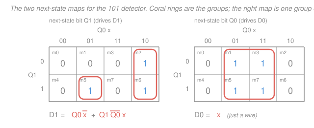
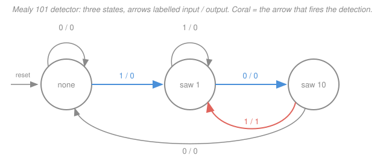

# Digital Logic Design · Lesson 3.4: Design of finite-state machines

> ⏱ ~15 min · Module 3: Sequential logic and finite-state machines · Builds on: [3.3 Analysis of synchronous circuits](03-03-analysis-of-synchronous-circuits.md), [3.2 Flip-flops and clocking](03-02-flip-flops-and-clocking.md), [2.1 Karnaugh maps](02-01-karnaugh-maps.md) · Unlocks: 4.2 (counters), 4.4 (datapaths and a simple CPU)

## Why this matters

This is the summit of the course. Everything so far has been *given* a circuit or a function and asked you to understand it; here you are given a sentence in English — "raise a flag when you've just seen `101`" — and you produce gates and flip-flops that do it. That inversion is the entire job of a digital designer. [3.3](03-03-analysis-of-synchronous-circuits.md) ran the pipeline forwards (circuit → state table → state diagram → behaviour); this lesson runs it **backwards**, and the backwards direction is the one that pays. Every controller you will ever meet — a vending machine, a traffic light, a bus arbiter, the fetch–decode–execute loop in [4.4](04-04-datapaths-and-a-simple-cpu.md) — is a finite-state machine somebody designed this way.

Notation, kept from [3.2](03-02-flip-flops-and-clocking.md): $\overline{A}$ is the complement of $A$ (some books write $A'$), juxtaposition is AND, $+$ is OR, $\oplus$ is XOR. The **next state** of a flip-flop is written $Q^+$ — the value $Q$ takes after the next active clock edge. In multi-bit state codes $Q_1$ is the most significant bit.

## The idea

Only one step of this is hard, and it is the first one: **deciding what the machine must remember.**

Here is the insight that makes the rest mechanical. A state is not a label. A state is *an equivalence class of pasts*. The machine has seen some sequence of input bits; it cannot store all of them (it has finitely many flip-flops), so it must compress that history down to the one thing that matters:

> **A state represents everything the machine needs to know about the past in order to behave correctly in the future — and nothing more.**

Two different histories that call for identical future behaviour *are the same state*. That is why state-machine design is a thinking task and not a mechanical one: you are looking for the coarsest possible summary of the past that still determines the future.

**The running spec** (boss problem 3 from the [syllabus](../syllabus.md)): a serial input $x$ delivers one bit per clock. Output $y = 1$ whenever the stream has just completed the pattern `101`. Occurrences may **overlap**.

What must you remember? Not the whole stream — only *how far along the pattern you already are*. That gives four situations:

- **none** — no useful progress; the last bits are nothing I can build on.
- **saw 1** — the last bit was a `1`: one third of the way there.
- **saw 10** — the last two bits were `10`: two thirds.
- **saw 101** — the pattern just completed. This is the state where $y = 1$.

Four situations, four states. Because the output depends only on *which state you are in* (not on the current input), this is a **Moore** machine.

Now the transitions. Three are obvious, and two are the whole point of the problem.

From **none**: a `1` starts the pattern, so go to **saw 1**. A `0` is useless — `101` never starts with `0` — so stay in **none**.

From **saw 1**: a `0` gives `10`, so go to **saw 10**. A `1` gives `11`; the pattern is broken, *but the new `1` is itself a fresh start*, so you land back in **saw 1** rather than in **none**. Never throw away progress the newest bits still support.

From **saw 10**: a `1` completes `101` — go to **saw 101** and raise the output. A `0` gives `100`; no suffix of that is a prefix of `101`, so you are genuinely back to **none**.

From **saw 101** — the two overlap arrows:

- Input `1`. The stream now ends `...1011`. Ask the only question that matters: *what is the longest suffix of what I've just seen that is a prefix of `101`?* The candidates are `1011`, `011`, `11`, `1`. Only `1` qualifies. So the machine goes to **saw 1** — not to **none**, which would discard a live `1`.
- Input `0`. The stream now ends `...1010`. Suffixes: `1010`, `010`, `10`. The last one qualifies — `10` is a prefix of `101`. So go to **saw 10**. Concretely: the trailing `1` of the pattern you just matched is being *reused* as the leading `1` of the next one, and the `0` you just read is that pattern's middle bit. One more `1` and you detect again, two clocks after the previous detection.

Those two arrows *are* what "overlapping" means. If instead you sent **saw 101** back to **none** on a `0`, you would have built the non-overlapping detector, and `10101` would report one hit instead of two.

## The formal version

**The design procedure.** Seven steps, in order:

1. **Understand the spec and decide what to remember.** Enumerate the distinct situations — the equivalence classes of past inputs. Decide Mealy or Moore here too (output a function of state alone → Moore; of state *and* current input → Mealy; see [3.3](03-03-analysis-of-synchronous-circuits.md)).
2. **Draw the state diagram, naming states by meaning.** Write "saw 10", not `S2`. Meaningful names let you *check* an arrow by reading it aloud; `S0…S3` gives you nothing to check against and is where most design bugs are born.
3. **Check completeness.** With $n$ input bits, every state needs exactly $2^n$ outgoing arrows — one per input combination — and they must be mutually exclusive. **Missing arrows are the single most common bug**, and they are silent: the synthesized hardware will do *something*, just not what you meant.
4. **Reduce.** Merge equivalent states (below).
5. **Assign state codes.** $k$ flip-flops encode $2^k$ patterns, so $N$ states need $$k = \lceil \log_2 N\rceil$$ flip-flops. *In words: round the base-2 log up.* Any leftover codes are unused states — decide what happens if the machine ever lands in one.
6. **Derive the logic.** Write the state table in binary. For each flip-flop, use its **excitation table** to turn each $Q \to Q^+$ transition into the required input, then minimize that input function — and each output function — on a K-map ([2.1](02-01-karnaugh-maps.md)).
7. **Verify by analysing your own circuit.** Run [3.3](03-03-analysis-of-synchronous-circuits.md)'s procedure on the equations you just derived, rebuild the state table, and compare it with step 2's diagram. Then trace a test string by hand.

**Excitation tables** ([3.2](03-02-flip-flops-and-clocking.md)) answer "what input forces this transition?" — the inverse of the characteristic table. `X` means don't-care:

| $Q$ | $Q^+$ | $D$ | $T$ | $J$ | $K$ |
|---|---|---|---|---|---|
| 0 | 0 | 0 | 0 | 0 | X |
| 0 | 1 | 1 | 1 | 1 | X |
| 1 | 0 | 0 | 1 | X | 1 |
| 1 | 1 | 1 | 0 | X | 0 |

The $D$ column is the identity: $D = Q^+$. That is why D flip-flops dominate FSM design — the "excitation" step costs nothing, and you just implement the next-state function directly.

**State equivalence.** Two states are **equivalent** if, started in either one, *every* input sequence produces the same output sequence. Checking every sequence is impossible, so use the recursive test:

$$s \equiv t \iff \text{output}(s) = \text{output}(t) \ \text{ and } \ \delta(s,a) \equiv \delta(t,a) \ \text{ for every input } a,$$

where $\delta(s,a)$ is the next state from $s$ on input $a$. *In words: same output now, and equivalent successors for every input.* The definition is circular, so compute it as a fixed point — **partition refinement**: split the states by output, then repeatedly split any group whose members send some input into *different* groups, until nothing splits.

Example: suppose you had over-drawn the `101` detector with a separate state S4 for "saw `100`":

| present state | next on `0` | next on `1` | $y$ |
|---|---|---|---|
| S0 (nothing yet) | S0 | S1 | 0 |
| S1 (saw 1) | S2 | S1 | 0 |
| S2 (saw 10) | S4 | S3 | 0 |
| S3 (saw 101) | S2 | S1 | 1 |
| S4 (saw 100) | S4 | S1 | 0 |

Refine. By output: $\{S0,S1,S2,S4\}$, $\{S3\}$. Now S2 sends `1` into $\{S3\}$ while the others send `1` into the first group, so S2 splits off: $\{S0,S1,S4\}$, $\{S2\}$, $\{S3\}$. Now S1 sends `0` into $\{S2\}$ while S0 and S4 send `0` into their own group, so S1 splits: $\{S0,S4\}$, $\{S1\}$, $\{S2\}$, $\{S3\}$. Check $\{S0,S4\}$ once more — on `0`, S0→S0 and S4→S4, both inside $\{S0,S4\}$; on `1`, both go to S1. Nothing splits. Stable.

So $S0 \equiv S4$: five states collapse to four, and $\lceil\log_2 5\rceil = 3$ flip-flops become $\lceil\log_2 4\rceil = 2$. Sensible, too — "I've seen `100`" and "I've seen nothing" call for identical futures. Note also that S1 and S3 have *identical* next-state columns yet are **not** equivalent: their outputs differ, and in a Moore machine that alone disqualifies a merge.

**The reduction caveat.** Fewer states only buy hardware when the count crosses a power of two. 5 states and 8 states both need 3 flip-flops, so grinding 8 down to 7 saves *nothing* in flip-flops; grinding 5 down to 4 saves one. (It can still simplify the next-state logic, and it always shrinks the thing you have to reason about — but do not over-value it.)

**State assignment matters.** The codes you hand the states are not cosmetic: they *are* the truth tables of the next-state functions, so different assignments give different minimal equations and different gate counts. The usual heuristic is to give **adjacent codes to states that transition into each other or share a successor**, so that the 1s land in adjacent K-map cells and group. In Example 1 below, the natural progress-ordered assignment makes one next-state function collapse to a bare wire; a Gray-code assignment of the same four states gives three product terms instead of one, for identical behaviour.

**One-hot** encoding goes the other way: one flip-flop per state, exactly one high at a time (`0001`, `0010`, `0100`, `1000`). It burns $N$ flip-flops instead of $\lceil\log_2 N\rceil$, but each next-state equation becomes a short OR of "the states that lead here, gated by their input condition" — no decoding, few logic levels, fast. On an FPGA, where flip-flops are abundant and already sitting next to every logic block, one-hot is the standard choice; in a hand-built or area-limited design, binary encoding wins.

## Picture

Read the completeness check straight off the figure: four circles, two arrows leaving each, eight arrows total — one per (state, input) pair. Nothing missing.

## Worked examples

**Example 1 (the boss problem, all the way to gates).**

*Steps 1–4* are done: four meaningful states, complete diagram, and nothing to reduce (no two states share an output *and* a future — check any pair against the definition).

*Step 5, assignment.* $N = 4$, so $k = \lceil\log_2 4\rceil = 2$ flip-flops, $Q_1Q_0$ with $Q_1$ the MSB. Encode by progress: none = `00`, saw 1 = `01`, saw 10 = `10`, saw 101 = `11`. The output is high only in `11`, so immediately $y = Q_1 Q_0$.

*Step 6, the state table.* Present state and input on the left, next state on the right:

| $Q_1$ | $Q_0$ | $x$ | minterm | $Q_1^+$ | $Q_0^+$ | $y$ |
|---|---|---|---|---|---|---|
| 0 | 0 | 0 | $m_0$ | 0 | 0 | 0 |
| 0 | 0 | 1 | $m_1$ | 0 | 1 | 0 |
| 0 | 1 | 0 | $m_2$ | 1 | 0 | 0 |
| 0 | 1 | 1 | $m_3$ | 0 | 1 | 0 |
| 1 | 0 | 0 | $m_4$ | 0 | 0 | 0 |
| 1 | 0 | 1 | $m_5$ | 1 | 1 | 0 |
| 1 | 1 | 0 | $m_6$ | 1 | 0 | 1 |
| 1 | 1 | 1 | $m_7$ | 0 | 1 | 1 |

(Each row is one arrow of the figure. Row $m_6$ is "from saw 101 on a `0`, go to saw 10" — an overlap arrow; row $m_7$ is "from saw 101 on a `1`, go to saw 1" — the other one.)

So $Q_1^+ = \Sigma m(2,5,6)$ and $Q_0^+ = \Sigma m(1,3,5,7)$. With D flip-flops, $D_1 = Q_1^+$ and $D_0 = Q_0^+$ — no excitation work needed.

The left map has a vertical pair in the `10` column ($Q_0 = 1$, $x = 0$), which is $Q_0\overline{x}$, and one isolated cell $m_5$, which is $Q_1\overline{Q_0}x$. The right map is a single group of four covering the two middle columns — the columns where $x = 1$ — so it reduces to $x$ alone. The final equations:

$$\boxed{\;D_1 = Q_0\overline{x} + Q_1\overline{Q_0}\,x, \qquad D_0 = x, \qquad y = Q_1Q_0\;}$$

*Check the minimization by re-expanding.* $Q_0\overline{x}$ covers exactly $\{m_2, m_6\}$ and $Q_1\overline{Q_0}x$ covers exactly $\{m_5\}$; the union is $\{2,5,6\}$, matching $Q_1^+$ with nothing extra. $x$ covers $\{m_1,m_3,m_5,m_7\}$, matching $Q_0^+$. ✓

$D_0 = x$ deserves a second look: with this assignment $Q_0$ is *literally the previous input bit*, and the semantics confirm it — the states with $Q_0 = 1$ are exactly "saw 1" and "saw 101", the two whose history ends in `1`. A good state assignment doesn't just shrink the algebra; it makes the algebra say something true out loud. The hardware is two D flip-flops, two AND gates, one OR gate, two inverters, and one AND gate for $y$.

*Contrast (why assignment matters).* Reassign the same machine in Gray order — none `00`, saw 1 `01`, saw 10 `11`, saw 101 `10` — and the same procedure yields $D_1 = \overline{Q_1}Q_0\overline{x} + Q_1\overline{Q_0}\,\overline{x} + Q_1Q_0x$ and $D_0 = (Q_1\oplus Q_0) + \overline{Q_0}x$: six product terms instead of two, for identical behaviour.

*Step 7, verify.* Re-analyse the boxed equations exactly as in [3.3](03-03-analysis-of-synchronous-circuits.md) — plug each of the eight $(Q_1,Q_0,x)$ combinations in. Two samples: at $(1,1,0)$, $D_1 = 1\cdot1 + 1\cdot0\cdot0 = 1$ and $D_0 = 0$, giving `10` = saw 10 ✓; at $(1,0,1)$, $D_1 = 1\cdot0 + 1\cdot1\cdot1 = 1$ and $D_0 = 1$, giving `11` = saw 101 ✓. All eight rows reproduce the table above.

*The trace.* Start in **none** and feed `1101011`. The Moore output is a property of the state, so the bit reported "after input $i$" is the output of the state the machine **lands in** on that clock edge:

| step | input | state before | state after | code | $y$ after |
|---|---|---|---|---|---|
| 1 | `1` | none | saw 1 | `01` | 0 |
| 2 | `1` | saw 1 | saw 1 | `01` | 0 |
| 3 | `0` | saw 1 | saw 10 | `10` | 0 |
| 4 | `1` | saw 10 | **saw 101** | `11` | **1** |
| 5 | `0` | saw 101 | saw 10 | `10` | 0 |
| 6 | `1` | saw 10 | **saw 101** | `11` | **1** |
| 7 | `1` | saw 101 | saw 1 | `01` | 0 |

Output sequence: `0001010` — two detections. ✓ Cross-check against the string itself: `1101011` contains `101` at bit positions 2–4 and again at 4–6, overlapping on the shared `1`. Two hits, ending at inputs 4 and 6, exactly where the trace puts them. Step 5 is the payoff: the overlap arrow parked the machine in **saw 10** instead of **none**, which is the only reason the second hit arrives one clock later instead of never.

**Example 2 (the same spec as a Mealy machine).** Let the output be a function of state *and* current input. Then you no longer need a state to *sit in* while asserting $y$ — you assert it on the transition that completes the pattern. "Saw 101" stops being a state and becomes an *edge*, and three states suffice:

Only one arrow carries output 1: from **saw 10** on input `1`, emitting 1 and landing in **saw 1** — because that completing `1` is also the possible start of the next occurrence. Same overlap logic, now compressed into one arrow. Trace `1101011` again: outputs `0`,`0`,`0`,`1`,`0`,`1`,`0` — the same string, but produced during the *same* clock cycle as the completing input, one cycle earlier in real time than the Moore version, which must wait for the edge that carries it into **saw 101**.

The trade, in three lines. Mealy: fewer states (3 vs 4 here, so possibly fewer flip-flops), output one cycle earlier, but the output is combinational from $x$ — it glitches whenever $x$ does, and it is not safe to feed straight into another machine's control input. Moore: one more state, one cycle of latency, but the output is a clean function of flip-flop outputs only — glitch-free and stable for a whole cycle. Controllers that drive other synchronous hardware are usually Moore for exactly that reason.

## Watch out

- **You might think a completed pattern means "start over".** That is the non-overlapping machine. When occurrences may overlap, the correct rule out of *every* state — including the accepting one — is: keep the **longest suffix of the stream so far that is a prefix of the pattern**. Applying that rule mechanically to **saw 101** gives `1` → saw 1 and `0` → saw 10, and it never lets you throw away live progress.
- **You might expect the Moore output in the same cycle as the completing bit.** It arrives one clock later, because the output is a property of the state you *enter*. Both conventions for reporting a trace are in use — output of the state you're in during cycle $t$, versus output after the edge that consumes input $t$ — so always say which you mean. This lesson uses the latter, matching the syllabus.
- **You might assume every unused state code is harmless.** With $N$ not a power of two, $2^k - N$ codes are unreachable, and treating them as don't-cares gives cheaper logic — but it also lets the hardware *stay* in a bad code if noise or power-up ever puts it there. Either guarantee a reset, or spend the gates to route unused codes back to a legal state (this is [4.2](04-02-counters.md)'s "self-correcting" design).

## One-liner

> A state is the smallest summary of the past that determines the future — name your states by what they remember, make every state's arrows complete, and the flip-flop equations fall out of the table.

## Problems

**P1 (🟢)** Take the Moore `101` detector of Example 1 and change the spec so that occurrences may **not** overlap (after a detection, the machine starts from scratch). Which arrow or arrows change? Re-trace `1101011` and give the output sequence.

**P2 (🟡)** Design a Moore machine with one input $x$ and one output $y$, where $y = 1$ exactly when the total number of `1`s seen since reset is a multiple of 3 (zero counts as a multiple). Give the state diagram in table form, assign codes, and derive $D_1$, $D_0$, and $y$ using D flip-flops, treating any unused code as a don't-care. Verify with the input `110101`. Then say what your circuit does if it ever powers up in the unused code.

**P3 (🔴)** Reduce this Moore machine and say how many flip-flops the reduction saves:

| present state | next on `0` | next on `1` | $y$ |
|---|---|---|---|
| A | B | C | 0 |
| B | B | C | 0 |
| C | E | D | 0 |
| D | B | D | 1 |
| E | B | C | 0 |

Then trace `10110` on both the original and the reduced machine to confirm they agree, and describe in one sentence what the machine detects.

Solutions

**P1** Only the arrows out of **saw 101** are candidates, since that is the only state where "a detection just happened" is true. Non-overlapping means the completed pattern is consumed and the next bit is read as the *first* bit of a fresh window:

- input `1` → **saw 1** (the fresh window's first bit is a `1`) — *unchanged* from the overlapping machine, coincidentally;
- input `0` → **none** (a fresh window starting with `0` is worthless) — **this is the arrow that changes**, from **saw 10** to **none**.

Trace `1101011` from **none**:

| step | input | state after | $y$ |
|---|---|---|---|
| 1 | `1` | saw 1 | 0 |
| 2 | `1` | saw 1 | 0 |
| 3 | `0` | saw 10 | 0 |
| 4 | `1` | **saw 101** | **1** |
| 5 | `0` | none | 0 |
| 6 | `1` | saw 1 | 0 |
| 7 | `1` | saw 1 | 0 |

Output `0001000` — one detection instead of two. Steps 1–4 are identical to Example 1; the single changed arrow at step 5 destroys the reusable `1`, so the second (overlapping) occurrence is never reported.

**P2** *States.* All you must remember is the count of `1`s **mod 3** — the actual count is irrelevant to future behaviour, which is the "smallest summary of the past" principle doing real work. Three states: R0 (count $\equiv 0$, $y=1$), R1 ($\equiv 1$, $y=0$), R2 ($\equiv 2$, $y=0$). A `0` never changes the count, so every state self-loops on `0`; a `1` advances one step around the ring.

| present state | next on `0` | next on `1` | $y$ |
|---|---|---|---|
| R0 | R0 | R1 | 1 |
| R1 | R1 | R2 | 0 |
| R2 | R2 | R0 | 0 |

Complete (two arrows each) and already reduced (all three outputs/futures differ). $N = 3$ so $k = \lceil\log_2 3\rceil = 2$ flip-flops; assign R0 = `00`, R1 = `01`, R2 = `10`, leaving `11` unused. Output: $y = 1$ only in `00`, so $y = \overline{Q_1}\,\overline{Q_0}$.

| $Q_1$ | $Q_0$ | $x$ | minterm | $Q_1^+$ | $Q_0^+$ |
|---|---|---|---|---|---|
| 0 | 0 | 0 | $m_0$ | 0 | 0 |
| 0 | 0 | 1 | $m_1$ | 0 | 1 |
| 0 | 1 | 0 | $m_2$ | 0 | 1 |
| 0 | 1 | 1 | $m_3$ | 1 | 0 |
| 1 | 0 | 0 | $m_4$ | 1 | 0 |
| 1 | 0 | 1 | $m_5$ | 0 | 0 |
| 1 | 1 | 0 | $m_6$ | X | X |
| 1 | 1 | 1 | $m_7$ | X | X |

So $D_1 = \Sigma m(3,4) + d(6,7)$ and $D_0 = \Sigma m(1,2) + d(6,7)$.

On a map with rows $Q_1$ and columns $Q_0x$ in Gray order (`00 01 11 10`): for $D_1$, group $m_3$ with the don't-care $m_7$ (the `11` column) to get $Q_0x$, and group $m_4$ with the don't-care $m_6$ (row $Q_1=1$, `00`/`10` columns) to get $Q_1\overline{x}$. For $D_0$, $m_1$ has no useful neighbour ($m_0$, $m_3$, $m_5$ are all 0) so it stands alone as $\overline{Q_1}\,\overline{Q_0}x$, while $m_2$ pairs with the don't-care $m_6$ to give $Q_0\overline{x}$.

$$D_1 = Q_0x + Q_1\overline{x}, \qquad D_0 = \overline{Q_1}\,\overline{Q_0}\,x + Q_0\overline{x}, \qquad y = \overline{Q_1}\,\overline{Q_0}.$$

*Check by re-expanding:* $Q_0x = \{m_3,m_7\}$ and $Q_1\overline{x} = \{m_4,m_6\}$, so $D_1$ covers $\{3,4\}$ plus don't-cares only ✓. $\overline{Q_1}\,\overline{Q_0}x = \{m_1\}$ and $Q_0\overline{x} = \{m_2,m_6\}$, so $D_0$ covers $\{1,2\}$ plus a don't-care ✓.

*Verify with `110101`*, starting at `00`:

| input | $Q_1Q_0$ before | $D_1$ | $D_0$ | $Q_1Q_0$ after | state | $y$ |
|---|---|---|---|---|---|---|
| `1` | 00 | 0 | 1 | 01 | R1 | 0 |
| `1` | 01 | 1 | 0 | 10 | R2 | 0 |
| `0` | 10 | 1 | 0 | 10 | R2 | 0 |
| `1` | 10 | 0 | 0 | 00 | R0 | 1 |
| `0` | 00 | 0 | 0 | 00 | R0 | 1 |
| `1` | 00 | 0 | 1 | 01 | R1 | 0 |

Output `000110`. Sanity check against the spec: running counts of `1`s are 1, 2, 2, 3, 3, 4, and the multiples of 3 occur at steps 4 and 5. ✓

*Unused code.* Put $Q_1Q_0 = $ `11` into the equations. With $x = 1$: $D_1 = 1\cdot1 + 1\cdot 0 = 1$, $D_0 = 0 + 1\cdot 0 = 0$, so it jumps to `10` = R2 — recovered. With $x = 0$: $D_1 = 0 + 1\cdot1 = 1$, $D_0 = 0 + 1\cdot 1 = 1$, so it stays in `11` — **stuck**, silently outputting $y=0$, for as long as the input holds `0`. The don't-cares bought cheap logic at the cost of a hang state; if a reset can't be guaranteed, force `11` → `00` instead and pay the extra gates.

**P3** Partition by output: $\{A,B,C,E\}$ and $\{D\}$. Refine — on input `1`, C goes to D (the second group) while A, B, E all go to C (the first group), so C splits off: $\{A,B,E\}$, $\{C\}$, $\{D\}$. Refine again — A, B, and E all send `0` into $\{A,B,E\}$ (to B) and `1` into $\{C\}$, identically. Nothing splits; the partition is stable.

So $A \equiv B \equiv E$: three states merge into one. Five states become three, and $\lceil\log_2 5\rceil = 3$ flip-flops become $\lceil\log_2 3\rceil = 2$ — **one flip-flop saved**. Reduced table (writing A for the merged class):

| present state | next on `0` | next on `1` | $y$ |
|---|---|---|---|
| A | A | C | 0 |
| C | A | D | 0 |
| D | A | D | 1 |

*Trace `10110`.* Original, from A: A →`1`→ C (0) →`0`→ E (0) →`1`→ C (0) →`1`→ D (1) →`0`→ B (0), giving `00010`. Reduced, from A: A →`1`→ C (0) →`0`→ A (0) →`1`→ C (0) →`1`→ D (1) →`0`→ A (0), giving `00010`. Identical ✓ — B and E were just extra names for "nothing useful in hand".

*What it detects:* $y = 1$ exactly when the last two input bits were `11`, with overlaps counted (a run of $n$ ones holds the output high for $n-1$ clocks).

## Flashback

**From Lesson 3.3 (Analysis of synchronous circuits):** A synchronous circuit has a single D flip-flop with $D = x \oplus Q$ and a Mealy output $y = xQ$, where $x$ is the input. Build its state table, give the output sequence for the input `1011` starting from $Q = 0$, and say in one sentence what the circuit does. *(Fresh variant — one flip-flop, Mealy output, and you're reading the circuit rather than designing it.)*

Solution

Evaluate $D$ and $y$ for all four $(Q,x)$ combinations. Entries are $Q^+ \,/\, y$:

| $Q$ | $x = 0$ | $x = 1$ |
|---|---|---|
| 0 | 0 / 0 | 1 / 0 |
| 1 | 1 / 0 | 0 / 1 |

(Check: at $Q=1, x=1$, $D = 1\oplus 1 = 0$ and $y = 1\cdot 1 = 1$ ✓; at $Q=1,x=0$, $D = 0 \oplus 1 = 1$, so a `0` leaves the state alone ✓.)

Trace `1011` from $Q = 0$: input `1` gives $y=0$, $Q\to1$; input `0` gives $y=0$, $Q\to1$; input `1` gives $y=1$, $Q\to0$; input `1` gives $y=0$, $Q\to1$. Output `0010`.

$Q$ toggles on every `1` and ignores `0`s, so $Q$ is the running parity of the `1`s seen; $y = xQ$ fires only when a `1` arrives while parity is odd. So the circuit **emits a 1 on every second `1` in the stream** — a divide-by-two on the input's `1`s. In `1011` the `1`s are the 1st, 3rd and 4th bits, and only the second of them (bit 3) raises the output. ✓

## Connections

- **Backward:** this is [3.3](03-03-analysis-of-synchronous-circuits.md) run in reverse, and step 7 literally re-runs 3.3 as the verification. Step 6 rests on [3.2](03-02-flip-flops-and-clocking.md)'s excitation tables and on [2.1](02-01-karnaugh-maps.md) for the minimization; unused-state don't-cares are [2.2](02-02-dont-cares-pos-quine-mccluskey.md)'s tool used on a sequential problem.
- **Forward:** [4.2](04-02-counters.md) is this procedure applied to a machine with *no* input — a counter is an FSM whose state diagram is a single cycle — and mod-$N$ counters are where the unused-state question bites hardest. In [4.4](04-04-datapaths-and-a-simple-cpu.md) the control unit that sequences fetch–decode–execute is exactly a Moore FSM whose outputs are the datapath's control lines, chosen Moore precisely for the glitch-free reason in Example 2.
- **Sideways:** the rule "keep the longest suffix of the stream that is a prefix of the pattern" is the *failure function* of the Knuth–Morris–Pratt string-matching algorithm ([algorithms](../../algorithms/syllabus.md)) — KMP is this state machine, built at run time for an arbitrary pattern instead of etched into gates for a fixed one. The same object is a deterministic finite automaton in formal language theory, which is why "regular expression" and "sequence detector" are two names for one idea.
