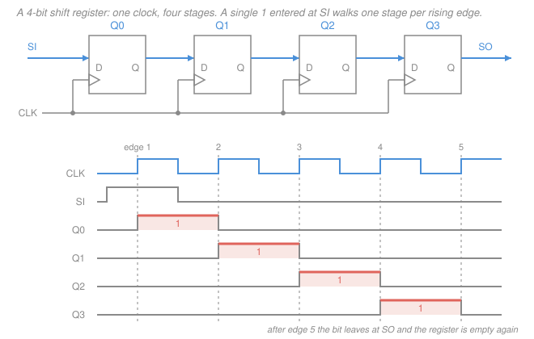
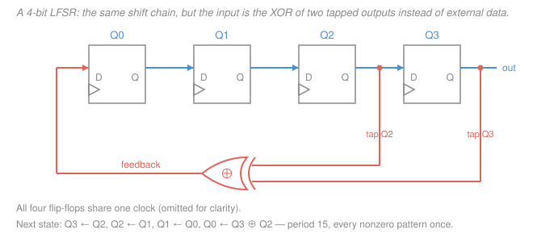

# Digital Logic Design · Lesson 4.1: Registers and shift registers

> ⏱ ~15 min · Module 4: Registers, memory, and datapaths · Builds on: [3.2 Flip-flops and clocking](03-02-flip-flops-and-clocking.md), [2.4 Decoders, encoders, and multiplexers](02-04-decoders-encoders-multiplexers.md), [1.2 Signed numbers and two's-complement arithmetic](01-02-signed-numbers-twos-complement.md) · Unlocks: [4.2 Counters](04-02-counters.md), [4.4 Datapaths and a simple CPU](04-04-datapaths-and-a-simple-cpu.md)

## Why this matters

A flip-flop stores one bit, which is not a thing anyone wants to store. Data comes in *words*: a byte, an address, an instruction. Bundle $n$ flip-flops under one clock and you get a **register** — the noun that every remaining lesson in this course is about. A CPU's programmer-visible state is a handful of registers ([4.4](04-04-datapaths-and-a-simple-cpu.md)); a memory is an array of them ([4.3](04-03-memory-and-programmable-logic.md)); a counter is a register with an incrementer wired to its own input ([4.2](04-02-counters.md)).

And once the bits sit side by side, one absurdly cheap operation becomes available: **slide them one position over**. That single wiring trick buys you serial communication, multiplication and division by two, hardware sequencers, and a pseudo-random number generator — all for zero gates beyond the flip-flops you already paid for.

## The idea

**A register is not a new device.** Take four D flip-flops, tie their clock pins together, and call the four $D$ inputs a 4-bit input and the four $Q$ outputs a 4-bit output. On every rising edge all four capture simultaneously. There is no clever circuit here; the *bundling* is the whole idea, and it works precisely because [3.2](03-02-flip-flops-and-clocking.md)'s edge-triggered flip-flop samples an instant rather than a window. Four latches sharing a clock would be four transparent windows racing each other.

**But a register that reloads every single cycle is useless.** You need it to *hold*. The obvious move — switch the clock off when you don't want to load — is one of the classic beginner mistakes in digital design, and I'll say why in a moment. The right move is to leave the clock running forever and change what the flip-flop is looking at: on a hold cycle, point its $D$ input back at its own $Q$. It still loads every cycle; it just loads *itself*.

**Shifting is the same trick with the wires moved over one.** Instead of feeding stage $i$ its own output, feed it stage $i-1$'s output. Every clock, the whole word slides one position. In *space* that's a conveyor belt for bits. In *arithmetic* it's multiplication or division by two, because sliding a binary digit one place left multiplies its place value by $2$ — the same fact as appending a zero to a decimal number to multiply by ten.

## The formal version

Notation for this lesson: $Q_i$ is the output of stage $i$, with $Q_0$ the stage nearest the serial input; $Q^+$ means the value a flip-flop holds *after* the next rising clock edge (some books write $Q(t{+}1)$). Bit patterns are always written **MSB first**, $Q_{n-1}\ldots Q_1 Q_0$, matching this course's convention that the leftmost variable is the most significant — so in a schematic the bits march left-to-right from $Q_0$ toward $Q_{n-1}$, while in the written number they march *left*.

### An $n$-bit register

$n$ D flip-flops, common clock, common reset:

$$Q_i^+ = D_i, \qquad i = 0,\ldots,n-1 .$$

*In words: on every active edge, each bit takes whatever is on its own $D$ line, and they all do it at the same instant.* Cost: $n$ flip-flops, zero gates. That simultaneity is what makes a register safe to feed from its own outputs — the new values do not appear until after the edge, so no stage sees a half-updated word.

### Parallel load with an enable — and why you must not gate the clock

You want a control signal $EN$: load $D$ when $EN=1$, hold when $EN=0$.

**The wrong circuit.** Feed the flip-flops the AND of `CLK` and $EN$ instead of `CLK`, so no edges arrive while $EN=0$. It *simulates* correctly and it is a genuinely bad idea in hardware:

- The AND gate adds delay, so this register's clock arrives **skewed** later than everyone else's — eating directly into the setup-time margin you established in [3.2](03-02-flip-flops-and-clocking.md).
- A glitch on $EN$ — and $EN$ comes out of combinational logic, which glitches ([2.2](02-02-dont-cares-pos-quine-mccluskey.md)'s static hazards) — manufactures a **spurious clock edge**. The register loads garbage, and no amount of static timing analysis will tell you it happened.

**The right circuit.** Keep the clock free-running to every flip-flop and put a **2-to-1 multiplexer** ([2.4](02-04-decoders-encoders-multiplexers.md)) in front of it. Call the external data line $D_i$ and the mux output $M_i$, which is what the flip-flop actually sees:

$$\boxed{\;Q_i^+ = M_i = \overline{EN}\,Q_i + EN\,D_i\;}$$

so $Q_i^+ = D_i$ when $EN=1$, and $Q_i^+ = Q_i$ — hold — when $EN=0$. *In words: the flip-flop clocks every cycle no matter what; the mux decides whether it clocks in new data or a copy of itself.* Cost: one 2-to-1 mux per bit. The rule generalizes to every control signal you will ever design:

> **Steer data with muxes; never steer the clock.**

Add a second select bit and the same mux becomes a **multifunction register**: `00` hold, `01` load, `10` shift right, `11` shift left. That is the standard 4-to-1-mux-per-bit register found in real parts, and it is exactly [2.4](02-04-decoders-encoders-multiplexers.md)'s "mux as a universal element" doing control work.

### Shift registers and the four data paths

Chain the stages — each flip-flop's $Q$ drives the next flip-flop's $D$, with an external serial input `SI` feeding stage 0:

$$Q_0^+ = \text{SI}, \qquad Q_i^+ = Q_{i-1}\ \ (i \ge 1).$$

*In words: every stage takes its upstream neighbour's value; the last stage's value falls off the end as the serial output.* Read as a number $Q_{n-1}\ldots Q_0$, this wiring moves each bit from a place value of $2^i$ to $2^{i+1}$ — which is why it is called a shift **left** even though the schematic draws it flowing rightward. Four data paths, named by how bits enter and leave:

| Path | Enters | Leaves | Used for |
|---|---|---|---|
| **SISO** | serially | serially | a delay line: $n$ clocks of pure delay |
| **SIPO** | serially | all $n$ bits at once | serial-to-parallel: how a UART *receives* a byte |
| **PISO** | all $n$ bits at once | serially | parallel-to-serial: how a UART *sends* a byte |
| **PIPO** | all $n$ bits at once | all $n$ bits at once | just a parallel-load register (the previous section) |

SIPO and PISO are the same shift chain read from different pins, and together they are why one wire can carry a byte: a **UART**, SPI, or any serial link is a PISO on the transmitting end and a SIPO on the receiving end, agreeing on a clock rate. PISO needs both behaviours — parallel load first, then $n$ shift clocks — so it is precisely the load/shift multifunction register above, mux per bit, clock never gated.

### Shifting is arithmetic

Three shifts, distinguished only by what fills the vacated end.

**Logical left shift (LSL).** $Q_i^+ = Q_{i-1}$, and $Q_0^+ = 0$ (zero-fill on the right).

$$V^+ = 2V \bmod 2^n .$$

*In words: every bit's place value doubles, so the number doubles — until the top bit falls off the end, at which point the answer wraps.* One shift is exact **as an unsigned number** iff the outgoing MSB was `0`; it is exact **as a signed number** iff the top *two* bits were equal (the bit shifted out must match the new sign bit). There is no separate "arithmetic left shift": the bit pattern is identical, only the overflow test differs.

**Logical right shift (LSR).** $Q_i^+ = Q_{i+1}$, and $Q_{n-1}^+ = 0$ (zero-fill on the left).

$$V^+ = \left\lfloor V/2 \right\rfloor \qquad (V \text{ read as unsigned}).$$

Applied to a two's-complement negative number this is nonsense: it drops the sign bit and turns a negative into a large positive.

**Arithmetic right shift (ASR).** $Q_i^+ = Q_{i+1}$, and $Q_{n-1}^+ = Q_{n-1}$ — the sign bit **replicates itself**. This is exactly [1.2](01-02-signed-numbers-twos-complement.md)'s sign extension applied one bit at a time, and it divides signed values by two.

The rounding is the subtle part, and it is worth memorising because it surprises people: ASR computes $\lfloor V/2 \rfloor$, the floor — **rounding toward $-\infty$, not toward zero.** In 8 bits, $-7$ is `11111001` (check: $128{+}64{+}32{+}16{+}8{+}1 = 249$, and $249-256 = -7$). Shifting right and replicating the sign gives `11111100` $= 252$, i.e. $252-256 = -4$. So

$$-7 \gg 1 = -4, \quad\text{not } -3,$$

because $\lfloor -3.5 \rfloor = -4$. This is why a C compiler cannot compile `x / 2` on a signed `int` into a bare ASR — C rounds toward zero, so it must add a correction term first.

$$\boxed{\;\text{LSL} = {\times}2, \qquad \text{LSR} = \lfloor\,\cdot/2\rfloor \text{ unsigned}, \qquad \text{ASR} = \lfloor\,\cdot/2\rfloor \text{ signed}\;}$$

**Barrel shifters.** A shift register needs $n$ clock cycles to shift by $n$. A processor cannot afford that for `x << 5`, so it uses a **barrel shifter**: a purely combinational network of muxes (a shift-by-1 mux layer, then shift-by-2, then shift-by-4, …) that does any shift amount in one pass, $\log_2 n$ mux levels deep. Same [2.4](02-04-decoders-encoders-multiplexers.md) building block, no clock at all.

### Rotations: ring and Johnson counters

Close the loop — feed the last stage's output back to the first — and nothing enters or leaves. The register **rotates**.

**Ring counter:** $Q_0^+ = Q_{n-1}$ — a pure rotation. Load a single `1` and let it circulate. With $n=4$, states written $Q_3Q_2Q_1Q_0$:

`0001` → `0010` → `0100` → `1000` → `0001`

That is **$n$ states** for $n$ flip-flops — terrible as a counter (a binary counter gets $2^n$), *wonderful* as a sequencer. The state is **one-hot**: each output is already the "it's phase $k$ now" signal, so a 4-phase controller needs zero decoding gates. You trade flip-flops for decoder logic.

**Johnson (twisted-ring) counter:** feed back the **inverted** last output, $Q_0^+ = \overline{Q_{n-1}}$. With $n=4$, starting from `0000`:

`0000` → `0001` → `0011` → `0111` → `1111` → `1110` → `1100` → `1000` → `0000`

Count them: 8 states, $= 2n$. Half the sequence fills with `1`s, half drains. Two payoffs: twice the states for the same hardware, and **successive states differ in exactly one bit** (check any adjacent pair above, including the wrap `1000` → `0000`), so decoding a Johnson state needs only a 2-input gate and — because only one input ever changes at a time — the decoded outputs are **glitch-free**. That property is why Johnson counters drive stepper motors and clock-phase generators.

**Both have unreachable cycles.** A 4-bit ring counter uses 4 of 16 states; a 4-bit Johnson counter uses 8 of 16. The leftovers are not scattered — they form their own closed loops. The Johnson counter's stray loop is

`1010` → `0100` → `1001` → `0010` → `0101` → `1011` → `0110` → `1101` → `1010`

— another 8 states, disjoint from the first 8 ($8+8=16$, every pattern accounted for exactly once), and **it never returns to the main sequence**. Power the chip up in `1010` and it counts wrong forever. Fixing that with modified feedback is [4.2](04-02-counters.md)'s self-correcting-counter discussion.

### LFSRs: a shift register that looks random

Keep the loop but make the feedback an **XOR of selected taps**. For 4 bits with taps at $Q_3$ and $Q_2$:

$$Q_0^+ = Q_3 \oplus Q_2, \qquad Q_1^+=Q_0,\quad Q_2^+=Q_1,\quad Q_3^+=Q_2 .$$

Starting from `0001` (as $Q_3Q_2Q_1Q_0$), stepping one edge at a time:

| # | state | # | state | # | state |
|---|---|---|---|---|---|
| 0 | `0001` | 5 | `0110` | 10 | `0111` |
| 1 | `0010` | 6 | `1101` | 11 | `1111` |
| 2 | `0100` | 7 | `1010` | 12 | `1110` |
| 3 | `1001` | 8 | `0101` | 13 | `1100` |
| 4 | `0011` | 9 | `1011` | 14 | `1000` |

Step 15 returns to `0001`. Sorting the 15 patterns gives `0001` through `1111` with no repeats and no omissions, so the period is $2^4 - 1 = 15$: **every nonzero pattern, exactly once, in scrambled order.** That is the maximum possible, and it happens only for the right tap sets (those whose feedback polynomial is *primitive*; $x^4+x^3+1$ here). Wrong taps give a short period — see P3.

**All-zeros is a dead state.** XOR of zeros is zero, so `0000` feeds itself `0` forever and the register locks. Every LFSR must be seeded nonzero; the $-1$ in $2^n-1$ is exactly this missing state.

One line each on why anyone cares:

- **Pseudo-random generation.** $n$ flip-flops and one XOR give a $2^n-1$-long "random-looking" bit stream — the cheapest noise source in hardware.
- **Built-in self-test.** One LFSR sprays pseudo-random test vectors at a chip; a second one (a *signature register*) compresses the responses into a few bits compared against a known-good value. Millions of test patterns, almost no test hardware.
- **Scramblers.** XOR your data with an LFSR stream before transmitting to break up long runs of identical bits, so the receiver's clock recovery keeps working. The receiver runs the same LFSR and XORs it back off.

The sequence is *balanced* and *high-entropy-looking* in the sense `information-theory` cares about — but it is **not** secure. The state is a linear function of its predecessors, so observing $2n$ output bits lets you solve for the taps and the seed by linear algebra (Berlekamp–Massey). Every real stream cipher in `cryptography` adds nonlinearity for exactly this reason. A bare LFSR is a *randomness* primitive, never a *secrecy* one.

## Picture

## Worked examples

**Example 1 (mechanical — the boss problem's shift).** An 8-bit register holds `01001101`. Shift it logically left once. What comes out, and does it still mean $\times 2$?

The value first: $64+8+4+1 = 77$. Shifting left drops the MSB and appends a `0`:

`0 1001101` → `1001101` `0` = `10011010`.

Read as unsigned: $128+16+8+2 = 154$, and $154 = 77 \times 2$. Exact — as the rule predicts, since the outgoing MSB was `0`.

*But read as signed two's complement it has already broken.* `10011010` has sign bit `1`, so its value is $154-256 = -102$, not $+154$: 77's top two bits were `0` and `1`, unequal, so the signed shift overflowed on the very first step. Signed 8-bit tops out at $+127$ and $154$ does not fit.

Shift once more and even unsigned breaks: `10011010` → `00110100` $= 32+16+4 = 52$, while $154\times2 = 308$. Check: $308 - 256 = 52$, exactly the $\bmod\ 2^n$ wrap. **A left shift multiplies by two only while the result still fits in the width** — which is a statement about the register, not about arithmetic.

**Example 2 (why you'd care — receiving a byte on one wire).** A UART receiver has one input wire and needs to hand the rest of the chip a parallel byte. The hardware is two of the blocks above:

1. An 8-bit **SIPO** shift register clocked at the agreed bit rate. A UART sends least-significant bit first, so the receiver shifts *right*: each new bit enters at $Q_7$ and the first-arrived LSB walks down to $Q_0$. After 8 edges the bits sit in their correct place values — the shifting *does the reassembly for free*, with no gates at all.
2. An 8-bit **parallel-load register** with $EN$ on those parallel outputs. The receiver pulses $EN$ for one cycle and the byte is captured, freeing the shift register for the next character.

That second register is the mux-per-bit design: its clock ticks through all eight shift cycles with $EN=0$ and it simply holds. Gate that clock instead and the enable pulse would have to be glitch- and skew-free at bit-rate precision — a needless hazard for a circuit that loads once per byte. Transmit is the mirror image: parallel-load into a **PISO** and clock eight bits out.

## Watch out

- **You might think an enable means switching off the clock.** It almost never does. Gating a clock inserts skew and turns any glitch on the enable into a fake edge that loads garbage. Gate the *data* with a mux and let the clock run. (Production chips do use clock gating to save power, but it is done with purpose-built, glitch-free gating cells, not an AND gate you dropped in.)
- **You might think a right shift always halves.** It halves what the *bits mean to you*: a logical right shift halves an unsigned value and mangles a signed one, an arithmetic right shift halves a signed value. The hardware has no idea which you intended. And even the right one floors — you might expect $-7 \gg 1$ to be $-3$, but it is $-4$, rounding toward $-\infty$ rather than toward zero, which diverges from integer division on every negative odd number.
- **You might assume a ring or Johnson counter finds its way back.** It does not. Both leave most of their $2^n$ states unused, and those states form closed loops of their own. Without an explicit reset or corrected feedback, a bad power-up state is permanent.

## One-liner

> A register is $n$ flip-flops on one clock; hold it with a mux (never by gating the clock), chain it to shift — which is $\times 2$ going left and floor-divide by 2 going right — and close the loop through an XOR to get $2^n - 1$ pseudo-random states for free.

## Problems

**P1 (🟢)** An 8-bit register holds `11101101`.
(a) Give its value read as unsigned, and as signed two's complement.
(b) Apply one logical right shift. Give the pattern and its unsigned value.
(c) Apply one arithmetic right shift to the original pattern instead. Give the pattern and its signed value, and compare it with the signed value from (a) divided by two.

**P2 (🟡)** A 3-bit Johnson counter has $Q_0^+ = \overline{Q_2}$, $Q_1^+ = Q_0$, $Q_2^+ = Q_1$ (states written $Q_2Q_1Q_0$).
(a) Starting from `000`, list the full state sequence and give the number of distinct states. Does it match $2n$?
(b) Identify the unused states and show what the counter does if it powers up in one of them.

**P3 (🔴)** A 4-bit LFSR is built with taps at $Q_3$ and $Q_1$ instead: $Q_0^+ = Q_3 \oplus Q_1$, with $Q_3^+=Q_2,\ Q_2^+=Q_1,\ Q_1^+=Q_0$. Starting from `0001`, find its period. Is it maximal? What does the answer tell you about choosing taps?

Solutions

**P1**

(a) `11101101` weighted by place value: $128+64+32+0+8+4+0+1 = 237$ unsigned. The sign bit is `1`, so as signed two's complement the value is $237-256 = -19$.
*Check by negation:* $+19$ is `00010011`; invert to `11101100`, add 1 to get `11101101` ✓ — the same pattern, so it really is $-19$.

(b) Logical right shift: drop the LSB, shift everything right, fill the top with `0`:

`11101101` → `01110110`.

Value: $64+32+16+0+4+2 = 118$. And $\lfloor 237/2 \rfloor = \lfloor 118.5\rfloor = 118$ ✓ — correct as an *unsigned* halving. (Note it is useless as a signed operation: $-19$ became $+118$.)

(c) Arithmetic right shift: same shift, but the top bit is filled with a copy of the old sign bit `1`:

`11101101` → `11110110`.

Value: $128+64+32+16+0+4+2 = 246$, and $246-256 = -10$ signed.
Compare: $-19/2 = -9.5$. Arithmetic right shift floors, giving $\lfloor -9.5\rfloor = -10$ ✓ — **not** $-9$, which is what truncation toward zero would give. This is the rounding trap from the lesson.

**P2**

(a) Each edge, the new string $Q_2Q_1Q_0$ is $(Q_1, Q_0, \overline{Q_2})$. Stepping from `000`:

| edge | $Q_2Q_1Q_0$ | $\overline{Q_2}$ (next $Q_0$) |
|---|---|---|
| start | `000` | 1 |
| 1 | `001` | 1 |
| 2 | `011` | 1 |
| 3 | `111` | 0 |
| 4 | `110` | 0 |
| 5 | `100` | 0 |
| 6 | `000` | — back to start |

Sequence: `000` → `001` → `011` → `111` → `110` → `100` → `000`. That is **6 distinct states**, and $2n = 2\times 3 = 6$ ✓.
*Check:* adjacent pairs differ in exactly one bit each time (`000`/`001`, `001`/`011`, `011`/`111`, `111`/`110`, `110`/`100`, `100`/`000`) ✓ — the glitch-free decoding property.

(b) $2^3 = 8$ states exist, 6 are used, so the unused ones are `010` and `101`. Stepping them:

- `010`: next is $(Q_1, Q_0, \overline{Q_2}) = (1, 0, \overline{0}) = $ `101`.
- `101`: next is $(0, 1, \overline{1}) = $ `010`.

So the two strays form a closed 2-cycle `010` ↔ `101` that **never joins the main sequence**. Powered up in either one, the counter oscillates at half the intended pattern forever. A reset (or self-correcting feedback, [4.2](04-02-counters.md)) is mandatory, not optional.

**P3** Next state: $Q_3^+=Q_2$, $Q_2^+=Q_1$, $Q_1^+=Q_0$, $Q_0^+=Q_3\oplus Q_1$. Stepping from `0001` (as $Q_3Q_2Q_1Q_0$):

| edge | state | $Q_3 \oplus Q_1$ |
|---|---|---|
| start | `0001` | $0\oplus 0 = 0$ |
| 1 | `0010` | $0\oplus 1 = 1$ |
| 2 | `0101` | $0\oplus 0 = 0$ |
| 3 | `1010` | $1\oplus 1 = 0$ |
| 4 | `0100` | $0\oplus 0 = 0$ |
| 5 | `1000` | $1\oplus 0 = 1$ |
| 6 | `0001` | — back to start |

**Period 6**, not 15. The six states are `0001`, `0010`, `0101`, `1010`, `0100`, `1000` — all distinct, and the loop closes ✓.

It is **not maximal**: 6 of the 15 nonzero patterns are visited, so the other 9 sit on separate cycles the register can never leave once it starts there. The lesson: the *number* of taps is not what matters — the tap positions must correspond to a **primitive** feedback polynomial. Here the taps give $x^4+x^2+1 = (x^2+x+1)^2$, which is not even irreducible, so it cannot be primitive; the taps in the lesson give $x^4+x^3+1$, which is, and reaches all 15. Tap positions come from a table, not from guessing.

## Flashback

**From Lesson 3.4 (Design of finite-state machines):** Design a Moore machine that detects the pattern `1101` in a serial bit stream, one bit per clock, with *overlapping* occurrences counted. (a) Name the states by the progress made toward `1101` and give the state table. (b) How many flip-flops does the state assignment need, and how many states go unused? (c) Starting from reset, give the output bit produced after each input for the stream `1101101`.

Solution

(a) A Moore state records *the longest suffix of the input so far that is also a prefix of* `1101`. Five states:

| state | meaning | on input `0` | on input `1` | output |
|---|---|---|---|---|
| $S_0$ | no progress | $S_0$ | $S_1$ | 0 |
| $S_1$ | saw `1` | $S_0$ | $S_2$ | 0 |
| $S_2$ | saw `11` | $S_3$ | $S_2$ | 0 |
| $S_3$ | saw `110` | $S_0$ | $S_4$ | 0 |
| $S_4$ | saw `1101` | $S_0$ | $S_2$ | **1** |

The two entries that make it *overlapping* are the ones leaving $S_4$: after a detection the machine does not restart at $S_0$. On a `1` the last two bits are `11`, so it goes to $S_2$ — already two-thirds of the way to another match. (On a `0` the recent bits are `…010`, no suffix of which is a prefix of `1101`, so $S_0$ is correct.) Likewise $S_2$ on `1` stays at $S_2$, because the last two bits are still `11`.

(b) Five states need $\lceil \log_2 5\rceil = 3$ flip-flops, leaving $2^3 - 5 = 3$ unused states — which, as in P2, must be steered somewhere safe or the machine can hang.

(c) Trace `1101101` from $S_0$; the Moore output is the output of the state *entered*:

| input | 1 | 1 | 0 | 1 | 1 | 0 | 1 |
|---|---|---|---|---|---|---|---|
| state | $S_1$ | $S_2$ | $S_3$ | $S_4$ | $S_2$ | $S_3$ | $S_4$ |
| output | 0 | 0 | 0 | **1** | 0 | 0 | **1** |

Output: `0001001`.

*Check by direct pattern matching.* Number the input bits 1–7: `1 1 0 1 1 0 1`. Length-4 windows ending at position 4 = `1101` (match), 5 = `1011`, 6 = `0110`, 7 = positions 4–7 = `1101` (match). Detections at positions 4 and 7, giving `0001001` ✓ — and the two matches share bit 4, which is exactly the overlap the $S_4 \to S_2$ edge buys.

## Connections

- **Backward:** every stage is [3.2](03-02-flip-flops-and-clocking.md)'s edge-triggered D flip-flop, and the whole "hold" mechanism is [2.4](02-04-decoders-encoders-multiplexers.md)'s 2-to-1 mux used as a control element rather than a logic element. Arithmetic right shift is [1.2](01-02-signed-numbers-twos-complement.md)'s sign extension applied one bit per clock.
- **Forward:** [4.2](04-02-counters.md) replaces the shift wiring with an incrementer and inherits this lesson's unused-state problem wholesale; [4.4](04-04-datapaths-and-a-simple-cpu.md) builds a datapath out of exactly these parts — a register file plus an ALU plus shift/load control lines driven by an FSM — and `computer-architecture` ([syllabus](../../computer-architecture/syllabus.md)) starts where 4.4 stops.
- **Sideways:** a SISO shift register *is* the unit-delay chain that `signals-systems` draws in its filter block diagrams ([4.3](../../signals-systems/lessons/04-03-difference-equations-realizations.md)) — each stage is one $z^{-1}$, and an LFSR is that same delay line with a modulo-2 feedback tap, which is why the polynomial notation looks identical. The pseudo-random stream it produces is the cheap entropy source behind hardware test and scrambling, and the reason its *apparent* randomness is not *cryptographic* randomness is a linearity argument that `cryptography` makes precise.
