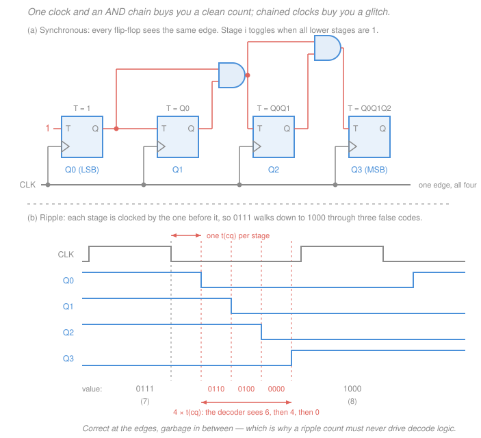

# Digital Logic Design · Lesson 4.2: Counters

> ⏱ ~15 min · Module 4: Registers, memory, and datapaths · Builds on: [4.1 Registers and shift registers](04-01-registers-and-shift-registers.md), [3.4 Design of finite-state machines](03-04-design-of-finite-state-machines.md), [3.2 Flip-flops and clocking](03-02-flip-flops-and-clocking.md) · Unlocks: [4.3 Memory and programmable logic](04-03-memory-and-programmable-logic.md)

## Why this matters

Almost every clocked system you will ever open contains a counter. The **program counter** that says which instruction is next ([4.4](04-04-datapaths-and-a-simple-cpu.md)) is a counter. The timer that fires an interrupt every millisecond is a counter. The block that turns a 32,768 Hz watch crystal into a 1 Hz tick is a counter. The address generator that sweeps a memory ([4.3](04-03-memory-and-programmable-logic.md)) is a counter. It is the single most-instantiated sequential block in digital design, and it is small enough that you can design it completely, by hand, in fifteen minutes — which makes it the perfect place to see the FSM machinery of Module 3 pay off.

## The idea

A counter is nothing new. It is a finite-state machine whose state sequence happens to be *the binary numbers in order*: `0000`, `0001`, `0010`, …, wrap, repeat. You could design it with the full procedure from [3.4](03-04-design-of-finite-state-machines.md) — draw sixteen states, assign codes, fill in excitation tables, minimize — and for an irregular sequence you *would*. But the binary sequence has so much structure that you can shortcut the whole thing with a single observation about arithmetic.

**Here is the observation.** Watch a car odometer roll over. The ones wheel turns every click. The tens wheel turns only when the ones wheel is about to pass 9. The hundreds wheel turns only when *both* the ones and tens are about to pass 9. In binary the same rule holds with "9" replaced by "1": **bit $i$ flips exactly when every bit below it is 1.** That is the entire theory of binary counting, and it gives two different circuits depending on how you deliver that "when".

- **Let the flip-flops tell each other.** Bit 0 flips every clock. When bit 0 falls from 1 to 0, that *is* the signal that bit 1 should flip — so just use bit 0's output as bit 1's clock. This is the **ripple** (asynchronous) counter, and it costs essentially no gates. The price is that the news travels down the chain one stage at a time.
- **Let a gate compute it.** Give every flip-flop the same clock, and put combinational logic in front of each one that asks "are all the lower bits 1?" This is the **synchronous** counter. It costs an AND chain, and in return every bit changes at the same instant.

Notation for this lesson: a $k$-bit count is written $Q_{k-1}\ldots Q_1Q_0$ with **$Q_0$ the least significant bit** and $Q_{k-1}$ the most significant, matching how we write binary literals (leftmost is biggest, as in [1.1](01-01-number-systems-and-bases.md)). $Q^+$ means "the value of $Q$ after the next active clock edge". A **T flip-flop** (from [3.2](03-02-flip-flops-and-clocking.md)) toggles when $T=1$ and holds when $T=0$: $Q^+ = T\oplus Q$. If you only have D flip-flops, a T flip-flop is $D = T\oplus Q$, and a permanently-toggling one is just $D = \overline{Q}$.

## The formal version

### Ripple (asynchronous) counters

Chain $n$ negative-edge-triggered T flip-flops with every $T$ tied to 1. Flip-flop 0 is clocked by the system clock; flip-flop $i$ is clocked by $Q_{i-1}$.

Each stage toggles once per *falling edge* of its input, so its output is a square wave at **half** the frequency of its input:

$$f_i = \frac{f_{\text{clk}}}{2^{\,i+1}}.$$

*In words: every stage divides by two, so stage $i$ runs at one over two-to-the-($i{+}1$) of the clock.* Divide-by-2 repeatedly and you are counting in binary — the outputs, read together, are the binary count.

**The drawback, which is serious.** Stage $i$ cannot move until stage $i-1$ has moved. If $t_{cq}$ is the clock-to-Q delay of one flip-flop, the last stage settles $n\,t_{cq}$ after the clock edge, and during that window the output word is **not any state the counter is supposed to visit**. Take `0111` → `1000` in a 4-bit ripple counter:

| after | event | output $Q_3Q_2Q_1Q_0$ | decoded as |
|---|---|---|---|
| $0$ | clock edge arrives | `0111` | 7 |
| $1\,t_{cq}$ | $Q_0$: 1 → 0 | `0110` | **6** |
| $2\,t_{cq}$ | $Q_1$: 1 → 0 (triggered by $Q_0$'s fall) | `0100` | **4** |
| $3\,t_{cq}$ | $Q_2$: 1 → 0 | `0000` | **0** |
| $4\,t_{cq}$ | $Q_3$: 0 → 1 | `1000` | 8 |

Between 7 and 8 the counter briefly *reads* 6, then 4, then 0. Hang a decoder ([2.4](02-04-decoders-encoders-multiplexers.md)) off those four bits and it will pulse its "6", "4" and "0" outputs for a few nanoseconds every time the count passes 7. That is a **decoding glitch**, and it is why the rule is: a ripple count must never feed combinational decode logic (or a comparator, or an enable) unless you gate it with something that waits out the ripple.

**The redeeming feature.** $n$ flip-flops, zero gates, and the fastest stage only has to keep up with the clock. As a pure **frequency divider** — where you only ever look at one output and never decode the word — a ripple counter is both correct and the cheapest thing there is.

### Synchronous counters

All $n$ flip-flops share one clock. Stage $i$'s toggle input asks the odometer question directly:

$$\boxed{\;T_0 = 1, \qquad T_i = Q_0\,Q_1\cdots Q_{i-1}\;}$$

*In words: toggle bit $i$ exactly when every bit below it is 1.*

**Why.** Adding 1 to a binary number ripples a carry from the bottom. Bit 0 always changes. The carry out of bit $i-1$ is 1 only if bit $i-1$ was 1 *and* it received a carry — recursively, only if bits $0$ through $i-1$ were all 1. Bit $i$ flips exactly when it receives that carry. (Same carry chain as the ripple-carry adder in [2.3](02-03-arithmetic-circuits.md) — a counter is an adder with one operand wired to 1.)

Check it on `0111`: $T_0=1$, $T_1=Q_0=1$, $T_2=Q_0Q_1=1$, $T_3=Q_0Q_1Q_2=1$, so all four toggle at once and the next state is `1000`. Check it on `1001`: $T_0=1$, $T_1=Q_0=1$, $T_2=Q_0Q_1=1\cdot 0=0$, $T_3=0$, so only the bottom two move, giving `1010` = 10. Correct both times.

Build the ANDs as a **chain** — $T_3 = (Q_0Q_1)\cdot Q_2$ reuses the gate that made $T_2$ — and an $n$-bit counter needs $n-2$ two-input AND gates. Because all outputs change together, there are no decoding glitches, and the speed limit is the ordinary synchronous one from [3.2](03-02-flip-flops-and-clocking.md):

$$T_{\text{clk}} \;\ge\; t_{cq} + t_{\text{comb}} + t_{su}.$$

| | Ripple | Synchronous |
|---|---|---|
| gates beyond the flip-flops | none | $n-2$ two-input ANDs |
| clock distribution | staged; each FF clocked by the previous | one common clock |
| time for the word to settle | $n\,t_{cq}$ — **accumulates** | $t_{cq}$ — all stages in parallel |
| decoding glitches | yes: transient false codes | none |
| max clock rate | $1/(n\,t_{cq})$ for a valid decoded word | $1/(t_{cq}+t_{\text{comb}}+t_{su})$ |
| good for | frequency division only | anything decoded, compared, or loaded |

With $t_{cq}=1.0$ ns, $t_{\text{comb}}=0.7$ ns, $t_{su}=0.3$ ns: the synchronous counter runs at $1/2.0\ \text{ns} = 500$ MHz whatever its width, while a 4-bit ripple counter's word is only trustworthy below $1/4\ \text{ns} = 250$ MHz — and an 8-bit one below 125 MHz. The ripple counter gets *worse as it gets wider*; the synchronous one barely notices.

### Up/down counters

To count down, the odometer rule inverts: bit $i$ flips when every bit below it is **0** (borrowing from 0 flips the digit and passes the borrow along). So $T_i = \overline{Q_0}\,\overline{Q_1}\cdots\overline{Q_{i-1}}$. Check on `1000`: all lower bits are 0, so all four toggle, giving `0111` = 7 — exactly $8-1$. A direction input $U$ ($U=1$ counts up) just selects between the two AND chains:

$$T_0 = 1, \qquad T_i = U\,(Q_0\cdots Q_{i-1}) + \overline{U}\,(\overline{Q_0}\cdots\overline{Q_{i-1}}).$$

*In words: one AND chain over the true outputs, one over the complements, and a mux between them.*

### Mod-N counters

A **mod-$N$** counter cycles through exactly $N$ states — it is addition-by-1 in $\mathbb{Z}/N\mathbb{Z}$ ([`discrete-mathematics` 4.3](../../discrete-mathematics/lessons/04-03-modular-arithmetic-and-congruences.md)) rendered in flip-flops. It needs

$$k = \lceil \log_2 N\rceil \ \text{flip-flops}, \qquad \text{leaving } 2^k - N \ \textbf{unused states.}$$

Two standard constructions:

**(a) Detect-and-reset.** Build a plain binary counter with a **synchronous clear** and decode the last valid count, $N-1$. When the decoder fires, the next edge loads all zeros instead of $N$. (The cheaper-looking variant decodes $N$ itself and drives an *asynchronous* clear — but then the counter genuinely visits state $N$ for a few nanoseconds, which is a decoding glitch of exactly the kind we just outlawed. Use the synchronous clear.)

**(b) Detect-and-load.** Decode the *terminal count* $2^k-1$ and use it to parallel-load a starting value $S = 2^k - N$. The counter then runs $S, S+1, \ldots, 2^k-1$, which is $N$ states. This is how a commercial 4-bit loadable counter is usually pressed into service, since it needs no clear pin — just the carry-out it already has.

### Unused states and self-correction

The $2^k - N$ leftover codes are the interesting part. They never occur in normal operation, so the obvious move is to mark them **don't-cares** ([2.2](02-02-dont-cares-pos-quine-mccluskey.md)) and let the minimizer use them to shrink the next-state logic. That is free — but it means the minimizer, not you, decided where each unused state goes. Those states are still real: power-up settles the flip-flops arbitrarily, and a noise glitch can knock a live counter into one.

A design is **self-correcting** if every unused state leads, in some finite number of clocks, back into the main cycle. If it isn't, the unused states can form a **private cycle** that the counter falls into and never leaves — the machine keeps clocking, keeps looking alive, and counts nothing. This is the same "is this state reachable, and what happens if we're in it?" question from [3.3](03-03-analysis-of-synchronous-circuits.md), except now it is a reliability requirement rather than a curiosity.

**How to check:** take the next-state equations you actually built, evaluate them on each unused code, and follow the chain until it either enters the valid sequence (good) or repeats a state you have already seen outside the valid sequence (bad). **You must check** — do not assume. And if it fails, you fix it by *pinning* some of the don't-cares to values that steer the strays home, paying a gate or two for the guarantee.

## Picture

## Worked examples

### Example 1 — a synchronous decade counter, and its six strays

This is boss problem 4(b) from [the syllabus](../syllabus.md). **Size it first:** $N=10$, and $2^3 = 8 < 10 \le 16 = 2^4$, so $k = \lceil\log_2 10\rceil = 4$ flip-flops, with $2^4 - 10 = 6$ unused states. **Verified.**

**Detect 9.** Among the valid codes `0000`–`1001`, only two have $Q_3=1$: `1000` (8) and `1001` (9). So $Q_3Q_0$ is 1 for 9 and for nothing else in range — a single two-input AND does the decode.

**Modify the toggle logic.** Start from the binary rule and patch the one transition that differs, $9 \to 0$ (`1001` → `0000`), where $Q_3$ must fall and $Q_1$ must stay put:

$$T_0 = 1, \qquad T_1 = Q_0\overline{Q_3}, \qquad T_2 = Q_0Q_1, \qquad T_3 = Q_0Q_1Q_2 + Q_0Q_3.$$

($T_1$ is $Q_0$ with the count-9 case suppressed: $Q_0\overline{Q_3Q_0} = Q_0\overline{Q_3}$. $T_3$ gains the extra term so that 9 clears the top bit. $T_2$ needs no change, since $Q_0Q_1 = 1\cdot 0 = 0$ at 9 already.)

**Verify the whole cycle** by evaluating the four $T$s at each state (state written $Q_3Q_2Q_1Q_0$):

| state | $T_3\,T_2\,T_1\,T_0$ | next | | state | $T_3\,T_2\,T_1\,T_0$ | next |
|---|---|---|---|---|---|---|
| `0000` | 0 0 0 1 | `0001` | | `0101` | 0 0 1 1 | `0110` |
| `0001` | 0 0 1 1 | `0010` | | `0110` | 0 0 0 1 | `0111` |
| `0010` | 0 0 0 1 | `0011` | | `0111` | 1 1 1 1 | `1000` |
| `0011` | 0 1 1 1 | `0100` | | `1000` | 0 0 0 1 | `1001` |
| `0100` | 0 0 0 1 | `0101` | | `1001` | 1 0 0 1 | `0000` |

Ten states, closing cleanly on `1001` → `0000`. **Verified.**

**Now the six strays.** Run the *same* equations on `1010` through `1111`:

| unused state | $T_3\,T_2\,T_1\,T_0$ | next state | verdict |
|---|---|---|---|
| `1010` (10) | 0 0 0 1 | `1011` | still outside |
| `1011` (11) | 1 1 0 1 | `0110` (6) | **rejoins** |
| `1100` (12) | 0 0 0 1 | `1101` | still outside |
| `1101` (13) | 1 0 0 1 | `0100` (4) | **rejoins** |
| `1110` (14) | 0 0 0 1 | `1111` | still outside |
| `1111` (15) | 1 1 0 1 | `0010` (2) | **rejoins** |

Every stray reaches the valid cycle within two clocks: $10\to 11\to 6$, $12\to 13\to 4$, $14\to 15\to 2$. **This design is self-correcting** — and notice that we got that for free, without asking for it. That is exactly why you check: the answer was good news here, and it would not have been if a different (equally minimal) choice of don't-cares had sent 10 to 12 and 12 back to 10.

### Example 2 — cascading, and where a 1 Hz tick comes from

**Cascade rule.** Feed a mod-$M$ counter's rollover to a mod-$N$ counter (as its clock, or better, as its enable on the shared clock) and the pair advances once every $M$ ticks, wrapping after $MN$. So mod-$M$ then mod-$N$ gives **mod-$MN$**.

A digital clock's seconds field is exactly this: a **mod-10** stage for the ones digit driving a **mod-6** stage for the tens digit, giving $10\times 6 = 60$ — displaying 00 through 59 and rolling over. Chain an identical mod-60 for minutes, then a mod-24 for hours. **Verify:** the mod-6 stage advances once per 10 seconds-ticks, so it wraps after 6 of those, i.e. 60 ticks total. The pair's own rollover happens once per 60 input ticks.

**And where do the ticks come from?** Watch and microcontroller crystals are overwhelmingly **32,768 Hz**, and the reason is one line of arithmetic: $32{,}768 = 2^{15}$. A 15-stage binary counter divides by $2^{15}$, so its top stage runs at

$$\frac{32{,}768\ \text{Hz}}{2^{15}} = \frac{32{,}768}{32{,}768} = 1\ \text{Hz}.$$

**Verified** — one pulse per second, exactly, from a chain of toggles and no arithmetic at all. Because nothing decodes the intermediate word, this divider can be a ripple counter.

For a division that isn't a power of two, use a mod-$N$ counter: from a 1 MHz clock, a mod-1000 counter's rollover fires at $10^6/1000 = 1000$ Hz. **Verified.** It needs $\lceil\log_2 1000\rceil = 10$ flip-flops (since $2^9 = 512 < 1000 \le 1024 = 2^{10}$), with $1024 - 1000 = 24$ unused states to account for. That rollover pulse is the standard way to make a slow **enable** for a synchronous system without ever making a second clock — including the sample-rate enable behind an ADC ([`signals-systems` 3.1](../../signals-systems/lessons/03-01-sampling-nyquist-shannon.md)).

## Watch out

- **You might think a ripple counter is *wrong* because it displays 6, 4 and 0 on the way from 7 to 8.** It isn't — sample it at any clock edge and the value is always correct. The bug is not in the counter, it's in whatever reads it asynchronously. Decode a synchronous counter, or register the ripple counter's output through one more flip-flop stage before decoding it.
- **You might think don't-cares are free the way they are in combinational logic.** In a combinational block an unspecified input pattern produces an unspecified output and the world moves on. In a sequential block that same pattern is a *state you can end up in*, and the don't-care decides where you go from there — possibly nowhere useful, forever. Free minimization, expensive silence.
- **You might think cascading a mod-10 and a mod-6 gives mod-16.** The moduli **multiply**, not add: $10\times 6 = 60$. Adding is what happens to flip-flop *counts* ($4 + 3 = 7$ flip-flops for that mod-60), which is the other half of the same fact — $\log_2(MN) = \log_2 M + \log_2 N$.

## One-liner

> A counter is the FSM whose state is the number: bit $i$ flips when all lower bits are 1 — deliver that news through the clock chain and you get a cheap glitching ripple counter, deliver it through an AND chain and you get a clean synchronous one, and whichever you build, walk the unused states before you ship it.

## Problems

**P1 (🟢)** A 12-stage ripple counter is clocked at 4.096 MHz, and each flip-flop has $t_{cq} = 3$ ns. (a) What frequency appears at the output of the last stage? (b) How long after a clock edge is the full 12-bit word guaranteed correct, and what is the highest clock frequency at which the word is ever valid?

**P2 (🟡)** Design a **mod-12** counter. (a) How many flip-flops, and how many unused states? (b) Using a binary counter with a *synchronous clear*, give the smallest AND gate that decodes the clear condition, in terms of $Q_3Q_2Q_1Q_0$ — and justify that no two-input AND will do. (c) Give the detect-and-load version instead: which count do you detect, and what value do you load?

**P3 (🔴)** A 3-bit shift register is wired with the feedback $Q_2^+ = \overline{Q_0}$, $Q_1^+ = Q_2$, $Q_0^+ = Q_1$ (this is the Johnson, or twisted-ring, counter from [4.1](04-01-registers-and-shift-registers.md); $Q_2$ is the MSB and the register shifts toward $Q_0$). (a) Starting from `000`, list the state sequence and give the modulus. (b) Two codes are left over. Trace them. Is this counter self-correcting? (c) Show that replacing the feedback with $Q_2^+ = \overline{Q_0}\,(\overline{Q_1} + Q_2)$ fixes the problem without disturbing the main cycle.

Solutions

**P1**

(a) Each stage halves the frequency, so after 12 stages the clock is divided by $2^{12} = 4096$:

$$f_{11} = \frac{4{,}096{,}000\ \text{Hz}}{4096} = 1000\ \text{Hz} = 1\ \text{kHz}.$$

*Check:* $4.096\ \text{MHz} = 4096 \times 1000$ Hz, so dividing by 4096 must leave exactly 1000 Hz. ✓

(b) The ripple reaches the last stage after all 12 clock-to-Q delays have elapsed in series:

$$t_{\text{settle}} = 12 \times 3\ \text{ns} = 36\ \text{ns}.$$

For the word to be valid at all, it must finish rippling before the next edge arrives, so $T_{\text{clk}} \ge 36$ ns, i.e.

$$f_{\text{max}} = \frac{1}{36\ \text{ns}} \approx 27.8\ \text{MHz}.$$

*Check:* at the actual 4.096 MHz the clock period is $1/4.096\ \text{MHz} \approx 244$ ns, comfortably longer than 36 ns — so this counter does settle between edges. It is still glitchy *within* those 36 ns, which is fine here because we only use the last stage as a 1 kHz square wave and never decode the word. ✓

**P2**

(a) $2^3 = 8 < 12 \le 16 = 2^4$, so $k = \lceil\log_2 12\rceil = 4$ flip-flops, and $2^4 - 12 = 4$ unused states (`1100`, `1101`, `1110`, `1111`).

(b) The valid counts are 0–11, and with a synchronous clear you decode the **last** valid count, 11 = `1011` (so that the *next* edge produces `0000`). A product of uncomplemented $Q$s that is true at `1011` may only use bits that are 1 there — namely $Q_3$, $Q_1$, $Q_0$ — so there are exactly three two-input candidates, and all three fail:

- $Q_3Q_1$ is also true at 10 = `1010` — fires one count early.
- $Q_3Q_0$ is also true at 9 = `1001` — fires two counts early.
- $Q_1Q_0$ is also true at 3 = `0011` and 7 = `0111` — fires far too early.

So no two-input AND works, and the answer is the three-input $\;\text{CLR} = Q_3Q_1Q_0$. *Check:* the only codes in 0–15 with $Q_3=Q_1=Q_0=1$ are `1011` (11) and `1111` (15); 15 is not in the valid range, so within 0–11 it fires uniquely at 11. ✓ Sequence: 0, 1, …, 11, 0 — twelve states. ✓

(c) Detect-and-load runs the counter at the *top* of the range instead: load $S = 2^4 - 12 = 4$ = `0100`, count up to the terminal count 15 = `1111`, and use that terminal count (the counter's own carry-out, or $Q_3Q_2Q_1Q_0$) to reload `0100`. *Check:* 4, 5, …, 15 is $15 - 4 + 1 = 12$ states. ✓

**P3**

(a) Apply $Q_2^+ = \overline{Q_0}$, $Q_1^+ = Q_2$, $Q_0^+ = Q_1$ repeatedly, writing states as $Q_2Q_1Q_0$:

`000` → `100` → `110` → `111` → `011` → `001` → `000`.

Six states, so **modulus 6** — a 3-bit Johnson counter gives $2\times 3 = 6$ states, twice the register width, which is the whole point of the twisted feedback. *Check:* `111` has $Q_0=1$ so $Q_2^+ = 0$, and $Q_1^+ = Q_2 = 1$, $Q_0^+ = Q_1 = 1$, giving `011`. ✓ The cycle closes on `001` → `000` because $Q_0 = 1$ forces $Q_2^+ = 0$ while $Q_1^+ = Q_2 = 0$ and $Q_0^+ = Q_1 = 0$. ✓

(b) The leftovers are `010` and `101`.

- `010`: $Q_2=0, Q_1=1, Q_0=0$. Then $Q_2^+ = \overline{0} = 1$, $Q_1^+ = Q_2 = 0$, $Q_0^+ = Q_1 = 1$ → `101`.
- `101`: $Q_2=1, Q_1=0, Q_0=1$. Then $Q_2^+ = \overline{1} = 0$, $Q_1^+ = Q_2 = 1$, $Q_0^+ = Q_1 = 0$ → `010`.

They map onto each other: `010` ↔ `101`, a private 2-cycle. **This counter is not self-correcting.** Power it up in either of those states and it toggles between them forever, ticking away and never producing a valid count — the classic failure this lesson warns about, and the reason real Johnson counters ship with a correction term.

(c) With $Q_2^+ = \overline{Q_0}\,(\overline{Q_1} + Q_2)$ and the shifts unchanged, evaluate the new feedback bit on all eight codes:

| $Q_2Q_1Q_0$ | $\overline{Q_0}$ | $\overline{Q_1}+Q_2$ | $Q_2^+$ | $Q_1^+ = Q_2$ | $Q_0^+ = Q_1$ | next |
|---|---|---|---|---|---|---|
| `000` | 1 | 1 | 1 | 0 | 0 | `100` |
| `100` | 1 | 1 | 1 | 1 | 0 | `110` |
| `110` | 1 | 1 | 1 | 1 | 1 | `111` |
| `111` | 0 | 1 | 0 | 1 | 1 | `011` |
| `011` | 0 | 0 | 0 | 0 | 1 | `001` |
| `001` | 0 | 1 | 0 | 0 | 0 | `000` |
| `010` | 1 | 0 | 0 | 0 | 1 | `001` |
| `101` | 0 | 1 | 0 | 1 | 0 | `010` |

The first six rows reproduce the original cycle exactly, so nothing valid was disturbed. ✓ And the strays now drain into it: `010` → `001` (one clock), `101` → `010` → `001` (two clocks). **Self-correcting.** ✓

The extra term costs one OR gate and one inverter — the standard price of the guarantee. Intuitively, $\overline{Q_1}+Q_2$ is false only for $Q_2Q_1 = $ `01`, which is precisely the "there's a 0 stuck below a 1" pattern that no valid Johnson state ever shows, so refusing to inject a 1 there is exactly the right correction.

## Flashback

**From Lesson 3.3 (Analysis of synchronous circuits):** A clocked circuit has two D flip-flops holding state $Q_1Q_0$ ($Q_1$ the MSB), one input $X$, and a Moore output $Z$, with

$$D_1 = X\,Q_0, \qquad D_0 = X + Q_1, \qquad Z = Q_1Q_0.$$

Build the state table, then start the machine in `00` and give the output produced after each input of the stream $X = 1,1,0,1,1$. Bonus: is any state unreachable?

Solution

**State table.** Evaluate $D_1$ and $D_0$ for each state and each input; the next state is $Q_1^+Q_0^+ = D_1D_0$.

| $Q_1Q_0$ | next, $X=0$ | next, $X=1$ | $Z$ |
|---|---|---|---|
| `00` | $D_1=0, D_0=0$ → `00` | $D_1=0, D_0=1$ → `01` | 0 |
| `01` | $D_1=0, D_0=0$ → `00` | $D_1=1, D_0=1$ → `11` | 0 |
| `10` | $D_1=0, D_0=1$ → `01` | $D_1=0, D_0=1$ → `01` | 0 |
| `11` | $D_1=0, D_0=1$ → `01` | $D_1=1, D_0=1$ → `11` | 1 |

(With $X=0$: $D_1 = 0$ and $D_0 = Q_1$. With $X=1$: $D_1 = Q_0$ and $D_0 = 1$.)

**Trace** from `00`, reading the Moore output *after* each transition:

| input $X$ | state before | state after | $Z$ |
|---|---|---|---|
| 1 | `00` | `01` | 0 |
| 1 | `01` | `11` | 1 |
| 0 | `11` | `01` | 0 |
| 1 | `01` | `11` | 1 |
| 1 | `11` | `11` | 1 |

Output stream: `0 1 0 1 1`.

**Bonus.** With $X=1$, $D_0 = 1$ always, so every $X=1$ transition lands in a state with $Q_0=1$: `01` or `11`. With $X=0$, $D_1 = 0$ always, so every $X=0$ transition lands in a state with $Q_1=0$: `00` or `01`. The union of reachable next states is $\{$`00`, `01`, `11`$\}$ — **`10` is unreachable**, and nothing in the table points to it.

*Check:* scan the "next" columns above — `10` appears zero times. ✓ Which is the same phenomenon as this lesson's unused counter states, arrived at from the analysis side: a code the machine can only occupy if something abnormal puts it there. Here it is harmless, since `10` leads to `01` under either input and rejoins immediately.

## Connections

- **Backward:** this is [3.4](03-04-design-of-finite-state-machines.md)'s FSM synthesis with the state assignment handed to you for free — the states *are* the binary codes, so the excitation logic collapses to one AND chain. The T flip-flop and the $t_{cq} + t_{\text{comb}} + t_{su}$ budget come from [3.2](03-02-flip-flops-and-clocking.md), the don't-care handling from [2.2](02-02-dont-cares-pos-quine-mccluskey.md), and the carry chain that justifies the AND chain from [2.3](02-03-arithmetic-circuits.md). The shift-register skeleton in P3 is [4.1](04-01-registers-and-shift-registers.md)'s.
- **Forward:** [4.3](04-03-memory-and-programmable-logic.md) uses a counter to sweep memory addresses, and [4.4](04-04-datapaths-and-a-simple-cpu.md) makes the counter famous — the **program counter** is a loadable up-counter, and the branch instruction is nothing but its parallel-load input. Pipelining and the rest live in [`computer-architecture`](../../computer-architecture/syllabus.md).
- **Sideways:** a mod-$N$ counter is a hardware realization of $\mathbb{Z}/N\mathbb{Z}$ with the successor map — the modular arithmetic of [`discrete-mathematics` 4.3](../../discrete-mathematics/lessons/04-03-modular-arithmetic-and-congruences.md) built out of switches. And the divide-down chain is how a sampling system gets its sample-rate enable from a single fast oscillator ([`signals-systems` 3.1](../../signals-systems/lessons/03-01-sampling-nyquist-shannon.md)).
