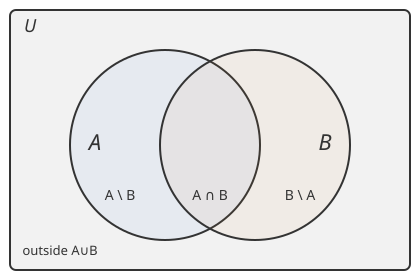

# Discrete Math for Beginners · Lesson 1.2: Sets, operations, and quantifiers

> ⏱ ~15 min · Module 1: Logic and sets · Builds on: 1.1 (statements, connectives, and truth tables) · Unlocks: 2.1 (ordered pairs, relations, and functions)

## Why this matters

In Lesson 1.1 you learned to combine *claims* with and/or/not. This lesson does the same thing for *collections* — and it turns out to be the exact same moves wearing new symbols. Sets are the raw material of everything downstream: a probability event is a set of outcomes, a database table is a set of rows, a function (next lesson) is a set of pairs, and a proof usually comes down to showing one set sits inside another. Learn to combine and count sets fluently now and three later courses stop being mysterious.

## The idea

A **set** is just an unordered bag of distinct things — no repeats, no order. The one question you can ask a set is: *is this thing in you or not?* That yes/no question is **membership**, written $x \in A$ ("$x$ is in $A$").

Here's the payoff that makes sets easy: **every way of combining sets mirrors a logical connective from Lesson 1.1.** "In $A$ **or** $B$" is union. "In $A$ **and** $B$" is intersection. "**Not** in $A$" is complement. You already know the logic — you're just relabeling. And you can *draw* the whole thing with overlapping circles, so when the algebra gets slippery you fall back on a picture.

## The formal version

**Two notations for the same set.** *Listing:* $A = \{1, 2, 3\}$. *Set-builder:* $A = \{\, x : x \text{ is a whole number and } 1 \le x \le 3 \,\}$, read "the set of all $x$ such that…". Use listing for small explicit sets, set-builder when a rule is cleaner than a list.

Fix a **universe** $U$ (everything under discussion). For sets $A, B \subseteq U$:

- **Union:** $A \cup B = \{\, x : x \in A \ \textbf{or}\ x \in B \,\}$. In words: everything in either set.
- **Intersection:** $A \cap B = \{\, x : x \in A \ \textbf{and}\ x \in B \,\}$. In words: only the overlap.
- **Difference:** $A \setminus B = \{\, x : x \in A \ \textbf{and}\ x \notin B \,\}$. In words: in $A$ but stripped of anything in $B$.
- **Complement:** $A^{c} = U \setminus A = \{\, x \in U : x \notin A \,\}$. In words: everything (in the universe) *not* in $A$ — the set version of $\lnot$.

**Subset.** $A \subseteq B$ means: for every $x$, if $x \in A$ then $x \in B$. In words: $A$ sits entirely inside $B$. Note $A \subseteq A$ and the empty set $\varnothing \subseteq A$ always.

**Power set.** $\mathcal{P}(S)$ is the set of *all* subsets of $S$. If $S = \{a, b\}$ then $\mathcal{P}(S) = \{\, \varnothing,\ \{a\},\ \{b\},\ \{a,b\} \,\}$ — four of them. Why $|\mathcal{P}(S)| = 2^{|S|}$: to build a subset, walk through the $|S|$ elements and make one independent **in/out** choice each — $2$ choices, $|S|$ times, so $2^{|S|}$ subsets.

**Cartesian product.** $A \times B = \{\, (a, b) : a \in A,\ b \in B \,\}$, the set of all **ordered pairs** with first slot from $A$, second from $B$. Since each of the $|A|$ first-choices pairs with each of the $|B|$ second-choices, $|A \times B| = |A|\,|B|$. (Order matters here: $(1,2) \neq (2,1)$ — the one place a set-flavored object cares about order.)

**Quantifiers.** These turn an open sentence into a true/false claim over a whole set:

- $\forall x \in U,\ P(x)$ — "**for all** $x$ in $U$, $P(x)$ holds." A giant AND across every element.
- $\exists x \in U,\ P(x)$ — "**there exists** an $x$ in $U$ with $P(x)$." A giant OR across every element.

**Negation flips the quantifier and negates the inside:**
$$\lnot\big(\forall x,\ P(x)\big) \;\equiv\; \exists x,\ \lnot P(x), \qquad \lnot\big(\exists x,\ P(x)\big) \;\equiv\; \forall x,\ \lnot P(x).$$
In words: to break a "for all" claim you need just *one* counterexample; to break a "there exists" claim you must rule out *everything*.

## Picture

The rectangle is the universe $U$; the two circles are $A$ and $B$. The four regions are the four possible answers to "in $A$? in $B$?": only-$A$ is $A \setminus B$, the lens is $A \cap B$, only-$B$ is $B \setminus A$, and the corner outside both circles is $(A \cup B)^{c} = A^{c} \cap B^{c}$. Every set expression you write is some union of these four tiles — which is why the picture never lies.

## Worked examples

**Example 1 (mechanical).** Let $U = \{1,2,3,4,5,6,7,8\}$, $A = \{1,2,3,4\}$, $B = \{3,4,5,6\}$.

- $A \cup B = \{1,2,3,4,5,6\}$ (everything in either).
- $A \cap B = \{3,4\}$ (the overlap).
- $A \setminus B = \{1,2\}$ (in $A$, drop the shared $3,4$).
- $A^{c} = \{5,6,7,8\}$ (everything in $U$ outside $A$).
- $\mathcal{P}(A \cap B)$: since $A \cap B = \{3,4\}$ has $2$ elements, it has $2^{2} = 4$ subsets, namely $\varnothing, \{3\}, \{4\}, \{3,4\}$.

**Example 2 (why you'd care — quantifiers as claims).** Universe $U = \{1,2,\dots,10\}$; let $P(x)$ be "$x$ is even."

- $\forall x \in U,\ P(x)$ reads "every number from $1$ to $10$ is even." **False** — and to prove it false I just point at $x = 3$. That single number is a **counterexample**, exactly what $\lnot\forall = \exists\lnot$ promised: the negation is $\exists x,\ x \text{ is odd}$, witnessed by $3$.
- $\exists x \in U,\ P(x)$ reads "some number from $1$ to $10$ is even." **True**, witnessed by $x = 2$. To have made *this* false I'd have needed *every* number odd — a much heavier lift. That asymmetry (one witness kills a $\forall$; you must sweep everything to kill an $\exists$) is the single most useful thing to remember about quantifiers, and it's why finding a counterexample is often a proof's fastest move.

## Watch out

- You might think $\in$ and $\subseteq$ are interchangeable, but they answer different questions: $3 \in \{3,4\}$ (an *element*), while $\{3\} \subseteq \{3,4\}$ (a *subset*). Writing $3 \subseteq \{3,4\}$ or $\{3\} \in \{3,4\}$ is a type error.
- You might think $\varnothing$ and $\{\varnothing\}$ are the same. They aren't: $\varnothing$ has $0$ elements; $\{\varnothing\}$ has $1$ element (whose name happens to be $\varnothing$). This is why $\mathcal{P}(\varnothing) = \{\varnothing\}$ has size $2^{0} = 1$, not $0$.
- You might think the order of quantifiers doesn't matter, but "$\forall x\, \exists y$" and "$\exists y\, \forall x$" can say very different things (one $y$ for everybody vs. a possibly different $y$ per $x$). Also: when negating, **flip every quantifier** — don't stop halfway.

## One-liner

> Sets are logic you can draw: or/and/not become $\cup/\cap/{}^{c}$, "for all" is a giant AND you break with one counterexample, and negating a quantifier flips it and negates the inside.

## Problems

**P1 (🟢)** Let $U = \{1,2,\dots,9\}$, $A = \{1,3,5,7,9\}$ (odds), $B = \{2,3,5,7\}$ (a few primes). Compute $A \cup B$, $A \cap B$, $A \setminus B$, $B \setminus A$, and $A^{c}$.

**P2 (🟡)** Let $S = \{a, b, c\}$ and $T = \{0, 1\}$. (a) How many elements does $\mathcal{P}(S)$ have, and list them. (b) How many ordered pairs are in $S \times T$, and list them. (c) Is $S \times T$ the same set as $T \times S$? Explain in one line.

**P3 (🔴, optional)** Over the universe $U = \{1,2,\dots,20\}$, consider the claim "every number in $U$ is either even or a multiple of $3$." (a) Write it with a quantifier. (b) Decide if it's true; if not, write its negation formally and give the smallest counterexample. (c) *(Toward `probability-theory`.)* If you pick one number from $U$ uniformly at random, and $E$ = "even", $M$ = "multiple of $3$", express "even **or** multiple of $3$" as a set operation and count how many numbers satisfy it using $|E \cup M| = |E| + |M| - |E \cap M|$.

Solutions

**P1** Work region by region.
- $A \cup B = \{1,2,3,5,7,9\}$ (all odds plus the extra even $2$).
- $A \cap B = \{3,5,7\}$ (in both — the odd primes here).
- $A \setminus B = \{1,9\}$ (odds not in $B$).
- $B \setminus A = \{2\}$ (in $B$ but even, so not among the odds).
- $A^{c} = U \setminus A = \{2,4,6,8\}$ (the evens in $U$).

**P2**
(a) $|\mathcal{P}(S)| = 2^{3} = 8$: $\{\ \varnothing,\ \{a\},\ \{b\},\ \{c\},\ \{a,b\},\ \{a,c\},\ \{b,c\},\ \{a,b,c\}\ \}$.
(b) $|S \times T| = |S|\,|T| = 3 \cdot 2 = 6$: $(a,0),(a,1),(b,0),(b,1),(c,0),(c,1)$.
(c) No. $S \times T$ holds pairs like $(a,0)$ (letter first); $T \times S$ holds $(0,a)$ (number first). Same *size* ($6$ each), but the ordered pairs differ, so they are different sets — order in a pair matters.

**P3**
(a) $\forall x \in U,\ (x \text{ is even}) \lor (3 \mid x)$.
(b) **False.** Negation: $\exists x \in U,\ (x \text{ is odd}) \land (3 \nmid x)$. Smallest witness: $x = 1$ (odd, not a multiple of $3$). Next ones would be $5, 7, 11, \dots$
(c) "Even or multiple of $3$" $= E \cup M$. Count: evens $E = \{2,4,\dots,20\}$, so $|E| = 10$; multiples of $3$ are $\{3,6,\dots,18\}$, so $|M| = 6$; multiples of $6$ (both) are $\{6,12,18\}$, so $|E \cap M| = 3$. Then $|E \cup M| = 10 + 6 - 3 = 13$. (Subtracting the overlap once is inclusion–exclusion — you'll meet it again in Module 3.)

## Flashback

*(None — course start; flashbacks begin at Lesson 2.1.)*

## Connections

- **Backward (Lesson 1.1):** $\cup, \cap, {}^{c}$ are $\lor, \land, \lnot$ applied to membership — De Morgan's laws for sets, $(A \cup B)^{c} = A^{c} \cap B^{c}$, are literally the truth-table De Morgan laws you built, read off the Venn picture.
- **Forward (Lesson 2.1):** a **relation** is just a subset of a Cartesian product $A \times B$ — so today's $A \times B$ is the room every relation and function lives in. Lesson 3.1's multiplication rule is $|A \times B| = |A|\,|B|$ grown up into a counting principle, and the power-set count $2^{|S|}$ is your first taste of it.
- **Sideways (`probability-theory` & CS):** an **event** is a set of outcomes, so "$A$ or $B$" / "$A$ and $B$" / "not $A$" are exactly $\cup / \cap / {}^{c}$ — probability is set theory with a measuring tape. In databases, `UNION`, `INTERSECT`, and `EXCEPT` are these same three operations, and a `JOIN` starts from the Cartesian product. The careful subset-and-membership reasoning here is also the backbone of the `proofs-primer`, where "prove $A \subseteq B$" becomes a standard proof template.
