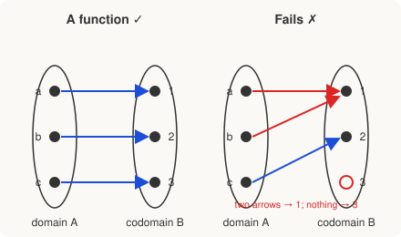

# Discrete Math for Beginners · Lesson 2.1: Ordered pairs, relations, and functions

> ⏱ ~15 min · Module 2: Relations, functions, and a first proof · Builds on: 1.2 (sets, operations, and quantifiers) · Unlocks: 2.2 (a first proof: direct proof and induction)

## Why this matters

"Function" is the single most-used word in all of math, and here you finally get its honest definition: not a formula, but a *rule that pairs things up*. Once you see a function as a set of pairs, three questions become sharp and checkable — does every input get exactly one output? do any two inputs collide? does every possible output get used? Those are exactly the questions a database asks of a primary key, a hash table asks of its hash, and `real-analysis` asks before it will let you invert anything. The same lens gives you **equivalence relations** — the tool that lets you declare "these are the same for my purposes" and carve a set into clean groups, which is precisely what "clock arithmetic" will do in Lesson 4.1.

## The idea

Start with the most primitive relationship there is: putting two things in order. An **ordered pair** $(a,b)$ is just "$a$ then $b$" — order matters, so $(1,2)$ and $(2,1)$ are different. Collect all possible ordered pairs from set $A$ then set $B$ and you get the **Cartesian product** $A\times B$ (Lesson 1.2). That grid of all possible pairings is the raw material.

A **relation** is a rule for keeping *some* of those pairs and throwing away the rest — "$x$ is a friend of $y$", "$x$ is less than $y$". So a relation is literally just a subset of the grid. Nothing fancier.

A **function** is a relation with one strict discipline imposed: **every input gets exactly one output.** No input left unpaired, no input pointing to two places. Think of a vending machine — press B4 and you get exactly one item, always the same one. Press it twice and get two different snacks, and it's broken; that's what disqualifies a relation from being a function.

Once you have a function, two follow-up questions sort them: does the machine ever give the *same* item for two different buttons (if never, it's **injective** — one-to-one), and does *every* item in the rack eventually come out for some button (if so, it's **surjective** — onto)?

## The formal version

**Ordered pair & product.** $A\times B=\{(a,b):a\in A,\ b\in B\}$. *In words: every way to pick a first thing from $A$ and a second from $B$.* If $|A|=m$ and $|B|=n$, then $|A\times B|=mn$.

**Relation.** A relation from $A$ to $B$ is any subset $R\subseteq A\times B$. We write $a\,R\,b$ to mean $(a,b)\in R$. *In words: a relation just declares which pairs count.*

**Function.** A function $f:A\to B$ is a relation from $A$ (the **domain**) to $B$ (the **codomain**) such that for every $a\in A$ there is **exactly one** $b\in B$ with $(a,b)\in f$; we write $b=f(a)$. *In words: each input hits one and only one output.*

- **Injective** (one-to-one): $f(a_1)=f(a_2)\ \Rightarrow\ a_1=a_2$. *In words: different inputs never share an output — no collisions.*
- **Surjective** (onto): for every $b\in B$ there is some $a\in A$ with $f(a)=b$. *In words: every element of the codomain gets hit.*
- **Bijective**: both. A perfect one-to-one pairing of $A$ with $B$.

**Equivalence relation.** A relation $\sim$ on a set $A$ (from $A$ to itself) that is:

- **reflexive**: $a\sim a$ for all $a$ *(everything relates to itself)*,
- **symmetric**: $a\sim b\Rightarrow b\sim a$ *(the relation doesn't care about direction)*,
- **transitive**: $a\sim b$ and $b\sim c\Rightarrow a\sim c$ *(it chains)*.

Such a $\sim$ chops $A$ into disjoint **equivalence classes** $[a]=\{x\in A: x\sim a\}$ — the group of everything considered "the same as $a$". Every element lands in exactly one class; the classes tile $A$ with no overlaps and no gaps (a **partition**). *In words: an equivalence relation is math's formal way of saying "same for my purposes," and it automatically sorts everything into bins.*

## Picture

Left: each input sends one arrow, every output is hit exactly once — injective **and** surjective (a bijection). Right: $a$ and $b$ both point to $1$ (so **not injective** — a collision), and $3$ receives no arrow (so **not surjective** — a missed target). It's still a *function* — every input fires exactly one arrow — just neither one-to-one nor onto.

## Worked examples

**Example 1 (mechanical).** Let $A=\{1,2,3\}$, $B=\{p,q\}$. The Cartesian product has $|A\times B|=3\cdot 2=6$ pairs. Define $f:A\to B$ by $f(1)=p,\ f(2)=q,\ f(3)=q$. As a set of pairs, $f=\{(1,p),(2,q),(3,q)\}$ — one pair per input, so it *is* a function. Injective? No: $f(2)=f(3)=q$ but $2\ne 3$, a collision. Surjective? Yes: $p=f(1)$ and $q=f(2)$, so both codomain elements are hit. So $f$ is onto but not one-to-one.

**Example 2 (why you'd care).** On the integers $\mathbb{Z}$, define $a\sim b$ to mean "$a$ and $b$ have the same remainder when divided by $3$." Check the three laws:

- *Reflexive:* $a$ has the same remainder as itself. ✓
- *Symmetric:* if $a$ matches $b$'s remainder, $b$ matches $a$'s. ✓
- *Transitive:* if $a,b$ share a remainder and $b,c$ share one, all three share it. ✓

So $\sim$ is an equivalence relation, and it partitions $\mathbb{Z}$ into exactly **three** classes by remainder:
$$[0]=\{\dots,-3,0,3,6,\dots\},\quad [1]=\{\dots,-2,1,4,7,\dots\},\quad [2]=\{\dots,-1,2,5,8,\dots\}.$$
Every integer sits in exactly one bin. This is **congruence mod 3** — the star of Lesson 4.1, and the reason a clock with $12$ hours can add $8+7$ and land on $3$.

## Watch out

- You might think any rule pairing $A$ with $B$ is a function, but a relation that leaves some input **unpaired** (no output) or gives an input **two** outputs is *not* a function. "Exactly one" is the whole rule — no more, no less.
- You might think injective and surjective are the same property said twice. They are independent: injective is about **inputs not colliding**; surjective is about **outputs all being used**. The right-hand picture fails both, but you can fail one and pass the other (Example 1 passes surjective, fails injective).
- You might think reflexive and symmetric together give transitive for free. They don't — transitivity is a genuinely separate demand, and "friend of" on people is the classic counterexample: it's reflexive-ish and symmetric, but your friend's friend need not be your friend.

## One-liner

> A function is a set of input–output pairs where every input fires exactly once; injective means no two inputs collide, surjective means no output is wasted, and an equivalence relation is just "same for my purposes," which always sorts a set into clean bins.

## Problems

**P1 (🟢)** Let $A=\{1,2\}$ and $B=\{x,y,z\}$. (a) How many ordered pairs are in $A\times B$? (b) Is the relation $R=\{(1,x),(2,y)\}$ a function $A\to B$? If so, is it injective? Is it surjective?

**P2 (🟡)** For each rule $f:\mathbb{R}\to\mathbb{R}$, decide injective / surjective / both / neither, with a one-line reason: (a) $f(x)=2x+1$; (b) $f(x)=x^2$.

**P3 (🔴, optional)** On the set of all people, define $a\sim b$ to mean "$a$ and $b$ were born in the same calendar year." Show $\sim$ is an equivalence relation, and describe its equivalence classes in plain words. (This is a database-key idea in disguise — see Connections.)

Solutions

**P1** (a) $|A\times B|=2\cdot 3=6$. (b) $R$ assigns exactly one output to each of $1$ and $2$ ($1\mapsto x$, $2\mapsto y$), so it **is** a function. Injective: $x\ne y$, so the two inputs don't collide — **yes, injective**. Surjective: the codomain is $\{x,y,z\}$ but $z$ is never hit, so **not surjective**.

**P2** (a) $f(x)=2x+1$ is a straight line with nonzero slope. Injective: if $2a+1=2b+1$ then $a=b$ — **yes**. Surjective: given any target $y$, solve $x=(y-1)/2$, a real number — **yes**. So **bijective**. (b) $f(x)=x^2$. Injective: $f(-2)=f(2)=4$ but $-2\ne 2$ — **no**. Surjective onto $\mathbb{R}$: negatives like $-1$ are never outputs of a square — **no**. So **neither**.

**P3** *Reflexive:* everyone shares a birth year with themselves. ✓ *Symmetric:* if $a$ shares $b$'s birth year, $b$ shares $a$'s. ✓ *Transitive:* if $a,b$ share a year and $b,c$ share a year, it's the same year, so $a,c$ share it. ✓ Hence $\sim$ is an equivalence relation. The classes are the **birth cohorts**: one class per calendar year, each holding everyone born in that year. Every person lands in exactly one cohort — a clean partition of all people by birth year.

## Flashback

**From Lesson 1.2 (Sets, operations, and quantifiers):** Let $S=\{a,b,c,d\}$ and $T=\{1,2\}$. (a) How many elements does the power set $\mathcal{P}(S)$ have? (b) How many ordered pairs are in the Cartesian product $S\times T$? (c) List the subsets of $S$ that have exactly one element.

Solution

(a) A power set of an $n$-element set has $2^n$ elements, so $|\mathcal{P}(S)|=2^4=16$. (b) $|S\times T|=|S|\cdot|T|=4\cdot 2=8$. (c) The singletons: $\{a\},\{b\},\{c\},\{d\}$ — four of them, matching $\binom{4}{1}=4$.

## Connections

- **Backward:** builds directly on the Cartesian product $A\times B$ from Lesson 1.2 — a relation is just a subset of that product, and a function is a specially disciplined relation.
- **Forward:** Lesson 2.2 turns the equivalence-relation *check* into a real **direct proof** (proving reflexive/symmetric/transitive from definitions), and Boss Problem 2 asks you to prove "$a-b$ is even" is an equivalence relation. `proofs-primer` and `real-analysis` then treat injective/surjective rigorously — surjectivity is what makes an inverse function exist.
- **Sideways (CS):** injectivity is the ideal a **hash function** chases (collisions = two keys sharing a bucket, exactly the right-hand picture) and the guarantee a **database primary key** must give (one row per key, no duplicates). Equivalence classes are how a database `GROUP BY` bins rows. Modular congruence in Lesson 4.1 is the equivalence relation of Example 2 taken to the clock.
