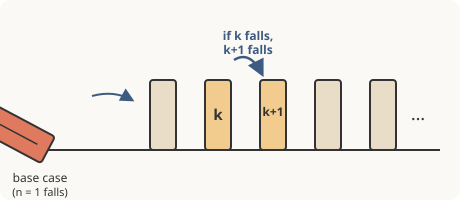

# Discrete Math for Beginners · Lesson 2.2: A first proof — direct proof and induction

> ⏱ ~15 min · Module 2: Relations, functions, and a first proof · Builds on: 2.1 (ordered pairs, relations, and functions) · Unlocks: 3.1 (counting rules and permutations)

## Why this matters

Up to now you've *computed* — built truth tables, listed sets, checked whether a rule is a function. A proof is different: it's how you become *certain* about infinitely many cases at once, without checking them one by one. "The sum of two even numbers is even" isn't something you verify with examples; you argue it, once, for every pair forever. This is the muscle that `proofs-primer` and `real-analysis` are built to make rigorous, and it's the same reasoning a programmer uses to know a loop is correct for every input, not just the three they tested.

## The idea

A **proof** is an airtight chain of reasoning that starts from definitions and known facts and ends, with no gaps, at the claim. No examples, no "it seems like" — each step forced by the one before.

Two moves cover most of what you'll ever need:

- **Direct proof.** Unpack the definitions, do honest algebra, and read off the conclusion. To prove "if $n$ is even then $n^2$ is even," you replace "even" with what it *means* ($n = 2k$), compute, and spot the answer is even again.
- **Induction** is the trick for "true for *all* $n$." Picture an infinite row of dominoes. Knock the first one over (the **base case**). Then guarantee that *whenever* one domino falls, it topples the next (the **inductive step**). Those two facts together mean *every* domino falls — even though you only pushed once and you never touched domino number 8,000. You don't check infinitely many cases; you check two things and let the chain do the rest.

## The formal version

**Definition (even/odd).** An integer $n$ is **even** if $n = 2k$ for some integer $k$, and **odd** if $n = 2k+1$ for some integer $k$. *In words: even means "exactly two times something whole."*

**Definition (divides).** For integers $a, b$, we say $a \mid b$ ("$a$ divides $b$") if $b = a\,m$ for some integer $m$. *In words: $b$ is a whole number of copies of $a$.*

**Principle of Mathematical Induction.** Let $P(n)$ be a statement about integers $n \ge 1$. If

1. $P(1)$ is true (**base case**), and
2. for every $k \ge 1$, *assuming* $P(k)$ is true (the **inductive hypothesis**) forces $P(k+1)$ to be true (**inductive step**),

then $P(n)$ is true for every integer $n \ge 1$.

*In words: if the first domino falls, and every fallen domino knocks over its neighbor, they all fall.* The subtle part is the inductive hypothesis: you're allowed to *assume* $P(k)$ for free — that's not cheating, because you're only ever using it to reach the *next* case, exactly like a domino only needs its one neighbor to have already tipped.

## Picture

## Worked examples

**Example 1 (direct proof — sum of two evens is even).** *Claim: if $m$ and $n$ are even, then $m + n$ is even.*

Unpack the hypothesis: $m$ even means $m = 2a$ for some integer $a$; $n$ even means $n = 2b$ for some integer $b$. Then
$$m + n = 2a + 2b = 2(a + b).$$
Since $a + b$ is an integer, $m+n$ has the form $2 \cdot (\text{integer})$ — which is precisely the definition of even. $\blacksquare$

Notice the whole proof is: *replace the words with their definitions, do one line of algebra, recognize the definition again.* That's the rhythm of nearly every direct proof.

**Example 2 (direct proof — a divisibility claim).** *Claim: for every integer $n$, if $3 \mid n$ then $3 \mid n^2$.*

Hypothesis $3 \mid n$ means $n = 3m$ for some integer $m$. Then
$$n^2 = (3m)^2 = 9m^2 = 3\,(3m^2).$$
Since $3m^2$ is an integer, $n^2 = 3 \cdot (\text{integer})$, so $3 \mid n^2$. $\blacksquare$

**Example 3 (induction — the triangular-number formula).** *Claim: for every integer $n \ge 1$,*
$$P(n): \quad 1 + 2 + \cdots + n = \frac{n(n+1)}{2}.$$

*Base case $P(1)$.* The left side is just $1$; the right side is $\frac{1 \cdot 2}{2} = 1$. They match, so $P(1)$ holds. The first domino falls.

*Inductive step.* Fix any $k \ge 1$ and **assume** $P(k)$: that $1 + 2 + \cdots + k = \frac{k(k+1)}{2}$. We must show $P(k+1)$, i.e. that $1 + 2 + \cdots + (k+1) = \frac{(k+1)(k+2)}{2}$. Start from the left side of $P(k+1)$ and split off the last term:
$$\underbrace{1 + 2 + \cdots + k}_{\text{use the hypothesis}} + (k+1) = \frac{k(k+1)}{2} + (k+1).$$
Now factor out $(k+1)$:
$$= (k+1)\left(\frac{k}{2} + 1\right) = (k+1)\cdot\frac{k+2}{2} = \frac{(k+1)(k+2)}{2}.$$
That's exactly the right side of $P(k+1)$. So whenever $P(k)$ holds, $P(k+1)$ holds too — every domino knocks over the next. By induction, $P(n)$ holds for all $n \ge 1$. $\blacksquare$

The one indispensable move: rewriting $1 + \cdots + (k+1)$ as $\big(1 + \cdots + k\big) + (k+1)$ so the inductive hypothesis has something to bite on. Almost every induction turns on peeling off the last piece to expose the previous case.

## Watch out

- **You might think the inductive hypothesis is circular** — "you assumed what you're proving!" But you didn't: you assume *one specific* case $P(k)$ and use it to earn *the next* case $P(k+1)$. Nowhere do you assume $P(n)$ for all $n$; that conclusion is *produced* by the chain, not borrowed.
- **You might think a couple of examples is a proof.** Checking $P(1), P(2), P(3)$ proves only $P(1), P(2), P(3)$. A pattern that holds for the first forty integers can still fail at the forty-first — a proof is the only thing that covers *all* of them.
- **Don't skip the base case.** An inductive step with no base case proves nothing: dominoes each knocking the next is useless if you never tip the first. (There are false "formulas" whose step works perfectly but whose base case fails — the whole chain then floats, anchored to nothing.)
- **Unpack every definition literally.** "Even" is not a vibe; in a proof it *is* the string "$= 2k$ for some integer $k$." The proof happens the moment you make that substitution.

## One-liner

> A direct proof swaps words for their definitions and reads off the answer; induction tips the first domino and guarantees each fall triggers the next, so all of them fall.

## Problems

**P1 (🟢)** Prove directly that the sum of two odd numbers is even. (Start by unpacking what "odd" means.)

**P2 (🟡)** Prove directly that if $n$ is even, then $n^2$ is divisible by $4$.

**P3 (🔴, optional)** Prove by induction that for every integer $n \ge 1$,
$$1 + 3 + 5 + \cdots + (2n-1) = n^2.$$
State the base case and the inductive step explicitly. (Geometric bonus: why does adding the next odd number to a square always give the next square?)

Solutions

**P1** Let $m, n$ be odd, so $m = 2a+1$ and $n = 2b+1$ for integers $a, b$. Then
$$m + n = (2a+1) + (2b+1) = 2a + 2b + 2 = 2(a + b + 1).$$
Since $a+b+1$ is an integer, $m+n = 2\cdot(\text{integer})$, which is the definition of even. $\blacksquare$

**P2** Let $n$ be even, so $n = 2k$ for some integer $k$. Then
$$n^2 = (2k)^2 = 4k^2 = 4\,(k^2).$$
Since $k^2$ is an integer, $n^2 = 4 \cdot (\text{integer})$, so $4 \mid n^2$. $\blacksquare$

**P3** Let $P(n)$ be the statement $1 + 3 + \cdots + (2n-1) = n^2$.

*Base case $P(1)$.* The left side is the single term $2(1)-1 = 1$; the right side is $1^2 = 1$. They agree, so $P(1)$ holds.

*Inductive step.* Fix $k \ge 1$ and assume $P(k)$: $1 + 3 + \cdots + (2k-1) = k^2$. The next odd number is $2(k+1)-1 = 2k+1$. Then
$$\underbrace{1 + 3 + \cdots + (2k-1)}_{= \, k^2 \text{ by hypothesis}} + (2k+1) = k^2 + 2k + 1 = (k+1)^2,$$
which is exactly $P(k+1)$. So $P(k) \Rightarrow P(k+1)$, and by induction $P(n)$ holds for all $n \ge 1$. $\blacksquare$

*Geometric bonus.* Picture $n^2$ as an $n \times n$ square of dots. To grow it into an $(n+1)\times(n+1)$ square you add a new column of $n$ dots and a new row of $n$ dots, plus one corner dot: $n + n + 1 = 2n+1$, the next odd number. So each odd number is exactly the L-shaped layer that turns one square into the next.

## Flashback

**From Lesson 1.1 (Statements, connectives, and truth tables):** Consider the statement *"If it is raining, then the ground is wet."* (a) Write its **converse** and its **contrapositive**. (b) Write the **negation** of the original statement (the situation that would make it false). (c) Build the truth table for $P \to Q$ and confirm the one row where it is false matches your part (b).

Solution

Let $P$ = "it is raining," $Q$ = "the ground is wet." The statement is $P \to Q$.

(a) **Converse** ($Q \to P$): "If the ground is wet, then it is raining." **Contrapositive** ($\lnot Q \to \lnot P$): "If the ground is not wet, then it is not raining." (The contrapositive is logically equivalent to the original; the converse is not.)

(b) An "if $P$ then $Q$" is false in exactly one situation: $P$ true while $Q$ false. So the negation is "it is raining **and** the ground is not wet" — $P \land \lnot Q$. (Note the negation of an implication is an *and*, not another *if–then*.)

(c)

| $P$ | $Q$ | $P \to Q$ |
|---|---|---|
| T | T | T |
| T | F | **F** |
| F | T | T |
| F | F | T |

The single **F** row is $P$ true, $Q$ false — exactly the "raining and not wet" case from part (b). $\checkmark$

## Connections

- **Backward:** this rests on Lesson 1.1's implication (an inductive step is the implication $P(k) \Rightarrow P(k+1)$) and on 2.1's habit of reading a definition literally before using it.
- **Forward:** Lesson 4.1 (divisibility, parity, and modular arithmetic) runs direct proofs like Examples 1–2 constantly to show things are impossible; `proofs-primer` and `real-analysis` take this same induction and make its logic airtight (including *strong* induction and well-ordering).
- **Sideways (CS):** the inductive step is exactly a **loop invariant** — proving "if the property holds before iteration $k$, it still holds after" is how you prove an algorithm correct for every input, not just the ones you tested.
