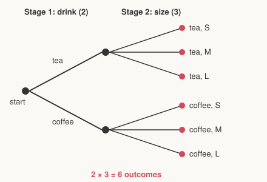

# Discrete Math for Beginners · Lesson 3.1: Counting rules and permutations

> ⏱ ~15 min · Module 3: Counting and combinatorics · Builds on: 1.2 (sets, operations, and quantifiers) · Unlocks: 3.2 (combinations, binomial coefficients, and clever counts)

## Why this matters

"How many ways?" is the question underneath probability (a probability is a count divided by a count), algorithm analysis (how many operations will this loop run?), and security (how many passwords must an attacker try?). The whole trick is learning to count *without listing* — because the lists get astronomically long fast. Two rules do almost all the work, and this lesson is about knowing which one you're holding.

## The idea

Counting a process means breaking it into **stages** and asking, at each fork, "how many choices?"

- If you make a sequence of independent choices — a drink *and* a size *and* a topping — you **multiply** the counts. Each first choice opens up a full fresh set of second choices, so the possibilities fan out.
- If instead you're facing *alternatives* — the answer is a small pizza *or* a large one, and these can't both happen — you **add** the counts of the separate cases.

The one-word test: **"and" (do this, then that) → multiply. "Or" (this case, or that case) → add.** Multiplication builds one outcome out of several parts; addition sorts all outcomes into separate bins and totals the bins.

## The formal version

**Multiplication rule.** If a process has $k$ independent stages, with $n_1$ choices at the first, $n_2$ at the second, …, $n_k$ at the last, the number of outcomes is
$$n_1 \times n_2 \times \cdots \times n_k.$$
In words: independent decisions multiply. "Independent" means the number of options at each stage doesn't depend on what you picked before (the *labels* can change; the *count* can't).

**Addition rule.** If the outcomes split into disjoint cases $A_1, A_2, \dots, A_m$ (no outcome lives in two cases at once), the total is
$$|A_1| + |A_2| + \cdots + |A_m|.$$
In words: count each mutually exclusive case and sum. This is exactly $|A \cup B| = |A| + |B|$ from Lesson 1.2 — *when $A$ and $B$ are disjoint*.

**Factorial.** For an integer $n \ge 1$, $\;n! = n \times (n-1) \times \cdots \times 2 \times 1$, with $0! = 1$ by convention. It counts the **full arrangements** of $n$ distinct objects: $n$ ways to place the first, $n-1$ left for the second (repetition not allowed — you used one up), and so on — the multiplication rule with a shrinking supply.

**Permutations.** An ordered selection of $k$ objects from $n$ distinct objects, **no repeats**, is a *permutation*, and there are
$$P(n,k) = n \times (n-1) \times \cdots \times (n-k+1) = \frac{n!}{(n-k)!}.$$
In words: fill $k$ ordered slots, one object each, crossing off as you go. The $\frac{n!}{(n-k)!}$ form just cancels away the $(n-k)$ slots you never filled. Here **order matters** — gold-silver-bronze is a different outcome from silver-gold-bronze.

## Picture

Every drink (2 of them) branches into every size (3 of them). Count the leaves: $2 \times 3 = 6$. The tree *is* the multiplication rule — the second choice repeats in full under each first choice, so you multiply rather than add.

## Worked examples

**Example 1 (mechanical — the two rules side by side).** A café menu has 2 drinks and 3 sizes.

- *How many drink-and-size combos?* Two independent stages: $2 \times 3 = 6$ (the tree above).
- *How many menu items total if there are also 4 pastries, and an "item" is one drink-with-size **or** one pastry?* These are disjoint kinds of item, so add the cases: $6 + 4 = 10$.

Notice the shift: "drink **and** size" multiplied; "combo **or** pastry" added.

**Example 2 (why you'd care — a password space).** How many 4-character passwords use lowercase letters (26 options each) with repetition allowed? Four independent stages, each with a full 26 options: $26^4 = 456{,}976$. Now forbid repeats (each character must differ): the stages shrink, giving a permutation $P(26,4) = 26 \times 25 \times 24 \times 23 = 358{,}800$. Repetition allowed → raise to a power; repetition forbidden → the falling product $P(n,k)$. This gap between $26^4$ and $P(26,4)$ is precisely why "no repeated characters" rules make passwords *weaker*, not stronger — and why counting is the language of security.

## Watch out

- You might think you should always multiply, but multiplying *alternatives* double-counts nothing yet overcounts by conflating "or" with "and." If two cases can't co-occur, you **add**. Ask: am I building one outcome from parts (multiply), or choosing between separate scenarios (add)?
- You might think order never matters — but for permutations it *always* does. Assigning president, VP, secretary to three people is $P(n,3)$; picking a three-person committee with no titles is **not** (that's next lesson — you'll divide the order back out).
- You might read $\frac{n!}{(n-k)!}$ as "compute two giant factorials, then divide." Don't. It's just the falling product $n(n-1)\cdots(n-k+1)$ — $k$ terms, stop early. $P(100,2) = 100 \times 99$, no factorial of 100 required.

## One-liner

> "And" fans out (multiply the stages); "or" sorts into bins (add the disjoint cases); ordered no-repeat selection is the falling product $P(n,k)=\tfrac{n!}{(n-k)!}$.

## Problems

**P1 (🟢)** A diner offers a fixed-price meal: 3 appetizers, 4 mains, 2 desserts, choose one of each. How many distinct meals are possible?

**P2 (🟡)** A 3-letter code is formed from the letters A, B, C, D, E. (a) How many codes if letters may repeat? (b) How many if no letter repeats? (c) How many of the *no-repeat* codes start with a vowel (A or E)?

**P3 (🔴, optional)** How many integers from 1 to 999 contain at least one digit equal to 7? (Hint: count the complement — the ones with *no* 7 — using the multiplication rule, then subtract.)

Solutions

**P1** Three independent stages, one choice each: $3 \times 4 \times 2 = \boxed{24}$ meals. Pure multiplication rule.

**P2**
(a) Repetition allowed: 3 independent stages of 5 options each, $5^3 = \boxed{125}$.
(b) No repeats: a permutation $P(5,3) = 5 \times 4 \times 3 = \boxed{60}$.
(c) Fix the first slot to a vowel: $2$ ways (A or E). Then fill the remaining 2 slots from the 4 unused letters, order matters, no repeats: $P(4,2) = 4 \times 3 = 12$. By the multiplication rule, $2 \times 12 = \boxed{24}$. (Check via symmetry: $\tfrac{2}{5}$ of the $60$ no-repeat codes should start with a vowel, and $\tfrac{2}{5}\cdot 60 = 24$. ✓)

**P3** Work with 3-digit strings from $000$ to $999$ (that's the numbers $1$–$999$ plus $000$, which has no 7, so it won't affect the "contains a 7" count). Total strings: $10^3 = 1000$. Strings with **no** 7: each of the 3 positions has 9 allowed digits, so $9^3 = 729$. Strings with **at least one** 7: $1000 - 729 = \boxed{271}$. (The excluded $000$ has no 7, so it sits in the 729, not the 271 — the count of numbers $1$–$999$ containing a 7 is exactly $271$.)

## Flashback

**From Lesson 1.2 (Sets, operations, and quantifiers):** Let $A = \{a, b, c\}$ and $B = \{1, 2, 3, 4\}$. (a) How many elements are in the Cartesian product $A \times B$? (b) How many elements are in the power set $\mathcal{P}(A)$? (c) In one sentence, say which counting rule from *this* lesson makes $|A \times B| = |A|\,|B|$ true.

Solution

(a) $|A \times B| = |A|\cdot|B| = 3 \times 4 = 12$ ordered pairs.
(b) $|\mathcal{P}(A)| = 2^{|A|} = 2^3 = 8$ subsets (each of the 3 elements is independently in or out — the multiplication rule with two choices per element, $2\times2\times2$).
(c) The **multiplication rule**: forming a pair $(x,y)$ is two independent stages — pick $x$ from $A$ ($|A|$ ways), then $y$ from $B$ ($|B|$ ways) — so the pairs number $|A|\,|B|$.

## Connections

- **Backward:** the addition rule is just $|A \cup B| = |A| + |B|$ for disjoint sets, and $|A \times B| = |A|\,|B|$ is the multiplication rule — both straight from Lesson 1.2. Counting is set theory with the sizes written down.
- **Forward:** Lesson 3.2 counts *unordered* selections (combinations): take a permutation $P(n,k)$ and divide out the $k!$ orderings you no longer care about — $\binom{n}{k} = \tfrac{P(n,k)}{k!}$. Permutations are the scaffold combinations are built on.
- **Sideways (probability):** in `prob-stat-refresher`, a probability is (favorable outcomes) ÷ (total outcomes) — two counts from *this* lesson. Every "what are the odds?" starts here.
- **Sideways (CS):** counting the operations a nested loop runs is the multiplication rule; a password/key space is $n^k$ or $P(n,k)$ (Example 2). Combinatorics is how algorithms and cryptography get sized.
