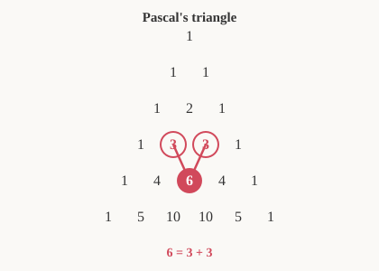

# Discrete Math for Beginners · Lesson 3.2: Combinations, binomial coefficients, and clever counts

> ⏱ ~15 min · Module 3: Counting and combinatorics · Builds on: 3.1 (counting rules and permutations) · Unlocks: 4.1 (divisibility, parity, and modular arithmetic)

## Why this matters

The moment you stop caring about *order* — a poker hand, a committee, a set of pixels flipped on — you've left permutations behind and entered combinations, and $\binom{n}{k}$ is the single most-used count in all of math. It's the backbone of binomial probability (`prob-stat-refresher`), it counts the subsets and bit-strings that algorithms churn through, and its cousin the **pigeonhole principle** is the deceptively simple idea that forces hash collisions and proves "there *must* be two of something." This lesson turns "how many ways?" from guesswork into a reflex.

## The idea

In Lesson 3.1 you counted *ordered* arrangements: picking a president, then a VP, then a secretary from 12 people gives $P(12,3)=12\cdot 11\cdot 10 = 1320$ ways, because swapping two of them makes a genuinely different outcome.

Now suppose the three winners just form a **committee** — no titles, no order. The lineups Ana-Ben-Cara, Cara-Ana-Ben, Ben-Cara-Ana are all the *same* committee. How many orderings did we overcount each committee by? Exactly $3! = 6$ — the number of ways to arrange 3 people. So divide it out: $1320 / 6 = 220$ committees.

That's the whole trick. **A combination is a permutation with the order divided out.** Pick an ordered arrangement, then quotient by the number of internal shuffles that don't change the underlying set.

## The formal version

The number of ways to choose $k$ items from $n$ distinct items, *ignoring order*, is the **binomial coefficient**

$$\binom{n}{k} = \frac{n!}{k!\,(n-k)!} \qquad (0 \le k \le n),$$

read "$n$ choose $k$." Here $n! = n(n-1)\cdots 2\cdot 1$ (and $0!=1$), $k!$ is the internal shuffles we divide out, and $(n-k)!$ cancels the tail of $n!$ we never used.

In words: take all $n!$ orderings, throw away the ordering of the $k$ chosen ($/k!$) and of the $n-k$ left behind ($/(n-k)!$).

**Symmetry.** $\displaystyle \binom{n}{k}=\binom{n}{n-k}$. In words: choosing which $k$ to *take in* is the same act as choosing which $n-k$ to *leave out*. (Algebraically, swapping $k\leftrightarrow n-k$ leaves the formula untouched.)

**Pascal's identity.** For $1\le k\le n-1$,

$$\binom{n}{k}=\binom{n-1}{k-1}+\binom{n-1}{k}.$$

In words: fix one special item. Every $k$-subset either **contains** it — then fill the other $k-1$ spots from the remaining $n-1$ items: $\binom{n-1}{k-1}$ ways — or **excludes** it — then choose all $k$ from the remaining $n-1$: $\binom{n-1}{k}$ ways. Add the two disjoint cases.

**Binomial theorem (first taste).** Those same coefficients are what pop out of expanding a power:

$$(x+y)^n=\sum_{k=0}^{n}\binom{n}{k}x^{k}y^{n-k}.$$

In words: each term of the product picks $x$ from $k$ of the $n$ factors and $y$ from the rest; the number of ways to make that choice is $\binom{n}{k}$. Setting $x=y=1$ gives $\sum_k \binom{n}{k}=2^n$ — the total number of subsets of an $n$-set, since each element is independently in or out.

## Picture

Stack the binomial coefficients by $n$ (row) and $k$ (position) and you get **Pascal's triangle** — every interior entry is the sum of the two directly above it, which is Pascal's identity drawn in numbers.

The highlighted $6$ is $\binom{4}{2}$, sitting on top of the two $3$'s ($\binom{3}{1}$ and $\binom{3}{2}$) that add to it.

## Worked examples

**Example 1 (mechanical).** From a standard 52-card deck, how many 5-card hands are there? Order doesn't matter, so

$$\binom{52}{5}=\frac{52!}{5!\,47!}=\frac{52\cdot 51\cdot 50\cdot 49\cdot 48}{5\cdot 4\cdot 3\cdot 2\cdot 1}=\frac{311{,}875{,}200}{120}=2{,}598{,}960.$$

Only the first five factors of $52!$ survive; the rest cancels against $47!$. Sanity check with symmetry: $\binom{52}{5}=\binom{52}{47}$ — choosing the 5 you hold is the same as choosing the 47 you don't.

**Example 2 (why you'd care — pigeonhole).** *Claim:* among any 13 people, at least two share a birth month. There are 12 months (the "holes") and 13 people (the "pigeons"). If every month had at most one person, we'd fit at most 12 people — contradiction. So some month holds $\ge 2$. That's the **pigeonhole principle**: *if $n+1$ objects go into $n$ boxes, some box gets at least two.*

Its **generalized form**: if $N$ objects go into $n$ boxes, some box holds at least $\left\lceil N/n\right\rceil$ objects (the ceiling — round up). With $N=100$ people and $n=12$ months, some month has $\ge \lceil 100/12\rceil = \lceil 8.33\rceil = 9$ people. This is exactly why a hash table with more keys than slots *must* produce a collision — no hash function, however clever, escapes counting.

## Watch out

- You might think you should always compute $n!$, $k!$, $(n-k)!$ separately — but $n!$ explodes fast. **Cancel first:** $\binom{n}{k}=\dfrac{n(n-1)\cdots(n-k+1)}{k!}$ uses only $k$ factors on top. For $\binom{100}{2}$, that's just $\dfrac{100\cdot 99}{2}=4950$, no giant factorials.
- You might reach for a combination when order *does* matter. Litmus test: would swapping two chosen items give a different outcome? Password / podium / sequence → **permutation** $P(n,k)$. Committee / hand / subset → **combination** $\binom{n}{k}$. They differ by exactly the factor $k!$: $\;P(n,k)=k!\binom{n}{k}$.
- You might add $|A|+|B|$ to count "$A$ or $B$" and double-count the overlap. For two sets, **inclusion–exclusion** fixes it: $|A\cup B|=|A|+|B|-|A\cap B|$. Subtract the intersection once, because you counted it in *both* $|A|$ and $|B|$.

## One-liner

> A combination is a permutation with the order divided out; and once you've got more pigeons than holes, some hole is doubled up — no matter how you arrange them.

## Problems

**P1 (🟢)** A pizza shop has 8 toppings. How many ways can you choose 3 different toppings for one pizza? Then explain in one sentence why the answer equals the number of ways to choose which 5 toppings to *leave off*.

**P2 (🟡)** In a class of 30 students, 18 have taken calculus, 15 have taken statistics, and 7 have taken both. (a) How many have taken at least one of the two? (b) How many have taken neither?

**P3 (🔴, optional)** Show that any set of 5 points placed inside (or on the boundary of) a $2\times 2$ square must contain two points no farther than $\sqrt{2}$ apart. *Hint: cut the square into four $1\times 1$ cells and let the points be pigeons.*

Solutions

**P1** Order of toppings on a pizza doesn't matter, so it's a combination:
$$\binom{8}{3}=\frac{8\cdot 7\cdot 6}{3\cdot 2\cdot 1}=\frac{336}{6}=56.$$
It equals $\binom{8}{5}=56$ by symmetry: naming the 3 toppings you *put on* is the very same decision as naming the 5 you *leave off* — each choice of one determines the other.

**P2** Let $C$ = took calculus, $S$ = took statistics, with $|C|=18$, $|S|=15$, $|C\cap S|=7$.
(a) By inclusion–exclusion, $|C\cup S| = 18 + 15 - 7 = 26$. (Adding $18+15$ counts the 7 "both" students twice, so subtract them once.)
(b) Neither $= $ total $-$ at least one $= 30 - 26 = 4$ students.

**P3** Partition the $2\times2$ square into four $1\times1$ cells (a $2\times2$ grid of unit squares). That's 4 boxes and 5 points, so by pigeonhole at least one cell contains $\ge 2$ of the points. Two points in the same unit square are at most as far apart as its diagonal, whose length is $\sqrt{1^2+1^2}=\sqrt{2}$. Hence some pair is within $\sqrt{2}$. (Points on shared cell borders can be assigned to either adjacent cell; the count still forces a doubled-up cell.)

## Flashback

**From Lesson 3.1 (Counting rules and permutations):** A café offers a 4-digit loyalty PIN using digits $0$–$9$. (a) How many PINs are possible if digits may repeat? (b) How many if all four digits must be *different*? (c) How many of the all-different PINs start with an odd digit?

Solution

(a) Multiplication rule, 10 choices per slot, 4 independent slots: $10^4 = 10{,}000$.
(b) No repeats — this is an ordered arrangement, a permutation: $P(10,4)=10\cdot 9\cdot 8\cdot 7 = 5040$.
(c) The first digit must be odd: 5 choices ($1,3,5,7,9$). Then the remaining three slots are filled from the 9 unused digits, distinct and ordered: $9\cdot 8\cdot 7 = 504$. Total $= 5\cdot 504 = 2520$ — exactly half of (b), as it should be, since a PIN's leading digit is odd or even with equal counts here.

## Connections

- **Backward:** this reuses the permutation count $P(n,k)$ from Lesson 3.1 directly — $\binom{n}{k}=P(n,k)/k!$ *is* the "divide out the order" move made precise.
- **Forward:** Lesson 4.1 (divisibility and parity) leans on the same counting-and-remainder reasoning; and in `prob-stat-refresher`, the binomial distribution $P(k\text{ successes})=\binom{n}{k}p^k(1-p)^{n-k}$ is the binomial theorem with probabilities — the $\binom{n}{k}$ counts *which* trials succeed. The deeper dive lives in the `combinatorics` course.
- **Sideways (CS):** the $2^n$ subsets of an $n$-set are the $n$-bit strings an algorithm may enumerate, and $\binom{n}{k}$ counts those with exactly $k$ ones. Pigeonhole is the reason **hash collisions are unavoidable** once you store more keys than buckets — a counting fact, not a flaw in the hash.
