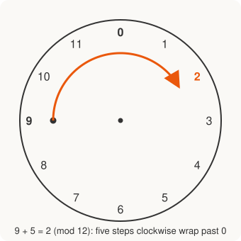

# Discrete Math for Beginners · Lesson 4.1: Divisibility, parity, and modular arithmetic

> ⏱ ~15 min · Module 4: Number sense and a taste of graphs · Builds on: 2.2 (a first proof: direct proof and induction) · Unlocks: 4.2 (a taste of graphs)

## Why this matters

Every time your computer checks a credit-card number for typos, hashes a password, or does the arithmetic behind encryption, it is doing this lesson. The trick is to throw away almost all of a number and keep only its **remainder** — what's left after dividing by some fixed $n$. That single move turns hard "is this possible?" questions into one-line remainder checks, and it's the arithmetic that `number-theory` and `cryptography` are built on.

## The idea

Two numbers of ideas here, and both are about *what a number leaves behind when you divide*.

**Divisibility** is the clean case: $6$ divides $18$ because $18$ splits into three equal groups of $6$ with nothing left over. **Parity** is the smallest version of this — divide by $2$ and ask only "even or odd?" That one bit is shockingly powerful: if a total has to be even and your recipe can only make odd numbers, the task is *impossible*, no matter how clever you are. That's a **parity argument**, and it settles questions without any computation.

**Modular arithmetic** is what happens when the remainder isn't zero and you decide to keep only it. Picture a clock: after 12 it doesn't go to 13, it wraps back to 1. Adding 5 hours to 9 o'clock lands on 2, not 14 — you're doing arithmetic where $12$ and $0$ are the same thing. Fix any modulus $n$ and the whole number line collapses onto a clock with $n$ positions.

## The formal version

**Divisibility.** For integers $a$ and $b$, we say $a \mid b$ ("$a$ divides $b$") when $b = ak$ for some integer $k$.

In words: $b$ is a whole number of copies of $a$. Note $a \mid b$ is a *true/false statement*, not a fraction — don't confuse $a \mid b$ with $a/b$.

**Quotient–remainder theorem.** For any integer $a$ and any integer $n > 0$, there exist **unique** integers $q$ (the quotient) and $r$ (the remainder) with
$$a = nq + r, \qquad 0 \le r < n.$$

In words: dividing by $n$ always gives exactly one answer, and the remainder is pinned to the range $0,1,\dots,n-1$. We write $r = a \bmod n$.

**Parity.** $a$ is **even** if $2 \mid a$ (so $a = 2k$), and **odd** if $a = 2k+1$. Every integer is exactly one of the two — that's the QRT with $n = 2$.

**Congruence.** For $n > 0$, we say $a \equiv b \pmod{n}$ when $n \mid (a - b)$.

In words: $a$ and $b$ leave the **same remainder** mod $n$ — they sit at the same clock position. This is exactly the equivalence relation from Lesson 2.1: it's reflexive ($a\equiv a$), symmetric, and transitive, and its classes are the $n$ remainders $\{0,1,\dots,n-1\}$.

**Arithmetic survives the collapse.** If $a \equiv a' \pmod n$ and $b \equiv b' \pmod n$, then
$$a + b \equiv a' + b' \pmod{n} \qquad\text{and}\qquad a \cdot b \equiv a' \cdot b' \pmod{n}.$$

In words: you may replace any number by its remainder *before* adding or multiplying and get the same clock answer. This is why big computations shrink to clock-sized ones.

## Picture

## Worked examples

**Example 1 (mechanical).** Take $a = 45$, $n = 6$. The quotient–remainder theorem gives
$$45 = 6 \cdot 7 + 3, \qquad 0 \le 3 < 6,$$
so $q = 7$, $r = 3$, i.e. $45 \equiv 3 \pmod 6$. Now use "reduce first" to add on the clock:
$$(45 + 20) \bmod 6 = (3 + 2) \bmod 6 = 5,$$
since $20 \equiv 2$. Check: $65 = 6\cdot 10 + 5$. ✓ We never needed the big number $65$ — only its remainder.

**Example 2 (why you'd care — a checksum).** Because $10 \equiv 1 \pmod 9$, every power of ten is $\equiv 1$, so a number is congruent mod $9$ to the *sum of its digits*:
$$12{,}345 \equiv 1+2+3+4+5 = 15 \equiv 1+5 = 6 \pmod 9.$$
That's the "divisible by 9 iff digit-sum is" rule, and it generalizes: banks and barcodes tack a **check digit** on the end so that the whole number hits a fixed remainder. A single mistyped digit changes the remainder, and the machine rejects it instantly — a parity/mod argument doing quality control. The same idea, with a much bigger modulus, is the skeleton of `cryptography`.

## Watch out

- You might think $-7 \bmod 5 = -2$, but the theorem forces $0 \le r < n$: $-7 = 5\cdot(-2) + 3$, so $-7 \bmod 5 = \mathbf{3}$. Remainders are never negative.
- You might read $a \equiv b \pmod n$ as "$a = b$," but it only means *same remainder*: $17 \equiv 5 \pmod{12}$ even though $17 \ne 5$. A congruence class holds infinitely many numbers.
- You might assume you can divide/cancel on a clock like normal. You can't in general: $2\cdot 3 \equiv 2\cdot 0 \pmod 6$, yet $3 \not\equiv 0 \pmod 6$. Addition and multiplication transfer; cancellation needs care.

## One-liner

> Divisibility asks "does it go in evenly?"; modular arithmetic throws away everything but the remainder and does math on a clock.

## Problems

**P1 (🟢)** (a) Write the quotient–remainder form of $a = 100$, $n = 7$, and state $100 \bmod 7$. (b) Compute $(-17) \bmod 5$. (c) Find $(38 + 27) \bmod 9$ by reducing each term first.

**P2 (🟡)** Show that every perfect square satisfies $x^2 \equiv 0$ or $1 \pmod 4$. Use this to prove that no number of the form $4k+3$ is a perfect square, and decide in one line whether $1{,}000{,}003$ is a perfect square.

**P3 (🔴, optional)** Find the last digit of $7^{2024}$, and explain in a sentence why this is the same kind of "work on a clock" that lets `cryptography` raise numbers to enormous powers without the numbers exploding.

Solutions

**P1** (a) $100 = 7\cdot 14 + 2$ with $0\le 2 < 7$, so $q=14$, $r=2$ and $100 \bmod 7 = 2$.
(b) Need $0\le r<5$: $-17 = 5\cdot(-4) + 3$ (since $5\cdot(-4) = -20$ and $-20+3=-17$), so $(-17)\bmod 5 = 3$. (Watch the sign trap — not $-2$.)
(c) $38 \equiv 2$ and $27 \equiv 0 \pmod 9$, so $(38+27)\equiv 2+0 = 2 \pmod 9$. Check: $65 = 9\cdot 7 + 2$. ✓

**P2** By the QRT every integer is $x \equiv 0,1,2,$ or $3 \pmod 4$. Squaring each residue and reducing:
$$0^2\equiv 0,\quad 1^2\equiv 1,\quad 2^2 = 4\equiv 0,\quad 3^2 = 9 \equiv 1 \pmod 4.$$
So a square is always $\equiv 0$ or $1 \pmod 4$ — never $2$ or $3$. A number $4k+3$ is $\equiv 3 \pmod 4$, which is not on that list, so it cannot be a perfect square. For $1{,}000{,}003$: $1{,}000{,}000 = 4\cdot 250{,}000 \equiv 0$, so $1{,}000{,}003 \equiv 3 \pmod 4$ — **not** a perfect square.

**P3** Track only the last digit, i.e. work mod $10$. Powers of $7$ cycle:
$$7^1\equiv 7,\ 7^2\equiv 9,\ 7^3\equiv 3,\ 7^4\equiv 1,\ 7^5\equiv 7,\dots \pmod{10},$$
a cycle of length $4$. Since $2024 = 4\cdot 506$, we have $2024 \equiv 0 \pmod 4$, landing at the end of a cycle: $7^{2024}\equiv 7^4 \equiv 1 \pmod{10}$. The last digit is $\boxed{1}$. The point: to know one digit we never computed the (astronomically large) $7^{2024}$ — we reduced mod $10$ at every step and stayed on a 10-position clock. Encryption does exactly this with a huge modulus, keeping every intermediate number small enough to store.

## Flashback

**From Lesson 2.2 (A first proof — direct proof and induction):** Prove directly that the product of two odd integers is odd.

Solution

Let $a$ and $b$ be odd. By definition of odd, $a = 2m+1$ and $b = 2n+1$ for some integers $m,n$. Then
$$ab = (2m+1)(2n+1) = 4mn + 2m + 2n + 1 = 2(2mn + m + n) + 1.$$
Since $2mn+m+n$ is an integer, $ab$ has the form $2k+1$, so $ab$ is odd. $\blacksquare$ (This is the parity fact quietly behind "an odd number squared is odd," which we leaned on when checking squares mod 4 in P2.)

## Connections

- **Backward:** congruence mod $n$ is the equivalence relation from Lesson 2.1 made concrete — its classes are exactly the remainders $0,\dots,n-1$. Parity proofs reuse the definition-unpacking move from 2.2.
- **Forward:** Lesson 4.2 uses a parity argument on the *degree sum* of a graph (the handshake lemma) to prove the number of odd-degree vertices is always even — the same "a total must be even" logic as P2, now on dots and lines.
- **Sideways (CS):** remainders power **hashing** (which bucket does a key land in?) and **checksums** (Example 2's check digit); scaled up to large moduli, modular exponentiation (P3) is the engine of `cryptography` and the entry point to a full `number-theory` course.
