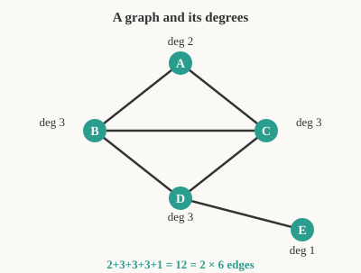

# Discrete Math for Beginners · Lesson 4.2: A taste of graphs

> ⏱ ~15 min · Module 4: Number sense and a taste of graphs · Builds on: 4.1 (divisibility, parity, and modular arithmetic) · Unlocks: proofs-primer (next course)

## Why this matters

Almost every structure computer science cares about is secretly a graph: the internet is machines wired by cables, a map is cities joined by roads, a social network is people joined by friendships, a molecule is atoms joined by bonds. Once you see "dots and lines," a huge range of questions — *shortest route, can everyone reach everyone, is there a cycle* — become one subject. And it closes this course perfectly: a single fact about graphs, the handshake lemma, turns out to be nothing but the parity argument from Lesson 4.1 in a new costume.

## The idea

A **graph** is the barest possible model of "things and the connections between them." Draw a dot for each thing (a **vertex**) and a line for each connection (an **edge**). That's it — no geometry, no distances, only *who is joined to whom*.

Two useful words fall out immediately. Two vertices are **adjacent** if an edge joins them. The **degree** of a vertex is just how many edges stick out of it — for a person in a friendship graph, their number of friends.

Here's the one fact worth carrying out the door. Count the degree of every vertex and add them up. Every edge has two ends, so every edge gets counted exactly **twice** — once at each endpoint. So the total of all degrees is always *even*, and always equal to twice the number of edges. That "each edge has two ends" bookkeeping is the whole lesson.

## The formal version

A **graph** $G=(V,E)$ is a set of **vertices** $V$ together with a set of **edges** $E$, where each edge is an unordered pair $\{u,v\}$ of distinct vertices. We write $|V|$ for the number of vertices and $|E|$ for the number of edges.

Two vertices $u,v$ are **adjacent** if $\{u,v\}\in E$. The **degree** of a vertex $v$, written $\deg(v)$, is the number of edges incident to it.

A **path** is a sequence of distinct vertices $v_0,v_1,\dots,v_k$ with each consecutive pair adjacent — a walk that never revisits a vertex. A **cycle** is such a walk that returns to its start, $v_0,v_1,\dots,v_k,v_0$, with $k\ge 2$.

**Handshake lemma.**
$$\sum_{v\in V}\deg(v)=2\,|E|.$$
*In words:* adding up everyone's degree double-counts every edge, so the total is exactly twice the edge count. An immediate consequence: since the left side equals an even number, **the number of vertices with odd degree must be even** — you can never have an odd count of odd-degree vertices.

Why the consequence follows: split the sum into even-degree vertices and odd-degree ones. The even-degree part is even. The whole sum is even. So the odd-degree part is even too — and a sum of odd numbers is even only when there is an *even number* of them (exactly the parity reasoning from Lesson 4.1: odd + odd = even, so odds must pair up).

## Picture

Five vertices, six edges. Read off the degrees: $A$ has $2$, $B,C,D$ each have $3$, and $E$ (a lone pendant) has $1$. Their sum is $2+3+3+3+1=12$, which is $2\times 6$ — the handshake lemma checking out. Notice the odd-degree vertices are $B,C,D,E$: four of them, an even count, exactly as promised.

## Worked examples

**Example 1 (mechanical).** Take the graph in the Picture. Is $A,B,D,E$ a path? Check consecutive pairs: $\{A,B\}$ is an edge (yes), $\{B,D\}$ is an edge (yes), $\{D,E\}$ is an edge (yes), and no vertex repeats — so yes, it's a path of length $3$. Is $A,B,C,A$ a cycle? Check $\{A,B\},\{B,C\},\{C,A\}$ — all three are edges, and it returns to $A$, so yes, it's a triangle (a $3$-cycle). Vertex $E$, by contrast, sits on no cycle at all: its single edge is a dead end.

**Example 2 (why you'd care).** *Six people at a party each want to shake hands with exactly three others — is that possible?* Model it as a graph: a vertex per person, an edge per handshake, so "three handshakes" means degree $3$. The degree sum would be $6\times 3=18$, and by the handshake lemma $|E|=18/2=9$ — a whole number, no parity obstruction, so it's *feasible* (two triangles joined by a matching — a triangular prism — gives every vertex degree $3$). Now change the party to *five* people each wanting exactly three handshakes: the degree sum is $5\times 3=15$, which is **odd**. But every degree sum is even, so no such graph exists — five people cannot each shake exactly three hands. You just proved something *impossible* without drawing a single diagram, purely from parity. That is the flavor of argument all of `proofs-primer` is built on.

## Watch out

- You might think a high-degree vertex means a "long" graph, but degree only counts *immediate* neighbors. A vertex of degree $100$ can still sit in a graph with no long path — degree is local, paths are global.
- You might think every list of desired degrees is achievable, but the handshake lemma forbids any list whose sum is odd (like five 3's). Always sum-and-check parity first.
- A **path** and a **cycle** require *distinct* vertices — wandering back and forth $A,B,A$ is a walk, not a path. Don't call every stroll through the graph a path.

## One-liner

> A graph is just dots and lines; add up every dot's degree and you've counted each line twice — so the total is always even, and odd-degree dots come in pairs.

## Problems

**P1 (🟢)** A graph has $5$ vertices with degrees $3,2,2,2,1$. How many edges does it have? Check that the number of odd-degree vertices is even, and sketch one graph that works.

**P2 (🟡)** In a group of $7$ people, is it possible for everyone to have exactly $3$ friends within the group (friendship being mutual)? Justify with the handshake lemma.

**P3 (🔴, optional)** Prove that in *any* graph with at least two vertices, there must exist two different vertices of the *same* degree. (Hint: in a graph on $n$ vertices, what are the possible degree values, and why can't the two extremes both occur?)

Solutions

**P1** Sum the degrees: $3+2+2+2+1=10$. By the handshake lemma $2|E|=10$, so $|E|=\boxed{5}$ edges. The odd-degree vertices are the ones with degree $3$ and degree $1$ — exactly **two** of them, an even count, as the lemma demands. One graph that works: label the vertices $a,b,c,d,e$ and take edges $ab,ac,ad,be,cd$. Then $\deg(a)=3$ (to $b,c,d$), $\deg(b)=2$ (to $a,e$), $\deg(c)=2$ (to $a,d$), $\deg(d)=2$ (to $a,c$), $\deg(e)=1$ (to $b$) — degrees $3,2,2,2,1$, and $5$ edges, exactly as required.

**P2** Model it as a graph: a vertex per person, an edge per mutual friendship, so "$3$ friends" means degree $3$. If everyone had degree $3$, the degree sum would be $7\times 3 = 21$, which is **odd**. But the handshake lemma forces every degree sum to equal $2|E|$, an even number. $21$ is not even, contradiction — so it is **impossible** for all $7$ people to have exactly $3$ friends. (Equivalently: the number of odd-degree vertices must be even, but $7$ people all of odd degree $3$ is an odd count.)

**P3** In a graph on $n$ vertices, each vertex's degree is one of the $n$ values $0,1,2,\dots,n-1$. Suppose, for contradiction, that all $n$ vertices had *different* degrees. Then those $n$ degrees would have to be exactly $0,1,2,\dots,n-1$, each occurring once. But degree $0$ means a vertex adjacent to *nobody*, while degree $n-1$ means a vertex adjacent to *everybody* (all other vertices). These two cannot coexist: the degree-$(n-1)$ vertex would be adjacent to the degree-$0$ vertex, making the latter's degree at least $1$ — contradiction. So the degrees cannot all be distinct; by pigeonhole (Lesson 3.2), at least two vertices share a degree. $\blacksquare$

## Flashback

**From Lesson 4.1 (Divisibility, parity, and modular arithmetic):** A $12$-hour clock reads $9$ o'clock. What time will it read $100$ hours later? And prove that a clock can *never* read the same hour after exactly $50$ hours as it does now.

Solution

Clock arithmetic is arithmetic $\bmod\ 12$. Starting at $9$ and advancing $100$ hours: $9 + 100 = 109$, and $109 = 9\times 12 + 1$, so $109 \equiv 1 \pmod{12}$. The clock reads **1 o'clock**.

For the second part: advancing $50$ hours changes the reading by $50 \equiv 2 \pmod{12}$ (since $50 = 4\times 12 + 2$). Returning to the same hour would require $50 \equiv 0 \pmod{12}$, i.e. $12 \mid 50$. But $50 = 4\times12 + 2$ leaves remainder $2\neq 0$, so $12\nmid 50$. Hence the reading shifts by $2$ hours and can never coincide with the start. $\blacksquare$

## Connections

- **Backward:** the handshake lemma's punchline — *the number of odd-degree vertices is even* — is pure parity from Lesson 4.1 (odd + odd = even, so odds pair up). The Flashback and Example 2 are the same "sum must be even" move applied to hours and to handshakes.
- **Forward:** this is the doorway to a full `graph-theory` course (trees, coloring, Euler and Hamilton paths, shortest paths) and to the future **Computer Science track**, where graphs power data structures, network routing, and core algorithms (BFS/DFS, Dijkstra). More immediately, the impossibility arguments here — "the degree sum is odd, therefore no such graph" — are your first taste of `proofs-primer`, the next course, which turns these one-line contradictions into disciplined proof.
- **Sideways:** in `probability-theory`, *random graphs* (connect each pair with probability $p$) model everything from epidemics to social ties, and their expected degree sum is computed with exactly this lemma. In chemistry, a molecule is a **molecular graph** — atoms as vertices, bonds as edges — and an atom's degree is its valence, so the handshake lemma becomes a bookkeeping check on bond counts.
