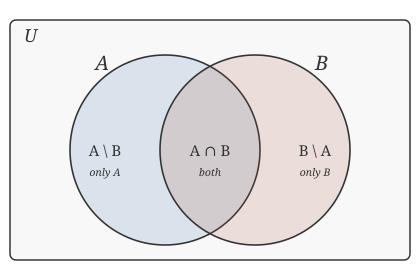

# Discrete Mathematics · Lesson 2.1: Sets & set operations

> ⏱ ~15 min · Module 2: Sets, Relations & Functions · Builds on: 1.2 (predicate logic: quantifiers & negation) · Unlocks: 2.2 (relations: equivalence & order)

## Why this matters

Every object you'll meet from here on — a relation, a function, an event in probability, a table in a database, a group in abstract algebra — is a *set* with extra structure. Sets are the universal container. And the moment you want to *prove* two set descriptions denote the same collection (not just eyeball them), you need one reliable move: the element method. It's the same $\forall/\exists$ reasoning from Lesson 1.2, now aimed at membership.

## The idea

A **set** is an unordered bag of distinct things. That's it — no order, no repeats. The only question you can ask a set is: *are you in here or not?* Everything else is built from that yes/no.

The operations are just the logical connectives from Module 1 wearing new clothes. "In $A$ **or** $B$" is union. "In $A$ **and** $B$" is intersection. "**Not** in $A$" is complement. If you already trust $\lor, \land, \lnot$, you already understand $\cup, \cap$, and complement — a set operation is a predicate on membership.

And to prove one set sits inside another, you don't check every element by hand (there may be infinitely many). You grab a *typical* element and follow the logic: "let $x \in A$ … therefore $x \in B$." One generic $x$, honestly argued, settles all of them at once. That's a universally quantified claim in disguise.

## The formal version

A **set** is a collection of distinct objects; $x \in A$ means "$x$ is an element of $A$," and $x \notin A$ its negation. Two ways to name a set:

- **Roster:** list the elements, e.g. $A = \{1, 2, 3\}$. Order and repetition don't matter: $\{1,2,3\} = \{3,1,1,2\}$.
- **Set-builder:** state the membership predicate, e.g. $A = \{\, x \in \mathbb{Z} : 1 \le x \le 3 \,\}$. In words: "the $x$ in $\mathbb{Z}$ such that the condition holds."

**Subset.** $A \subseteq B$ means $\forall x\,(x \in A \to x \in B)$. *In words:* everything in $A$ is also in $B$.

**Set equality.** $A = B$ iff $A \subseteq B$ **and** $B \subseteq A$ — the two sets contain exactly the same elements. This "prove both inclusions" pattern is how almost every set identity gets established.

**Operations.** Fix a universe $U$ (the set of all objects under discussion).

$$A \cup B = \{x : x \in A \lor x \in B\}, \qquad A \cap B = \{x : x \in A \land x \in B\},$$
$$A \setminus B = \{x : x \in A \land x \notin B\}, \qquad \overline{A} = U \setminus A = \{x \in U : x \notin A\}.$$

*In words:* union = "in either," intersection = "in both," difference $A\setminus B$ = "in $A$ but not $B$," complement = "everything in $U$ outside $A$." Note the exact mirror: $\cup \leftrightarrow \lor$, $\cap \leftrightarrow \land$, $\overline{\ \cdot\ } \leftrightarrow \lnot$.

**Power set.** $\mathcal{P}(S) = \{\, T : T \subseteq S \,\}$, the set of **all** subsets of $S$ (including $\emptyset$ and $S$ itself). Each element of $S$ is independently in-or-out of a subset, so

$$|\mathcal{P}(S)| = 2^{|S|}.$$

**Cartesian product.** $A \times B = \{\, (a, b) : a \in A \land b \in B \,\}$, the set of **ordered** pairs. Here order *does* matter — $(a,b) \ne (b,a)$ in general. Counting each choice independently,

$$|A \times B| = |A|\,|B|.$$

**The element method.** To prove $A \subseteq B$: *take an arbitrary $x \in A$, and deduce $x \in B$.* To prove $A = B$: do that in both directions. Because $x$ is arbitrary, the single argument covers every element — it's a proof of $\forall x\,(x \in A \to x \in B)$.

## Picture

The universe $U$ is the box; $A$ and $B$ are the circles. The three disjoint regions carve up $A \cup B$: elements in $A$ only ($A \setminus B$), in both ($A \cap B$), and in $B$ only ($B \setminus A$). Everything outside both circles is $\overline{A \cup B}$.

## Worked examples

**Example 1 (mechanical).** Let $U = \{1,2,3,4,5,6\}$, $A = \{1,2,3,4\}$, $B = \{3,4,5\}$. Then:

$$A \cup B = \{1,2,3,4,5\},\quad A \cap B = \{3,4\},\quad A \setminus B = \{1,2\},\quad \overline{B} = \{1,2,6\}.$$

Power set count: $|\mathcal{P}(A)| = 2^4 = 16$. For a small one, $\mathcal{P}(\{3,4\}) = \{\, \emptyset, \{3\}, \{4\}, \{3,4\} \,\}$ — four subsets, as $2^2 = 4$ predicts. Product size: $|A \times B| = 4 \cdot 3 = 12$, e.g. $(1,3)$ and $(4,5)$ are two of the twelve pairs, and $(3,1) \ne (1,3)$.

**Example 2 (why you'd care — an identity by the element method).** Prove the **distributive law** $A \cap (B \cup C) = (A \cap B) \cup (A \cap C)$.

*($\subseteq$)* Let $x \in A \cap (B \cup C)$. Then $x \in A$ and $x \in B \cup C$, so $x \in A$ and ($x \in B$ or $x \in C$). Distributing the logical *and* over *or*: ($x \in A$ and $x \in B$) or ($x \in A$ and $x \in C$), i.e. $x \in A\cap B$ or $x \in A\cap C$, so $x \in (A\cap B)\cup(A\cap C)$.

*($\supseteq$)* Every step above is an *iff*, so reading it backwards proves the reverse inclusion. Both inclusions hold, so the sets are equal. $\blacksquare$

Notice the engine: the *set* distributive law is nothing but the *logical* distributive law $p \land (q \lor r) \equiv (p\land q)\lor(p\land r)$ from Lesson 1.1, applied to membership predicates. This is why databases can freely rewrite `A AND (B OR C)` as `(A AND B) OR (A AND C)` when planning a query — same law, same guarantee.

## Watch out

- You might think $\in$ and $\subseteq$ are interchangeable — they're not. $2 \in \{1,2,3\}$ (an element), but $\{2\} \subseteq \{1,2,3\}$ (a subset). And $\emptyset \subseteq S$ *always* (vacuously — there's no element to fail the test), while $\emptyset \in S$ only if you deliberately put it there.
- You might think $A \times B$ is unordered like a set operation — it isn't. Its elements are *ordered pairs*, so $(a,b) \ne (b,a)$ unless $a=b$, and $A \times B \ne B \times A$ in general.
- You might treat "prove $A = B$" as one step. It's two: $A \subseteq B$ **and** $B \subseteq A$. Skipping a direction is the most common set-proof error — showing only $\subseteq$ leaves $B$ possibly larger.

## One-liner

> A set answers one question — "are you in?" — so every set law is just a logic law ($\lor,\land,\lnot$) applied to membership, and the element method is how you cash that in as a proof.

## Problems

**P1 (🟢)** Let $U = \{1,2,3,4,5,6,7,8\}$, $A = \{1,2,3,4,5\}$, $B = \{4,5,6,7\}$. Compute $A \cap B$, $A \setminus B$, $\overline{A \cup B}$, and $|\mathcal{P}(B)|$. Then list all elements of $\{1,2\} \times \{5,6\}$.

**P2 (🟡)** Prove by the element method that $A \setminus B \subseteq A$. Then give a concrete $A, B$ for which the inclusion is *strict* (i.e. $A\setminus B \ne A$), and one for which it's an *equality*.

**P3 (🔴, optional)** Prove **De Morgan's law** $\overline{A \cup B} = \overline{A} \cap \overline{B}$ by the element method (both inclusions), and name the logical equivalence from Lesson 1.1 that powers it.

Solutions

**P1** $A \cap B = \{4,5\}$ (the shared elements). $A \setminus B = \{1,2,3\}$ (in $A$, not in $B$). $A \cup B = \{1,2,3,4,5,6,7\}$, so $\overline{A \cup B} = U \setminus (A\cup B) = \{8\}$. $|\mathcal{P}(B)| = 2^{|B|} = 2^4 = 16$. Finally $\{1,2\}\times\{5,6\} = \{\,(1,5),\,(1,6),\,(2,5),\,(2,6)\,\}$ — four ordered pairs, matching $2\cdot 2 = 4$.

**P2** *Claim: $A\setminus B \subseteq A$.* Let $x \in A \setminus B$. By definition of difference, $x \in A$ **and** $x \notin B$. In particular $x \in A$. Since $x$ was arbitrary, $A \setminus B \subseteq A$. $\blacksquare$

Strict example: $A = \{1,2\}$, $B = \{2\}$ gives $A\setminus B = \{1\} \ne A$. Equality example: $A = \{1,2\}$, $B = \{3\}$ (disjoint from $A$) gives $A \setminus B = \{1,2\} = A$. In general $A\setminus B = A$ exactly when $A \cap B = \emptyset$.

**P3** *($\subseteq$)* Let $x \in \overline{A\cup B}$. Then $x \notin A \cup B$, i.e. it is **not** the case that ($x\in A$ or $x\in B$). By De Morgan for logic, that means $x \notin A$ **and** $x \notin B$, so $x \in \overline{A}$ and $x \in \overline{B}$, hence $x \in \overline{A}\cap\overline{B}$.

*($\supseteq$)* Let $x \in \overline{A}\cap\overline{B}$. Then $x \notin A$ and $x \notin B$, so it is not the case that ($x\in A$ or $x\in B$), i.e. $x \notin A\cup B$, so $x \in \overline{A\cup B}$.

Both inclusions hold, so $\overline{A\cup B} = \overline{A}\cap\overline{B}$. $\blacksquare$ The engine is the logical equivalence $\lnot(p \lor q) \equiv \lnot p \land \lnot q$ — De Morgan's law from Lesson 1.1. (Every step above is an *iff*, so a one-shot chain of $\Leftrightarrow$ also works.)

## Flashback

**From Lesson 1.2 (Predicate logic: quantifiers & negation):** Consider the statement $S$: "for every integer $n$, there exists an integer $m$ with $m > n^2$." Decide whether $S$ is true, then write its negation and decide whether *that* is true.

Solution

$S$ is $\forall n\in\mathbb{Z},\ \exists m\in\mathbb{Z},\ m > n^2$. It is **true**: given any $n$, take $m = n^2 + 1$, which is an integer and satisfies $m > n^2$.

Negation — flip each quantifier and negate the inner predicate ($\lnot(m>n^2)$ is $m \le n^2$):

$$\lnot S:\quad \exists n\in\mathbb{Z},\ \forall m\in\mathbb{Z},\ m \le n^2.$$

*In words:* "there is an integer $n$ such that every integer $m$ is $\le n^2$." This is **false** — for any fixed $n$, the integer $m = n^2 + 1$ violates $m \le n^2$. (As it must be: $S$ true forces $\lnot S$ false.)

## Connections

- **Backward:** the set operations *are* the logical connectives of Lessons 1.1–1.2 applied to membership; the element method *is* a $\forall$-proof (1.2) executed on the predicate $x \in A$.
- **Forward:** Lesson 2.2 defines a relation as a *subset of $A \times B$* — today's Cartesian product is its home. Lesson 3.1's product rule is $|A\times B| = |A||B|$ generalized to many choices, and power sets reappear when counting subsets.
- **Sideways:** in `[probability-theory](../../probability-theory/syllabus.md)`, events are subsets of a sample space and $\cup/\cap/\overline{\ \cdot\ }$ are "or / and / not" for events; in relational databases, `UNION`, `INTERSECT`, and `EXCEPT` are literally these operations on rows, and `A AND (B OR C)` rewrites via the distributive law from Example 2.
