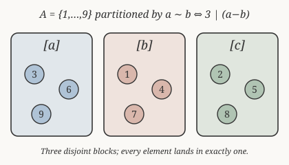

# Discrete Mathematics · Lesson 2.2: Relations — equivalence & order

> ⏱ ~15 min · Module 2: Sets, Relations & Functions · Builds on: 2.1 (sets & set operations) · Unlocks: 2.3 (functions: injections, surjections, bijections & cardinality)

## Why this matters

Almost every "these two things are the same for my purposes" statement in math is an equivalence relation in disguise: two fractions equal ($\tfrac12 = \tfrac{2}{4}$), two integers congruent mod $n$ (the whole engine of Module 4's number theory), two objects the same up to rotation, two program states indistinguishable. And almost every "this comes before that" statement — divides, is a subset of, is less than or equal to — is a partial order. Learn to test the three properties of a relation and you can classify *any* "sameness" or "ordering" notion, and know exactly what it lets you do. This is also the mental model behind a type system's equality and a database's grouping.

## The idea

A **relation** is just a rule that answers yes/no to "is $a$ related to $b$?" — nothing more. Formally it's the *set of pairs* for which the answer is yes. Once you have a rule, three questions decide its personality:

- **Reflexive** — is everything related to itself? ("Am I the same age as me?" Obviously yes.)
- **Symmetric** — if $a$ relates to $b$, does $b$ relate back? ("Same age as" is symmetric; "older than" is not.)
- **Transitive** — if $a\sim b$ and $b\sim c$, does $a\sim c$? ("Same age" chains; "friend of" famously does not.)

Two special combinations dominate everything downstream. Hit **all three** (reflexive, symmetric, transitive) and you have an **equivalence relation** — it shatters your set into non-overlapping clumps, the *equivalence classes*, each holding exactly the elements that are "the same." Swap symmetry for **antisymmetry** (if $a\preceq b$ and $b\preceq a$ then $a=b$ — no two *distinct* things can precede each other) and you have a **partial order**: a consistent notion of ranking, possibly with some pairs left uncompared.

## The formal version

Let $A$ be a set. A **(binary) relation** $R$ on $A$ is any subset $R\subseteq A\times A$; we write $a\,R\,b$ (or $a\sim b$) to mean $(a,b)\in R$. More generally a relation from $A$ to $B$ is a subset of $A\times B$.

The three core properties. $R$ on $A$ is:

- **Reflexive**: $\forall a\in A,\ a\sim a$. *In words: every element relates to itself.*
- **Symmetric**: $\forall a,b\in A,\ a\sim b \Rightarrow b\sim a$. *In words: the relation never points one way only.*
- **Transitive**: $\forall a,b,c\in A,\ (a\sim b \wedge b\sim c)\Rightarrow a\sim c$. *In words: relatedness chains through a middleman.*

**Equivalence relation.** $\sim$ is an equivalence relation if it is reflexive, symmetric, *and* transitive. The **equivalence class** of $a$ is
$$[a] = \{\,x\in A : x\sim a\,\}.$$
*In words: $[a]$ collects everything the same as $a$.* The classes have a rigid structure — this is the payoff:

> **Fundamental theorem.** The equivalence classes of $\sim$ **partition** $A$: they are non-empty, pairwise disjoint, and their union is all of $A$. Equivalently, $[a]=[b] \iff a\sim b$, and if $a\not\sim b$ then $[a]\cap[b]=\varnothing$.

The canonical example is **congruence mod $n$** on $\mathbb Z$:
$$a\equiv b\pmod{n}\quad\Longleftrightarrow\quad n\mid(a-b).$$
Its classes are the $n$ **residue classes** $[0],[1],\dots,[n-1]$ — "same remainder on division by $n$."

**Partial order.** $\preceq$ is a partial order if it is reflexive, **antisymmetric** ($a\preceq b \wedge b\preceq a \Rightarrow a=b$), and transitive. A set with a partial order is a **poset**. "Partial" because some pairs may be **incomparable** — neither $a\preceq b$ nor $b\preceq a$. Two workhorse examples: divisibility $a\mid b$ on $\mathbb{Z}^{+}$, and containment $\subseteq$ on a power set.

## Picture

Congruence mod $3$ cuts $\{1,\dots,9\}$ into three blocks by remainder. Every element lands in exactly one block, and no block is empty — that is precisely what "partition" means, and precisely what *every* equivalence relation does.

## Worked examples

**Example 1 (mechanical — prove an equivalence relation).** On $\mathbb Z$, define $a\sim b \iff a\equiv b \pmod 3$, i.e. $3\mid(a-b)$. Check all three:

- *Reflexive:* $a-a=0$ and $3\mid 0$ (since $0=3\cdot 0$), so $a\sim a$. ✓
- *Symmetric:* suppose $a\sim b$, so $a-b=3k$ for some integer $k$. Then $b-a=3(-k)$, and $-k\in\mathbb Z$, so $3\mid(b-a)$, i.e. $b\sim a$. ✓
- *Transitive:* suppose $a\sim b$ and $b\sim c$: $a-b=3k$ and $b-c=3\ell$. Add: $a-c=(a-b)+(b-c)=3k+3\ell=3(k+\ell)$, so $3\mid(a-c)$, i.e. $a\sim c$. ✓

All three hold, so $\sim$ is an equivalence relation. Its classes are $[0]=\{\dots,-3,0,3,6,\dots\}$, $[1]=\{\dots,-2,1,4,7,\dots\}$, $[2]=\{\dots,-1,2,5,8,\dots\}$ — exactly the three columns of the picture, extended in both directions.

**Example 2 (why you'd care — a partial order, and why "partial").** On $\mathbb Z^{+}$, define $a\preceq b \iff a\mid b$. Check the poset properties:

- *Reflexive:* $a\mid a$ because $a=a\cdot 1$. ✓
- *Antisymmetric:* if $a\mid b$ and $b\mid a$ with $a,b$ positive, then $b=am$ and $a=bn$, so $a=amn$, giving $mn=1$; positive integers force $m=n=1$, hence $a=b$. ✓
- *Transitive:* if $a\mid b$ and $b\mid c$, then $b=am$, $c=bn=amn$, so $a\mid c$. ✓

So divisibility is a partial order. It is *only partial*: $2$ and $3$ are **incomparable** — $2\nmid 3$ and $3\nmid 2$. A **Hasse diagram** draws a poset with the minimum being lowest and an edge $a\!-\!b$ whenever $b$ covers $a$ (i.e. $a\prec b$ with nothing strictly between), dropping edges you could infer by transitivity. For the divisors of $12=\{1,2,3,4,6,12\}$: $1$ at the bottom; $2$ and $3$ above it; $4$ above $2$, $6$ above both $2$ and $3$; $12$ at the top covering $4$ and $6$. The side-by-side, unconnected $2$ and $3$ are the visual signature of incomparability — you don't get that in the total order $\le$ on $\mathbb Z$.

## Watch out

- You might think symmetric + transitive gives you reflexive "for free" (chain $a\sim b$ then $b\sim a$ to get $a\sim a$). But that argument only reaches elements that relate to *something*; an element related to nothing stays unreflexive. Reflexivity must be checked on its own — you need every $a\in A$ covered.
- You might think antisymmetric means "not symmetric." It doesn't. Antisymmetric says $a\preceq b$ and $b\preceq a$ can only both hold when $a=b$. Equality $=$ is *both* symmetric and antisymmetric; "$a\ne b$ or unrelated" relations can be neither.
- You might think two different-looking classes might overlap a little. They can't: for an equivalence relation, classes are either **identical or disjoint** — never partially overlapping. If $x\in[a]\cap[b]$ then $x\sim a$ and $x\sim b$, and symmetry + transitivity force $[a]=[b]$.
- A relation can have none, some, or all of these properties — "$<$ on $\mathbb Z$" is transitive and antisymmetric but *not* reflexive (it's a *strict* order). Always test each property against its full definition rather than pattern-matching a name.

## One-liner

> Reflexive-symmetric-transitive shatters a set into disjoint "same-as" classes; swap symmetry for antisymmetry and you get a consistent "comes-before" ranking instead.

## Problems

**P1 (🟢)** On $\mathbb Z$, define $a\sim b \iff a\equiv b\pmod{5}$. Prove $\sim$ is an equivalence relation (show the reflexive, symmetric, and transitive checks explicitly), and list its equivalence classes.

**P2 (🟡)** Let $S=\{1,2,3\}$ and consider $\subseteq$ on the power set $\mathcal P(S)$. Show $\subseteq$ is a partial order (check reflexive, antisymmetric, transitive), and give a specific pair of *incomparable* subsets.

**P3 (🔴, optional)** On $\mathbb Z$, define $a\sim b \iff ab\ge 0$ ("same sign, treating $0$ as flexible"). Determine which of reflexive / symmetric / transitive hold. If it fails transitivity, give an explicit counterexample — so it is *not* an equivalence relation.

Solutions

**P1** Here $a\sim b$ means $5\mid(a-b)$, i.e. $a-b=5k$ for some $k\in\mathbb Z$.
- *Reflexive:* $a-a=0=5\cdot 0$, so $5\mid(a-a)$ and $a\sim a$. ✓
- *Symmetric:* if $a\sim b$ then $a-b=5k$, so $b-a=5(-k)$ with $-k\in\mathbb Z$; thus $5\mid(b-a)$ and $b\sim a$. ✓
- *Transitive:* if $a\sim b$ and $b\sim c$ then $a-b=5k$, $b-c=5\ell$; adding, $a-c=5(k+\ell)$, so $5\mid(a-c)$ and $a\sim c$. ✓

All three hold, so $\sim$ is an equivalence relation. Its classes are the five residue classes by remainder mod $5$:
$$[0]=\{\dots,-5,0,5,\dots\},\ [1]=\{\dots,-4,1,6,\dots\},\ [2],\ [3],\ [4],$$
with $[r]=\{5q+r: q\in\mathbb Z\}$ for $r=0,1,2,3,4$. (These are exactly the classes from Boss problem 2.)

**P2** For subsets $X,Y,Z$ of $S$:
- *Reflexive:* every element of $X$ is an element of $X$, so $X\subseteq X$. ✓
- *Antisymmetric:* if $X\subseteq Y$ and $Y\subseteq X$, then $X$ and $Y$ contain exactly the same elements, so $X=Y$ (this is the definition of set equality — the element method from Lesson 2.1). ✓
- *Transitive:* if $X\subseteq Y$ and $Y\subseteq Z$, take any $x\in X$; then $x\in Y$ (first inclusion), then $x\in Z$ (second), so $X\subseteq Z$. ✓

Hence $\subseteq$ is a partial order on $\mathcal P(S)$. An incomparable pair: $\{1,2\}$ and $\{2,3\}$ — neither is a subset of the other ($1\notin\{2,3\}$ and $3\notin\{1,2\}$). (Another: $\{1\}$ and $\{2\}$.)

**P3** Test each property, where $a\sim b \iff ab\ge 0$.
- *Reflexive:* $a\cdot a=a^2\ge 0$ for every integer $a$, so $a\sim a$. ✓
- *Symmetric:* $ab=ba$, so $ab\ge 0 \Rightarrow ba\ge 0$; $a\sim b\Rightarrow b\sim a$. ✓
- *Transitive:* **fails.** Counterexample: $a=1$, $b=0$, $c=-1$. Then $ab=0\ge 0$ so $1\sim 0$, and $bc=0\ge 0$ so $0\sim -1$; but $ac=(1)(-1)=-1<0$, so $1\not\sim -1$. The middleman $0$ links things of opposite sign. ✗

Reflexive and symmetric but not transitive, so $\sim$ is **not** an equivalence relation — and indeed the "classes" $\{$negatives$\}$, $\{$positives$\}$ can't be cleanly separated because $0$ leaks between them.

## Flashback

**From Lesson 2.1 (Sets & set operations):** Let $A=\{1,2\}$ and $B=\{x,y,z\}$. (a) Compute $|\mathcal P(A)|$ and $|A\times B|$. (b) Prove the set identity $A\cup(A\cap B)=A$ by the element method (the *absorption law*).

Solution

**(a)** The power set of an $n$-element set has $2^n$ elements, so $|\mathcal P(A)|=2^2=4$ (namely $\varnothing,\{1\},\{2\},\{1,2\}$). The Cartesian product has $|A|\cdot|B|=2\cdot 3=6$ elements.

**(b)** *Element method* — show mutual inclusion.
- ($\subseteq$) Take $x\in A\cup(A\cap B)$. Then $x\in A$ or $x\in A\cap B$. In the first case $x\in A$ directly; in the second $x\in A\cap B$ means $x\in A$ (and $x\in B$), so again $x\in A$. Either way $x\in A$. Hence $A\cup(A\cap B)\subseteq A$.
- ($\supseteq$) Take $x\in A$. Then $x\in A\cup(\text{anything})$, so $x\in A\cup(A\cap B)$. Hence $A\subseteq A\cup(A\cap B)$.

Both inclusions hold, so $A\cup(A\cap B)=A$. $\blacksquare$

## Connections

- **Backward:** a relation is a *subset of $A\times A$*, so the Cartesian product and the element-method proofs from Lesson 2.1 are exactly the tools used here — antisymmetry's proof *is* a set-equality argument.
- **Forward:** Lesson 2.3 reveals a **function** as a special relation (each input related to exactly one output); and Module 4's Lesson 4.3 is built on the fact that congruence mod $n$ **is** an equivalence relation — its residue classes $[0],\dots,[n-1]$ are the elements of $\mathbb Z_n$, so arithmetic "wrapping around" is just arithmetic on equivalence classes.
- **Sideways (abstract algebra):** partitioning a group by a subgroup produces **cosets**, and the resulting classes form a **quotient** — the same equivalence-class-as-new-object move you'll see here with $\mathbb Z_n$, generalized. In CS, the equality/type-identity relation a compiler uses and the "group by" of a database are equivalence relations; a build-dependency graph is a partial order.
