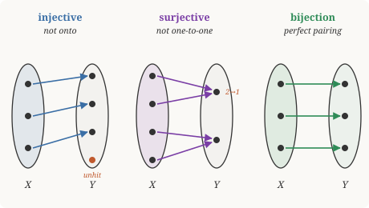

# Discrete Mathematics · Lesson 2.3: Functions — injections, surjections, bijections & cardinality

> ⏱ ~15 min · Module 2: Sets, Relations & Functions · Builds on: 2.2 (relations: equivalence & order) · Unlocks: 3.1 (the rules of counting)

## Why this matters

A function is the mathematical word for *a rule that turns one thing into another* — a program's input-to-output map, an encoding, a coordinate change. But the real payoff is subtler: the right kind of function lets you compare two sets without counting either one. That single idea powers all of counting (3.1 counts a set by matching it to one you already understand), lets number theory fold $\mathbb{Z}$ down onto $\{0,1,2,3,4\}$ (4.3), and, taken to its limit, forces the shocking conclusion that some infinities are strictly bigger than others.

## The idea

A **function** $f:X\to Y$ is a rule assigning to each input in $X$ **exactly one** output in $Y$. "Each input, exactly one output" — no input left unassigned, no input sent to two places. That's the whole contract.

Now ask two independent questions about how the arrows land in $Y$:

- **Injective** ("one-to-one"): do distinct inputs always land on distinct outputs? *No collisions.* Different in $\Rightarrow$ different out.
- **Surjective** ("onto"): does every point of $Y$ get hit by some arrow? *No leftovers.* Every target is reached.

Injective controls **crowding on the receiving end**; surjective controls **coverage of the receiving end**. They're orthogonal — you can have either, both, or neither. A function that is both is a **bijection**: a perfect one-to-one pairing between $X$ and $Y$, with no collisions and no leftovers. That perfect pairing is exactly what "these two sets are the same size" means.

## The formal version

Let $f:X\to Y$. Write $f(x)$ for the output at $x$.

**Injective:** $f$ is injective iff
$$\forall a,b\in X:\quad f(a)=f(b)\ \Rightarrow\ a=b.$$
In words: if two outputs coincide, the inputs were already equal — so distinct inputs never collide. (The contrapositive, $a\neq b\Rightarrow f(a)\neq f(b)$, says the same thing more visibly.)

**Surjective:** $f$ is surjective iff
$$\forall y\in Y\ \ \exists x\in X:\quad f(x)=y.$$
In words: every target $y$ has at least one input mapping to it. (Note the $\forall\exists$ order from Lesson 1.2 — for *each* $y$ you get to pick an $x$ depending on $y$.)

**Bijective:** injective **and** surjective — every $y\in Y$ is hit by **exactly one** $x$.

**Two-sided inverse.** $f$ is a bijection iff there is a function $g:Y\to X$ with
$$g(f(x))=x\ \text{ for all }x\in X,\qquad f(g(y))=y\ \text{ for all }y\in Y.$$
In words: $g$ undoes $f$ and $f$ undoes $g$. This $g$ is unique; we write it $f^{-1}$. (Injectivity alone buys a *left* inverse; surjectivity alone a *right* inverse; you need both for a genuine two-sided undo.)

**Image and preimage.** For $A\subseteq X$, the **image** $f(A)=\{f(a):a\in A\}\subseteq Y$ is the set of outputs $A$ produces. For $B\subseteq Y$, the **preimage** $f^{-1}(B)=\{x\in X:f(x)\in B\}\subseteq X$ is every input landing inside $B$. Surjective means $f(X)=Y$; the preimage notation makes sense for *any* $f$, invertible or not — it does not require $f^{-1}$ to exist.

## Picture

Left: every arrow lands on its own target, but one target (orange) is never reached — injective, not surjective. Middle: every target is reached, but two arrows pile onto the top target — surjective, not injective. Right: exactly one arrow per target, in and out — a bijection.

## Worked examples

**Example 1 (mechanical — prove a bijection from the definitions).** Let $f:\mathbb{R}\to\mathbb{R}$, $f(x)=3x-4$.

*Injective.* Suppose $f(a)=f(b)$. Then $3a-4=3b-4$, so $3a=3b$, so $a=b$. That is the implication $f(a)=f(b)\Rightarrow a=b$, so $f$ is injective.

*Surjective.* Take any $y\in\mathbb{R}$. We need $x$ with $3x-4=y$. Solve: $x=\tfrac{y+4}{3}$, which is a real number, and $f\!\left(\tfrac{y+4}{3}\right)=3\cdot\tfrac{y+4}{3}-4=y$. So every $y$ is hit; $f$ is surjective.

Both hold, so $f$ is a bijection, and the algebra already handed us the inverse: $f^{-1}(y)=\tfrac{y+4}{3}$. Check the two-sided law: $f^{-1}(f(x))=\tfrac{(3x-4)+4}{3}=x$. ✓

**Example 2 (why you'd care — comparing set sizes by a bijection).** Claim: the even naturals $E=\{0,2,4,\dots\}$ have the *same size* as all of $\mathbb{N}=\{0,1,2,\dots\}$, even though $E$ is a proper subset. Define $f:\mathbb{N}\to E$ by $f(n)=2n$.

- Injective: $2a=2b\Rightarrow a=b$.
- Surjective: any even number is $2n$ for some $n\in\mathbb{N}$, namely $n$ = (that number)$/2$.

So $f$ is a bijection $\mathbb{N}\to E$, and by definition $|E|=|\mathbb{N}|$. This is the signature move of infinite sets: a set can be the *same size* as a strict part of itself. When a set can be bijected with $\mathbb{N}$, we call it **countably infinite** and write its size $\aleph_0$ ("aleph-null"), the smallest infinity.

## Watch out

- You might think injective and surjective are two names for the same "nice" property. They are **independent**: $f:\mathbb{R}\to\mathbb{R}$, $f(x)=e^{x}$ is injective (strictly increasing, no collisions) but *not* surjective (never outputs a negative number); $f(x)=x^{3}-x$ is surjective onto $\mathbb{R}$ but *not* injective (it has repeated values). The codomain you declare matters — $e^x$ *is* a bijection onto $(0,\infty)$.
- You might think $f^{-1}(B)$ requires $f$ to be invertible. It doesn't. Preimage is defined for **every** function; it's just a set of inputs. Only the *bijection* $f^{-1}$ (a function) needs both properties.
- You might think "same size" needs counting. For infinite sets there is nothing to count — **a bijection is the definition of same size**, full stop. Trying to say "$E$ is smaller because it skips numbers" imports finite intuition that simply fails here.

## One-liner

> Injective = no collisions, surjective = no leftovers, bijective = a perfect pairing — and a perfect pairing is what "same size" means, even for infinity.

## Problems

**P1 (🟢)** Let $f:\mathbb{Z}\to\mathbb{Z}$ be $f(n)=2n+1$. Prove $f$ is injective, and decide (with justification) whether it is surjective.

**P2 (🟡)** Let $g:\mathbb{R}\to\mathbb{R}$ be $g(x)=x^{2}$. Prove $g$ is neither injective nor surjective by giving explicit witnesses. Then find a domain and codomain restriction that makes it a bijection, and state its inverse.

**P3 (🔴, optional)** Prove $\mathbb{Z}$ is countable by exhibiting a bijection $h:\mathbb{N}\to\mathbb{Z}$, and verify injectivity and surjectivity. (Hint: interleave — even $\mathbb{N}$ to one sign, odd to the other.)

Solutions

**P1** *Injective.* Suppose $f(a)=f(b)$: then $2a+1=2b+1$, so $2a=2b$, so $a=b$. Hence $f(a)=f(b)\Rightarrow a=b$ and $f$ is injective.

*Surjective?* No. The output $2n+1$ is always **odd**, so no even integer is hit. Concrete refutation: there is no integer $n$ with $2n+1=0$, since that needs $n=-\tfrac12\notin\mathbb{Z}$. So $0$ has empty preimage and $f$ is not surjective (onto $\mathbb{Z}$). It *is* a bijection onto the odd integers.

**P2** *Not injective:* $g(-1)=1=g(1)$ but $-1\neq 1$ — a collision, so injectivity's implication fails ($g(a)=g(b)$ without $a=b$).

*Not surjective:* squares are never negative, so no $x$ gives $g(x)=-1$; the target $-1$ has empty preimage.

*Fix:* restrict to $g:[0,\infty)\to[0,\infty)$, $g(x)=x^2$. Injective: on $[0,\infty)$, if $a^2=b^2$ with $a,b\ge 0$ then $a=b$ (taking nonnegative square roots). Surjective: any $y\ge 0$ equals $(\sqrt{y})^2$ with $\sqrt{y}\in[0,\infty)$. So it is a bijection with inverse $g^{-1}(y)=\sqrt{y}$. Check: $g^{-1}(g(x))=\sqrt{x^2}=x$ for $x\ge 0$. ✓

**P3** Define
$$h(n)=\begin{cases}\ \ n/2, & n\text{ even},\\[2pt] -(n+1)/2, & n\text{ odd}.\end{cases}$$
So $h:0,1,2,3,4,5,\dots\mapsto 0,-1,1,-2,2,-3,\dots$ — it walks outward from $0$, alternating signs.

*Surjective.* Given $k\in\mathbb{Z}$: if $k\ge 0$, take $n=2k$ (even), then $h(2k)=k$. If $k<0$, take $n=-2k-1$, which is odd and $\ge 1$, and $h(-2k-1)=-\tfrac{(-2k-1)+1}{2}=-\tfrac{-2k}{2}=k$. Every integer is hit.

*Injective.* $h$ maps even $n$ to nonnegative values and odd $n$ to strictly negative values, so an equality $h(a)=h(b)$ forces $a,b$ to have the **same parity**. If both even, $a/2=b/2\Rightarrow a=b$. If both odd, $-(a+1)/2=-(b+1)/2\Rightarrow a=b$. Hence injective.

Both hold, so $h$ is a bijection and $|\mathbb{Z}|=|\mathbb{N}|=\aleph_0$: $\mathbb{Z}$ is countable. (Remarkably, so is $\mathbb{Q}$ — list the fractions in a grid by numerator and denominator and zig-zag through it, skipping repeats; that traversal is a bijection with $\mathbb{N}$. But $\mathbb{R}$ is **not** countable: Cantor's diagonal argument builds, from any proposed list of all reals in $[0,1)$, a new real differing from the $n$-th listed number in its $n$-th decimal digit — so no list can be complete. There are strictly more reals than naturals, a bigger infinity.)

## Flashback

**From Lesson 2.2 (Relations: equivalence & order):** Define a relation on $\mathbb{Z}$ by $a\sim b \iff a-b$ is even. Prove $\sim$ is an equivalence relation and describe its equivalence classes.

Solution

Check the three properties (with $a-b$ even meaning $a-b=2k$ for some $k\in\mathbb{Z}$):

- **Reflexive:** $a-a=0=2\cdot 0$ is even, so $a\sim a$.
- **Symmetric:** if $a-b=2k$, then $b-a=-2k=2(-k)$ is even, so $b\sim a$.
- **Transitive:** if $a-b=2k$ and $b-c=2m$, then $a-c=(a-b)+(b-c)=2(k+m)$ is even, so $a\sim c$.

All three hold, so $\sim$ is an equivalence relation. Two integers are related exactly when they have the **same parity**, so there are precisely **two** equivalence classes: the evens $[0]=\{\dots,-2,0,2,\dots\}$ and the odds $[1]=\{\dots,-1,1,3,\dots\}$. They partition $\mathbb{Z}$. (Same-parity is the $n=2$ special case of the "congruent mod $n$" relation you'll formalize in Lesson 4.3.)

## Connections

- **Backward:** a function *is* a relation from Lesson 2.2 with the extra rule "each input related to exactly one output." Its "same output" grouping — the preimages $f^{-1}(\{y\})$ — is exactly an equivalence relation partitioning the domain.
- **Forward:** Lesson 3.1 counts a finite set by building a bijection to $\{1,\dots,n\}$; Lesson 4.3's map $\mathbb{Z}\to\{0,\dots,n-1\}$, $a\mapsto a\bmod n$, is a surjection whose fibers are the congruence classes seen in this Flashback.
- **Sideways (higher math):** in `real-analysis` and `abstract-algebra`, an **isomorphism** is a bijection that also preserves structure (order, distance, or the group operation) — "same size" upgraded to "same shape." Every isomorphism is first of all a bijection proven exactly as above.
- **Sideways (CS):** a **hash function** deliberately fails injectivity (collisions are unavoidable when the codomain is smaller), while a lossless **encoding** must be injective so it can be decoded — that decoder is the left inverse. Bijection ⟺ perfectly reversible transform.
