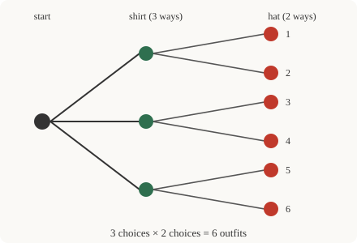

# Discrete Mathematics · Lesson 3.1: The rules of counting — sum, product, permutations & combinations

> ⏱ ~15 min · Module 3: Counting & Combinatorics · Builds on: 2.3 (functions & cardinality) · Unlocks: 3.2 (the binomial theorem & combinatorial identities)

## Why this matters

"How many?" is one of the oldest questions in mathematics and it never stops mattering. A probability is just a count divided by a count (`prob-stat-refresher`: favorable outcomes over equally likely total). The running time of an algorithm is a count of the states it might visit. The size of a password space, the number of hands in poker, the ways to seat a committee — all the same machinery. The trick is to count a structured set *without listing it*, because listing dies the moment the set has a few million elements. This lesson gives you the four moves that do almost all of it.

## The idea

Every counting problem is a story about **making choices in stages**. Two questions unlock nearly all of them:

- **Are these separate cases, or sequential stages?** If you're picking *one thing* from among several disjoint piles — "a vowel *or* a digit" — you **add** the pile sizes (the **sum rule**). If you're building *one thing* by making choice after choice — "a letter *then* a digit" — you **multiply** the number of options at each stage (the **product rule**). Sum = "or / either", Product = "and / then".

- **Does order matter?** Ranking three finalists gold-silver-bronze is different from just choosing which three advance. When order matters you count **permutations**; when it doesn't you count **combinations** — and the only difference between them is that you *divide out the orderings you don't care about*.

That's the whole lesson in four words: **add, multiply, arrange, choose.** Everything else is bookkeeping about which one applies.

## The formal version

**Sum rule.** If a set $S$ splits into disjoint cases $A_1, \dots, A_m$ (no element in two cases), then
$$|S| = |A_1| + |A_2| + \cdots + |A_m|.$$
In words: if the possibilities fall into non-overlapping buckets, the total is the sum of the bucket sizes. (The "disjoint" is essential — Lesson 3.3 handles overlaps with inclusion–exclusion.)

**Product rule.** If an object is built by a sequence of $k$ independent stages, with $n_1$ options at the first stage, $n_2$ at the second, …, $n_k$ at the last, then the number of objects is
$$n_1 \cdot n_2 \cdots n_k.$$
In words: independent choices multiply. "Independent" means the *number* of options at each stage doesn't depend on the earlier choices (the specific options may change).

**Factorial.** $n! = n \cdot (n-1) \cdots 2 \cdot 1$ counts the ways to arrange $n$ distinct objects in a row, with the convention $0! = 1$ (there is exactly one way to arrange nothing). It's the product rule applied to placing the first object ($n$ ways), then the second ($n-1$ ways left), and so on.

**Permutations (ordered, no repetition).** The number of ways to pick and *arrange* $k$ objects from $n$ distinct ones is
$$P(n,k) = n(n-1)\cdots(n-k+1) = \frac{n!}{(n-k)!}.$$
In words: fill $k$ ordered slots from $n$ items, one item per slot — $n$ choices for the first slot, $n-1$ for the next, down to $n-k+1$ for the last.

**Combinations (unordered, no repetition).** The number of ways to *choose* $k$ objects from $n$ distinct ones, ignoring order, is
$$\binom{n}{k} = \frac{n!}{k!\,(n-k)!} = \frac{P(n,k)}{k!}.$$
In words: it's the permutation count with the orderings divided out. Each unordered choice of $k$ items was counted $k!$ times among the arrangements (once per way to shuffle those $k$), so we divide by $k!$. Read $\binom{n}{k}$ as "$n$ choose $k$."

**With repetition.** If repeats are *allowed* and order matters — a $4$-digit PIN, say — each of the $k$ stages independently has all $n$ options, so the product rule gives $n^k$. (Unordered-with-repetition exists too — "stars and bars" — but we hold it for later.)

## Picture

Read the tree left to right: from the start you pick a shirt ($3$ branches), and *from each of those* you pick a hat ($2$ branches). The leaves are the finished outfits. Because every shirt-node grows the same number of hat-branches, the leaf count is $3 \times 2 = 6$ — you never listed the outfits, you multiplied the branchings. That "same number of branches at each node" is exactly the independence the product rule needs.

## Worked examples

**Example 1 (mechanical — all four rules on one menu).** A café offers $5$ coffees, $3$ teas, and $4$ pastries.

- *How many single drinks?* A drink is a coffee **or** a tea — disjoint cases — so the **sum rule** gives $5 + 3 = 8$.
- *How many (drink, pastry) combos?* Pick a drink **then** a pastry — two stages — so the **product rule** gives $8 \cdot 4 = 32$.
- *In how many orders can you eat $3$ distinct pastries?* Arrange $3$ objects: $3! = 6$.
- *How many ways to choose $2$ of the $4$ pastries to take home (order irrelevant)?* $\binom{4}{2} = \frac{4!}{2!\,2!} = 6$. Compare: if order *did* matter (first bite vs. second), it'd be $P(4,2) = \frac{4!}{2!} = 12 = 6 \cdot 2!$ — exactly $2!$ times bigger, the orderings we divided out.

**Example 2 (why you'd care — poker and probability).** How many $5$-card hands from a standard $52$-card deck? Order of dealing doesn't matter, and no card repeats, so this is a pure combination:
$$\binom{52}{5} = \frac{52 \cdot 51 \cdot 50 \cdot 49 \cdot 48}{5!} = \frac{311{,}875{,}200}{120} = 2{,}598{,}960.$$
Now use it as a *denominator*. A flush (all five one suit) is chosen by the product rule: pick the suit ($4$ ways) **then** pick $5$ of its $13$ cards ($\binom{13}{5} = 1287$), giving $4 \cdot 1287 = 5148$ hands. So the probability of a flush is $\frac{5148}{2{,}598{,}960} \approx 0.00198$. This is the entire engine of `prob-stat-refresher`: count the good outcomes, count the total, divide.

## Watch out

- **You might think you should multiply the café's $5$ coffees and $3$ teas to count single drinks — but you add.** Multiplying answers "one coffee *and* one tea" (a two-stage combo), not "one drink, either kind." Ask "am I building one object in stages (×) or sorting one object into buckets (+)?" before touching a number.
- **You might think permutations and combinations are different formulas to memorize — they're one formula.** $\binom{n}{k} = P(n,k)/k!$. If you're unsure which you want, ask "would relabeling the chosen items as first/second/third give me a genuinely different outcome?" Yes → permutation. No → divide by $k!$.
- **You might think "independent stages" means the *options* can't change — it only means their *count* can't.** In $P(n,k)$ the specific items available shrink each stage (you can't reuse one), but the *number* available is a fixed $n, n-1, n-2, \dots$ regardless of *which* ones you picked, so the product rule still applies. It breaks only when the *count* of options depends on earlier choices.

## One-liner

> Building one thing in stages multiplies; sorting into disjoint cases adds; ordered selection is $P(n,k)$, and forgetting the order divides it by $k!$ to give $\binom{n}{k}$.

## Problems

**P1 (🟢)** A standard license plate is $3$ letters ($A$–$Z$) followed by $4$ digits ($0$–$9$), repeats allowed. (a) How many plates are possible? (b) How many if no character — letter or digit — may repeat within its own block (letters all distinct, digits all distinct)?

**P2 (🟡)** A book club of $10$ people must (a) choose a $3$-person subcommittee, and separately (b) choose a president, vice-president, and treasurer (three *distinct* roles). Compute both and explain in one sentence why (b) is exactly $3!$ times (a).

**P3 (🔴, optional — a state-space count for CS)** A binary string of length $8$ is a sequence of $8$ bits. (a) How many such strings are there? (b) How many have *exactly* three $1$s? (c) Explain why (b) equals the number of ways to choose *which* of the $8$ positions hold the $1$s — a bridge you'll reuse constantly when counting subsets in `combinatorics`.

Solutions

**P1** (a) Seven independent stages: $26$ options each for $3$ letter slots, $10$ each for $4$ digit slots. Product rule:
$$26^3 \cdot 10^4 = 17{,}576 \cdot 10{,}000 = 175{,}760{,}000.$$
(b) Letters now form an ordered selection without repetition: $P(26,3) = 26 \cdot 25 \cdot 24 = 15{,}600$. Digits likewise: $P(10,4) = 10 \cdot 9 \cdot 8 \cdot 7 = 5040$. The two blocks are independent stages, so multiply:
$$15{,}600 \cdot 5040 = 78{,}624{,}000.$$

**P2** (a) Order among the three members doesn't matter, no repeats — a combination:
$$\binom{10}{3} = \frac{10 \cdot 9 \cdot 8}{3!} = \frac{720}{6} = 120.$$
(b) Three *distinct labeled* roles means order matters — a permutation:
$$P(10,3) = 10 \cdot 9 \cdot 8 = 720.$$
Why exactly $3!$ times bigger: each unordered trio in (a) can be assigned the three roles in $3! = 6$ ways, and (b) counts every one of those assignments separately. So $P(10,3) = \binom{10}{3} \cdot 3! = 120 \cdot 6 = 720$. That's the $\binom{n}{k} = P(n,k)/k!$ identity in the flesh.

**P3** (a) Eight independent bits, $2$ options each: $2^8 = 256$. (b) A string with exactly three $1$s is determined entirely by *which three of the eight positions* are the ones — an unordered choice of $3$ from $8$: $\binom{8}{3} = \frac{8 \cdot 7 \cdot 6}{6} = 56$. (c) Choosing the string *is* choosing that set of positions: pick the $3$-element subset of positions to be $1$ (the rest are forced to $0$), and every distinct subset yields a distinct string and vice versa. So counting these strings = counting $3$-element subsets of an $8$-element set = $\binom{8}{3}$. This "a subset is a yes/no choice per element" view is why $\binom{n}{k}$ counts subsets, the workhorse of the next two lessons.

## Flashback

**From Lesson 2.3 (Functions & cardinality):** Let $A = \{1,2,3,4\}$ and define $f : A \to A$ by $f(x) = (x \bmod 4) + 1$ — that is, $f$ sends $1\to2,\ 2\to3,\ 3\to4,\ 4\to1$. Prove $f$ is a bijection. Then state, in one sentence, what the existence of this bijection says about the two sets it connects.

Solution

List the outputs: $f(1)=2,\ f(2)=3,\ f(3)=4,\ f(4)=1$.

*Injective:* the four outputs $2,3,4,1$ are all distinct, so no two inputs share an output — $f(a)=f(b) \Rightarrow a=b$. *Surjective:* the outputs are exactly $\{1,2,3,4\} = A$, so every element of the codomain is hit. A function that is both injective and surjective is a **bijection**. (Equivalently: $f$ is a function from a finite set to itself that is injective, and on a finite set injective $\Rightarrow$ surjective $\Rightarrow$ bijective — a fact worth keeping.)

What the bijection says: it certifies that domain and codomain have the **same cardinality** — $|A| = |A| = 4$. This is the bridge into this whole module: comparing set sizes *is* finding a bijection, and the cleanest way to count a hard set is to biject it to an easy one you can already count (exactly the move in P3, where strings-with-three-$1$s biject to $3$-element subsets of positions).

## Connections

- **Backward:** the bijection principle here *is* Lesson 2.3's definition of cardinality put to work — to count set $B$, exhibit a bijection $B \to A$ with $A$ already counted, and conclude $|B| = |A|$. Counting is cardinality-comparison in disguise.
- **Forward:** Lesson 3.2 arranges the $\binom{n}{k}$ into Pascal's triangle and proves the **binomial theorem** $(x+y)^n = \sum_k \binom{n}{k} x^k y^{n-k}$ — the combination count *is* the coefficient. Lesson 3.3 repairs the sum rule's "disjoint" requirement with **inclusion–exclusion** and turns counting bounds into existence proofs via the **pigeonhole principle**.
- **Sideways (probability):** in `prob-stat-refresher`, an equally-likely probability is a combination count over a combination count — Example 2's flush calculation is the template. **Sideways (CS):** the size of a **state space** or configuration count (P3's binary strings) is a product/combination count; it's what separates a tractable search from an intractable one in complexity analysis.
