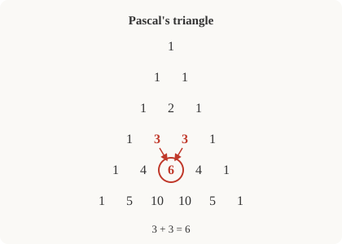

# Discrete Mathematics · Lesson 3.2: The binomial theorem & combinatorial identities

> ⏱ ~15 min · Module 3: Counting & Combinatorics · Builds on: 3.1 (the rules of counting) · Unlocks: 3.3 (inclusion–exclusion & the pigeonhole principle)

## Why this matters

The numbers $\binom{n}{k}$ you learned to compute in 3.1 aren't just answers to "how many committees?" — they are the coefficients that pop out when you expand $(x+y)^n$, the probabilities behind every coin-flip experiment, and the entries of the single most famous table in combinatorics. This lesson does two things: it shows *why* counting and algebra are the same subject wearing different hats, and it hands you **double counting** — a proof technique where you count one set two ways and let the answers argue with each other. That trick will prove identities you'd never grind out by algebra.

## The idea

Expand $(x+y)^3$ by hand and you get $x^3 + 3x^2y + 3xy^2 + y^3$. Where does that $3$ come from? Write the product out honestly as three factors:

$$(x+y)(x+y)(x+y).$$

To build a term, you walk through the three factors and grab either the $x$ or the $y$ from each. The term $x^2y$ means you grabbed $x$ from two factors and $y$ from one — and there are exactly **$\binom{3}{1}=3$ ways** to choose *which* factor donates the $y$. That's the whole secret: **each coefficient is a count of choices**, nothing more. Multiplying binomials is just organized choosing.

## The formal version

**Binomial theorem.** For any $x,y$ and integer $n\ge 0$,

$$(x+y)^n=\sum_{k=0}^{n}\binom{n}{k}\,x^k y^{\,n-k}.$$

In words: expand the product of $n$ copies of $(x+y)$; the coefficient of $x^k y^{n-k}$ is the number of ways to pick *which* $k$ of the $n$ factors contribute an $x$ (the rest contribute $y$). Here $\binom{n}{k}=\frac{n!}{k!\,(n-k)!}$ is the count from Lesson 3.1, and it's called a **binomial coefficient** precisely because of this role.

**Pascal's rule.** For $1\le k\le n-1$,

$$\binom{n}{k}=\binom{n-1}{k-1}+\binom{n-1}{k}.$$

In words: to choose $k$ things from $n$, fix your eye on element $n$. Either it's in your chosen set — then you need $k-1$ more from the remaining $n-1$, giving $\binom{n-1}{k-1}$ — or it's out, and you need all $k$ from the other $n-1$, giving $\binom{n-1}{k}$. Those two cases are exhaustive and don't overlap, so by the **sum rule** you add them. This one rule builds the entire triangle below.

## Picture

Row $n$ (counting from $0$) holds $\binom{n}{0},\binom{n}{1},\dots,\binom{n}{n}$. Each interior entry is the sum of the two directly above it — that *is* Pascal's rule. The circled $6=\binom{4}{2}$ is $\binom{3}{1}+\binom{3}{2}=3+3$.

## Worked examples

**Example 1 (mechanical).** Expand $(x+y)^4$ straight off row $4$ of the triangle: $1,4,6,4,1$.

$$(x+y)^4 = x^4 + 4x^3y + 6x^2y^2 + 4xy^3 + y^4.$$

No multiplying-out required — the triangle *is* the coefficient list. As a spot-check, set $x=y=1$: the left side is $2^4=16$, the right side is $1+4+6+4+1=16$. ✓

**Example 2 (why you'd care).** What is the coefficient of $a^3b^5$ in $(2a-b)^8$? Match to the theorem with $x=2a$, $y=-b$, $n=8$. We want the $x^3y^5$ term (so $k=3$):

$$\binom{8}{3}(2a)^3(-b)^5 = 56\cdot 8a^3 \cdot(-1)b^5 = -448\,a^3b^5.$$

So the coefficient is $\boxed{-448}$. Two things the theorem handled for free: the constant $2$ got raised to the third power, and the minus sign rode along inside $(-b)^5$, flipping the term negative. This is exactly how you read off a single probability from a binomial distribution later — pick the one term you care about instead of expanding everything.

## Double counting (the real payoff)

**Double counting** proves an identity by describing *one* set, then counting it in two different ways; since both counts tally the same objects, they must be equal. Watch it kill the identity $\sum_{k=0}^{n}\binom{n}{k}=2^n$.

Let $S$ be the collection of **all subsets** of an $n$-element set.

- **Count 1 (by size).** Group subsets by how many elements they have. There are $\binom{n}{k}$ subsets of size $k$, so summing over every possible size gives $\sum_{k=0}^{n}\binom{n}{k}$.
- **Count 2 (by decisions).** Build a subset by walking the $n$ elements and saying *in* or *out* for each — $2$ independent choices, $n$ times. By the product rule that's $2^n$ subsets.

Both count $|S|$, so $\sum_{k=0}^{n}\binom{n}{k}=2^n$. (Algebra fans: it's also the binomial theorem at $x=y=1$. Two proofs, and the counting one you'll never forget.)

## Watch out

- You might think the exponents in the theorem are $x^k y^k$ — they're not. The two exponents always **sum to $n$**: it's $x^k y^{\,n-k}$, because every one of the $n$ factors donates exactly one letter.
- You might read $\binom{n}{k}=\binom{n}{n-k}$ as a coincidence. It isn't: choosing the $k$ elements you *keep* is the same act as choosing the $n-k$ you *discard*. The symmetry of the triangle is this bijection made visible.
- Signs live *inside* the substitution. For $(x-y)^n$ set $y\to -y$; the term is $\binom{n}{k}x^k(-y)^{n-k}$, so terms alternate sign. Don't tack the sign on afterward — let $(-y)^{n-k}$ carry it and the parity sorts itself out.

## One-liner

> Every binomial coefficient is a count of choices, so algebra and counting are the same story — and the cleanest proofs just count one set two ways.

## Problems

**P1 (🟢)** Use row $5$ of Pascal's triangle to write the full expansion of $(x+y)^5$. Then find the coefficient of $x^2y^3$.

**P2 (🟡)** Find the coefficient of $x^4$ in $(3x-2)^6$. (Watch the constant and the sign.)

**P3 (🔴, optional)** The **hockey-stick identity** says $\displaystyle\sum_{i=r}^{n}\binom{i}{r}=\binom{n+1}{r+1}$. Prove it by double counting: count the $(r+1)$-element subsets of $\{1,2,\dots,n+1\}$ by classifying each according to its **largest** element. *(Hint: if the largest element is $i+1$, the other $r$ elements come from $\{1,\dots,i\}$.)*

Solutions

**P1** Row $5$ is $1,5,10,10,5,1$, so
$$(x+y)^5 = x^5 + 5x^4y + 10x^3y^2 + 10x^2y^3 + 5xy^4 + y^5.$$
The coefficient of $x^2y^3$ is $\binom{5}{2}=10$. (Check: $2+3=5$, exponents sum to $n$. ✓)

**P2** Write $(3x-2)^6=\sum_{k=0}^{6}\binom{6}{k}(3x)^k(-2)^{6-k}$. The $x^4$ term is $k=4$:
$$\binom{6}{4}(3x)^4(-2)^{2} = 15\cdot 81x^4 \cdot 4 = 4860\,x^4.$$
Coefficient $=\boxed{4860}$. Note $(-2)^2=+4$ is positive — the even power ate the sign.

**P3** Let $T$ be the set of all $(r+1)$-element subsets of $\{1,\dots,n+1\}$; by definition $|T|=\binom{n+1}{r+1}$ (Count 1).
For Count 2, classify each such subset by its largest element. If the largest element is $i+1$ (which ranges over $r+1,\dots,n+1$, so $i$ ranges over $r,\dots,n$), the remaining $r$ elements are chosen from $\{1,\dots,i\}$ — that's $\binom{i}{r}$ subsets. Every subset falls into exactly one class (it has exactly one largest element), so by the sum rule
$$|T|=\sum_{i=r}^{n}\binom{i}{r}.$$
Both counts equal $|T|$, hence $\sum_{i=r}^{n}\binom{i}{r}=\binom{n+1}{r+1}$. The name comes from the shape these entries trace in Pascal's triangle: a diagonal run capped by one entry off to the side, like a hockey stick.

## Flashback

**From Lesson 3.1 (The rules of counting):** A 4-character password is built from the 26 lowercase letters followed by rules you can vary. (a) How many passwords are there if characters may repeat? (b) How many if all four characters must be *distinct*? (c) How many distinct *sets* of 4 letters could such a distinct-character password be drawn from — i.e. ignoring order?

Solution

(a) Four independent slots, $26$ choices each — product rule: $26^4 = 456{,}976$.

(b) Distinct characters *in order* is a permutation: $P(26,4)=26\cdot25\cdot24\cdot23 = 358{,}800$.

(c) Ignoring order is a combination: $\binom{26}{4}=\frac{26\cdot25\cdot24\cdot23}{4!}=\frac{358{,}800}{24}=14{,}950$. Sanity check: (b) $=$ (c) $\times 4!$, since each unordered set of 4 letters can be arranged in $4!=24$ ordered passwords. ✓

## Connections

- **Backward:** the coefficients here *are* the combinations $\binom{n}{k}$ from Lesson 3.1; Pascal's rule and $\sum_k\binom{n}{k}=2^n$ are just the sum and product rules applied to subsets.
- **Forward:** Lesson 3.3 uses these counts inside inclusion–exclusion, and `[prob-stat-refresher](../../prob-stat-refresher/syllabus.md)` builds the **binomial distribution** $P(k\text{ successes})=\binom{n}{k}p^k(1-p)^{n-k}$ directly on top of the binomial theorem — each term is one outcome-count times its probability. The identity technique here is the whole toolkit of `[combinatorics](../../combinatorics/syllabus.md)`.
- **Sideways (CS):** a binomial coefficient counts fixed-size subsets, exactly the objects a subset-enumeration algorithm generates; the row sum $2^n$ is why iterating over *all* subsets of an $n$-element set is $2^n$ work. And any polynomial coefficient extraction — reading off "the coefficient of $x^k$" — is the binomial theorem when the polynomial is a power of a binomial.
