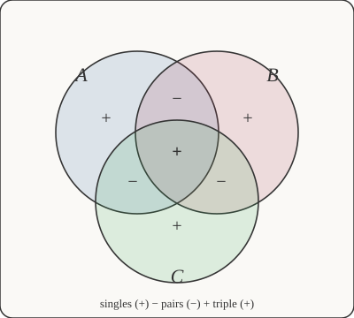

# Discrete Mathematics · Lesson 3.3: Inclusion–exclusion & the pigeonhole principle

> ⏱ ~15 min · Module 3: Counting & Combinatorics · Builds on: 3.2 (the binomial theorem & identities) · Unlocks: 4.1 (divisibility & primes)

## Why this matters

Two humble ideas do a shocking amount of work. **Inclusion–exclusion** is how you count a union without double-counting the overlap — it powers everything from counting derangements to the sieve behind prime-counting estimates. **Pigeonhole** is how you prove something *must* exist without ever finding it — the engine behind hash collisions, the birthday paradox, and a surprising number of one-line existence proofs. One fixes overcounting; the other manufactures certainty from a count. Both are pure common sense, sharpened into theorems.

## The idea

**Inclusion–exclusion.** Two clubs share some members. If you add both rosters, everyone in *both* clubs got counted twice, so subtract the overlap once. That's the whole idea: $|A \cup B| = |A| + |B| - |A \cap B|$. With three clubs it's trickier — subtracting all three pairwise overlaps removes the triple-overlap members too many times, so you add them back. The pattern is **add singles, subtract pairs, add the triple** — a tug-of-war that lands exactly on the truth.

Its shadow twin is **complementary counting**: sometimes the thing you want is a mess, but its *opposite* is easy. Count the opposite, subtract from the total. "How many outcomes have at least one X?" is usually "total minus outcomes with no X."

**Pigeonhole.** Put $10$ letters into $9$ mailboxes and some box gets at least two — you can't spread $10$ things one-per-box across $9$ boxes. That's it: **more pigeons than holes forces a shared hole.** The magic is that it proves existence with zero construction. You never have to say *which* box is crowded; the count alone guarantees one is.

## The formal version

**Inclusion–exclusion, two sets.**
$$|A \cup B| = |A| + |B| - |A \cap B|.$$
In words: the size of the union is both sizes added, minus the part counted twice.

**Inclusion–exclusion, three sets.**
$$|A \cup B \cup C| = |A| + |B| + |C| - |A \cap B| - |A \cap C| - |B \cap C| + |A \cap B \cap C|.$$
In words: add the three singles, subtract the three pairwise overlaps, add back the triple overlap. (The signs alternate by how many sets you're intersecting: $+$ for one, $-$ for two, $+$ for three.)

**Complementary counting.** If $U$ is the universe and $A \subseteq U$, then $|A| = |U| - |A^c|$, where $A^c$ is everything *not* in $A$. In words: what you want equals everything minus what you don't want.

**Pigeonhole principle.** If $n+1$ objects are placed into $n$ boxes, some box contains at least $2$ objects. In words: you cannot fit more pigeons than holes without doubling up.

**Generalized pigeonhole.** If $n$ objects are placed into $k$ boxes, some box contains at least $\lceil n/k \rceil$ objects. In words: even the *most even* spread can't keep every box below the average, so the fullest box holds at least the average rounded up. ($\lceil x \rceil$ is the ceiling — round up to the nearest integer.)

## Picture

Each of the seven regions carries the sign it ends up with once the dust settles. The three "only" slices and the center get a net $+$ (counted once, as they should be); the three lens-shaped pairwise slices get a net $-$ from the correction. Trace any point: a member of all three sets is added $3$ times (singles), subtracted $3$ times (pairs), added $1$ time (triple) — net $+1$. Counted exactly once. That cancellation *is* the theorem.

## Worked examples

**Example 1 (mechanical — the boss count).** How many integers in $\{1, \dots, 100\}$ are divisible by $2$, $3$, or $5$?

Let $A, B, C$ be the sets divisible by $2, 3, 5$. The count of multiples of $d$ up to $100$ is $\lfloor 100/d \rfloor$ (floor — round down):

$$|A| = \lfloor 100/2 \rfloor = 50, \quad |B| = \lfloor 100/3 \rfloor = 33, \quad |C| = \lfloor 100/5 \rfloor = 20.$$

Pairwise, "divisible by both" means divisible by the (coprime) product:

$$|A \cap B| = \lfloor 100/6 \rfloor = 16, \quad |A \cap C| = \lfloor 100/10 \rfloor = 10, \quad |B \cap C| = \lfloor 100/15 \rfloor = 6.$$

Triple: $|A \cap B \cap C| = \lfloor 100/30 \rfloor = 3$. Now assemble:

$$|A \cup B \cup C| = (50 + 33 + 20) - (16 + 10 + 6) + 3 = 103 - 32 + 3 = \boxed{74}.$$

So $74$ of the first hundred integers have $2$, $3$, or $5$ as a factor — and $26$ are coprime to $30$. Listing would take all day; the sieve takes one line.

**Example 2 (why you'd care — existence for free).** Show that among any $6$ integers, some two differ by a multiple of $5$.

Two integers differ by a multiple of $5$ exactly when they leave the **same remainder** on division by $5$. There are only $5$ possible remainders: $\{0, 1, 2, 3, 4\}$ — those are the boxes. Drop your $6$ integers into boxes by remainder. Six pigeons, five holes: some hole holds at least two. Those two share a remainder, so their difference is divisible by $5$. Done — and notice we never said *which* two. The count forced them to exist. (This is pigeonhole married to modular arithmetic, the exact tool you'll formalize in Lesson 4.3.)

## Watch out

- You might think the three-set formula subtracts every overlap and stops. But actually subtracting all three pairs removes the *triple*-overlap elements one time too many — you must **add the triple back**. Forgetting the $+|A\cap B\cap C|$ is the single most common inclusion–exclusion error.
- You might think pigeonhole tells you which box is full. It **doesn't** — it's a pure existence statement. If a problem asks *which*, pigeonhole gives you existence and you still owe a construction.
- You might think "at least $2$" needs $n+1$ pigeons *per box*. The generalized bound is $\lceil n/k \rceil$, not $n/k$: with $10$ pigeons in $3$ boxes, some box has $\lceil 10/3 \rceil = 4$, not $3.33$. Always round **up**.
- Complementary counting fails silently if the complement isn't actually simpler or if you mis-measure the universe $U$. Sanity-check that $|A| + |A^c| = |U|$.

## One-liner

> Inclusion–exclusion adds singles, subtracts pairs, adds the triple so every element is counted once; pigeonhole says more pigeons than holes forces a shared hole — and that shared hole is a theorem.

## Problems

**P1 (🟢)** In a class of $40$ students, $22$ take Spanish, $19$ take French, and $9$ take both. How many take at least one of the two languages? How many take neither?

**P2 (🟡)** How many integers in $\{1, \dots, 1000\}$ are divisible by neither $4$ nor $6$? (Hint: count the "at least one" via inclusion–exclusion, then complement.)

**P3 (🔴, optional)** Prove that any set of $5$ points placed inside a $1 \times 1$ square contains two points at distance at most $\tfrac{\sqrt2}{2}$ apart. (Hint: chop the square into $4$ boxes.)

Solutions

**P1** Let $S$ = Spanish, $F$ = French. $|S \cup F| = |S| + |F| - |S \cap F| = 22 + 19 - 9 = 32$ take at least one. Neither: complementary counting, $40 - 32 = \boxed{8}$.

**P2** Divisible by $4$: $\lfloor 1000/4 \rfloor = 250$. Divisible by $6$: $\lfloor 1000/6 \rfloor = 166$. Divisible by both means divisible by $\mathrm{lcm}(4,6) = 12$: $\lfloor 1000/12 \rfloor = 83$. So divisible by $4$ or $6$ is $250 + 166 - 83 = 333$. Neither, by complement: $1000 - 333 = \boxed{667}$. (Note the trap: use $\mathrm{lcm}(4,6)=12$, not $4\cdot6=24$, because $4$ and $6$ aren't coprime.)

**P3** Cut the unit square into four $\tfrac12 \times \tfrac12$ sub-squares — these are the $4$ boxes. Place $5$ points; by pigeonhole some sub-square contains at least $\lceil 5/4 \rceil = 2$ of them. Two points in the same $\tfrac12 \times \tfrac12$ square are at most a diagonal apart: $\sqrt{(\tfrac12)^2 + (\tfrac12)^2} = \sqrt{\tfrac14 + \tfrac14} = \sqrt{\tfrac12} = \tfrac{\sqrt2}{2}$. So those two points are within $\tfrac{\sqrt2}{2}$. $\blacksquare$

## Flashback

**From Lesson 3.2 (The binomial theorem & identities):** Give a double-counting proof of the identity $\displaystyle\sum_{k=0}^{n} k\binom{n}{k} = n\,2^{n-1}$.

Solution

Count, in two ways, the number of ways to choose a committee (any size) from $n$ people and designate one member of it as chair.

*Way 1 — pick the committee, then the chair.* For each committee size $k$, there are $\binom{n}{k}$ committees and $k$ choices of chair, giving $k\binom{n}{k}$. Sum over all sizes: $\sum_{k=0}^{n} k\binom{n}{k}$.

*Way 2 — pick the chair first, then the rest.* Choose the chair in $n$ ways. Each of the remaining $n-1$ people is independently in or out of the committee, giving $2^{n-1}$ ways to fill out the rest. Total: $n\,2^{n-1}$.

Both count the same set of (committee, chair) pairs, so
$$\sum_{k=0}^{n} k\binom{n}{k} = n\,2^{n-1}. \qquad \blacksquare$$

## Connections

- **Backward:** the double-counting reflex from Lesson 3.2 is exactly the engine of inclusion–exclusion — both count one set two ways and equate. Complementary counting reuses the sum rule from 3.1 ($|U| = |A| + |A^c|$).
- **Forward:** Lesson 4.1 (divisibility & primes) leans on the same $\lfloor n/d \rfloor$ multiple-counting; the remainder-box trick from Example 2 becomes the residue classes of Lesson 4.3, and inclusion–exclusion over prime factors is the sieve behind Euler's totient. This is why 3.3 unlocks 4.1.
- **Sideways (CS):** pigeonhole is why a hash table with more keys than buckets *must* have a collision, and the counting behind the **birthday problem** — why just $23$ people make a shared birthday more likely than not. See `combinatorics` for the general inclusion–exclusion formula and `prob-stat-refresher` for the probabilistic version of both ideas.
