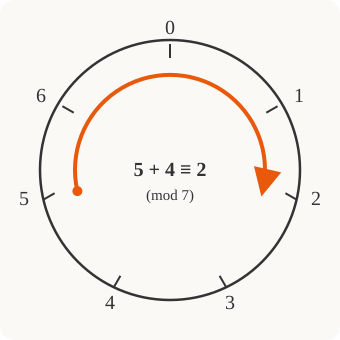

# Discrete Mathematics · Lesson 4.3: Modular arithmetic & congruences

> ⏱ ~15 min · Module 4: Number Theory & Modular Arithmetic · Builds on: 4.2 (Euclid's algorithm, gcd & Bézout) · Unlocks: 5.1 (recurrence relations)

## Why this matters

Anything that cycles — clock time, days of the week, hash buckets, the check digit on a credit card, the wrap-around of a fixed-width integer — is running modular arithmetic. It's also the engine room of cryptography: RSA is *nothing but* exponentiation in $\mathbb{Z}_n$. The payoff of this lesson is a mental shift: you stop thinking of a number as a lone integer and start thinking of it as a **remainder class**, where addition and multiplication still work but the world is finite. That shift is what makes otherwise-terrifying computations like $3^{100}\bmod 7$ collapse to a line of arithmetic.

## The idea

Fix a modulus $n$. Now agree to treat two integers as "the same" whenever they leave the **same remainder** when divided by $n$. On a clock, $15{:}00$ and $3{:}00$ are the same time because $15$ and $3$ both leave remainder $3$ after dividing by $12$. That's the whole concept: **congruence is sameness-of-remainder**, and it chops the infinite number line into $n$ bins.

The beautiful part is that arithmetic survives the chopping. If you only care about remainders, you can reduce *early and often* — add the bins, multiply the bins — and never touch a large number. Want $5+4$ on a $7$-clock? Start at $5$, step forward $4$, wrap past $0$, land on $2$. So $5+4\equiv 2$. You've been doing this since you learned to read a clock; we're just naming it.

## The formal version

For $n\ge 1$ and integers $a,b$, we say $a$ is **congruent to** $b$ **modulo** $n$, written
$$a \equiv b \pmod{n} \iff n \mid (a-b).$$
In words: $a$ and $b$ differ by a multiple of $n$ — equivalently, they have the same remainder under division by $n$. The symbol $\bmod$ used as an operator, as in $a \bmod n$, denotes that remainder itself (a number in $\{0,\dots,n-1\}$); the relation $\equiv \pmod n$ compares two numbers.

This is *exactly* the equivalence relation from Lesson 2.2: it's reflexive ($n\mid 0$), symmetric ($n\mid(a-b)\Rightarrow n\mid(b-a)$), and transitive. So it partitions $\mathbb{Z}$ into **residue classes** $[a]=\{a+kn : k\in\mathbb{Z}\}$, and the set of the $n$ classes is
$$\mathbb{Z}_n = \{\,[0],[1],\dots,[n-1]\,\}.$$
In words: $\mathbb{Z}_n$ is the number line rolled into a loop of $n$ beads.

**Operations are well-defined.** If $a\equiv a'$ and $b\equiv b'\pmod n$, then
$$a+b \equiv a'+b' \pmod n \qquad\text{and}\qquad ab \equiv a'b' \pmod n.$$
In words: it doesn't matter *which* representative of a class you pick — reduce whenever you like, the answer's class is the same. (Quick proof of the product rule: $ab-a'b' = a(b-b') + b'(a-a')$, and $n$ divides both terms.) This is the license to keep every intermediate number small.

**Inverses.** In $\mathbb{Z}_n$ there's no division, but there can be a **multiplicative inverse**: a class $a^{-1}$ with $a\cdot a^{-1}\equiv 1\pmod n$. The clean criterion, straight from Lesson 4.2:
$$a \text{ is invertible mod } n \iff \gcd(a,n)=1.$$
Why: Bézout gives integers $x,y$ with $ax+ny=\gcd(a,n)=1$, so $ax\equiv 1\pmod n$ — that $x$ *is* the inverse. Coprimality and invertibility are the same fact wearing two hats.

## Picture

Adding $4$ to $5$ on the mod-$7$ clock: step forward four beads, wrap past $0$, and land on $2$. The wrap-around *is* the "$-7$" that reduction performs.

## Worked examples

**Example 1 (mechanical — reduce early).** Compute $5^{117}\cdot 5^{3} \bmod 6$ without a calculator. Every power of $5$ is either $\dots$ well, reduce the base first: $5\equiv -1\pmod 6$. So $5^{117}\cdot 5^3 = 5^{120} \equiv (-1)^{120} = 1 \pmod 6$. The class did all the work; the giant exponent never mattered. **Lesson: pick the friendliest representative of the class** — here $-1$ instead of $5$.

**Example 2 (an inverse, then a linear congruence).** Solve $4x \equiv 7 \pmod 9$.

First, is $4$ invertible? $\gcd(4,9)=1$, yes. Find $4^{-1}$: we want $4k\equiv 1\pmod 9$, and $4\cdot 7 = 28 = 27+1 \equiv 1$, so $4^{-1}\equiv 7$. (For bigger numbers you'd run extended Euclid as in 4.2, but small cases you can spot.) Now multiply both sides by $7$:
$$x \equiv 7\cdot 7 = 49 \equiv 4 \pmod 9.$$
Check: $4\cdot 4 = 16 \equiv 7 \pmod 9$. ✓ The full solution set is the class $[4]$: $\{\dots,-5,4,13,22,\dots\}$.

**Example 3 (fast exponentiation + a taste of Fermat).** Compute $4^{13}\bmod 11$.

*Method A — repeated squaring.* Write $13 = 8+4+1$ (binary $1101$) and square your way up, reducing at each step:
$$4^1\equiv 4,\quad 4^2\equiv 16\equiv 5,\quad 4^4\equiv 5^2=25\equiv 3,\quad 4^8\equiv 3^2=9 \pmod{11}.$$
Then $4^{13}=4^{8}\cdot 4^{4}\cdot 4^{1}\equiv 9\cdot 3\cdot 4 = 108 \equiv 9\pmod{11}$. Squaring turns a $13$-fold product into $4$ multiplications — the logarithmic speedup that makes RSA-scale exponents feasible.

*Method B — Fermat's little theorem.* For a prime $p$ and any $a$ not divisible by $p$,
$$a^{\,p-1}\equiv 1 \pmod p.$$
In words: on a prime clock, raising to the $(p-1)$ knocks any nonzero class back to $1$. Here $p=11$, so $4^{10}\equiv 1$, and $4^{13}=4^{10}\cdot 4^{3}\equiv 4^{3}=64\equiv 9\pmod{11}$. Same answer, less work — Fermat lets you throw away whole multiples of $p-1$ in the exponent.

## Watch out

- **You might think you can divide.** In $\mathbb{Z}_n$ there is no "$\div a$" — there's only "multiply by $a^{-1}$," and that exists **only when $\gcd(a,n)=1$**. $2x\equiv 1\pmod 4$ has no solution because $2$ shares a factor with $4$.
- **You might think you can reduce exponents mod $n$.** No — you reduce the **base** mod $n$, but the **exponent** obeys Fermat/Euler, not $n$. For prime $p$, exponents collapse mod $p-1$, not mod $p$: $4^{13}\bmod 11$ uses $13\equiv 3\pmod{10}$, not $\pmod{11}$.
- **You might think cancellation always works.** $ka\equiv kb\pmod n$ does **not** give $a\equiv b$ in general — only when $\gcd(k,n)=1$. E.g. $2\cdot 3\equiv 2\cdot 0\pmod 6$ but $3\not\equiv 0$.

## One-liner

> A number modulo $n$ is a bead on a loop of $n$; addition and multiplication still turn, and you can undo multiplication by $a$ exactly when $a$ shares no factor with $n$.

## Problems

**P1 (🟢)** (a) Compute $17\cdot 14 \bmod 5$ by reducing the factors first. (b) Compute $2^{10}\bmod 7$.

**P2 (🟡)** Find the inverse of $4$ modulo $9$ (yes, from Example 2 — do it via extended Euclid this time to build the muscle), then use it to solve $4x\equiv 5\pmod 9$.

**P3 (🔴, optional)** (a) Compute $2^{1000}\bmod 13$ using Fermat's little theorem. (b) Does $6x\equiv 5\pmod 8$ have a solution? Justify with a gcd criterion, and state the general rule for when $ax\equiv b\pmod n$ is solvable.

Solutions

**P1** (a) $17\equiv 2$ and $14\equiv 4\pmod 5$, so $17\cdot 14\equiv 2\cdot 4 = 8\equiv 3\pmod 5$. (Check: $238 = 47\cdot 5 + 3$.) (b) By Fermat, $2^6\equiv 1\pmod 7$, so $2^{10}=2^{6}\cdot 2^{4}\equiv 2^4 = 16\equiv 2\pmod 7$. (Check: $1024 = 146\cdot 7 + 2$.)

**P2** Run extended Euclid on $\gcd(9,4)$: $9 = 2\cdot 4 + 1$, $4 = 4\cdot 1$. Back-substitute: $1 = 9 - 2\cdot 4$, so $-2\cdot 4 \equiv 1\pmod 9$, giving $4^{-1}\equiv -2\equiv 7\pmod 9$. (Agrees with Example 2.) Now $4x\equiv 5$ ⟹ $x\equiv 7\cdot 5 = 35 \equiv 8\pmod 9$. Check: $4\cdot 8 = 32 \equiv 5\pmod 9$. ✓

**P3** (a) $13$ is prime, so $2^{12}\equiv 1\pmod{13}$. Reduce the exponent mod $12$: $1000 = 12\cdot 83 + 4$, so $2^{1000}\equiv 2^{4}=16\equiv 3\pmod{13}$.
(b) $\gcd(6,8)=2$, and $2\nmid 5$, so **no solution**. General rule: $ax\equiv b\pmod n$ is solvable **iff** $\gcd(a,n)\mid b$ — because $ax+ny$ ranges over exactly the multiples of $\gcd(a,n)$ (Bézout, Lesson 4.2). When it is solvable, there are exactly $\gcd(a,n)$ solution classes mod $n$; when $\gcd(a,n)=1$, the inverse gives a unique one.

## Flashback

**From Lesson 4.2 (Euclid's algorithm, gcd & Bézout):** Compute $\gcd(84,30)$ with the Euclidean algorithm, then find integers $x,y$ with $84x + 30y = \gcd(84,30)$.

Solution

Euclidean algorithm:
$$84 = 2\cdot 30 + 24,\qquad 30 = 1\cdot 24 + 6,\qquad 24 = 4\cdot 6 + 0.$$
The last nonzero remainder is $\gcd(84,30) = 6$. Back-substitute for Bézout:
$$6 = 30 - 1\cdot 24 = 30 - (84 - 2\cdot 30) = 3\cdot 30 - 1\cdot 84.$$
So $x=-1,\ y=3$: indeed $84(-1) + 30(3) = -84 + 90 = 6$. ✓ (Since $\gcd(84,30)=6\neq 1$, note $84$ is **not** invertible mod $30$ — a preview of the linear-congruence solvability rule above.)

## Connections

- **Backward:** the "same remainder" relation is the equivalence relation of Lesson 2.2, and the invertibility criterion is Bézout's identity from 4.2 applied — this lesson is those two ideas fused.
- **Forward:** Lesson 5.1 (recurrences) leans on cyclic residue behavior when analyzing periodic sequences; and `[number-theory](../../number-theory/syllabus.md)` promotes Fermat to **Euler's theorem** ($a^{\varphi(n)}\equiv 1$) and stitches congruences across moduli with the **Chinese Remainder Theorem**.
- **Sideways:** `[cryptography](../../cryptography/syllabus.md)` — RSA is exactly encryption-as-exponentiation in $\mathbb{Z}_n$ with a decryption inverse built from Euler's theorem. The same wrap-around powers **hashing** (map a key to $h\bmod m$ buckets), **checksums/check digits** (ISBN and credit-card Luhn are congruence conditions), and any **cyclic** counter that overflows back to zero.
