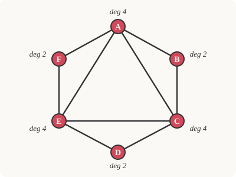

# Discrete Mathematics · Lesson 5.2: Graphs — paths, connectivity, Euler & Hamilton

> ⏱ ~15 min · Module 5: Recurrences, Graphs & Trees · Builds on: 3.3 (inclusion–exclusion & pigeonhole) · Unlocks: 5.3 (trees & graph coloring)

## Why this matters

The moment you draw a road map, a friendship network, a circuit, or a state machine, you've drawn a **graph** — dots joined by lines — and the questions you actually care about ("Can I get from here to there?", "Is there a route that crosses every bridge once?", "How do I tour every city and return home?") are graph questions with real answers. Two of them, the Euler and Hamilton problems, look almost identical but sit on opposite sides of the deepest divide in computer science: one is decided by a five-second glance at degrees, the other has resisted every simple test for 170 years. This lesson gives you the vocabulary and the two theorems that separate them.

## The idea

A **graph** is nothing but a set of dots (**vertices**) and a set of lines connecting pairs of them (**edges**). That's it. Everything else is language for talking about how the dots are wired together.

Two vertices are **adjacent** if an edge joins them. The **degree** of a vertex is how many edge-ends stick out of it — count the lines touching it. If you walk along edges from dot to dot, you trace a **walk**; if you never reuse a vertex, it's a **path**; a path that loops back to its start is a **cycle**. A graph is **connected** if you can walk between any two vertices; if not, it falls into separate islands called **components**.

Here's the one fact that quietly governs all of it. Every edge has exactly two ends, so if you add up the degrees of all vertices, you count every edge twice. That single bookkeeping observation — the **handshake lemma** — forces surprising consequences, like: *the number of people at a party who shook an odd number of hands is always even.*

## The formal version

A **graph** $G=(V,E)$ is a set $V$ of vertices and a set $E$ of edges, each edge an unordered pair $\{u,v\}$ of distinct vertices (a **simple** graph: no loops, no repeated edges). The **degree** $\deg v$ is the number of edges containing $v$.

**Handshake lemma.** $\displaystyle\sum_{v\in V}\deg v = 2|E|.$

> In words: sum the degrees and you get twice the edge count, because each edge contributes one to the degree at each of its two endpoints.

**Corollary.** The number of vertices of odd degree is even. (Split the sum into odd- and even-degree vertices; the total is even, the even-degree part is even, so the odd-degree part must be even — and a sum of odd numbers is even only when there's an even count of them.)

**Walk / path / cycle.** A **walk** is a sequence $v_0,v_1,\dots,v_k$ with each $\{v_{i},v_{i+1}\}\in E$. A **path** is a walk with no repeated vertex. A **cycle** is a walk of length $\ge 3$ that repeats only its endpoints ($v_0=v_k$). $G$ is **connected** if every pair of vertices is joined by a walk; its maximal connected pieces are its **components**.

**Euler's theorem.** A connected graph has an **Euler circuit** (a closed walk using *every edge exactly once*) **iff every vertex has even degree**. It has an **Euler path** (uses every edge once, endpoints may differ) iff exactly $0$ or $2$ vertices have odd degree.

> In words: to traverse every edge once and come home, every time you enter a vertex you must be able to leave by a fresh edge — so edges at each vertex must pair up, i.e. degrees are even.

**Hamiltonian cycle.** A cycle that visits *every vertex exactly once* (then returns to start). Deceptively similar to Euler — but about **vertices**, not edges — and there is **no known simple degree criterion** that decides existence in general. Deciding it is NP-complete.

**Complete graph.** $K_n$ is the simple graph on $n$ vertices with *every* pair joined by an edge. So each vertex has degree $n-1$, and $|E|=\binom n2=\dfrac{n(n-1)}{2}$.

## Picture

Six vertices, nine edges, degrees $4,2,4,2,4,2$. Check the handshake lemma: $4+2+4+2+4+2 = 18 = 2\cdot 9$. Every degree is even and the graph is connected, so by Euler's theorem it has an **Euler circuit** — a closed trail crossing all nine edges exactly once. One such circuit: $A\to B\to C\to D\to E\to F\to A\to C\to E\to A$.

## Worked examples

**Example 1 (mechanical — read the degrees, apply the theorem).** Take $K_4$, the complete graph on $4$ vertices. Every vertex has degree $n-1 = 3$, so *all four* degrees are odd. Since more than $2$ vertices have odd degree, $K_4$ has **neither** an Euler circuit **nor** an Euler path. (Edge count check: $\binom 42 = 6$, and $\sum\deg v = 4\cdot 3 = 12 = 2\cdot 6$. ✓)

**Example 2 (why you'd care — the Königsberg bridges).** In 1736 Euler was asked whether one could stroll through Königsberg crossing each of its seven bridges exactly once and return home. Model it: each **landmass** is a vertex, each **bridge** an edge. The four landmasses had degrees $3, 3, 3, 5$ — all odd. An Euler circuit needs *every* degree even; a walk that starts and ends at the same place needs even degree everywhere. Four odd-degree vertices is two too many even for an open Euler path. So the walk is **impossible** — and Euler had invented graph theory to prove it. Notice the payoff: you decide an infinite-looking search ("try every route") by counting to see if numbers are even.

## Watch out

- **Euler is about edges; Hamilton is about vertices.** You might think a graph rich in edges surely has a Hamiltonian cycle — but $K_{2,3}$ (a complete bipartite graph) is highly connected and has none. Conversely, having an Euler circuit says nothing about having a Hamiltonian one.
- **"Even degree" alone is not enough for an Euler circuit — you also need connectivity.** Two disjoint triangles have all even degrees but obviously no single circuit covering both; the theorem's *connected* hypothesis is doing real work.
- **A path may not repeat vertices; a walk may.** Don't call a route that revisits a city a "path." And a *cycle* repeats only its start/end vertex — nothing in between.
- **No shortcut for Hamilton.** You might hope for a degree rule as crisp as Euler's. There isn't one that's both simple and complete; sufficient conditions exist (e.g. Dirac's: every degree $\ge n/2$), but no easy iff. This gap is a genuine hard boundary, not a gap in your knowledge.

## One-liner

> Sum the degrees and you double-count the edges; even degrees plus connectivity let you trace every edge once (Euler) — but visiting every *vertex* once (Hamilton) hides an NP-hard problem behind an almost identical picture.

## Problems

**P1 (🟢)** A simple graph has $8$ vertices, six of degree $3$ and two of degree $4$. How many edges does it have? Can it have an Euler circuit?

**P2 (🟡)** For which $n$ does the complete graph $K_n$ have an Euler circuit? Give the degree condition and the answer as a condition on $n$.

**P3 (🔴, optional)** Prove that in any group of $n\ge 2$ people, at least two people have shaken hands with the same number of people in the group. (Model handshakes as a graph; think about the possible degrees.)

Solutions

**P1** By the handshake lemma, $\sum_v\deg v = 6\cdot 3 + 2\cdot 4 = 18 + 8 = 26 = 2|E|$, so $|E| = 13$. For an Euler circuit *every* degree must be even, but six vertices have odd degree $3$, so **no Euler circuit** exists. (Consistency check: the number of odd-degree vertices is $6$, which is even — as the corollary demands.)

**P2** Every vertex of $K_n$ has degree $n-1$. An Euler circuit requires all degrees even *and* the graph connected. $K_n$ is connected for all $n\ge 1$, so the condition reduces to $n-1$ being even, i.e. $n$ **odd**. So $K_n$ has an Euler circuit exactly when $n$ is odd (and $n\ge 3$ for a nontrivial circuit): $K_3, K_5, K_7,\dots$ do; $K_4, K_6,\dots$ do not. (This settles the Euler half of Boss problem 5(c): $K_5$ has $n=5$ odd, so it *does* have an Euler circuit.)

**P3** Build a graph: one vertex per person, an edge for each handshake. Each vertex has a degree in $\{0,1,\dots,n-1\}$ — that's $n$ possible values for $n$ vertices, so pigeonhole doesn't *immediately* force a repeat. But the values $0$ and $n-1$ can't both occur: if someone shook *everyone's* hand (degree $n-1$), then nobody has degree $0$; if someone shook *no* hands (degree $0$), then nobody has degree $n-1$. So at most $n-1$ of the $n$ degree-values are actually attainable. Now $n$ vertices must take degrees from a set of at most $n-1$ values, so by the **pigeonhole principle** two vertices share a degree. $\blacksquare$

## Flashback

**From Lesson 3.3 (Inclusion–exclusion & the pigeonhole principle):** How many integers in $\{1,2,\dots,200\}$ are divisible by $4$, by $6$, or by $9$?

Solution

Let $A,B,C$ be the sets divisible by $4$, $6$, $9$ respectively, and count with inclusion–exclusion:
$$|A\cup B\cup C| = |A|+|B|+|C| - |A\cap B| - |A\cap C| - |B\cap C| + |A\cap B\cap C|.$$
Each intersection counts multiples of the relevant **lcm**:

- $|A| = \lfloor 200/4\rfloor = 50$, $\ |B| = \lfloor 200/6\rfloor = 33$, $\ |C| = \lfloor 200/9\rfloor = 22$.
- $\operatorname{lcm}(4,6)=12$: $\lfloor 200/12\rfloor = 16$; $\ \operatorname{lcm}(4,9)=36$: $\lfloor 200/36\rfloor = 5$; $\ \operatorname{lcm}(6,9)=18$: $\lfloor 200/18\rfloor = 11$.
- $\operatorname{lcm}(4,6,9)=36$: $\lfloor 200/36\rfloor = 5$.

$$50+33+22 \;-\;16-5-11 \;+\;5 \;=\; 105 - 32 + 5 = \boxed{78}.$$

The trap is using $4\cdot 6 = 24$ instead of $\operatorname{lcm}(4,6)=12$ for the overlap — products only equal lcms when the numbers are coprime.

## Connections

- **Backward:** the odd-degree corollary is a pigeonhole/parity argument (Lesson 3.3) dressed up in graph language; P3 is a pure pigeonhole problem living on a graph, and the flashback keeps inclusion–exclusion warm.
- **Forward:** Lesson 5.3 restricts to **trees** — connected graphs with no cycles — where the handshake lemma pins the edge count at exactly $n-1$, then colors graphs with as few colors as possible.
- **Sideways (graph theory & CS):** connectivity and "can I reach this vertex?" are answered in practice by **BFS/DFS** traversals; Euler/Hamilton generalize to routing and the traveling-salesman problem. The `[graph-theory](../../graph-theory/syllabus.md)` course pushes on into network **flows**, **planarity** (echoing the Königsberg map), and the **coloring** you'll meet next lesson.
