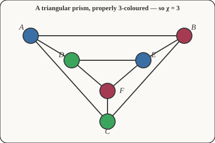

# Discrete Mathematics · Lesson 5.3: Trees & graph coloring

> ⏱ ~15 min · Module 5: Recurrences, Graphs & Trees · Builds on: 5.2 (graphs: paths, connectivity, Euler & Hamilton) · Unlocks: graph-theory & combinatorics (next courses)

## Why this matters

Two of the most useful shapes a graph can take are the sparsest connected one — a **tree** — and any graph you want to partition into non-conflicting groups — a **coloring**. Trees are the skeleton of every file system, every search algorithm, every parse of a sentence or program. Coloring is how a compiler assigns your variables to a handful of CPU registers, how exams get scheduled into non-overlapping time slots, and how the four-color theorem tamed political maps. Both come down to one number you can often read off by hand: how few edges hold a thing together, and how few colors keep neighbors apart.

## The idea

A **tree** is a connected graph with no cycles — connected so you can get anywhere, acyclic so there's exactly one way to get there. Picture a family tree or a river branching upstream: it spreads and splits but never loops back on itself. That "no loops" property is stingy: a tree uses the fewest edges that still hold all the vertices together. Add one more edge anywhere and you create a cycle; delete any edge and it falls into two pieces.

**Coloring** is a different question about the same dots and lines. Hand out colors to the vertices so that no edge ever joins two vertices of the same color. Think of the colors as exam time-slots and an edge as "these two exams share a student, so they can't be simultaneous." The **chromatic number** $\chi(G)$ is the minimum number of colors that does the job — the fewest time-slots that avoid every conflict. A triangle needs 3; a long chain needs only 2.

## The formal version

**Tree.** A graph $T$ is a *tree* if it is connected and contains no cycle. The following are equivalent (each can serve as the definition):

1. $T$ is connected and acyclic.
2. $T$ is connected and has exactly $|V|-1$ edges.
3. Between every pair of vertices there is a *unique* path.
4. $T$ is acyclic, but adding any single edge creates exactly one cycle.

*In words:* a tree is the minimal connected structure — connected with nothing to spare, so every pair of dots is linked by exactly one route.

**Edge-count theorem.** A tree on $n = |V|$ vertices has exactly $n-1$ edges: $|E| = n - 1$.

A **leaf** is a vertex of degree 1 — a dead end. Every tree with at least two vertices has at least two leaves (the two ends of its longest path). A **spanning tree** of a connected graph $G$ is a subgraph that is a tree and touches *every* vertex of $G$: **every connected graph has at least one** (keep deleting an edge from any cycle until no cycle remains — you remove edges but never disconnect the graph).

**Chromatic number.** A *proper $k$-coloring* assigns one of $k$ colors to each vertex so that adjacent vertices differ. The **chromatic number** is
$$\chi(G) = \min\{\,k : G \text{ has a proper } k\text{-coloring}\,\}.$$
*In words:* the smallest palette that keeps every pair of neighbors distinct. A graph is **bipartite** if its vertices split into two groups with all edges going *between* the groups — equivalently $\chi(G) \le 2$.

**Bipartite theorem (König).** A graph is bipartite (2-colorable) **if and only if it contains no odd cycle.** *In words:* two colors suffice exactly when you can never walk a closed loop of odd length — trees, even cycles, and grids all qualify; a triangle does not.

## Picture

Three colors, no edge joining two of the same — and you can't do it in two, because the graph contains triangles (odd cycles). So $\chi = 3$ here.

## Worked examples

**Example 1 (mechanical — the edge count by induction).** Prove: every tree on $n$ vertices has exactly $n-1$ edges.

*Induction on $n$* (this is exactly the machinery from [Lesson 1.4](01-04-induction-and-strong-induction.md)).

- **Base case** $n=1$: a single vertex, no edges. $|E| = 0 = 1 - 1$. ✓
- **Inductive step.** Assume every tree on $n$ vertices has $n-1$ edges. Take any tree $T$ on $n+1$ vertices. Since $T$ has at least two vertices, it has a **leaf** $v$ (degree 1). Delete $v$ and its single incident edge. The result $T'$ is still connected (a degree-1 vertex is never a cut vertex) and still acyclic, so $T'$ is a tree on $n$ vertices. By hypothesis $T'$ has $n-1$ edges, so $T$ has $(n-1)+1 = n$ edges — that is, $(n+1)-1$. ✓

By induction, $|E| = n-1$ for every tree. $\blacksquare$ The trick — *peel a leaf, shrink the problem* — is the standard way to induct on trees.

**Example 2 (why you'd care — coloring as scheduling).** Five final exams — call them $A,B,C,D,E$ — must be slotted into time periods. Two exams conflict (share a student) as follows: $A$–$B$, $A$–$C$, $B$–$C$, $C$–$D$, $D$–$E$. Make a graph with an edge per conflict; a proper coloring is a valid schedule, and $\chi$ is the fewest periods needed.

$A,B,C$ form a triangle, so they need 3 distinct periods — say $A=1,\,B=2,\,C=3$. Now $D$ conflicts only with $C(=3)$, so $D$ can reuse period 1. And $E$ conflicts only with $D(=1)$, so $E$ can reuse period 2. Final schedule: $\{A,D\}$ at period 1, $\{B,E\}$ at period 2, $\{C\}$ at period 3. Three periods suffice, and the triangle proves you can't beat 3, so $\chi = 3$. This is *literally* how register allocation works in a compiler: variables are vertices, "both live at once" is an edge, and colors are CPU registers.

## Watch out

- You might think "connected and $n-1$ edges" is a weaker claim than "tree" — actually **any two** of {connected, acyclic, has $n-1$ edges} force the third. A connected graph with $n-1$ edges *must* be acyclic; an acyclic graph with $n-1$ edges *must* be connected.
- You might think a graph with no triangles is automatically 2-colorable. **No** — a 5-cycle has no triangle but still needs 3 colors, because it's an *odd* cycle. The forbidden thing is odd cycles of *any* length, not just triangles.
- You might think more edges always means a bigger $\chi$. Not necessarily: the complete bipartite graph $K_{100,100}$ has 10{,}000 edges but $\chi = 2$. What forces colors up is dense mutual adjacency (a large clique), not raw edge count.

## One-liner

> A tree is "connected with nothing to spare" ($|E| = |V| - 1$); the chromatic number is the smallest palette that keeps neighbors apart, and two colors suffice exactly when there's no odd cycle.

## Problems

**P1 (🟢)** A tree has 12 vertices. How many edges does it have? A different tree has 20 edges — how many vertices? Justify in one line each.

**P2 (🟡)** Find $\chi(G)$ for (a) the cycle $C_6$ (six vertices in a ring), (b) the cycle $C_7$, (c) the complete graph $K_4$. State the reason for each.

**P3 (🔴, optional)** Prove that every tree is bipartite. (Hint: what does the bipartite theorem forbid, and does a tree ever contain it?)

Solutions

**P1** By the edge-count theorem $|E| = |V| - 1$. So the 12-vertex tree has $12 - 1 = 11$ edges. A tree with 20 edges has $|V| = |E| + 1 = 21$ vertices.

**P2** (a) $C_6$ is an *even* cycle: alternate two colors around the ring and they meet consistently, so $\chi(C_6) = 2$ (and it's more than 1 since it has edges). (b) $C_7$ is an *odd* cycle: alternating two colors fails where the ends meet, so it's not bipartite; three colors work (2-color all but one vertex, give that one a third color), so $\chi(C_7) = 3$. (c) In $K_4$ every vertex is adjacent to every other, so all four must differ: $\chi(K_4) = 4$. (In general $\chi(K_n) = n$.)

**P3** By the bipartite theorem, a graph is bipartite iff it has no odd cycle. A tree is *acyclic* — it contains no cycle at all, odd or even. Vacuously it has no odd cycle, so it is bipartite. $\blacksquare$ (Concretely: pick any vertex as the root and color by parity of distance from it — because the path to every vertex is unique, this is well-defined, and every edge steps between an even and an odd level.)

## Flashback

**From Lesson 5.2 (Graphs: paths, connectivity, Euler & Hamilton):** A connected graph $G$ has degree sequence $(2, 2, 3, 3, 4)$. (a) How many edges does $G$ have? (b) Does $G$ have an Euler circuit? Justify with the relevant theorems.

Solution

(a) By the **handshake lemma**, the sum of degrees equals $2|E|$. Here $2 + 2 + 3 + 3 + 4 = 14$, so $|E| = 14/2 = 7$.

(b) A connected graph has an Euler circuit **if and only if every vertex has even degree**. Two vertices here have degree 3 (odd), so $G$ has **no Euler circuit**. (It does have an Euler *trail* — an open walk using every edge once — because it has exactly two odd-degree vertices; the trail must start at one of them and end at the other.)

## Connections

- **Backward:** the edge-count proof reuses induction from [Lesson 1.4](01-04-induction-and-strong-induction.md) with the "peel a leaf" shrink, and $|E| = \tfrac12\sum \deg v$ from the handshake lemma in [Lesson 5.2](05-02-graphs-paths-connectivity-euler-hamilton.md).
- **Forward:** this is the last lesson of the course. Both threads continue in dedicated courses — [`graph-theory`](../../graph-theory/syllabus.md) develops **planarity** (which graphs draw without crossings), the proof behind the **four-color theorem** for planar maps ($\chi \le 4$ for any planar graph), and **Ramsey theory** (unavoidable monochromatic structure); [`combinatorics`](../../combinatorics/syllabus.md) counts trees, colorings, and much else with generating functions and the chromatic *polynomial*.
- **Sideways (CS):** spanning trees are the output of breadth-/depth-first **search** and of minimum-spanning-tree algorithms (Kruskal, Prim); graph coloring *is* compiler **register allocation** and conflict-free **scheduling** — Example 2 is the prototype of both.
