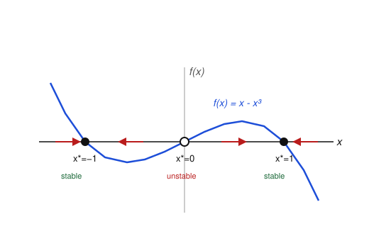

# Dynamical Systems & Chaos · Lesson 1.1: Flows on the line and fixed-point stability

> ⏱ ~15 min · Module 1: Flows on the line and the plane · Builds on: nothing (course start) · Unlocks: [Lesson 1.2](01-02-linear-systems-plane.md)

## Why this matters

Most differential equations you meet in physics, biology, and economics can't be solved in closed form — and it turns out you rarely need to. The whole thesis of this course is that you can read a system's *qualitative fate* — where it settles, whether it blows up, whether it oscillates — straight off a picture, without ever writing down $x(t)$. This lesson is that thesis in its simplest possible setting: one variable on a line. Everything later (the Jacobian, the trace–determinant plane, even the birth of chaos) is a generalization of the one move you learn here — *look at the sign*.

## The idea

Take a single quantity $x$ evolving in time according to
$$\dot x = f(x), \qquad \dot x := \frac{dx}{dt}.$$
This is **autonomous**: the rule $f$ depends only on *where* you are, not on *when*. So think of $f(x)$ not as an equation to solve but as a **velocity field on the line** — at each point $x$, $f$ tells you which way to move and how fast. The variable $x$ is an imaginary particle carried along by that flow, like a cork on a river.

Two facts run the whole show:

- Where $f(x) > 0$, the velocity is positive, so the particle drifts **right**. Where $f(x) < 0$, it drifts **left**.
- Where $f(x^*) = 0$, the velocity is zero: the particle just sits there. These are the **fixed points** (equilibria). Whether the flow *pushes toward* a fixed point or *away from* it is the entire question of stability — and you can see it just from whether the arrows on either side point in or out.

That's it. Draw the arrows and you know the destiny of every starting point. We call the $x$-axis decorated with these arrows the **phase line**.

## The formal version

**Definition (fixed point).** A point $x^*$ is a fixed point of $\dot x = f(x)$ if $f(x^*) = 0$. Then $x(t) \equiv x^*$ is a constant solution.

*In words:* fixed points are the roots of $f$ — the places where the system stops changing.

**Definition (stability).** A fixed point $x^*$ is **stable** (an attractor) if every trajectory that starts close enough to $x^*$ converges to it as $t \to \infty$, and **unstable** (a repeller) if nearby trajectories move away.

*In words:* stable = the flow points inward from both sides; unstable = it points outward.

**Linear stability test.** Suppose $f$ is differentiable at a fixed point $x^*$. Then:
$$f'(x^*) < 0 \Rightarrow x^* \text{ stable}, \qquad f'(x^*) > 0 \Rightarrow x^* \text{ unstable}, \qquad f'(x^*) = 0 \Rightarrow \text{inconclusive}.$$

*In words:* if the graph of $f$ crosses zero going **downhill**, the point is stable; crossing **uphill**, it's unstable; if it just grazes zero ($f'=0$), the linear test tells you nothing — go back to the graph.

*Why it's true.* Let $\eta(t) = x(t) - x^*$ be a small displacement. Taylor-expand: $\dot\eta = \dot x = f(x^* + \eta) = f(x^*) + f'(x^*)\eta + O(\eta^2) = f'(x^*)\,\eta + \cdots$. Dropping the higher-order terms, $\dot\eta \approx f'(x^*)\,\eta$, whose solution is $\eta(t) \approx \eta(0)\,e^{f'(x^*)\,t}$. So the displacement **decays** (stable) exactly when the exponent $f'(x^*)$ is negative and **grows** (unstable) when it's positive. The rate $|f'(x^*)|$ even tells you how fast. When $f'(x^*)=0$ the linear term vanishes and the neglected quadratic term decides — hence "inconclusive."

**Monotonicity (why 1-D flows are boring, in a good way).** Between two consecutive fixed points $f$ has one constant sign, so $\dot x$ never changes sign there: **$x(t)$ is strictly monotonic on each such interval.** A trajectory approaches the fixed point ahead of it but can never reach it in finite time — and so can never overshoot or cross it.

*In words:* on the line you can only slide steadily toward an equilibrium; you can never circle back, oscillate, or overshoot. (The reason: the constant solution sitting at $x^*$ is *already* the unique solution passing through $x^*$, so no other trajectory is allowed to touch it — uniqueness of ODE solutions forbids crossings.) **A one-dimensional flow cannot oscillate.** Oscillation and chaos will require more room, which is exactly why later modules climb to two and three dimensions.

## Picture

The phase line for $\dot x = x - x^3$. The blue curve is $f$; where it's above the axis the flow arrows point right, where it's below they point left. Fixed points sit where the curve meets the axis: filled dots are stable (arrows converge), the open dot is unstable (arrows diverge).

Notice you didn't need a single formula for $x(t)$: the arrows already tell you that anything starting positive ends at $+1$, anything negative ends at $-1$, and only the knife-edge start $x(0)=0$ stays at $0$.

## Worked examples

**Example 1 (mechanical — the logistic equation).** Population growth with a ceiling:
$$\dot x = r\,x\left(1 - \frac{x}{K}\right), \qquad r, K > 0,$$
where $x \ge 0$ is population, $r$ the low-density growth rate, and $K$ the carrying capacity. Fixed points solve $r x(1 - x/K) = 0$, giving $x^* = 0$ and $x^* = K$. Differentiate $f(x) = rx - rx^2/K$:
$$f'(x) = r - \frac{2r}{K}x.$$
- At $x^* = 0$: $f'(0) = r > 0$ → **unstable**. A tiny population grows — extinction is a repeller.
- At $x^* = K$: $f'(K) = r - 2r = -r < 0$ → **stable**. The carrying capacity is the attractor.

So from *any* positive start the population rises (or falls) monotonically to $K$. No oscillation, no overshoot — consistent with the monotonicity rule. We read all of this off two sign checks.

**Example 2 (reading the graph — the picture above).** Classify $\dot x = x - x^3$ analytically and confirm the figure. Factor: $f(x) = x(1 - x^2) = x(1-x)(1+x)$, so $x^* \in \{-1, 0, 1\}$. Now $f'(x) = 1 - 3x^2$:
- $f'(-1) = 1 - 3 = -2 < 0$ → **stable**.
- $f'(0) = 1 > 0$ → **unstable**.
- $f'(1) = 1 - 3 = -2 < 0$ → **stable**.

Two stable equilibria flanking one unstable one: the system is **bistable**. Where you end up depends only on the *sign* of your start. This exact system, given an adjustable knob, becomes the supercritical pitchfork of Lesson 3.2 — the unstable middle point will split off the two stable ones as a parameter crosses zero. Hold onto the shape.

## Watch out

- **You might think** the linear test's sign is the derivative of the *solution* $x(t)$ — **but** it's the derivative of the *velocity field* $f$, evaluated at the fixed point. You differentiate $f(x)$ with respect to $x$, then plug in $x^*$; time never enters the test.
- **You might think** $f'(x^*) = 0$ means the point is stable (nothing pushing it) — **but** it means the linear test is *silent*, and the truth can go either way. For $\dot x = x^2$, the only fixed point is $x^*=0$ with $f'(0)=0$; yet $f(x)=x^2 \ge 0$ pushes **right on both sides**, so the flow *approaches* from the left and *flees* to the right. That's a **half-stable** point — invisible to the derivative, obvious from the graph. When $f'=0$, always fall back to the sign of $f$ itself.
- **You might think** a trajectory can reach a fixed point in finite time and then move on — **but** uniqueness forbids it. A cork approaching $x^*$ slows down exactly enough (velocity $\to 0$) that it takes *infinite* time to arrive, which is why it can never cross to the other side.

## One-liner

> On the line, destiny is a matter of arrows: the flow goes right where $f>0$, left where $f<0$, and settles wherever $f$ crosses zero going downhill.

## Problems

**P1 (🟢)** For $\dot x = x^2 - 4$, find all fixed points and classify each using the sign of $f'$. Then sketch the phase line (arrows) and state where a trajectory starting at $x(0) = 1$ ends up.

**P2 (🟡)** Consider $\dot x = \sin x$. Find *all* fixed points, classify them, and describe the long-run fate of the trajectory starting at $x(0) = 1$. (Hint: the fixed points repeat; look at the sign of $f'$ at each.)

**P3 (🔴, optional)** Prove the monotonicity claim: if $f$ is continuously differentiable and $x(t)$ solves $\dot x = f(x)$ with initial value strictly between two consecutive fixed points $a < x(0) < b$ (so $f \ne 0$ on the open interval $(a,b)$), then $x(t)$ is strictly monotonic for all $t$, stays inside $(a,b)$ forever, and converges to one endpoint as $t \to \infty$ without ever reaching it in finite time.

Solutions

**P1** $f(x) = x^2 - 4 = 0 \Rightarrow x^* = \pm 2$. Derivative $f'(x) = 2x$:
- $x^* = 2$: $f'(2) = 4 > 0$ → **unstable**.
- $x^* = -2$: $f'(-2) = -4 < 0$ → **stable**.

Signs of $f$: for $x < -2$, $f > 0$ (arrow right); for $-2 < x < 2$, $f < 0$ (arrow left); for $x > 2$, $f > 0$ (arrow right). Phase line: `→  ●(−2)  ←  ○(2)  →`. Starting at $x(0)=1$ lies in $(-2,2)$ where the flow points left, so $x(t) \to -2$ (the stable point).

**P2** $\sin x = 0 \Rightarrow x^* = n\pi$ for every integer $n$. Here $f'(x) = \cos x$, so $f'(n\pi) = \cos(n\pi) = (-1)^n$:
- $n$ even (e.g. $x^*=0, \pm 2\pi$): $f' = +1 > 0$ → **unstable**.
- $n$ odd (e.g. $x^* = \pm\pi$): $f' = -1 < 0$ → **stable**.

Stable and unstable points alternate along the line. Starting at $x(0) = 1$: since $0 < 1 < \pi$ and $\sin x > 0$ there, the flow points right, so $x(t)$ increases monotonically toward the nearest fixed point ahead, $x^* = \pi$. Thus $x(t) \to \pi$.

**P3** On $(a,b)$ the function $f$ is continuous and never zero, so by the intermediate value theorem it has one constant sign there — say $f > 0$ (the case $f<0$ is identical with directions reversed). Then $\dot x = f(x(t)) > 0$ as long as $x(t)\in(a,b)$, so $x(t)$ is strictly increasing there.

*Stays inside:* the constant functions $x \equiv a$ and $x \equiv b$ are themselves solutions (since $f(a)=f(b)=0$). By the Picard–Lindelöf uniqueness theorem (valid because $f\in C^1$ is locally Lipschitz), two distinct solutions can never meet. So $x(t)$, starting strictly inside, can never touch $a$ or $b$; being increasing and bounded above by $b$, it remains in $(a,b)$ for all $t \ge 0$.

*Converges:* an increasing function bounded above has a limit $L = \lim_{t\to\infty} x(t) \le b$. That limit must be a fixed point: if $f(L) > 0$, then $\dot x$ stays bounded away from $0$ near $L$ and $x$ would shoot past $L$, contradicting convergence to $L$. Since the only fixed point in $(a,b]$ that $x$ can approach from below is $b$, we get $L = b$.

*Never reaches it in finite time:* if $x(T) = b$ for some finite $T$, then $x(t)$ and the constant solution $b$ would agree at $t=T$, forcing them equal for all time by uniqueness — contradicting $x(0) < b$. Hence the approach to $b$ takes infinite time. $\blacksquare$

## Connections

- **Backward:** this reuses only single-variable calculus — the sign of a derivative — plus the idea of an ODE. The linear stability test is a one-line Taylor expansion; nothing from the prereq courses beyond that is needed yet.
- **Forward:** in [Lesson 1.2](01-02-linear-systems-plane.md) the state becomes a vector $\mathbf x$ and $f'(x^*)$ becomes the **Jacobian matrix**; "sign of $f'$" is promoted to "signs of the real parts of the eigenvalues" — the same stability idea in higher dimensions. The inconclusive case $f'(x^*)=0$ is precisely where a parameter can reshape the fixed points: that's the whole subject of **bifurcations** in Module 3, and the bistable $\dot x = x - x^3$ above *is* the pitchfork ([Lesson 3.2](03-02-pitchfork-symmetry.md)).
- **Sideways:** this fixed-point/eigenvalue stability machinery is the shared language of the phase-portrait analysis in [analytical-mechanics](../../analytical-mechanics/syllabus.md), and it is exactly how economists ask whether Walrasian tâtonnement price adjustment converges to equilibrium in [grad-micro](../../grad-micro/syllabus.md) — a stable fixed point of the price-adjustment flow is a stable competitive equilibrium.
