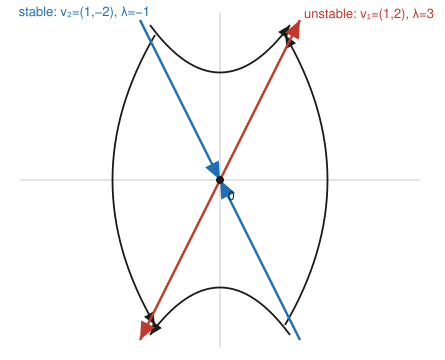

# Dynamical Systems & Chaos · Lesson 1.2: Linear systems in the plane

> ⏱ ~15 min · Module 1: Flows on the line and the plane · Builds on: [1.1 Flows on the line](01-01-flows-on-the-line.md) · Unlocks: [1.3 The trace–determinant classification](01-03-trace-determinant-classification.md)

## Why this matters

On the line (Lesson 1.1) a fixed point could only be stable or unstable — the whole story lived in the sign of one number, $f'(x^*)$. The plane is where dynamics gets interesting: trajectories can spiral, orbit, or shoot off along one direction while collapsing along another. Linear systems $\dot{\mathbf x}=A\mathbf x$ are the ones we can solve *exactly and completely*, and — crucially — they are the **local template** for every nonlinear fixed point. When you linearize a nonlinear system near an equilibrium (Lesson 1.4), the matrix you get is exactly an $A$ of this kind, so its eigenvalues decide the local fate. The same machinery reappears as the stability analysis of a mechanical equilibrium in [`analytical-mechanics`](../../analytical-mechanics/syllabus.md) and as the question of whether Walrasian price adjustment (tâtonnement) converges to equilibrium in [`grad-micro`](../../grad-micro/syllabus.md).

## The idea

Read $\dot{\mathbf x}=A\mathbf x$ as a rule: **at the point $\mathbf x$, your velocity is $A\mathbf x$.** The matrix $A$ takes your position and hands you back a velocity vector. Usually that velocity points off at some angle to $\mathbf x$, so trajectories curve.

But some directions are special. If a vector $\mathbf v$ satisfies $A\mathbf v=\lambda\mathbf v$ — an **eigenvector** — then at any point on the ray through $\mathbf v$ the velocity is just $\lambda$ times your position: it points straight along the ray. So a trajectory that starts on that ray *never leaves it*; it only speeds up or slows down. Motion collapses to a 1-D problem $\dot s=\lambda s$, whose solution you already know: $s(t)=s_0e^{\lambda t}$. If $\lambda>0$ you flee the origin along the ray; if $\lambda<0$ you're pulled in.

These eigen-rays are the **skeleton** of the phase portrait. Every other trajectory is a blend of the two exponential motions — sliding in along the decaying direction while stretching out along the growing one. And when $A$ has no real eigen-rays at all, the "eigenvalues" come out complex, which is the algebra's way of telling you the flow *rotates*: you get spirals or closed orbits instead of straight-line escape.

## The formal version

We study the **2-D linear system**
$$\dot{\mathbf x}=A\mathbf x,\qquad \mathbf x=\begin{pmatrix}x\\ y\end{pmatrix},\quad A=\begin{pmatrix}a&b\\ c&d\end{pmatrix},$$
where $\dot{\mathbf x}=\tfrac{d\mathbf x}{dt}$. The origin $\mathbf x^*=\mathbf 0$ is always a fixed point (and the only one when $A$ is invertible).

*In words:* the state is a point in the plane, and $A$ assigns each point the velocity it moves with.

**Eigenvalues and eigenvectors.** A scalar $\lambda$ and nonzero vector $\mathbf v$ with
$$A\mathbf v=\lambda\mathbf v\quad\Longleftrightarrow\quad (A-\lambda I)\mathbf v=\mathbf 0$$
require $\det(A-\lambda I)=0$, giving the **characteristic equation**
$$\lambda^2-(\operatorname{tr}A)\,\lambda+\det A=0,\qquad \operatorname{tr}A=a+d,\ \ \det A=ad-bc.$$

*In words:* eigen-directions are the ones $A$ merely stretches (by $\lambda$) without rotating; they exist where $A-\lambda I$ collapses the plane.

**General solution — distinct real eigenvalues.** If $\lambda_1\neq\lambda_2$ are real with eigenvectors $\mathbf v_1,\mathbf v_2$ (automatically independent), then every solution is
$$\boxed{\;\mathbf x(t)=c_1e^{\lambda_1 t}\mathbf v_1+c_2e^{\lambda_2 t}\mathbf v_2\;}$$
with $c_1,c_2$ fixed by the initial condition $\mathbf x(0)=c_1\mathbf v_1+c_2\mathbf v_2$.

*In words:* the motion is a superposition of two independent exponential "pure modes," one along each eigen-ray.

**Invariant eigendirections (straight-line trajectories).** Setting $c_2=0$ leaves $\mathbf x(t)=c_1e^{\lambda_1 t}\mathbf v_1$: the trajectory stays on the line $\operatorname{span}(\mathbf v_1)$ for all time. Such a line is **invariant** — you can enter it but the flow never carries you off it.

*In words:* each eigen-ray is a one-way street the flow respects forever; sign of $\lambda$ says outbound ($\lambda>0$) or inbound ($\lambda<0$).

The signs of $\lambda_1,\lambda_2$ name the fixed point (developed fully in Lesson 1.3):

- both negative → **stable node** (everything decays in);
- both positive → **unstable node** (everything flees);
- opposite signs → **saddle** (in along one eigen-ray, out along the other).

**Complex eigenvalues $\lambda=\alpha\pm i\omega$ (with $\omega\neq0$).** No real eigen-ray exists; the flow rotates. Taking real and imaginary parts of the complex solution gives the real general solution
$$\mathbf x(t)=e^{\alpha t}\big(\text{a vector rotating with angular frequency }\omega\big),\qquad |\mathbf x(t)|\propto e^{\alpha t}.$$
The envelope $e^{\alpha t}$ decides everything:

- $\alpha<0$ → **stable spiral** (focus): rotate inward;
- $\alpha>0$ → **unstable spiral**: rotate outward;
- $\alpha=0$ → **center**: pure rotation on closed orbits (ellipses), neither growing nor shrinking.

*In words:* complex eigenvalues mean "spin"; the real part $\alpha$ is the growth rate of the spin's radius, the imaginary part $\omega$ is how fast it spins.

**Repeated eigenvalue $\lambda_1=\lambda_2=\lambda$ (a preview).** Two sub-cases. If $A=\lambda I$, every vector is an eigenvector — a **star node**, all rays straight. Otherwise there is only *one* eigendirection, and the second solution picks up a linear factor: the general solution is $\mathbf x(t)=e^{\lambda t}\big[(c_1+c_2 t)\mathbf v+c_2\mathbf w\big]$ where $(A-\lambda I)\mathbf w=\mathbf v$. This is a **degenerate (improper) node** — trajectories come in tangent to the lone eigendirection. Stability is still just the sign of $\lambda$. (You'll meet this in P3.)

## Picture

A **saddle** for $A=\begin{pmatrix}1&1\\ 4&1\end{pmatrix}$ (worked below): eigenvalues $\lambda_1=3$ (unstable, red) and $\lambda_2=-1$ (stable, blue). The two eigen-rays are the invariant straight-line trajectories; every other trajectory (black) is a hyperbola that comes in along the stable direction and leaves along the unstable one.

## Worked examples

**Example 1 (a saddle, worked end to end).** Solve and classify $\dot{\mathbf x}=A\mathbf x$ with $A=\begin{pmatrix}1&1\\ 4&1\end{pmatrix}$.

*Eigenvalues.* $\operatorname{tr}A=2$, $\det A=1-4=-3$, so
$$\lambda^2-2\lambda-3=(\lambda-3)(\lambda+1)=0\ \Rightarrow\ \lambda_1=3,\ \lambda_2=-1.$$
Opposite signs ⇒ **saddle**.

*Eigenvectors.* For $\lambda_1=3$: $(A-3I)=\begin{pmatrix}-2&1\\ 4&-2\end{pmatrix}$, so $-2v_1+v_2=0\Rightarrow v_2=2v_1$, giving $\mathbf v_1=\begin{pmatrix}1\\2\end{pmatrix}$. For $\lambda_2=-1$: $(A+I)=\begin{pmatrix}2&1\\ 4&2\end{pmatrix}$, so $2v_1+v_2=0\Rightarrow v_2=-2v_1$, giving $\mathbf v_2=\begin{pmatrix}1\\-2\end{pmatrix}$.

*General solution.*
$$\mathbf x(t)=c_1e^{3t}\begin{pmatrix}1\\2\end{pmatrix}+c_2e^{-t}\begin{pmatrix}1\\-2\end{pmatrix}.$$

*Reading the portrait.* The line $\operatorname{span}(1,2)$ is the **unstable manifold**: start there ($c_2=0$) and $e^{3t}$ blows you outward. The line $\operatorname{span}(1,-2)$ is the **stable manifold**: start there ($c_1=0$) and $e^{-t}$ pulls you in. A generic trajectory ($c_1,c_2\neq0$) is dominated by $e^{-t}$ early (sliding toward the origin along $\mathbf v_2$) but by $e^{3t}$ eventually (flung out parallel to $\mathbf v_1$) — the hyperbolas in the Picture.

**Example 2 (a spiral you already know — the damped oscillator).** The underdamped mass–spring $\ddot x+2\dot x+2x=0$ becomes a plane system via $x_1=x$, $x_2=\dot x$:
$$\dot x_1=x_2,\qquad \dot x_2=-2x_1-2x_2,\qquad A=\begin{pmatrix}0&1\\ -2&-2\end{pmatrix}.$$
Here $\operatorname{tr}A=-2$, $\det A=2$, so $\lambda^2+2\lambda+2=0\Rightarrow\lambda=-1\pm i$. Complex with $\alpha=-1<0$, $\omega=1$: a **stable spiral**. The envelope $e^{-t}$ is the exponential decay of the amplitude; the rotation $\omega=1$ is the residual oscillation. The real general solution is
$$x(t)=e^{-t}\big(c_1\cos t+c_2\sin t\big),$$
the textbook underdamped ring-down. Which way does it spiral? Evaluate the velocity on the positive $x_1$-axis, at $(1,0)$: $\dot{\mathbf x}=(x_2,\,-2x_1-2x_2)=(0,-2)$ — pointing straight down, so the flow turns **clockwise** while decaying to the origin. This is the phase portrait every physicist draws for a damped oscillator; the identical picture governs a linearized pendulum with friction in [`analytical-mechanics`](../../analytical-mechanics/syllabus.md).

## Watch out

- **Complex eigenvalues do not mean complex trajectories.** The state $\mathbf x(t)$ is always real; the complex $\lambda,\mathbf v$ are bookkeeping. Take real and imaginary parts to get the real, spiraling solution — never report a complex phase portrait.
- **Stability lives in $\lambda$, not $\mathbf v$.** Eigenvectors set the *directions*; only the sign of the (real part of the) eigenvalue sets in vs. out. And eigenvectors are defined only up to scale — $(1,2)$ and $(-3,-6)$ are the same eigen-ray.
- **A repeated eigenvalue is usually *not* a star.** You might think $\lambda_1=\lambda_2$ means every direction is invariant, but that only happens when $A=\lambda I$. Generically there's a single eigendirection and a $t\,e^{\lambda t}$ term — a degenerate node, not a star.
- **A center is knife-edge.** $\alpha=0$ (purely imaginary $\lambda$) gives closed orbits, but the tiniest perturbation to $A$ can push $\alpha$ off zero and turn the center into a slow spiral. This fragility is exactly why linearization can fail to decide stability at a center — the theme of Lesson 1.4.

## One-liner

> Eigenvalues are the growth rates and eigenvectors are the invariant rays: real ones give nodes and saddles, complex ones give spins (spirals if $\alpha\neq0$, centers if $\alpha=0$).

## Problems

**P1 (🟢)** For $A=\begin{pmatrix}1&2\\ 2&1\end{pmatrix}$: find the eigenvalues and eigenvectors, write the general solution $\mathbf x(t)$, classify the fixed point at the origin, and state the two invariant lines and whether the flow on each is inbound or outbound.

**P2 (🟡)** For $A=\begin{pmatrix}1&-2\\ 2&1\end{pmatrix}$: find the eigenvalues, classify the fixed point (name it precisely, including stability), and determine the direction of rotation (clockwise or counterclockwise) by evaluating the vector field at the point $(1,0)$.

**P3 (🔴, optional)** A repeated eigenvalue. For $A=\begin{pmatrix}-1&1\\ 0&-1\end{pmatrix}$: show $\lambda=-1$ is a double eigenvalue with only one eigendirection, find a generalized eigenvector $\mathbf w$ solving $(A+I)\mathbf w=\mathbf v$, write the general solution (it will contain a $t\,e^{-t}$ term), and classify the fixed point.

Solutions

**P1** $\operatorname{tr}A=2$, $\det A=1-4=-3$, so $\lambda^2-2\lambda-3=(\lambda-3)(\lambda+1)=0$: $\lambda_1=3,\ \lambda_2=-1$.
For $\lambda_1=3$: $(A-3I)=\begin{pmatrix}-2&2\\ 2&-2\end{pmatrix}$ gives $v_1=v_2$, so $\mathbf v_1=\begin{pmatrix}1\\1\end{pmatrix}$. For $\lambda_2=-1$: $(A+I)=\begin{pmatrix}2&2\\ 2&2\end{pmatrix}$ gives $v_1=-v_2$, so $\mathbf v_2=\begin{pmatrix}1\\-1\end{pmatrix}$.
General solution:
$$\mathbf x(t)=c_1e^{3t}\begin{pmatrix}1\\1\end{pmatrix}+c_2e^{-t}\begin{pmatrix}1\\-1\end{pmatrix}.$$
Opposite-sign eigenvalues ⇒ **saddle**. Invariant lines: $\operatorname{span}(1,1)$ is **outbound** (unstable, $\lambda=3>0$); $\operatorname{span}(1,-1)$ is **inbound** (stable, $\lambda=-1<0$).

**P2** $\operatorname{tr}A=2$, $\det A=1-(-4)=5$, so $\lambda^2-2\lambda+5=0\Rightarrow\lambda=\dfrac{2\pm\sqrt{4-20}}{2}=1\pm2i$. Complex with $\alpha=1>0$, $\omega=2$ ⇒ **unstable spiral** (spiral source): trajectories spiral *outward*.
Rotation direction: at $(1,0)$, $\dot{\mathbf x}=A\begin{pmatrix}1\\0\end{pmatrix}=\begin{pmatrix}1\\2\end{pmatrix}$ — pointing up and to the right, i.e. the $y$-component is positive on the positive $x$-axis, so the flow turns **counterclockwise** (while growing).

**P3** Characteristic equation: $\operatorname{tr}A=-2$, $\det A=1$, so $\lambda^2+2\lambda+1=(\lambda+1)^2=0$, a double root $\lambda=-1$.
Eigenvector: $(A+I)=\begin{pmatrix}0&1\\ 0&0\end{pmatrix}$, so $(A+I)\mathbf v=\mathbf 0$ forces $v_2=0$ with $v_1$ free: the *only* eigendirection is $\mathbf v=\begin{pmatrix}1\\0\end{pmatrix}$ (not a star — defective).
Generalized eigenvector: solve $(A+I)\mathbf w=\mathbf v$, i.e. $\begin{pmatrix}0&1\\ 0&0\end{pmatrix}\mathbf w=\begin{pmatrix}1\\0\end{pmatrix}$, giving $w_2=1$ with $w_1$ free; take $\mathbf w=\begin{pmatrix}0\\1\end{pmatrix}$.
General solution:
$$\mathbf x(t)=c_1e^{-t}\begin{pmatrix}1\\0\end{pmatrix}+c_2e^{-t}\left[t\begin{pmatrix}1\\0\end{pmatrix}+\begin{pmatrix}0\\1\end{pmatrix}\right]=e^{-t}\begin{pmatrix}c_1+c_2 t\\ c_2\end{pmatrix}.$$
Check: $\dot{\mathbf x}=e^{-t}\begin{pmatrix}c_2-(c_1+c_2 t)\\ -c_2\end{pmatrix}$ and $A\mathbf x=e^{-t}\begin{pmatrix}-(c_1+c_2 t)+c_2\\ -c_2\end{pmatrix}$ agree. ✓
Since $\lambda=-1<0$, every solution $\to\mathbf 0$ (the $t$ grows but $e^{-t}$ wins), so the origin is a **stable degenerate (improper) node**; trajectories approach tangent to the lone eigendirection $\mathbf v=(1,0)$.

## Connections

- **Backward (Lesson 1.1):** on the line, the "eigenvalue" was literally $f'(x^*)$ and its sign gave stability. In the plane you get *two* growth rates, and the same sign logic applies — but now direction matters, which is the genuinely new content.
- **Forward (Lesson 1.3):** you never actually need to compute eigenvalues to classify a linear system — the pair $(\operatorname{tr}A,\det A)$ already fixes node/saddle/spiral/center. Lesson 1.3 turns the case list above into a single picture, the trace–determinant plane.
- **Forward (Lesson 1.4):** near a fixed point of a *nonlinear* system, the Jacobian plays the role of $A$, and (when it's hyperbolic) the local phase portrait is exactly one of the ones here. This lesson is the dictionary linearization looks words up in.
- **Sideways (physics & econ):** the stable-spiral picture of Example 2 is the linearized damped oscillator/pendulum of [`analytical-mechanics`](../../analytical-mechanics/syllabus.md); the same eigenvalue-sign test decides whether Walrasian tâtonnement price dynamics converge to a market equilibrium in [`grad-micro`](../../grad-micro/syllabus.md).
