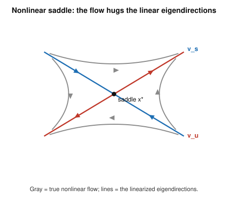
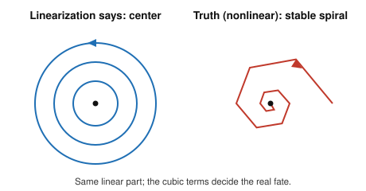

# Dynamical Systems & Chaos · Lesson 1.4: Nonlinear systems and linearization

> ⏱ ~15 min · Module 1: Flows on the line and the plane · Builds on: [Lesson 1.3](01-03-trace-determinant-classification.md) (trace–determinant classification), [Lesson 1.2](01-02-linear-systems-plane.md) (linear systems) · Unlocks: [Lesson 1.5](01-05-phase-portraits.md) (drawing phase portraits)

## Why this matters

Almost nothing in nature is linear, and almost no nonlinear system can be solved in closed form. So the working strategy of this whole subject is: don't solve — *look near the equilibria*. Zoom in far enough on a fixed point and a smooth nonlinear system looks like a linear one, and you already know how to read every 2-D linear system off its trace and determinant. This lesson makes "looks like" precise (the Jacobian), tells you exactly when the linear picture is trustworthy (Hartman–Grobman), and — just as important — flags the borderline cases where it lies to you. It's the engine behind stability analysis everywhere: whether a mechanical equilibrium is stable in [`analytical-mechanics`](../../analytical-mechanics/syllabus.md), whether Walrasian price adjustment converges to equilibrium in [`grad-micro`](../../grad-micro/syllabus.md), and every phase portrait you'll draw from here on.

## The idea

A fixed point $\mathbf{x}^*$ of $\dot{\mathbf{x}} = \mathbf{f}(\mathbf{x})$ is a place where the vector field vanishes: $\mathbf{f}(\mathbf{x}^*) = \mathbf{0}$, so a trajectory placed exactly there never moves. The question that matters is what happens *nearby*: nudge the state a little, and does it slide back (stable) or run away (unstable)?

Here's the trick. Set $\mathbf{u} = \mathbf{x} - \mathbf{x}^*$, the small displacement from equilibrium. Near $\mathbf{x}^*$ a smooth vector field is well-approximated by the first term of its Taylor expansion, and since $\mathbf{f}(\mathbf{x}^*)=\mathbf 0$ that first term is *linear* in $\mathbf u$:
$$\dot{\mathbf{u}} \approx J\,\mathbf{u}, \qquad J = D\mathbf{f}(\mathbf{x}^*).$$
The matrix $J$ — the **Jacobian**, the matrix of all first partial derivatives evaluated at the fixed point — is the local "gain" of the flow. Classify *its* eigenvalues and you've classified the equilibrium: node, saddle, spiral, or center, exactly the menu from [Lesson 1.3](01-03-trace-determinant-classification.md). The bet is that the true curved flow, magnified near $\mathbf{x}^*$, matches this straight-line linear flow. Hartman–Grobman says the bet is safe — *unless* the linearization is sitting on a knife's edge.

## The formal version

**Definition (fixed point).** $\mathbf{x}^*$ is a fixed point (equilibrium) of $\dot{\mathbf{x}} = \mathbf{f}(\mathbf{x})$ if $\mathbf{f}(\mathbf{x}^*) = \mathbf{0}$.

For a planar system with $\mathbf{f} = (f, g)$ and $\mathbf{x} = (x, y)$, the **Jacobian** at a point is
$$
J(x,y) \;=\;
\begin{pmatrix}
\dfrac{\partial f}{\partial x} & \dfrac{\partial f}{\partial y} \\[2mm]
\dfrac{\partial g}{\partial x} & \dfrac{\partial g}{\partial y}
\end{pmatrix},
\qquad
J = J(\mathbf{x}^*) = D\mathbf{f}(\mathbf{x}^*).
$$

*In words:* $J$ collects how each rate-of-change component responds to a small push in each coordinate; evaluated at the fixed point, it *is* the linearized system.

**The linearization.** Writing $\mathbf{u} = \mathbf{x}-\mathbf{x}^*$, Taylor's theorem gives $\dot{\mathbf{u}} = J\,\mathbf{u} + \underbrace{O(\lVert\mathbf{u}\rVert^2)}_{\text{higher-order terms}}$. Dropping the quadratic-and-smaller remainder leaves the **linearized system** $\dot{\mathbf{u}} = J\,\mathbf{u}$.

**Definition (hyperbolic).** A fixed point is **hyperbolic** if *neither* eigenvalue of $J$ has zero real part ($\operatorname{Re}\lambda_i \neq 0$ for all $i$).

*In words:* hyperbolic = the linear flow is unambiguously expanding or contracting in every direction — no direction is exactly borderline. Saddles, and all genuine nodes and spirals, are hyperbolic. Centers ($\lambda = \pm i\omega$, purely imaginary) and any fixed point with a zero eigenvalue are **non-hyperbolic**.

**Hartman–Grobman theorem.** Near a *hyperbolic* fixed point, the nonlinear flow $\dot{\mathbf{x}}=\mathbf{f}(\mathbf{x})$ is **topologically conjugate** to its linearization $\dot{\mathbf{u}}=J\mathbf{u}$: there is a continuous, continuously-invertible change of coordinates (a homeomorphism) on a neighborhood of $\mathbf{x}^*$ that maps trajectories of one onto trajectories of the other, preserving their direction in time.

*In words:* at a hyperbolic fixed point the linear picture is qualitatively **exact** — same stability, same type (a linear saddle stays a saddle, a stable spiral stays a stable spiral). The homeomorphism may bend and stretch the picture (spacing and precise spiral rate aren't preserved), but it can't change how many trajectories go in versus out, so it can't change the *type*. This is the license to classify a nonlinear equilibrium by reading off $J$'s eigenvalues.

**When it fails — the non-hyperbolic borderline.** If some $\operatorname{Re}\lambda_i = 0$, Hartman–Grobman does **not** apply, and the higher-order terms you threw away can decide the outcome. Two cases you'll meet constantly:

- **Center ($\tau = 0$, $\Delta > 0$, so $\lambda = \pm i\omega$).** The linearization predicts closed orbits, but nonlinear terms can turn them into a slow inward spiral (stable), an outward spiral (unstable), or leave a true center. The Jacobian genuinely cannot tell which.
- **Zero eigenvalue ($\Delta = \det J = 0$).** A direction of neither growth nor decay to linear order; the leading nonlinear term along it sets the fate (this is exactly the setting of the saddle-node bifurcation, Module 3).

For the borderline you need other tools — Lyapunov functions ([Lesson 2.2](02-02-lyapunov-functions.md)) or center-manifold / normal-form reductions ([Lesson 3.4](03-04-normal-forms-structural-stability.md)). Here, the job is to *recognize* it and refuse to trust the linear answer.

## Picture

At a hyperbolic saddle the true trajectories (curved, gray) come in asymptotic to the linear **stable** eigendirection $v_s$ and leave asymptotic to the **unstable** one $v_u$ — the straight eigenlines of $J$. Locally, nonlinear and linear are the same portrait, exactly as Hartman–Grobman promises.

Contrast the failure case. A linear center and its nonlinear cousin share the *same* Jacobian (pure imaginary eigenvalues), yet the cubic terms — invisible to $J$ — can spiral the orbits inward. Same linearization, different fate: this is why "center" is never a reliable verdict.

## Worked examples

**Example 1 (mechanical — one Jacobian, read off the type).** Classify the fixed points of
$$\dot x = x^2 - 1, \qquad \dot y = -y.$$
*Fixed points:* $\dot y = 0 \Rightarrow y = 0$; $\dot x = 0 \Rightarrow x^2 = 1 \Rightarrow x = \pm 1$. So $(1,0)$ and $(-1,0)$.
*Jacobian:* with $f = x^2 - 1$, $g = -y$,
$$J(x,y) = \begin{pmatrix} 2x & 0 \\ 0 & -1 \end{pmatrix}.$$
- At $(1,0)$: $J = \begin{pmatrix} 2 & 0 \\ 0 & -1 \end{pmatrix}$, eigenvalues $2, -1$. Real, opposite signs $\Rightarrow$ **saddle** (hyperbolic). Trace $\tau = 1$, determinant $\Delta = -2 < 0$ — negative determinant is the saddle signature from [Lesson 1.3](01-03-trace-determinant-classification.md).
- At $(-1,0)$: $J = \begin{pmatrix} -2 & 0 \\ 0 & -1 \end{pmatrix}$, eigenvalues $-2, -1$. Both real and negative $\Rightarrow$ **stable node** (hyperbolic; $\tau=-3<0,\ \Delta=2>0,\ \tau^2-4\Delta=1>0$).

Both hyperbolic, so both verdicts are Hartman–Grobman-certified.

**Example 2 (why you'd care — a competition model).** Two species with populations $x, y \ge 0$:
$$\dot x = x\,(3 - x - 2y), \qquad \dot y = y\,(2 - x - y).$$
Expanded, $f = 3x - x^2 - 2xy$ and $g = 2y - xy - y^2$, so
$$J(x,y) = \begin{pmatrix} 3 - 2x - 2y & -2x \\ -y & 2 - x - 2y \end{pmatrix}.$$
*Fixed points* (set each factored equation to zero): $(0,0)$, $(3,0)$, $(0,2)$, and the coexistence point where $3-x-2y=0$ and $2-x-y=0$; subtracting gives $y=1$, then $x=1$, i.e. $(1,1)$. Evaluate $J$ at each:

- **$(0,0)$:** $J = \begin{pmatrix}3&0\\0&2\end{pmatrix}$, eigenvalues $3, 2$ ($\tau=5,\ \Delta=6$) — **unstable node**.
- **$(3,0)$:** $J = \begin{pmatrix}-3&-6\\0&-1\end{pmatrix}$ (upper-triangular), eigenvalues $-3, -1$ ($\tau=-4,\ \Delta=3$) — **stable node**.
- **$(0,2)$:** $J = \begin{pmatrix}-1&0\\-2&-2\end{pmatrix}$ (lower-triangular), eigenvalues $-1, -2$ ($\tau=-3,\ \Delta=2$) — **stable node**.
- **$(1,1)$:** $J = \begin{pmatrix}-1&-2\\-1&-1\end{pmatrix}$, $\tau=-2$, $\Delta = (-1)(-1) - (-2)(-1) = 1 - 2 = -1 < 0$ — **saddle**. Eigenvalues $\lambda = \tfrac{\tau \pm \sqrt{\tau^2 - 4\Delta}}{2} = -1 \pm \sqrt 2$, of opposite sign.

All four are hyperbolic, so linearization is fully trustworthy, and the whole story emerges: coexistence at $(1,1)$ is an unstable saddle, and its stable eigendirection (along the eigenvector $(\sqrt2, 1)$) is the **separatrix** — the watershed deciding which species wins. Start on one side and you flow to the stable node $(3,0)$ ($x$ wins); start on the other and you flow to $(0,2)$ ($y$ wins). That separatrix is precisely the object we'll trace globally in [Lesson 1.5](01-05-phase-portraits.md).

## Watch out

- **A center from linearization is a *verdict deferred*, not a verdict.** You might think $\lambda = \pm i\omega$ means "closed orbits, neutrally stable." Actually the fixed point is non-hyperbolic and the true flow may spiral in or out — the linear center is exactly the case Hartman–Grobman refuses to certify (see fig. 2). Never report "center" from $J$ alone; report "linear center — borderline, nonlinear terms decide."
- **Evaluate the Jacobian *at* the fixed point — always, and separately at each one.** $J(x,y)$ is a matrix-valued function; its eigenvalues change from point to point. Plugging in the wrong equilibrium (or forgetting to plug in at all and using symbolic $x,y$) is the most common error here.
- **"Hyperbolic" has nothing to do with hyperbolas or saddles specifically.** You might read "hyperbolic fixed point" as "saddle." It means only that no eigenvalue is purely imaginary or zero — stable nodes and stable spirals are hyperbolic too. Hyperbolic = "linearization can be trusted," full stop.
- **A tiny eigenvalue is still nonzero.** $\operatorname{Re}\lambda = -0.001$ is hyperbolic and stable; $\operatorname{Re}\lambda = 0$ exactly is the borderline. The theorem cares about the sign being definite, not the magnitude being large.

## One-liner

> Zoom in on a fixed point and read the Jacobian's eigenvalues — the linear picture is exactly right *if* the point is hyperbolic, and quietly unreliable (center, or zero eigenvalue) the moment an eigenvalue's real part hits zero.

## Problems

**P1 (🟢)** For $\dot x = y - x^2$, $\dot y = x - y$, find all fixed points, compute the Jacobian at each, and classify them.

**P2 (🟡)** Consider $\dot x = -y + x(x^2 + y^2)$, $\dot y = x + y(x^2 + y^2)$. (a) Show the origin is a fixed point and find its linearization; what type does the Jacobian predict? (b) Convert to polar coordinates ($r^2 = x^2+y^2$, so $r\dot r = x\dot x + y\dot y$) to find $\dot r$, and use it to determine the *true* stability of the origin. Why don't the two answers agree?

**P3 (🔴, optional)** For $\dot x = x^2$, $\dot y = -y$, show the origin is a non-hyperbolic fixed point (find $J$ and its eigenvalues), then describe the true dynamics near it directly from the equations. Is the origin attracting, repelling, or neither?

Solutions

**P1.** Fixed points: $\dot y = 0 \Rightarrow y = x$; substitute into $\dot x = 0$: $x - x^2 = 0 \Rightarrow x(1-x)=0$, so $x = 0$ or $x = 1$. Fixed points $(0,0)$ and $(1,1)$.

With $f = y - x^2$, $g = x - y$:
$$J(x,y) = \begin{pmatrix} -2x & 1 \\ 1 & -1 \end{pmatrix}.$$

- At $(0,0)$: $J = \begin{pmatrix} 0 & 1 \\ 1 & -1 \end{pmatrix}$, $\tau = -1$, $\Delta = (0)(-1) - (1)(1) = -1 < 0$ $\Rightarrow$ **saddle** (hyperbolic). (Eigenvalues $\lambda = \tfrac{-1\pm\sqrt{1+4}}{2} = \tfrac{-1\pm\sqrt5}{2}$, opposite signs. ✓)
- At $(1,1)$: $J = \begin{pmatrix} -2 & 1 \\ 1 & -1 \end{pmatrix}$, $\tau = -3$, $\Delta = (-2)(-1) - (1)(1) = 2 - 1 = 1 > 0$, discriminant $\tau^2 - 4\Delta = 9 - 4 = 5 > 0$, and $\tau < 0$ $\Rightarrow$ **stable node** (hyperbolic). Both classifications are Hartman–Grobman-certified.

**P2.** (a) At the origin $f = g = 0$, so it is a fixed point. Expand: $f = -y + x^3 + xy^2$, $g = x + x^2 y + y^3$. Then
$$J = \begin{pmatrix} 3x^2 + y^2 & -1 + 2xy \\ 1 + 2xy & x^2 + 3y^2 \end{pmatrix}\Bigg|_{(0,0)} = \begin{pmatrix} 0 & -1 \\ 1 & 0 \end{pmatrix}.$$
Here $\tau = 0$, $\Delta = 1 > 0$, eigenvalues $\lambda = \pm i$. The Jacobian predicts a **center** (closed orbits).

(b) $r\dot r = x\dot x + y\dot y = x(-y + x r^2) + y(x + y r^2) = -xy + x^2 r^2 + xy + y^2 r^2 = r^2(x^2 + y^2) = r^2 \cdot r^2 = r^4$, so
$$\dot r = r^3 > 0 \quad (r > 0).$$
Every nonzero radius grows, so the origin is an **unstable spiral** — trajectories spiral outward. (Aside: $\dot\theta = \tfrac{x\dot y - y\dot x}{r^2} = 1 > 0$, confirming rotation.)

The answers disagree because $\lambda = \pm i$ is *purely imaginary*: the origin is **non-hyperbolic**, so Hartman–Grobman does not apply and the discarded cubic term $x(x^2+y^2)$ — precisely what produces $\dot r = r^3$ — is exactly what decides the stability. The linear "center" is a borderline verdict the nonlinear terms overturn.

**P3.** With $f = x^2$, $g = -y$: $J(x,y) = \begin{pmatrix} 2x & 0 \\ 0 & -1 \end{pmatrix}$, so at the origin $J = \begin{pmatrix} 0 & 0 \\ 0 & -1 \end{pmatrix}$, eigenvalues $0$ and $-1$. The zero eigenvalue ($\Delta = \det J = 0$) makes the origin **non-hyperbolic** — linearization is inconclusive along the $x$-direction.

Read the true dynamics off the (decoupled) equations. In $y$: $\dot y = -y$ always decays to $0$ — attracting. In $x$: $\dot x = x^2 \ge 0$, so $x$ *always increases* (except it's stuck at $x=0$). For $x < 0$ the state moves rightward toward $0$ (attracted); for $x > 0$ it moves rightward away from $0$ (repelled). So along $x$ the origin is **half-stable** (a saddle-node-type point): attracting from the left, repelling to the right. The origin is therefore **neither purely attracting nor purely repelling** — exactly the kind of degenerate behavior a zero eigenvalue warns you to check by hand.

## Flashback

**From [Lesson 1.3](01-03-trace-determinant-classification.md) (trace–determinant classification):** Classify the linear system $\dot{\mathbf{x}} = A\mathbf{x}$ with
$$A = \begin{pmatrix} -1 & -5 \\ 1 & -3 \end{pmatrix}.$$
Find $\tau$, $\Delta$, and the discriminant, and name the type and its stability.

Solution

$\tau = \operatorname{tr} A = -1 + (-3) = -4$. $\Delta = \det A = (-1)(-3) - (-5)(1) = 3 + 5 = 8$. Discriminant $\tau^2 - 4\Delta = 16 - 32 = -16 < 0$, so the eigenvalues are complex: $\lambda = \tfrac{\tau \pm \sqrt{\tau^2-4\Delta}}{2} = -2 \pm 2i$. Complex eigenvalues with $\operatorname{Re}\lambda = -2 < 0$ (equivalently $\Delta > 0$ and $\tau < 0$ with negative discriminant) $\Rightarrow$ **stable spiral** (inward). Since $\operatorname{Re}\lambda \neq 0$ this is a hyperbolic linear system — the kind whose type would survive intact as a nonlinear perturbation, by Hartman–Grobman.

## Connections

- **Backward:** this is the payoff of [Lesson 1.3](01-03-trace-determinant-classification.md) — the entire node/saddle/spiral/center vocabulary, plus the trace–determinant shortcut, now applies to *any* smooth nonlinear system, one Jacobian at a time. And [Lesson 1.1](01-01-flows-on-the-line.md)'s 1-D rule "stable iff $f'(x^*) < 0$" is just the $1\times1$ Jacobian.
- **Forward:** [Lesson 1.5](01-05-phase-portraits.md) stitches these local pictures into a global phase portrait, with the saddle separatrices from Example 2 as the skeleton. The non-hyperbolic borderline flagged here is picked up by Lyapunov functions ([Lesson 2.2](02-02-lyapunov-functions.md)) and re-emerges as the organizing center of bifurcations ([Lesson 3.1](03-01-saddle-node-transcritical.md), [Lesson 3.4](03-04-normal-forms-structural-stability.md)): a bifurcation is precisely a fixed point going non-hyperbolic as a parameter passes through it.
- **Sideways:** the same linearize-and-check-eigenvalues machinery is how [`analytical-mechanics`](../../analytical-mechanics/syllabus.md) decides whether an equilibrium of a mechanical system is stable, and how [`grad-micro`](../../grad-micro/syllabus.md) tests whether Walrasian tâtonnement price adjustment converges to a market equilibrium — the Jacobian of excess demand playing the role of $J$ here.
