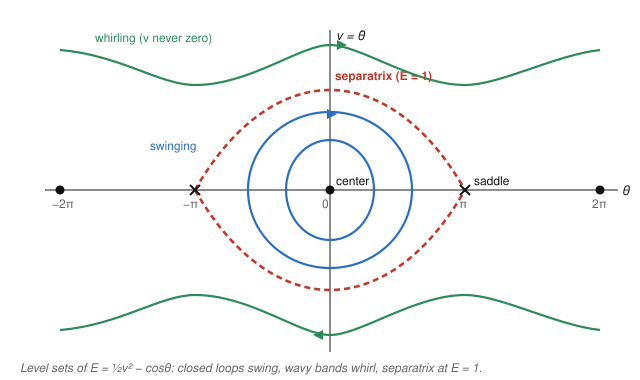

# Dynamical Systems & Chaos · Lesson 2.1: Conservative and reversible systems

> ⏱ ~15 min · Module 2: Limit cycles and the constraints of the plane · Builds on: [Lesson 1.5](01-05-phase-portraits.md) (phase portraits), [Lesson 1.4](01-04-linearization-hartman-grobman.md) (linearization) · Unlocks: [Lesson 2.2](02-02-lyapunov-functions.md) (Lyapunov functions)

## Why this matters

Sometimes you can read off *every* trajectory of a nonlinear system without solving a single differential equation — you just need one quantity that never changes. For a swinging pendulum that quantity is energy, and knowing energy is conserved instantly tells you the pendulum swings in closed loops forever. This is the physicist's oldest trick, and it does two jobs at once: it draws the whole phase portrait for free, and it rescues the one case linearization couldn't decide — the center, where eigenvalues sit on the imaginary axis and the linear picture might be lying. The same conserved-quantity move is the backbone of [analytical-mechanics](../../analytical-mechanics/syllabus.md), where "phase space" and "energy surface" are the primary objects.

## The idea

A **conserved quantity** (or **first integral**) is a function $E(x,y)$ that stays constant as the state moves along any trajectory. It doesn't have to be the same constant on different trajectories — it just can't change *along* one. Geometrically that is a hard constraint: the trajectory is trapped on a single level curve $E(x,y) = c$. Draw the contour map of $E$ and you've drawn the phase portrait, because each orbit is one contour.

The headline example is a particle in a potential well. A mass on a spring, a pendulum, a marble in a bowl — all obey $\ddot x = -V'(x)$ (force is minus the slope of the potential $V$), and all conserve energy $E = \tfrac12\dot x^2 + V(x)$: kinetic plus potential. Roll the marble and it trades height for speed and back, tracing the same closed loop endlessly. It never spirals to rest — that would require energy to leak away, and here nothing leaks.

That "nothing leaks" is exactly what forbids the interesting long-run behaviors you might expect. An attracting fixed point or an attracting closed orbit would pull in a whole neighborhood of states, forcing all of them to end up at the *same* energy — but they started at different energies, and energy can't change. So **conservative systems have no attractors at all**. What they have instead are **centers**: nested closed orbits circling an energy minimum, like contour rings around the bottom of a valley.

## The formal version

**Definition (conserved quantity).** For a system $\dot x = f(x,y),\ \dot y = g(x,y)$, a continuous non-constant function $E(x,y)$ is a **conserved quantity** if it is constant along every trajectory, i.e.
$$\dot E \;=\; \frac{\partial E}{\partial x}\,\dot x + \frac{\partial E}{\partial y}\,\dot y \;=\; E_x\,f + E_y\,g \;=\; 0 \quad\text{for all } (x,y).$$

*In words:* differentiate $E$ along the flow and you must get exactly zero — the state is pinned to a level set $E = c$. A system with such an $E$ is called **conservative**. (We insist $E$ be non-constant on every open region, or the definition would be trivially satisfied by $E \equiv 0$.)

**Conservative mechanical systems.** The equation $\ddot x = -V'(x)$ is equivalent to the first-order system $\dot x = y,\ \dot y = -V'(x)$, and
$$E(x,y) = \tfrac12 y^2 + V(x)$$
is conserved: $\dot E = y\,\dot y + V'(x)\,\dot x = y(-V'(x)) + V'(x)\,y = 0.$

*In words:* total energy = kinetic $\tfrac12\dot x^2$ + potential $V(x)$ is constant, because the two terms' rates of change cancel exactly.

**Theorem (no attractors).** A conservative system can have no attracting fixed point and no attracting (or repelling) closed orbit.

*Why:* if $x^*$ were attracting, an open neighborhood of initial conditions would all flow into $x^*$, hence all share the value $E(x^*)$ — so $E$ would be constant on that open set, contradicting non-constancy. Same argument kills limit cycles. *In words:* nothing can win by draining energy, because there's no energy to drain.

**Nonlinear centers, and why they're honest here.** At a fixed point where the Jacobian has pure-imaginary eigenvalues $\pm i\omega$, the linearization predicts a center — but [Lesson 1.4](01-04-linearization-hartman-grobman.md) warned that this borderline (non-hyperbolic) case is untrustworthy: nonlinear terms could turn it into a slow spiral. Conservation removes the doubt. Near an isolated *minimum* of $E$, the level sets $E = c$ are small closed curves, so the orbits are closed and it is a genuine **nonlinear center**.

**Reversibility.** A system is **time-reversible** under the reflection $(x,y)\mapsto(x,-y)$ if running it backward in time looks the same after flipping the sign of $y$. Concretely, that holds when $f$ is **odd** in $y$ and $g$ is **even** in $y$:
$$f(x,-y) = -f(x,y), \qquad g(x,-y) = g(x,y).$$

*In words:* reverse the velocity and reverse the clock, and the movie is unchanged. Any mechanical system $\dot x = y,\ \dot y = -V'(x)$ qualifies ($f=y$ is odd; $g=-V'(x)$ has no $y$, so it's even), which is why conservative mechanical flows are automatically reversible — but reversibility is the broader condition and catches systems that have no obvious energy.

**Theorem (reversibility forces centers).** If the origin is a linear center of a reversible system, then it is a true nonlinear center: nearby orbits are closed, and the phase portrait is symmetric under $y\to -y$.

*In words:* the mirror symmetry across the $x$-axis pins trajectories into closed loops just as conservation does — a spiral would break the symmetry, since inward and time-reversed outward spirals can't both be present.

## Picture

The undamped pendulum $\ddot\theta = -\sin\theta$, written as $\dot\theta = v,\ \dot v = -\sin\theta$, with potential $V(\theta) = -\cos\theta$ and energy $E = \tfrac12 v^2 - \cos\theta$.

Fixed points sit at $v=0,\ \sin\theta=0$, i.e. $\theta = n\pi$. The **centers** at $\theta = 0, \pm2\pi$ (pendulum hanging down, an energy minimum $E=-1$) are ringed by closed **libration** orbits — back-and-forth swinging. The **saddles** at $\theta = \pm\pi$ (pendulum balanced straight up, energy maximum) are joined by the **separatrix**, the level set $E=1$: a **homoclinic orbit** that leaves a saddle and returns to it, the razor's-edge trajectory that just barely reaches the top with zero speed. Above and below it lie the **whirling** (rotation) orbits, where $v$ never vanishes and the pendulum goes over the top forever.

## Worked examples

**Example 1 (the pendulum, in full).** Verify conservation and classify the equilibria of $\dot\theta = v,\ \dot v = -\sin\theta$.

*Conservation:* with $E = \tfrac12 v^2 - \cos\theta$,
$$\dot E = v\,\dot v + \sin\theta\,\dot\theta = v(-\sin\theta) + \sin\theta\,(v) = 0. \checkmark$$

*Fixed points and Jacobian:* $J(\theta,v) = \begin{pmatrix} 0 & 1 \\ -\cos\theta & 0 \end{pmatrix}$.
- At $\theta=0$: $J=\begin{pmatrix}0&1\\-1&0\end{pmatrix}$, so $\tau = 0,\ \Delta = 1$, eigenvalues $\pm i$. Linearly a center — and since $E$ has a minimum here, a genuine **nonlinear center**.
- At $\theta=\pi$: $J=\begin{pmatrix}0&1\\1&0\end{pmatrix}$, so $\Delta = -1 < 0$, eigenvalues $\pm 1$: a **saddle**.

The separatrix is found by setting $E$ to its saddle value $E(\pi,0)=1$: $\tfrac12 v^2 - \cos\theta = 1 \Rightarrow v = \pm2\cos(\theta/2)$, exactly the eye-shaped curve in the figure. Inside ($E<1$): swinging. Outside ($E>1$): whirling.

**Example 2 (a double-well potential — why you'd care).** Take $\ddot x = x - x^3$, i.e. $\dot x = y,\ \dot y = x - x^3$. Here $V'(x) = -(x-x^3) = x^3 - x$, so $V(x) = \tfrac14 x^4 - \tfrac12 x^2$ — a **double well** with minima at $x=\pm1$ and a hump at $x=0$. Energy $E = \tfrac12 y^2 + \tfrac14 x^4 - \tfrac12 x^2$ is conserved.

Fixed points ($y=0,\ x - x^3=0$): $x = 0, \pm1$. Jacobian $J = \begin{pmatrix}0 & 1\\ 1 - 3x^2 & 0\end{pmatrix}$.
- $x=\pm1$: entry $1-3 = -2$, so $\Delta = 2>0,\ \tau=0$, eigenvalues $\pm i\sqrt2$ — **centers** at the two well bottoms.
- $x=0$: entry $1-0 = 1$, so $\Delta = -1<0$ — a **saddle** on the hump.

The saddle's level set $E=0$ is a **figure-eight**: two homoclinic loops, one around each center, meeting at the origin. This is the phase portrait of a **bistable** system — a bead that settles into one of two states — and the figure-eight separatrix is precisely the energy threshold to hop between wells. Bistability, hysteresis, and Duffing-oscillator dynamics all live on this picture.

## Watch out

- You might think pure-imaginary eigenvalues *always* mean a center — but for a generic nonlinear system that's the untrustworthy borderline case (a hidden spiral is possible). It is a *true* center only when you have extra structure: a conserved quantity or reversibility. Never call a nonlinear fixed point a center on eigenvalues alone.
- You might think "conserved" means $E$ is one fixed number everywhere — but $\dot E = 0$ only forbids change *along each trajectory*. Different orbits carry different values of $E$; that's why distinct level sets are distinct orbits.
- Watch the sign in $\ddot x = -V'(x)$. Force points *downhill*, toward lower $V$. Flip it and you'll turn every center into a saddle and vice versa — you'd be studying $+V'(x)$, an upside-down potential.
- Conservative $\Rightarrow$ reversible, but not the reverse. Reversibility is the more general tool: some reversible systems have no natural energy yet are still forced to have centers and symmetric orbits (see P2).

## One-liner

> Find one quantity the flow can't change and the phase portrait draws itself — closed orbits on its level sets, centers instead of attractors, and a separatrix wherever the level set passes through a saddle.

## Problems

**P1 (🟢)** For the conservative system $\ddot x = x^2 - 1$ (i.e. $\dot x = y,\ \dot y = x^2 - 1$): (a) write down a conserved energy $E(x,y) = \tfrac12 y^2 + V(x)$ and verify $\dot E = 0$; (b) find both fixed points and classify each via the Jacobian.

**P2 (🟡)** Consider $\dot x = y - y^3,\ \dot y = -x - y^2$. (a) Show it is reversible under $(x,y)\to(x,-y),\ t\to -t$ by checking the odd/even conditions. (b) Show the origin is a linear center, and conclude it is a genuine nonlinear center. (c) Is this system conservative-mechanical of the form $\dot x = y,\ \dot y = -V'(x)$? Why does that not matter for the conclusion?

**P3 (🔴, optional)** For the same system as P2, find the other two fixed points and classify them. What symmetry of the phase portrait relates them, and how is that a fingerprint of reversibility?

Solutions

**P1.** (a) $\ddot x = x^2 - 1 = -V'(x)$ means $V'(x) = 1 - x^2$, so $V(x) = x - \tfrac13 x^3$ and $E = \tfrac12 y^2 + x - \tfrac13 x^3$. Check: $\dot E = y\dot y + (1 - x^2)\dot x = y(x^2 - 1) + (1-x^2)y = 0.\ \checkmark$

(b) Fixed points: $y=0$ and $x^2 - 1 = 0 \Rightarrow x = \pm1$. Jacobian $J = \begin{pmatrix} 0 & 1 \\ 2x & 0 \end{pmatrix}$.
- $x=1$: $J = \begin{pmatrix}0&1\\2&0\end{pmatrix}$, $\Delta = -2 < 0$, eigenvalues $\pm\sqrt2$ — **saddle**.
- $x=-1$: $J = \begin{pmatrix}0&1\\-2&0\end{pmatrix}$, $\Delta = 2 > 0,\ \tau = 0$, eigenvalues $\pm i\sqrt2$ — **center** (and $V$ has a local min at $x=-1$: $V''=-2x = 2 > 0$, confirming a true nonlinear center).

**P2.** (a) Here $f(x,y) = y - y^3$ and $g(x,y) = -x - y^2$. Odd/even test: $f(x,-y) = -y - (-y)^3 = -y + y^3 = -(y - y^3) = -f(x,y)$ ✓ ($f$ odd in $y$); $g(x,-y) = -x - (-y)^2 = -x - y^2 = g(x,y)$ ✓ ($g$ even in $y$). Reversible.

(b) Jacobian at a general point: $J = \begin{pmatrix} 0 & 1 - 3y^2 \\ -1 & -2y \end{pmatrix}$. At the origin $(0,0)$: $J = \begin{pmatrix}0 & 1\\ -1 & 0\end{pmatrix}$, $\tau = 0,\ \Delta = 1$, eigenvalues $\pm i$ — a linear center. By the reversibility theorem, a linear center of a reversible system is a genuine **nonlinear center**: nearby orbits are closed.

(c) No — $g = -x - y^2$ depends on $y$, so it is *not* of the form $-V'(x)$ (which would depend on $x$ only). There is no obvious mechanical energy. It doesn't matter, because **reversibility alone** forces the center; we never needed a conserved quantity. This is the payoff of having a second, more general tool.

**P3.** Fixed points: $f=0 \Rightarrow y - y^3 = y(1-y^2) = 0 \Rightarrow y \in \{0, 1, -1\}$; $g = 0 \Rightarrow x = -y^2$. So besides the origin we get $(-1, 1)$ and $(-1, -1)$.
- At $(-1, 1)$: $J = \begin{pmatrix} 0 & 1-3 \\ -1 & -2 \end{pmatrix} = \begin{pmatrix}0 & -2\\ -1 & -2\end{pmatrix}$, $\Delta = (0)(-2) - (-2)(-1) = -2 < 0$ — **saddle**.
- At $(-1,-1)$: $J = \begin{pmatrix} 0 & 1-3 \\ -1 & 2 \end{pmatrix} = \begin{pmatrix}0 & -2\\ -1 & 2\end{pmatrix}$, $\Delta = (0)(2) - (-2)(-1) = -2 < 0$ — **saddle**.

The two saddles are reflections of each other across the $x$-axis ($y \to -y$), sitting at $(-1, \pm1)$. That mirror symmetry of the whole phase portrait — fixed points and orbits come in $y\to-y$ pairs, with anything on the axis (here the center at the origin) fixed by the reflection — is exactly the fingerprint of a reversible system.

## Flashback

**From [Lesson 1.5](01-05-phase-portraits.md) (drawing phase portraits):** For the system $\dot x = y - x^2,\ \dot y = x - y$, find the nullclines, locate all fixed points, and classify each from its Jacobian.

Solution

*Nullclines:* $\dot x = 0$ on the parabola $y = x^2$; $\dot y = 0$ on the line $y = x$. Fixed points are their intersections: $x^2 = x \Rightarrow x = 0$ or $x = 1$, giving $(0,0)$ and $(1,1)$.

*Jacobian:* $J = \begin{pmatrix} -2x & 1 \\ 1 & -1 \end{pmatrix}$.
- $(0,0)$: $J = \begin{pmatrix}0 & 1\\ 1 & -1\end{pmatrix}$, $\Delta = (0)(-1) - (1)(1) = -1 < 0$ — **saddle**.
- $(1,1)$: $J = \begin{pmatrix}-2 & 1\\ 1 & -1\end{pmatrix}$, $\tau = -3,\ \Delta = (-2)(-1) - 1 = 1 > 0$. Discriminant $\tau^2 - 4\Delta = 9 - 4 = 5 > 0$ with $\tau < 0$ — a **stable node**.

So the flow has a saddle at the origin and a stable node at $(1,1)$; trajectories are funneled along the nullclines toward $(1,1)$, with the saddle's stable manifold acting as a separatrix. Note this system is *not* conservative — it has an attractor, which a conserved quantity would forbid.

## Connections

- **Backward:** this closes the loop on [Lesson 1.4](01-04-linearization-hartman-grobman.md)'s warning — the non-hyperbolic center that linearization couldn't certify is finally made rigorous, once you supply a conserved quantity or a reversal symmetry. The classification moves (trace, determinant, Jacobian) are straight from [Lesson 1.3](01-03-trace-determinant-classification.md) and [Lesson 1.5](01-05-phase-portraits.md).
- **Forward:** [Lesson 2.2](02-02-lyapunov-functions.md) keeps the "one special function" idea but *relaxes* $\dot E = 0$ to $\dot E \le 0$ — a Lyapunov function is an energy that only ever decreases, which turns a center into an asymptotically stable point and proves the attractors conservative systems can't have. [Lesson 2.3](02-03-limit-cycles.md) then studies the isolated closed orbits (limit cycles) that require dissipation — the exact thing conservation rules out here.
- **Sideways ([analytical-mechanics](../../analytical-mechanics/syllabus.md)):** $E = \tfrac12\dot x^2 + V(x)$ is the mechanical energy, and the phase plane here *is* the mechanical phase space. Conservation of energy, motion confined to energy surfaces, and the pendulum's separatrix are the entry point to Hamiltonian dynamics; time-reversal symmetry is the same $T$-symmetry discussed there. The "no attractors" theorem is the dynamical-systems face of Liouville's theorem — conservative flows preserve phase-space volume, so they can't contract onto a point.
