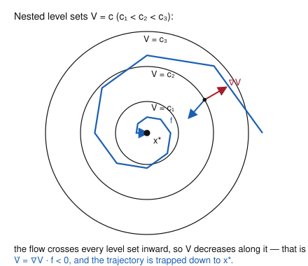

# Dynamical Systems & Chaos · Lesson 2.2: Lyapunov functions and stability

> ⏱ ~15 min · Module 2: Limit cycles and the constraints of the plane · Builds on: [Lesson 1.4](01-04-linearization-hartman-grobman.md), [Lesson 2.1](02-01-conservative-reversible-systems.md) · Unlocks: [Lesson 2.3](02-03-limit-cycles.md)

## Why this matters

Linearization (Lesson 1.4) is a fair-weather friend: when the Jacobian's eigenvalues sit off the imaginary axis it tells you everything, but at a **center** ($\pm i\omega$) or a **zero eigenvalue** it goes silent — Hartman–Grobman doesn't apply, and the nonlinear terms you threw away are exactly the ones that decide the fate of the fixed point. Lyapunov's method is the all-weather tool: build a scalar "energy" that the flow can only spend, never earn, and stability follows without ever solving the system or even trusting the linearization. It is how you prove a damped pendulum settles, how `grad-micro` shows Walrasian price adjustment converges to equilibrium, and how control engineers certify that an aircraft's autopilot won't diverge.

## The idea

Picture a ball rolling in a bowl. Define $V$ = its height. Two facts, and only two, make the bottom of the bowl stable: height is **lowest at the bottom and positive everywhere else** (the bowl really is a bowl), and height **never increases as the ball moves** (there's no anti-gravity feeding it energy). You don't need the ball's trajectory, its speed, or a solution to any equation of motion — those two facts alone pin the ball near the bottom forever. Add a whisper of friction so height *strictly* decreases whenever the ball moves, and it must drain all the way to the bottom.

That's the whole method. A **Lyapunov function** $V(\mathbf x)$ is a made-up "height" — an energy-like bowl centered on the fixed point — and you check its rate of change *along the flow*. If $V$ can't increase, the fixed point is stable; if $V$ strictly decreases, the fixed point pulls everything nearby into it. The genius is that $V$ is *yours to invent*: it need not be the physical energy, and there's no algorithm for finding it — but when you do, it settles a question the linearization couldn't touch.

The one moving part is how to compute "the rate of change of $V$ as you ride the flow" without solving for the trajectory. That's the chain rule, and it's the next section.

## The formal version

Work with a system $\dot{\mathbf x} = \mathbf f(\mathbf x)$ on the plane with a fixed point at $\mathbf x^*$ (translate coordinates so $\mathbf x^* = \mathbf 0$). Let $V(\mathbf x)$ be a continuously differentiable scalar function defined on a neighborhood of $\mathbf 0$.

**The rate of change along the flow.** The key quantity is $\dot V$, how $V$ changes as you follow a trajectory. By the chain rule, without knowing the trajectory itself,
$$\dot V \;=\; \frac{d}{dt}\,V(\mathbf x(t)) \;=\; \nabla V \cdot \dot{\mathbf x} \;=\; \nabla V \cdot \mathbf f(\mathbf x) \;=\; \frac{\partial V}{\partial x}\,f_1 + \frac{\partial V}{\partial y}\,f_2.$$

*In words:* to get $\dot V$ you just dot the gradient of $V$ with the vector field — no solving required, which is the whole trick. Geometrically, $\nabla V$ points "uphill" perpendicular to the level set $V=c$; $\dot V<0$ means the flow $\mathbf f$ has a downhill component, so it crosses that level set inward.

**Definition (Lyapunov function).** $V$ is a **Lyapunov function** for the fixed point $\mathbf 0$ if, on some neighborhood,
$$V(\mathbf 0) = 0, \qquad V(\mathbf x) > 0 \ \text{ for } \mathbf x \neq \mathbf 0 \qquad (\textbf{positive definite}),$$
$$\text{and}\qquad \dot V(\mathbf x) \le 0 \quad \text{everywhere in the neighborhood}.$$

*In words:* $V$ is a genuine bowl with its bottom exactly at the fixed point, and the flow never climbs it.

**Lyapunov's direct method (the theorem).** Suppose such a $V$ exists. Then:

- $\dot V \le 0$ on the neighborhood $\;\Longrightarrow\;$ $\mathbf 0$ is **(Lyapunov) stable**: trajectories that start near $\mathbf 0$ stay near it.
- $\dot V < 0$ for all $\mathbf x \neq \mathbf 0$ (**negative definite**) $\;\Longrightarrow\;$ $\mathbf 0$ is **asymptotically stable**: trajectories that start near $\mathbf 0$ actually converge to it.

*In words:* can't-go-up means it can't escape (stable); must-go-down means it must drain to the bottom (asymptotically stable). "Direct" because you never integrate the equations — you read stability straight off the sign of one derivative.

*Why it works — the argument in one breath.* Fix a small level $c>0$ and consider the sublevel set $\{V \le c\}$. Because $\dot V \le 0$, once a trajectory is inside it can never make $V$ climb back above $c$, so it can never cross out — the sublevel set is a **trap**. Shrinking $c$ traps trajectories in ever-smaller neighborhoods of $\mathbf 0$: that is stability. If moreover $\dot V<0$ off the origin, $V$ is strictly decreasing and bounded below by $0$, so $V(\mathbf x(t))$ must fall to a limit; that limit can only be $0$ (anywhere else $\dot V<0$ would keep pushing it down), and $V=0$ only at $\mathbf 0$ — so the trajectory converges to $\mathbf 0$. $\blacksquare$

**Why this rescues the non-hyperbolic cases.** When the Jacobian at $\mathbf 0$ has eigenvalues on the imaginary axis — a center, or a zero eigenvalue — the fixed point is **non-hyperbolic** and Hartman–Grobman (Lesson 1.4) gives no verdict: the linear picture is a ring of closed orbits (a center) that the discarded nonlinear terms can bend either inward (stable) or outward (unstable). Lyapunov's method never linearizes, so it sees through this: $\dot V = \nabla V \cdot \mathbf f$ keeps the *full* nonlinear $\mathbf f$, and its sign delivers the verdict the eigenvalues withheld.

**Basins of attraction from sublevel sets.** The trapping argument gives more than a yes/no. If $V$ is positive definite and $\dot V<0$ on the whole region $\{V < c\}$ (with $\{V \le c\}$ bounded and containing no other fixed point), then that *entire sublevel set* funnels into $\mathbf 0$ — it is a certified piece of the **basin of attraction**, the set of initial conditions that eventually reach $\mathbf 0$. The largest such $c$ your $V$ supports is a rigorous under-estimate of the basin. Linearization can never do this: it only ever speaks about an infinitesimal neighborhood.

**The art.** There is no algorithm. The reliable opening move is a **quadratic form** $V = ax^2 + bxy + cy^2$ (positive definite when $a>0$ and $b^2 < 4ac$); the plain **$V = x^2 + y^2$** works astonishingly often, especially when the fixed point looks like a center. If $\dot V$ won't come out sign-definite, reach for a weighted $V=ax^2+cy^2$, or the system's physical energy, or (for a mechanical system) kinetic-plus-potential. A failed $V$ proves nothing — it just means try another.

## Picture

The circles are level sets $V=c$; the fixed point $\mathbf x^*$ sits at their common center. At the marked point, $\nabla V$ (red) points radially *outward*, normal to the level set, while the flow $\mathbf f$ (blue) points *inward*: their dot product $\dot V = \nabla V\cdot\mathbf f$ is negative, so the trajectory pierces every level set inward and spirals down to $\mathbf x^*$. Strict inward-crossing everywhere is exactly asymptotic stability.

## Worked examples

**Example 1 (mechanical — a quadratic $V$ certifies a stable spiral).** Take the linear system $\dot x = -x + y,\ \dot y = -x - y$ and try $V = x^2 + y^2$. It's positive definite with $V(\mathbf 0)=0$. Along the flow,
$$\dot V = 2x\dot x + 2y\dot y = 2x(-x+y) + 2y(-x-y) = -2x^2 + 2xy - 2xy - 2y^2 = -2(x^2+y^2) < 0$$
for all $(x,y)\ne\mathbf 0$. Negative definite $\Rightarrow$ the origin is asymptotically stable. (Here $\dot V = -2V$, so $V(t)=V(0)e^{-2t}$: the "energy" decays exponentially, and you never solved the system.) This one the linearization could also settle — eigenvalues $-1\pm i$ — but it warms up the machinery for the case where it can't.

**Example 2 (the payoff — proving asymptotic stability when the Jacobian shows a center).** Consider
$$\dot x = -y - x^3, \qquad \dot y = x - y^3.$$
The only fixed point is the origin. Linearize: the Jacobian is
$$J = \begin{pmatrix} -3x^2 & -1 \\[2pt] 1 & -3y^2 \end{pmatrix}, \qquad J(\mathbf 0) = \begin{pmatrix} 0 & -1 \\ 1 & 0 \end{pmatrix},$$
with $\operatorname{tr} J(\mathbf 0)=0$, $\det J(\mathbf 0)=1$, hence eigenvalues $\pm i$ — a **center**. The origin is non-hyperbolic; Hartman–Grobman is silent, and the linear picture (closed circular orbits) tells us *nothing* about the true stability. The cubic terms decide it — but which way?

Try $V = x^2 + y^2$ (positive definite, $V(\mathbf 0)=0$). Along the flow,
$$\dot V = 2x\dot x + 2y\dot y = 2x(-y - x^3) + 2y(x - y^3) = \underbrace{-2xy + 2xy}_{0} - 2x^4 - 2y^4 = -2(x^4 + y^4).$$
The rotational terms $-2xy$ and $+2xy$ cancel exactly — that's the linear "center" doing no work on $V$ — and the cubic terms leave $\dot V = -2(x^4+y^4) < 0$ for every $(x,y)\ne\mathbf 0$. Negative definite, so **the origin is asymptotically stable.** In fact $V$ is *radially unbounded* ($V\to\infty$ as $\|\mathbf x\|\to\infty$) and $\dot V<0$ on the whole plane, so the basin of attraction is *all of $\mathbb R^2$* — global asymptotic stability. The center that linearization saw was an illusion; the cubes bleed energy and spiral everything inward, precisely the picture above.

## Watch out

- **You might think** $\dot V \le 0$ gives asymptotic stability — **but** it only gives stability (no escape). Convergence needs *strict* $\dot V < 0$ off the fixed point. A conserved system has $\dot V \equiv 0$: its orbits circle forever at constant $V$, stable but never converging (that's Problem 2, and the world of Lesson 2.1).
- **You might think** failing to find a working $V$ proves instability — **but** it proves nothing at all. Lyapunov's theorem is one-directional: a good $V$ certifies stability; the *absence* of one is just your failure of imagination. Try another $V$ before concluding anything.
- **You might think** $\dot V$ needs the solution $\mathbf x(t)$ — **but** the chain rule $\dot V = \nabla V\cdot \mathbf f$ evaluates it purely from $V$ and the vector field. Never integrate; just differentiate and dot.
- **You might think** any bowl-shaped $V$ works — **but** $V$ must be positive definite *about the fixed point in question*. $V=x^2+y^2$ is a bowl around the origin, not around a fixed point sitting at $(2,0)$; recenter first.

## One-liner

> Invent an energy that the flow can only spend — if it can't rise, the fixed point is stable; if it must fall, everything nearby drains into it, no linearization and no solving required.

## Problems

**P1 (🟢)** For $\dot x = -x + y,\ \dot y = -x - y^3$, use $V = x^2 + y^2$ to classify the origin. Compute $\dot V$, check its sign, and state the strongest stability conclusion Lyapunov's method supports.

**P2 (🟡)** The undamped pendulum is $\dot x = y,\ \dot y = -\sin x$ (here $x$ is the angle, $y$ the angular velocity). (a) Show the Jacobian at the origin is a center, so linearization is inconclusive. (b) Using the energy $V = \tfrac12 y^2 + (1-\cos x)$, show $V$ is positive definite near the origin and compute $\dot V$. (c) What is the strongest conclusion — stable, or asymptotically stable? Explain the difference physically.

**P3 (🔴, optional — a basin from a sublevel set)** Consider the radial system $\dot x = -x + x(x^2+y^2),\ \dot y = -y + y(x^2+y^2)$, i.e. $\dot{\mathbf x} = -(1 - r^2)\,\mathbf x$ with $r^2 = x^2+y^2$. With $V = x^2 + y^2$: (a) compute $\dot V$ in terms of $V$. (b) On which region is $\dot V < 0$? (c) Conclude that the origin is asymptotically stable and that the **open unit disk** $\{x^2+y^2 < 1\}$ lies in its basin of attraction. (d) What happens to a trajectory started at $r > 1$?

Solutions

**P1** $V = x^2+y^2$ is positive definite with $V(\mathbf 0)=0$. Along the flow,
$$\dot V = 2x\dot x + 2y\dot y = 2x(-x+y) + 2y(-x - y^3) = -2x^2 + 2xy - 2xy - 2y^4 = -2x^2 - 2y^4.$$
The cross terms $+2xy$ and $-2xy$ cancel. Now $-2x^2 - 2y^4 = 0$ only when $x=0$ *and* $y=0$; everywhere else it is strictly negative (if $x=0,\,y\neq0$ it's $-2y^4<0$; if $y=0,\,x\neq0$ it's $-2x^2<0$). So $\dot V$ is **negative definite**, and the origin is **asymptotically stable**. ($V$ is radially unbounded and $\dot V<0$ on all of $\mathbb R^2$, so in fact globally asymptotically stable.)

**P2** (a) $\mathbf f = (y,\,-\sin x)$, so
$$J = \begin{pmatrix} 0 & 1 \\ -\cos x & 0 \end{pmatrix}, \qquad J(\mathbf 0) = \begin{pmatrix} 0 & 1 \\ -1 & 0 \end{pmatrix},$$
with $\operatorname{tr}=0$, $\det=1$, eigenvalues $\pm i$ — a center, hence non-hyperbolic and inconclusive by Hartman–Grobman.

(b) $V = \tfrac12 y^2 + (1-\cos x)$. Clearly $V(\mathbf 0)=0$. Near the origin $1-\cos x = \tfrac12 x^2 - \tfrac1{24}x^4+\cdots > 0$ for $0<|x|<2\pi$, and $\tfrac12 y^2 \ge 0$ with equality only at $y=0$; so $V>0$ for $(x,y)\neq\mathbf 0$ in the strip $|x|<2\pi$ — positive definite. Along the flow,
$$\dot V = \frac{\partial V}{\partial x}\dot x + \frac{\partial V}{\partial y}\dot y = (\sin x)(y) + (y)(-\sin x) = 0.$$

(c) $\dot V \equiv 0$: the energy is exactly conserved, so we get **Lyapunov stability but not asymptotic stability**. Physically, a frictionless pendulum nudged from the bottom swings back and forth forever along a closed orbit $V=\text{const}$ — it stays near the bottom (stable) but never settles there (not asymptotic). Only adding damping (a $-\dot V$ friction term) would make $\dot V<0$ and pull it to rest. This is the conserved-system world of [Lesson 2.1](02-01-conservative-reversible-systems.md); the same energy is the Hamiltonian of the pendulum in [analytical-mechanics](../../analytical-mechanics/syllabus.md).

**P3** (a) $V=x^2+y^2=r^2$, and $\dot{\mathbf x} = -(1-r^2)\mathbf x$ means $\dot x = -(1-r^2)x,\ \dot y=-(1-r^2)y$. So
$$\dot V = 2x\dot x + 2y\dot y = -2(1-r^2)(x^2+y^2) = -2(1-r^2)\,r^2 = -2V(1-V).$$
(b) $\dot V = -2V(1-V)<0$ exactly when $0 < V < 1$, i.e. on the punctured open unit disk $0<r<1$. (On $r>1$, $\dot V>0$.)

(c) On $0<r<1$, $V$ is positive definite and $\dot V<0$, so by Lyapunov's method the origin is **asymptotically stable**. Every sublevel set $\{V \le c\}$ with $c<1$ is a bounded trap (once inside, $\dot V<0$ keeps $V$ falling, so the trajectory can't cross out) containing no fixed point but the origin, so it funnels into $\mathbf 0$. Taking the union over all $c<1$, the entire **open unit disk** $\{r<1\}$ lies in the basin of attraction. (Note the linearization here is $J(\mathbf 0)=-I$, a stable node — it confirms asymptotic stability but says *nothing* about how big the basin is. Only the Lyapunov sublevel sets deliver the disk.)

(d) For $r>1$, $\dot V = -2V(1-V) > 0$: $V=r^2$ *increases*, so the trajectory spirals *outward* and diverges — the unit circle $r=1$ (a circle of fixed points, since $\dot{\mathbf x}=0$ there) is the exact boundary of the basin.

## Flashback

**From [Lesson 1.4](01-04-linearization-hartman-grobman.md) (linearization and its limits):** For the system $\dot x = x^2,\ \dot y = -y$, find every fixed point, compute the Jacobian there, classify its eigenvalues, and explain why the linearization *cannot* determine the stability of the origin. What does the true stability turn out to be?

Solution

Fixed points: $\dot x = x^2 = 0 \Rightarrow x=0$ and $\dot y = -y=0 \Rightarrow y=0$; the origin is the only one. The Jacobian is
$$J = \begin{pmatrix} 2x & 0 \\ 0 & -1 \end{pmatrix}, \qquad J(\mathbf 0) = \begin{pmatrix} 0 & 0 \\ 0 & -1 \end{pmatrix},$$
with eigenvalues $0$ and $-1$. One eigenvalue is **zero**, so the origin is **non-hyperbolic** and Hartman–Grobman does not apply — the linearization $\dot x = 0$ predicts the $x$-coordinate neither grows nor decays, punting the decision entirely to the discarded nonlinear term.

The truth comes from that term. The $x$-equation $\dot x = x^2 \ge 0$ is a 1-D flow (Lesson 1.1): $x$ always increases. For $x<0$ it climbs toward $0$ (attracting from the left), but for $x>0$ it runs off to $+\infty$ (repelling to the right) — a **semi-stable** fixed point. Since arbitrarily small positive $x$ escapes, the origin is **unstable**. The stable $y$-direction can't save it: instability in even one direction is instability. Linearization saw a harmless zero eigenvalue; the quadratic term made it unstable — exactly the non-hyperbolic blind spot Lyapunov's method (and honest nonlinear reasoning) is built to cover.

## Connections

- **Backward:** this is the rescue for [Lesson 1.4](01-04-linearization-hartman-grobman.md)'s non-hyperbolic cases — centers and zero eigenvalues where the Jacobian abstains. And a conserved quantity from [Lesson 2.1](02-01-conservative-reversible-systems.md) is a *ready-made* Lyapunov function with $\dot V=0$: conservation gives stability for free, damping upgrades it to asymptotic (Problem 2).
- **Forward:** [Lesson 2.3](02-03-limit-cycles.md) turns the sign of $\dot V$ into a positive tool — a region where energy is pumped *in* near a fixed point but bled *out* far away traps trajectories onto a self-sustained oscillation (a limit cycle), the trapping-region idea that [Lesson 2.4](02-04-poincare-bendixson.md) makes into the Poincaré–Bendixson theorem.
- **Sideways (economics):** [grad-micro](../../grad-micro/syllabus.md)'s question of whether Walrasian *tâtonnement* price adjustment converges to equilibrium is a Lyapunov problem — the excess-demand system admits an energy-like function that decreases toward the market-clearing price, the exact same $\dot V<0$ argument dressed in prices instead of positions.
- **Sideways (mechanics):** in [analytical-mechanics](../../analytical-mechanics/syllabus.md), total energy $E$ = kinetic + potential is the canonical Lyapunov function; a potential-energy *minimum* is a stable equilibrium precisely because $E$ is positive definite there and (with damping) non-increasing — Lyapunov's method is the rigorous form of "systems roll downhill to the bottom of the potential well."
