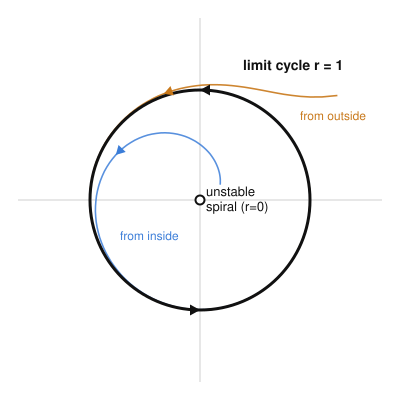

# Dynamical Systems & Chaos · Lesson 2.3: Limit cycles

> ⏱ ~15 min · Module 2: Limit cycles and the constraints of the plane · Builds on: [Lesson 2.1](02-01-conservative-reversible-systems.md) (conservative systems and centers) · Unlocks: [Lesson 2.4](02-04-poincare-bendixson.md) (proving cycles exist)

## Why this matters

A heartbeat, a firing neuron, the current in a laser, a pendulum clock's escapement, the predator–prey cycle that won't die out — these all *oscillate on their own*, at an amplitude they choose for themselves. Knock them and they return to the same rhythm. That is not what a frictionless pendulum does: its amplitude is set forever by how hard you first pushed it. The object that captures self-chosen, self-restoring oscillation is the **limit cycle**, and it is the first genuinely nonlinear phenomenon in this course — no linear system has one.

## The idea

In [Lesson 2.1](02-01-conservative-reversible-systems.md) you met a **center**: a fixed point surrounded by a *continuum* of closed orbits, like the concentric ovals of an undamped pendulum. Every amplitude is allowed, and each is neutrally stable — nudge the orbit and it just sits on a neighboring one forever. That fragility is the giveaway that centers come from conservation, not from any pull toward a preferred motion.

A **limit cycle** is the opposite temperament. It is a *single, isolated* closed orbit: no closed orbits crowd right next to it. Because it is isolated, nearby trajectories have nowhere to sit — they must either spiral *toward* it or *away* from it. When they spiral toward it, the cycle is an **attractor** for oscillations: start anywhere nearby, at any amplitude, and you converge onto the *same* loop, the same period, the same amplitude. The oscillation is "self-sustained" — the system manufactures and regulates it, independent of the initial kick.

"Isolated" is the whole point. A center gives you a wall of orbits; a limit cycle gives you exactly one, standing alone with spirals on both sides.

## The formal version

**Definition (limit cycle).** A **limit cycle** is an isolated closed orbit of a system $\dot{\mathbf x} = \mathbf f(\mathbf x)$ — a periodic trajectory $\mathbf x(t+T)=\mathbf x(t)$ such that some neighborhood of it contains *no other* closed orbit.

*In words:* a lone loop, with a ring of breathing room around it that holds no rival loops.

Classify it by what the neighbors do:

- **Stable (attracting):** all nearby trajectories, inside and out, spiral *toward* the cycle as $t\to\infty$. This is the self-sustained oscillator.
- **Unstable (repelling):** all nearby trajectories spiral *away* as $t\to\infty$ (equivalently, toward it as $t\to-\infty$).
- **Semi-stable:** attracting from one side, repelling from the other.

*In words:* stable = both sides fall in; unstable = both sides fly out; semi-stable = one of each.

**The clean prototype.** Work in polar coordinates $(r,\theta)$, and take
$$\dot r = r\,(1-r^2), \qquad \dot\theta = 1.$$
The two equations *decouple*: the angle just winds at constant rate ($\theta$ increases forever), while the radius obeys a 1-D flow you can read with Lesson 1.1's phase line. Radial fixed points solve $r(1-r^2)=0$, giving $r=0$ (the origin) and $r=1$. For $0<r<1$, $\dot r=r(1-r^2)>0$, so $r$ grows toward $1$; for $r>1$, $\dot r<0$, so $r$ shrinks toward $1$. The circle $r=1$ is therefore an isolated closed orbit that attracts from both sides — a **stable limit cycle** — while the origin is an unstable spiral (it repels).

To *prove* the stability rather than eyeball it, linearize the radial equation at $r^*=1$. With $g(r)=r-r^3$, $g'(r)=1-3r^2$, so $g'(1)=1-3=-2<0$. A negative slope on the phase line means $r=1$ is an attracting radial fixed point (Lesson 1.1) — hence a stable cycle, with perturbations decaying like $e^{-2t}$.

## Picture

The black loop is the cycle $r=1$. The orange trajectory starts outside and spirals inward; the blue one starts near the repelling origin and spirals outward. Both wind counterclockwise (since $\dot\theta=1>0$) and both asymptote to the *same* circle — the amplitude the system insists on, no matter where you begin.

## Worked examples

**Example 1 (mechanical — read a cycle off a polar system).** Analyze
$$\dot r = r\,(4-r^2), \qquad \dot\theta = -1.$$
Radial fixed points: $r(4-r^2)=0 \Rightarrow r=0$ or $r=2$. For $0<r<2$, $4-r^2>0$ so $\dot r>0$ ($r$ climbs to $2$); for $r>2$, $\dot r<0$ ($r$ falls to $2$). So $r=2$ is a **stable limit cycle**. Its period comes from the angle: $\dot\theta=-1$ means $\theta$ decreases at unit rate (clockwise motion), so one lap takes $T=2\pi/|\dot\theta| = 2\pi$. Stability check: $g(r)=4r-r^3$, $g'(2)=4-3(4)=-8<0$ ✓ (attracting, decay rate $8$).

**Example 2 (why you'd care — the van der Pol oscillator).** The physical archetype is
$$\ddot x - \mu\,(1-x^2)\,\dot x + x = 0, \qquad \mu>0,$$
a model of a vacuum-tube circuit (and later of neurons and heartbeats). Read the middle term as a *state-dependent damping* coefficient $-\mu(1-x^2)$:

- When $|x|<1$ (small swings), $1-x^2>0$, so the damping is **negative** — the system pumps energy *in* and amplitudes grow.
- When $|x|>1$ (large swings), $1-x^2<0$, so the damping is **positive** — energy is bled *out* and amplitudes shrink.

Small oscillations get amplified, large ones get damped; the tug-of-war balances at exactly one amplitude in between. The result is a single **stable limit cycle** — the same rhythm regardless of how the circuit started. This is self-sustained oscillation made physical, and it is impossible for any *linear* damped oscillator, where damping has one fixed sign and every motion either decays to rest or blows up.

## Watch out

- **You might think** a closed orbit and a limit cycle are the same thing — **but** a limit cycle must be *isolated*. The concentric orbits around a conservative center (Lesson 2.1) are closed but *not* limit cycles: each has closed orbits arbitrarily close on both sides. Conservative/Hamiltonian systems and linear centers have **no** limit cycles at all.
- **You might think** "stable cycle" means trajectories rush straight onto the loop — **but** they *spiral*, approaching asymptotically as $t\to\infty$ without ever exactly landing in finite time (just as a 1-D trajectory nears a stable fixed point but never reaches it).
- **You might think** stability of a cycle is about the origin's stability — **but** they are independent. In the prototype the origin is *unstable* (repelling) while the cycle is *stable*; the instability inside is exactly what feeds trajectories outward onto the loop.
- **Amplitude is emergent, not chosen.** With a center you dial the amplitude by your initial condition; with a stable limit cycle the *system* dictates it, and your initial condition only sets the phase.

## One-liner

> A limit cycle is a lone closed orbit that the flow spirals onto — self-sustained oscillation whose amplitude the system picks for itself, something no linear system and no conservative center can do.

## Problems

**P1 (🟢)** For $\dot r = r(3-r^2)$, $\dot\theta = 2$: find every limit cycle, give its radius and stability (justify with the sign of $\dot r$ on each side, or by linearizing), and state the period of motion along the cycle.

**P2 (🟡)** Consider $\dot r = r\,(1-r)^2$, $\dot\theta = 1$ (note the *squared* factor). Show that $r=1$ is a limit cycle and determine its type (stable / unstable / semi-stable). *Hint: what is the sign of $\dot r$ just inside vs. just outside $r=1$? Why doesn't linearizing at $r=1$ settle it?*

**P3 (🔴, optional — van der Pol's engine room)** Write van der Pol $\ddot x - \mu(1-x^2)\dot x + x = 0$ as a first-order system with $y=\dot x$. Show the only fixed point is the origin, compute the Jacobian there, and classify it via trace and determinant (Lesson 1.3). For which $\mu>0$ is the origin an *unstable spiral*? Explain in one line how this supports the existence of an attracting limit cycle.

Solutions

**P1** Set $\dot r = r(3-r^2)=0$: radial fixed points $r=0$ and $r=\sqrt3$ (discard the negative root; $r\ge0$). For $0<r<\sqrt3$, $3-r^2>0\Rightarrow\dot r>0$ ($r$ increases toward $\sqrt3$); for $r>\sqrt3$, $\dot r<0$ ($r$ decreases toward $\sqrt3$). So there is one limit cycle at $r=\sqrt3$, and it is **stable** (attracts from both sides). Linearization check: $g(r)=3r-r^3$, $g'(r)=3-3r^2$, $g'(\sqrt3)=3-9=-6<0$ ✓. The origin is an unstable spiral. Period: $\dot\theta=2$, so $T = 2\pi/2 = \pi$.

**P2** Fixed points of $\dot r = r(1-r)^2$: $r=0$ and $r=1$ (a double root). Signs: for $0<r<1$, both $r>0$ and $(1-r)^2>0$, so $\dot r>0$ — trajectories inside spiral *outward toward* $r=1$ (attracted). For $r>1$, still $r>0$ and $(1-r)^2>0$, so $\dot r>0$ again — trajectories outside move *away* from $r=1$ (increasing $r$, repelled). Attracting from inside, repelling from outside: $r=1$ is a **semi-stable** limit cycle. Linearizing fails to reveal this because $g(r)=r(1-r)^2$ has $g'(1)=0$ (the fixed point is degenerate, a double root), so the linear test is inconclusive — you must use the *sign of $\dot r$ on each side*, exactly the non-hyperbolic situation Lesson 1.1 warns about.

**P3** Let $y=\dot x$. Then
$$\dot x = y, \qquad \dot y = \mu(1-x^2)\,y - x.$$
Fixed points need $\dot x=\dot y=0$: $y=0$ from the first equation, and then $\dot y = -x = 0 \Rightarrow x=0$. So the origin is the *only* fixed point. Jacobian:
$$J(x,y)=\begin{pmatrix} \dfrac{\partial \dot x}{\partial x} & \dfrac{\partial \dot x}{\partial y}\\[4pt] \dfrac{\partial \dot y}{\partial x} & \dfrac{\partial \dot y}{\partial y}\end{pmatrix}=\begin{pmatrix} 0 & 1\\ -2\mu x y - 1 & \mu(1-x^2)\end{pmatrix}.$$
At the origin,
$$J(0,0)=\begin{pmatrix} 0 & 1\\ -1 & \mu\end{pmatrix},\qquad \tau=\operatorname{tr}J=\mu,\quad \Delta=\det J = (0)(\mu)-(1)(-1)=1.$$
Since $\Delta=1>0$ and $\tau=\mu>0$, the origin is an unstable point; it is a **spiral** precisely when $\tau^2-4\Delta<0$, i.e. $\mu^2-4<0$, so **$0<\mu<2$** gives an unstable spiral (eigenvalues $\tfrac{\mu}{2}\pm i\sqrt{1-\mu^2/4}$, positive real part). Interpretation: trajectories are pushed *outward* from the origin, yet for large $|x|$ the damping is positive and pulls them back in — so they are trapped in an annulus with no fixed point, and must wind onto an attracting limit cycle in between. (That trapping argument is Poincaré–Bendixson, [Lesson 2.4](02-04-poincare-bendixson.md).)

## Flashback

**From [Lesson 1.3](01-03-trace-determinant-classification.md) (trace–determinant classification):** Classify the fixed point at the origin of $\dot{\mathbf x}=A\mathbf x$ for
$$A=\begin{pmatrix} 1 & -2\\ 2 & 1\end{pmatrix}.$$
Give the type (node / saddle / spiral / center) and its stability, using $\tau$, $\Delta$, and the eigenvalues.

Solution

Trace $\tau = 1+1 = 2$; determinant $\Delta = (1)(1)-(-2)(2) = 1+4 = 5$. Discriminant $\tau^2-4\Delta = 4-20 = -16 < 0$, so the eigenvalues are complex — a **spiral**. Since $\tau=2>0$ (equivalently $\Re\lambda>0$), it is an **unstable spiral**. Explicitly, $\lambda = \tfrac{\tau\pm\sqrt{\tau^2-4\Delta}}{2} = \tfrac{2\pm 4i}{2} = 1\pm 2i$: positive real part confirms outward spiraling. This is exactly the linearized picture at the van der Pol origin in P3 — an unstable spiral inside is what launches trajectories toward a surrounding limit cycle.

## Connections

- **Backward:** The stability test for the cycle is nothing new — decoupling into $(r,\theta)$ turned it into a 1-D phase-line problem (Lesson 1.1), and the contrast throughout is against the fragile, non-isolated **center** of [Lesson 2.1](02-01-conservative-reversible-systems.md). Conservative systems can't host limit cycles.
- **Forward:** We asserted the van der Pol cycle exists; [Lesson 2.4](02-04-poincare-bendixson.md) makes it rigorous with the Poincaré–Bendixson theorem (trap the flow in an annulus with no fixed points) and gives the Bendixson–Dulac criterion for ruling cycles *out*. In Module 3, [Lesson 3.3](03-03-hopf-bifurcation.md) shows how a stable cycle is *born* from a fixed point as a parameter crosses a threshold (the Hopf bifurcation) — the prototype here is exactly its normal form.
- **Sideways (physics):** Self-sustained oscillation is everywhere — pendulum-clock escapements, cardiac pacemaker cells, laser intensity. The van der Pol / Hopf machinery is precisely the onset of *oscillatory convection* in [`fluid-dynamics`](../../fluid-dynamics/syllabus.md), where a steady flow gives way to a periodic one. And the sharp divide between the neutral centers of Hamiltonian mechanics ([`analytical-mechanics`](../../analytical-mechanics/syllabus.md)) and the attracting cycles of dissipative systems is the same conservative-vs-dissipative line drawn here.
