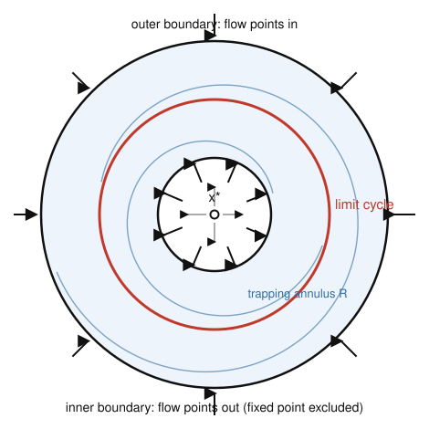

# Dynamical Systems & Chaos · Lesson 2.4: Poincaré–Bendixson and ruling out cycles

> ⏱ ~15 min · Module 2: Limit cycles and the constraints of the plane · Builds on: [Lesson 2.3](02-03-limit-cycles.md), [Lesson 2.2](02-02-lyapunov-functions.md) · Unlocks: [Lesson 2.5](02-05-index-theory.md)

## Why this matters

In [Lesson 2.3](02-03-limit-cycles.md) you learned what a limit cycle *is*. This lesson answers the harder question: given a system you **cannot solve**, how do you *prove* a self-sustained oscillation exists — or prove one can't? The Poincaré–Bendixson theorem is the tool that manufactures periodic orbits out of a purely geometric trap, and the Bendixson–Dulac criterion is its opposite number, an integral test that kills cycles outright. Along the way falls the single deepest structural fact about the plane: a continuous 2-D flow **cannot be chaotic**. That is exactly why chaos will have to wait for the third dimension in Module 4 (the Lorenz system, [Lesson 4.1](04-01-lorenz-system.md)).

## The idea

Two facts conspire to make the plane rigid. First, **trajectories can't cross** — uniqueness of ODE solutions means only one orbit passes through each point, and an orbit can't even cross itself (it would have to loop, i.e. already be periodic). Second, the **Jordan curve theorem**: a closed loop in the plane splits it cleanly into an inside and an outside. Put these together and a trajectory that stays forever inside a bounded region has almost nowhere to go. It can't wander densely, it can't cross old tracks — its only escape from claustrophobia is to *wind onto a closed loop*. That loop is a limit cycle.

So the recipe writes itself: find a region the flow can enter but never leave, poke out any fixed points, and the theorem hands you a cycle for free. The natural shape is an **annulus** — a ring — because it has a hole exactly where you bury the troublesome fixed point (a repeller pushing flow outward from the middle) while an outer wall pushes flow inward. The trajectory is pinned in the ring and must spiral onto a periodic orbit trapped there.

The converse tool is an accountant's trick. A closed orbit encloses a fixed area, and over one lap the flow neither gains nor loses that enclosed region. If the (weighted) divergence — the local rate at which the flow expands area — has a *single sign* everywhere in a region, then area is relentlessly gained (or lost) and no orbit can close up on itself. That's Bendixson–Dulac.

## The formal version

First, the object a trajectory "settles onto."

**Definition ($\omega$-limit set).** For a trajectory $\mathbf x(t)$, its $\omega$-limit set is every point $\mathbf p$ that the trajectory returns arbitrarily close to as $t \to \infty$: there are times $t_n \to \infty$ with $\mathbf x(t_n) \to \mathbf p$.

*In words:* the $\omega$-limit set is the trajectory's long-run destination — a fixed point, a closed orbit, or (only in 3-D and up) something stranger.

**Poincaré–Bendixson theorem.** Let $\dot{\mathbf x} = \mathbf f(\mathbf x)$ be a smooth flow in the plane. Suppose a trajectory is confined to a closed, bounded region $R$ for all $t \ge t_0$, and $R$ contains **no fixed points**. Then the $\omega$-limit set of that trajectory is a **closed orbit** — either the trajectory *is* a periodic orbit, or it spirals toward one.

*In words:* a planar trajectory trapped in a bounded, fixed-point-free region has no choice but to become, or approach, a limit cycle.

**Trapping-region method (the working version).** If $R$ is a closed **annulus** such that (i) the vector field points *strictly into* $R$ across both its inner and outer boundaries, and (ii) $R$ contains no fixed points, then $R$ contains at least one closed orbit.

*In words:* build a ring the flow flows into from both sides, with no equilibrium inside, and a limit cycle is guaranteed to live in it.

**Why this is special to the plane.** The proof rides on trajectories not crossing plus the Jordan curve theorem, so a trapped orbit is forced to be *monotone* — each crossing of a cross-section marches steadily in one direction and converges. In three dimensions a trajectory can dodge its own past by lifting out of the plane, wandering forever in a bounded box without ever repeating. **Hence a 2-D continuous flow admits no chaos** — the most it can do is approach fixed points or cycles.

**Bendixson–Dulac negative criterion.** Write $\mathbf f = (f, g)$ for $\dot x = f(x,y),\ \dot y = g(x,y)$. Let $D$ be a **simply connected** region (no holes). If there is a smooth function $\varphi(x,y)$ — a *Dulac function* — such that
$$\nabla \cdot (\varphi\,\mathbf f) \;=\; \frac{\partial(\varphi f)}{\partial x} + \frac{\partial(\varphi g)}{\partial y}$$
has **one sign** throughout $D$ (and is not identically zero on any open subset), then $D$ contains **no closed orbit**.

*In words:* if a single-signed divergence can be arranged, no periodic orbit can fit inside the region. Taking $\varphi \equiv 1$ recovers the plain **Bendixson criterion**: if $\partial f/\partial x + \partial g/\partial y$ never changes sign, there are no cycles.

*Why it's true.* Suppose a closed orbit $C$ did lie in $D$, bounding the area $A$ it encloses. Green's theorem (the divergence form) gives
$$\iint_A \nabla\cdot(\varphi\,\mathbf f)\,dA \;=\; \oint_C \varphi\,\mathbf f \cdot \mathbf n\; d\ell,$$
where $\mathbf n$ is the outward normal to $C$. But on the orbit the velocity $\mathbf f$ is **tangent** to $C$, so $\mathbf f \cdot \mathbf n = 0$ and the right side is $0$. The left side, meanwhile, is the integral of a single-signed, not-everywhere-zero function — strictly nonzero. Contradiction, so no such $C$ exists. $\blacksquare$

## Picture

A trapping annulus. The flow crosses **into** the ring from both walls — inward across the outer circle, outward across the inner circle (which fences off the repelling fixed point $x^*$ in the hole). With no equilibrium inside, Poincaré–Bendixson forces a closed orbit (red) to live in the band; nearby trajectories (blue) spiral onto it.

## Worked examples

**Example 1 (mechanical — rule cycles out with Bendixson).** Show that
$$\dot x = y - x^3, \qquad \dot y = -x - y^3$$
has no closed orbits anywhere in the plane.

Take $\varphi \equiv 1$. The divergence is
$$\frac{\partial}{\partial x}(y - x^3) + \frac{\partial}{\partial y}(-x - y^3) = -3x^2 - 3y^2 = -3(x^2 + y^2).$$
This is $\le 0$ everywhere and strictly negative off the origin — one sign, not identically zero on any open set. The whole plane is simply connected, so by Bendixson there are **no periodic orbits**. (Sanity check on the intuition: the divergence is the rate of area change, and here every patch of phase space is *shrinking* — a swept-out loop could never return to enclose the same area.)

**Example 2 (why you'd care — prove a cycle exists by trapping it).** Consider a system you cannot solve in closed form,
$$\dot r = r\big(1 - r^2\big) + \tfrac{1}{2}\,r\cos\theta, \qquad \dot\theta = 1,$$
in polar coordinates $(r,\theta)$. Prove it has a limit cycle.

The angular equation $\dot\theta = 1 \ne 0$ tells us the flow circulates forever and — crucially — there are **no fixed points** except the origin (where polar coordinates degenerate). Now we hunt for two circles that trap the flow. Factor the radial equation:
$$\dot r = r\big[(1 - r^2) + \tfrac12\cos\theta\big].$$
Since $\cos\theta \in [-1, 1]$, the bracket is squeezed between $(1 - r^2) - \tfrac12$ and $(1 - r^2) + \tfrac12$ for every angle.

- **Inner circle $r = \tfrac12$:** the bracket is at least $(1 - \tfrac14) - \tfrac12 = \tfrac14 > 0$, so $\dot r > 0$ for *all* $\theta$ — the flow points strictly **outward**, into the ring.
- **Outer circle $r = \tfrac32$:** the bracket is at most $(1 - \tfrac94) + \tfrac12 = -\tfrac34 < 0$, so $\dot r < 0$ for all $\theta$ — the flow points strictly **inward**, into the ring.

So the annulus $\tfrac12 \le r \le \tfrac32$ is a trapping region with no fixed points inside (the origin sits in the excluded hole). By Poincaré–Bendixson, **a closed orbit lives in that annulus** — a genuine oscillation, proven without ever solving the equations. This is the whole Module-2 game: geometry, not formulas.

## Watch out

- **You might think a trapping *disk* is enough — but a fixed point inside kills the theorem.** Poincaré–Bendixson requires *no* equilibrium in $R$. If the middle of your region holds a fixed point (say an unstable spiral), you must excise it with an inner boundary, turning the disk into an annulus. Otherwise the trapped trajectory might just converge to that point instead of a cycle.
- **You might think Bendixson–Dulac can *prove* a cycle exists — it only ever rules them out.** A single-signed divergence means "no cycles." If the divergence *changes sign*, the test is silent: you've learned nothing, not "there is a cycle." And the region must be **simply connected** — the criterion fails on an annulus, which is exactly the shape where cycles like to hide.
- **You might expect the trapping trick to work in 3-D — it doesn't.** Confining a 3-D trajectory to a bounded box does *not* force it onto a cycle; it can stretch and fold forever. That escape hatch is precisely where chaos lives (Module 4). Poincaré–Bendixson is a planar privilege.
- **Finding a Dulac function $\varphi$ is a guess, not an algorithm.** Always try $\varphi \equiv 1$ first (plain Bendixson); if the divergence changes sign, common rescues are $\varphi = 1/(xy)$, $\varphi = e^{ax}$, or $\varphi = r^{-k}$ for polar systems.

## One-liner

> Trap a planar trajectory in a fixed-point-free annulus and it *must* coil onto a limit cycle; keep the divergence one-signed and no cycle can survive.

## Problems

**P1 (🟢)** Use the Bendixson criterion ($\varphi \equiv 1$) to show that
$$\dot x = -x + y - x^3, \qquad \dot y = -x - y - y^3$$
has no closed orbits in the plane.

**P2 (🟡)** For the polar system
$$\dot r = r\big(4 - r^2\big) + r\sin\theta, \qquad \dot\theta = 1,$$
show that the annulus $\tfrac32 \le r \le \tfrac52$ is a trapping region containing no fixed points, and conclude that a limit cycle exists inside it.

**P3 (🔴, optional)** A two-population model on the open first quadrant $x>0,\ y>0$ is
$$\dot x = x\,(2 - x - y), \qquad \dot y = y\,(4x - x^2 - 3).$$
Using the Dulac function $\varphi(x,y) = \dfrac{1}{xy}$, show there is no closed orbit in the first quadrant. (This bridges to `grad-micro`: the same "does the dynamics settle or oscillate?" question decides whether a market's tâtonnement price adjustment converges — see the Connections.)

Solutions

**P1** With $\varphi \equiv 1$, $f = -x + y - x^3$ and $g = -x - y - y^3$, so
$$\frac{\partial f}{\partial x} + \frac{\partial g}{\partial y} = (-1 - 3x^2) + (-1 - 3y^2) = -2 - 3x^2 - 3y^2.$$
This is $\le -2 < 0$ everywhere — strictly one sign, never zero. The plane is simply connected, so by Bendixson there are no periodic orbits. $\blacksquare$

**P2** No fixed points first: $\dot\theta = 1 \ne 0$, so the only candidate equilibrium is the origin, which the annulus $\tfrac32 \le r \le \tfrac52$ excludes. Now factor $\dot r = r\big[(4 - r^2) + \sin\theta\big]$ and use $\sin\theta \in [-1,1]$:

- At $r = \tfrac32$: $r^2 = \tfrac94$, so the bracket is at least $(4 - \tfrac94) - 1 = \tfrac{3}{4} > 0$. Hence $\dot r > 0$ for all $\theta$ — flow points outward, into the ring.
- At $r = \tfrac52$: $r^2 = \tfrac{25}{4}$, so the bracket is at most $(4 - \tfrac{25}{4}) + 1 = -\tfrac54 < 0$. Hence $\dot r < 0$ for all $\theta$ — flow points inward, into the ring.

The flow enters the annulus across both boundaries and there are no fixed points inside, so by Poincaré–Bendixson at least one closed orbit lies in $\tfrac32 \le r \le \tfrac52$. $\blacksquare$

**P3** The first quadrant $\{x>0,\ y>0\}$ is simply connected. With $\varphi = 1/(xy)$,
$$\varphi f = \frac{x(2 - x - y)}{xy} = \frac{2 - x - y}{y}, \qquad \varphi g = \frac{y(4x - x^2 - 3)}{xy} = \frac{4x - x^2 - 3}{x}.$$
Differentiate each in its own variable:
$$\frac{\partial}{\partial x}\!\left(\frac{2 - x - y}{y}\right) = \frac{-1}{y}, \qquad \frac{\partial}{\partial y}\!\left(\frac{4x - x^2 - 3}{x}\right) = 0,$$
the second because that expression contains no $y$. Therefore
$$\nabla\cdot(\varphi\,\mathbf f) = -\frac{1}{y},$$
which is **strictly negative** throughout the first quadrant ($y > 0$) — one sign, never zero. By the Bendixson–Dulac criterion there is no closed orbit in the first quadrant: the populations can approach an equilibrium or diverge, but they cannot cycle. $\blacksquare$

## Flashback

**From [Lesson 2.3](02-03-limit-cycles.md) (Limit cycles):** A polar system has radial dynamics
$$\dot r = r\,(r - 1)\,(3 - r), \qquad \dot\theta = 1.$$
Find every circular closed orbit and classify each as a stable or unstable limit cycle. What happens to a trajectory started at $r = 0.5$? At $r = 2$? At $r = 4$?

Solution

Closed orbits are the circles where $\dot r = 0$ with $r > 0$: from $r(r-1)(3-r) = 0$ these are $r = 1$ and $r = 3$ (and the origin $r = 0$, a fixed point). Classify by the sign of $f(r) = r(r-1)(3-r)$ on each side — or by $f'(r^*)$. Expanding, $f(r) = -r^3 + 4r^2 - 3r$, so $f'(r) = -3r^2 + 8r - 3$.

- **$r = 1$:** $f'(1) = -3 + 8 - 3 = 2 > 0$, so nearby trajectories move *away* — an **unstable** limit cycle. (Check the signs: $f(0.5) = 0.5(-0.5)(2.5) < 0$, $f(1.5) = 1.5(0.5)(1.5) > 0$: flow diverges from $r=1$ on both sides.)
- **$r = 3$:** $f'(3) = -27 + 24 - 3 = -6 < 0$ — a **stable** limit cycle. ($f(2.5) > 0$ pushes up toward $3$, $f(3.5) = 3.5(2.5)(-0.5) < 0$ pushes down toward $3$.)
- **$r = 0$:** for small $r > 0$, $f(r) \approx -3r < 0$, so the origin is a stable fixed point.

Trajectory fates: $r = 0.5$ lies below the unstable cycle, so it spirals **inward to the origin**. $r = 2$ lies between the two cycles, where $f > 0$, so it spirals **outward to the stable cycle $r = 3$**. $r = 4$ lies outside, where $f < 0$, so it spirals **inward to $r = 3$**. The unstable cycle at $r=1$ is the watershed between the origin's basin and the stable cycle's basin.

## Connections

- **Backward:** this completes [Lesson 2.3](02-03-limit-cycles.md)'s picture of limit cycles by supplying the *existence* proofs it lacked. The trapping-region idea is the geometric cousin of the [Lesson 2.2](02-02-lyapunov-functions.md) Lyapunov argument — both wall off a region and read the flow across its boundary; here the flow points *inward* to trap, there a Lyapunov function decreased to attract.
- **Forward:** [Lesson 2.5](02-05-index-theory.md) sharpens "no fixed points inside" into a topological count — the index of a closed orbit is $+1$, which forces at least one fixed point to sit *inside* every limit cycle (why the annulus needs its hole). And the headline "no chaos in the plane" is the negative space that makes Module 4 necessary: [Lesson 4.1](04-01-lorenz-system.md) shows the third dimension is exactly what lets trajectories stay bounded, never cross, and never close — the birth of strange attractors.
- **Sideways (economics — Walrasian tâtonnement):** in `grad-micro`, price adjustment $\dot p = f(\text{excess demand})$ is a dynamical system, and whether it *converges* to a Walrasian equilibrium versus oscillating forever is precisely a limit-cycle question. A Dulac/Bendixson argument like P3 is one way to prove prices can't cycle and must settle. The same stability-of-equilibrium machinery drives the phase portraits of `analytical-mechanics`.
