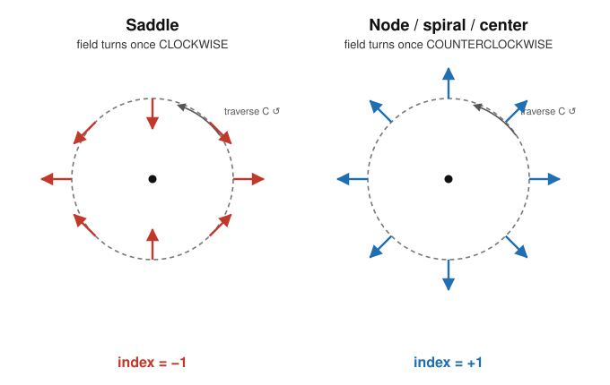

# Dynamical Systems & Chaos · Lesson 2.5: Index theory

> ⏱ ~15 min · Module 2: Limit cycles and the constraints of the plane · Builds on: [Lesson 2.4](02-04-poincare-bendixson.md), [Lesson 1.5](01-05-phase-portraits.md) · Unlocks: [Lesson 3.1](03-01-saddle-node-transcritical.md)

## Why this matters

Poincaré–Bendixson ([Lesson 2.4](02-04-poincare-bendixson.md)) tells you *when* a limit cycle exists; index theory tells you *where it's allowed to be* — and it does so with an integer you can read off a picture, no equations solved. It answers questions that look hard: "Can this system have a closed orbit encircling only a saddle?" (No.) "If a loop of trajectory exists, must it surround a fixed point?" (Yes, exactly one net.) The tool is a winding number — the same topological invariant that counts how many times a vector field wraps around — and it turns *counting fixed points* into a global constraint that no amount of nonlinearity can break.

## The idea

Stand on a closed curve $C$ in the phase plane — a loop that passes through no fixed point — and walk once around it counterclockwise. At every step, the vector field $\mathbf{f}=(f,g)$ (from $\dot x = f(x,y)$, $\dot y = g(x,y)$) points *somewhere*. Watch only the **direction** of that arrow, ignoring its length. As you complete your lap, the arrow has swung around and returned to its starting direction — so it must have made some whole number of full turns. That integer, counting counterclockwise turns as positive, is the **index** of $C$.

The magic is that this integer can't change if you deform $C$ smoothly without dragging it across a fixed point — direction is continuous, and a whole number that varies continuously can't move. So the index only "sees" the fixed points trapped inside. Shrink $C$ down toward a single isolated fixed point and you get *its* index: a fingerprint of the local flow. A saddle turns the arrow backward (index $-1$); a node, spiral, or center carries it forward (index $+1$).

And here's the punchline. A **closed orbit** — an actual trajectory that loops — always has index $+1$, because the flow is tangent to it and rides around exactly once. So whatever fixed points a limit cycle encloses, their indices must **sum to $+1$**. That single arithmetic fact forbids a limit cycle around nothing, or around one lone saddle.

## The formal version

**Definition (index of a curve).** Let $C$ be a simple closed curve, traversed counterclockwise, on which $\mathbf{f}$ has no fixed point. Let $\phi(x,y)=\operatorname{atan2}\big(g(x,y),\,f(x,y)\big)$ be the angle of the field. The **index** of $C$ is
$$I_C \;=\; \frac{1}{2\pi}\oint_C d\phi \;\in\; \mathbb{Z}.$$

*In words:* the index is the net number of counterclockwise revolutions the field vector makes as you go once around the loop.

**Definition (index of a fixed point).** For an isolated fixed point $\mathbf{x}^*$, its index $I(\mathbf{x}^*)$ is $I_C$ for any small circle $C$ around $\mathbf{x}^*$ enclosing no other fixed point.

The properties that make it useful — each provable from continuity of $\phi$:

1. **Deformation invariance.** If you deform $C$ continuously without crossing a fixed point, $I_C$ is unchanged. *(A continuous integer is constant.)*
2. **Empty loop.** If $C$ encloses no fixed points, $I_C = 0$. *(No obstruction, so shrink it to a point where the field barely turns.)*
3. **Sum rule.** $I_C$ equals the sum of the indices of the fixed points enclosed by $C$.
   *In words:* the loop's winding number is just the tally of the fingerprints inside it.
4. **Reversal invariance.** Replacing $\mathbf{f}\to-\mathbf{f}$ (running time backward) leaves every index unchanged. *(Every arrow flips by $\pi$; a constant added to $\phi$ doesn't change $d\phi$.)* So a stable node and an unstable node share an index — index sees geometry, not stability.

**The closed-orbit theorem.** If $C$ is itself a trajectory that closes on itself (a periodic orbit), then $I_C = +1$.

*In words:* the field is tangent to a closed orbit and sweeps around it exactly once, so its winding number is one. Combined with the sum rule: **the fixed points enclosed by any closed orbit have indices summing to $+1$.**

Two immediate corollaries, both used constantly:

- A closed orbit must enclose **at least one** fixed point.
- A closed orbit cannot enclose **only saddles** (their indices are $-1$; a sum of $-1$'s is never $+1$), nor a single lone saddle.

## Picture

Walk counterclockwise around each dashed loop $C$ and track the colored field arrows. Around the **saddle** $\dot x = x,\ \dot y = -y$, the arrows rotate *clockwise* — one full backward turn, index $-1$. Around the **node** $\dot x = x,\ \dot y = y$, they point radially out and rotate *with* you — one forward turn, index $+1$. Same picture, opposite winding: that sign is the whole of index theory.

## Worked examples

**Example 1 (compute a saddle's index by tracking the angle).** Take the standard saddle $\dot x = x$, $\dot y = -y$, so $\mathbf{f}=(x,-y)$. Ride the unit circle $\mathbf{x}=(\cos\theta,\sin\theta)$ as $\theta$ runs $0\to 2\pi$. The field there is
$$\mathbf{f} = (\cos\theta,\,-\sin\theta) = (\cos(-\theta),\,\sin(-\theta)),$$
so its angle is $\phi = -\theta$. Sampling: at $\theta=0$ the arrow points at $0$; at $\theta=\tfrac{\pi}{2}$ (top) it points at $-\tfrac{\pi}{2}$ (down, *toward* the origin along the stable $y$-axis); at $\theta=\pi$ it points at $-\pi$; back to $-2\pi$ at $\theta=2\pi$. The field angle *decreases* by $2\pi$ over the lap:
$$I = \frac{1}{2\pi}\big(\phi(2\pi)-\phi(0)\big) = \frac{-2\pi}{2\pi} = -1.$$
A node computed the same way ($\mathbf{f}=(\cos\theta,\sin\theta)$, so $\phi=+\theta$) gives $I=+1$. The saddle is the odd one out precisely because its stable direction makes the arrow *counter-rotate*.

**Example 2 (use the sum rule to constrain a limit cycle).** Suppose a planar system has exactly three fixed points: a stable spiral $S$, and two saddles $P_1,P_2$. Which of these can a limit cycle enclose?

Index budget: spiral $= +1$, each saddle $= -1$. A closed orbit needs its enclosed indices to sum to $+1$. Check the options:

| Enclosed set | Index sum | Closed orbit allowed? |
|---|---|---|
| nothing | $0$ | no |
| $P_1$ only | $-1$ | no |
| $S$ only | $+1$ | **yes** |
| $S,P_1$ | $0$ | no |
| $S,P_1,P_2$ | $-1$ | no |

So any limit cycle in this system must loop around the spiral **alone**, threading *between* the two saddles without enclosing them. That is a hard geometric constraint on the phase portrait — obtained without solving a single ODE, and exactly the kind of reasoning that pins down where the van der Pol cycle of [Lesson 2.3](02-03-limit-cycles.md) can live (its only fixed point is an unstable spiral at the origin, index $+1$ — the cycle wraps it, as it must).

## Watch out

- You might think index measures stability — but it doesn't. Reversal invariance (property 4) means a *stable* node and an *unstable* node both have index $+1$; a stable and unstable spiral likewise. Index reads the *shape* of the local flow (does the arrow co-rotate or counter-rotate?), not whether trajectories come in or go out.
- You might think "index $+1$" means the fixed point is a node/spiral/center — but the sum rule allows cancellation. A loop of index $+1$ could enclose three nodes and two saddles ($3-2=+1$). Index $+1$ *around a small circle* pins down the local type up to that co-rotating family; index $+1$ *around a big loop* only constrains the total.
- You might think a closed orbit could surround empty space (a "cycle around nothing") — impossible. An empty loop has index $0\neq+1$. Every periodic orbit fences in fixed points whose indices net to exactly one.
- Don't confuse the **index of a fixed point** (a property of the flow near a point) with the **index of a curve** (a winding number of a chosen loop). The sum rule is the bridge between them.

## One-liner

> Count how many net counterclockwise turns the vector field makes around a loop — saddles turn it back ($-1$), everything else turns it forward ($+1$) — and no closed orbit can ever fence off a total that isn't $+1$.

## Problems

**P1 (🟢)** A planar system has a single fixed point, an unstable spiral, at the origin. (a) State its index. (b) A student claims there's a closed orbit in this system that does *not* enclose the origin. Use index theory to refute it in one line.

**P2 (🟡)** By tracking the field angle around the unit circle, compute the index of the fixed point at the origin for the *center* $\dot x = -y$, $\dot y = x$. Then, without any new computation, give the index of the time-reversed system $\dot x = y$, $\dot y = -x$ and say which property guarantees it.

**P3 (🔴, optional)** A system has fixed points at four corners of a square: two saddles on one diagonal and two nodes on the other. Can a single limit cycle enclose all four? Can one enclose exactly one node and one saddle? For each "no", say what index budget rules it out — and describe the enclosed set of a limit cycle that *is* permitted here.

Solutions

**P1** (a) A spiral (stable or unstable) has index $+1$; reversal invariance means the "unstable" qualifier is irrelevant. So $I(\text{origin})=+1$.

(b) A closed orbit not enclosing the origin encloses **no** fixed point, so by the empty-loop property its index is $0$. But every closed orbit has index $+1$, and $0\neq +1$. Contradiction — no such orbit exists.

**P2** For the center $\mathbf{f}=(-y,x)$, ride $\mathbf{x}=(\cos\theta,\sin\theta)$: the field is $\mathbf{f}=(-\sin\theta,\cos\theta)=(\cos(\theta+\tfrac{\pi}{2}),\sin(\theta+\tfrac{\pi}{2}))$, so $\phi=\theta+\tfrac{\pi}{2}$. Over $\theta:0\to2\pi$, $\phi$ increases by $2\pi$, giving
$$I=\frac{1}{2\pi}(2\pi)=+1.$$
(The arrow is always tangent to the circle, sweeping around once counterclockwise.) The reversed system $\dot x=y,\dot y=-x$ has $\mathbf{f}\to-\mathbf{f}$; by **reversal invariance** its index is unchanged, still $+1$. (Directly: every arrow flips by $\pi$, adding a constant to $\phi$, which leaves $d\phi$ and hence $I$ untouched.)

**P3** Indices: two saddles at $-1$ each, two nodes at $+1$ each.

- *All four:* index sum $=(-1)+(-1)+(+1)+(+1)=0$. A closed orbit needs $+1$, and $0\neq+1$, so **no** — the empty budget (total $0$) forbids it.
- *One node and one saddle:* sum $=(+1)+(-1)=0\neq+1$, so **no** again.
- *Permitted:* the enclosed indices must total $+1$. The simplest allowed loop encloses **one node alone** ($+1$). (Enclosing both nodes and one saddle, $+1+1-1=+1$, is also permitted by the budget, though geometry may not realize it.)

## Flashback

**From [Lesson 1.3](01-03-trace-determinant-classification.md) (trace–determinant classification):** Consider the linear system $\dot{\mathbf x}=A\mathbf x$ with
$$A=\begin{pmatrix}1 & 4\\ 2 & 3\end{pmatrix}.$$
Classify the fixed point at the origin from its trace $\tau$ and determinant $\Delta$. Then state its index, and note the general link between $\operatorname{sign}(\Delta)$ and the index of a linear fixed point.

Solution

$\tau = \operatorname{tr}A = 1+3 = 4$ and $\Delta = \det A = (1)(3)-(4)(2) = 3-8 = -5$. Since $\Delta<0$, the eigenvalues are real with opposite signs — a **saddle**. (Check: $\lambda = \tfrac{\tau\pm\sqrt{\tau^2-4\Delta}}{2} = \tfrac{4\pm\sqrt{16+20}}{2} = \tfrac{4\pm6}{2} = 5,\,-1$. ✓)

A saddle has **index $-1$**.

The general link: for a linear system, the index of the origin equals $\operatorname{sign}(\Delta)$. When $\Delta<0$ (saddle) the index is $-1$; when $\Delta>0$ (node, spiral, or center) the index is $+1$. So the trace–determinant plane's single dividing line $\Delta=0$ is exactly the boundary between index $-1$ below and index $+1$ above — the trace $\tau$ (which sets stability) never affects the index, matching reversal invariance.

## Connections

- **Backward:** the fixed-point types from [Lesson 1.3](01-03-trace-determinant-classification.md) are precisely the index fingerprints — saddle $=-1$, everything else $=+1$ — and the sum rule stitches the *local* pictures of [Lesson 1.5](01-05-phase-portraits.md) into a *global* count. Index theory is the topological complement to [Lesson 2.4](02-04-poincare-bendixson.md): Poincaré–Bendixson finds cycles, index theory constrains what they can surround.
- **Forward:** in [Module 3](03-01-saddle-node-transcritical.md), when a saddle and a node collide and annihilate at a saddle-node bifurcation, their indices $-1$ and $+1$ sum to $0$ — index conservation is *why* they must be born and die in pairs. Watch for it in every bifurcation diagram.
- **Sideways (physics/econ):** the co-rotating/counter-rotating distinction is the same stability geometry that organizes phase portraits in [`analytical-mechanics`](../../analytical-mechanics/syllabus.md) (elliptic vs. hyperbolic fixed points) and the convergence of Walrasian tâtonnement price adjustment in [`grad-micro`](../../grad-micro/syllabus.md) — a market equilibrium that acts like a saddle (index $-1$) is a knife-edge no adjustment path settles onto. The winding-number idea itself is the topological degree that recurs across the mathematics of vector fields.
