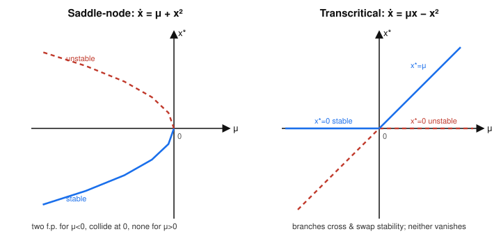
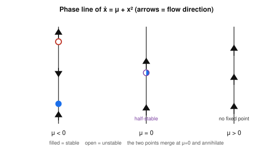

# Dynamical Systems & Chaos · Lesson 3.1: Saddle-node and transcritical bifurcations

> ⏱ ~15 min · Module 3: Bifurcations · Builds on: [Lesson 1.1](01-01-flows-on-the-line.md) (fixed points and stability from $f'$) · Unlocks: [Lesson 3.2](03-02-pitchfork-symmetry.md) (pitchforks and symmetry-breaking)

## Why this matters

Everything in Modules 1–2 held a system *fixed* and asked "what does it do?" Now we turn a knob. A laser below its pump threshold sits dark; nudge the pump past a critical value and coherent light switches on. A fishery harvested lightly has a healthy stable stock; raise the quota past a threshold and the stable and unstable equilibria collide, annihilate, and the population crashes to zero with no warning. Both are the **saddle-node bifurcation** — the single most common way a system loses an equilibrium. This lesson is the vocabulary: what a bifurcation *is*, the two simplest types, and the one picture (the bifurcation diagram) that summarizes an entire family of phase portraits at a glance.

## The idea

Take a one-parameter family $\dot x = f(x,\mu)$. For most values of the parameter $\mu$, wiggling it a little just slides the fixed points around and nudges their stability — nothing qualitative changes. But at special **critical values** the *structure* of the phase line reorganizes: a fixed point appears out of nowhere, two of them merge and vanish, or two swap which one is the attractor. That qualitative reorganization is a **bifurcation**, and the $\mu$ where it happens is the **bifurcation point**.

Two flavors to meet here:

- **Saddle-node (fold):** two fixed points march toward each other as $\mu$ changes, collide, and *annihilate*. On one side of the bifurcation you have a stable/unstable pair; on the other side, nothing. Equilibria are **created or destroyed**.
- **Transcritical:** two fixed points that always exist pass *through* each other and trade stability. Nobody disappears — the attractor and the repeller just **swap roles**.

The cleanest way to see either is a **bifurcation diagram**: plot every fixed point $x^*$ against $\mu$, drawing the curve solid where the fixed point is stable and dashed where it's unstable. One glance tells you how many equilibria exist at each parameter value and which one the system actually settles into.

## The formal version

**Bifurcation.** A one-parameter family $\dot x = f(x,\mu)$ undergoes a bifurcation at $\mu = \mu_c$ if the qualitative structure of the phase portrait (the number of fixed points, or their stability type) changes as $\mu$ passes through $\mu_c$.

*In words:* a bifurcation is a value of the knob where the "shape of the story" — not just the numbers — changes.

The workflow for any 1-D bifurcation is exactly the Module 1 recipe, now carrying $\mu$ along:

1. **Fixed points:** solve $f(x^*,\mu)=0$ for $x^*$ as a function of $\mu$.
2. **Stability:** evaluate $f'(x^*) \equiv \partial f/\partial x$ at each branch. $f'(x^*)<0 \Rightarrow$ stable; $f'(x^*)>0 \Rightarrow$ unstable; $f'(x^*)=0 \Rightarrow$ borderline — and *that* borderline is exactly where a bifurcation can happen.
3. **Diagram:** plot $x^*(\mu)$, solid for stable, dashed for unstable.

Near a bifurcation, every system of a given type looks the same after a change of variables. The stripped-down representative is the **normal form** — the simplest polynomial exhibiting that bifurcation.

**Saddle-node, normal form** $\dot x = \mu + x^2$.
Fixed points: $x^2 = -\mu$, so
$$x^* = \pm\sqrt{-\mu}\quad(\mu<0),\qquad x^*=0\ \text{(one, degenerate) at }\mu=0,\qquad \text{none}\ (\mu>0).$$
Stability from $f'(x)=2x$: at $x^*=-\sqrt{-\mu}$, $f'=-2\sqrt{-\mu}<0$ (**stable**); at $x^*=+\sqrt{-\mu}$, $f'=+2\sqrt{-\mu}>0$ (**unstable**).

*In words:* for $\mu<0$ there's a stable–unstable pair; they slide together as $\mu\to0^-$, fuse into one half-stable point at $\mu=0$, and for $\mu>0$ the flow $\dot x = \mu + x^2 > 0$ has no fixed point at all — everything drifts off to $+\infty$.

**Transcritical, normal form** $\dot x = \mu x - x^2 = x(\mu - x)$.
Fixed points: $x^*=0$ and $x^*=\mu$ — two of them for *every* $\mu$ (they merely coincide at $\mu=0$).
Stability from $f'(x)=\mu - 2x$:
$$f'(0)=\mu,\qquad f'(\mu)=\mu-2\mu=-\mu.$$
So $x^*=0$ is stable for $\mu<0$ and unstable for $\mu>0$; $x^*=\mu$ is the opposite. At $\mu=0$ they collide and **exchange stability**.

*In words:* the origin is always a fixed point; a second fixed point $x^*=\mu$ crosses it at $\mu=0$, and as they pass through each other the "stable" label hops from one branch to the other. Nothing is created or destroyed.

## Picture

Read the left panel as $\mu = -(x^*)^2$: a parabola opening to the *left*. To its right (at $\mu>0$) there is simply no curve — no fixed points exist. The solid lower arm is the stable branch, the dashed upper arm unstable; they meet at the nose $(\mu,x^*)=(0,0)$ where stability is borderline. The right panel is two straight lines, $x^*=0$ (horizontal) and $x^*=\mu$ (diagonal), crossing at the origin; **solid and dashed swap at the crossing** — that swap *is* the transcritical bifurcation.

The same saddle-node, told on the phase line as $\mu$ sweeps through zero:

For $\mu<0$ the flow points up outside the pair and down between them — the lower point attracts, the upper repels. As $\mu\to0$ they slide together into a single half-stable point (attracts from below, repels above), then for $\mu>0$ the whole line flows upward with nothing to stop it.

## Worked examples

**Example 1 (mechanical — reduce to normal form).** Analyze $\dot x = r - x^2$ ($r$ the parameter). Fixed points: $x^2 = r$, so $x^*=\pm\sqrt{r}$ for $r>0$, none for $r<0$. With $f'(x)=-2x$: $x^*=+\sqrt{r}$ gives $f'=-2\sqrt r<0$ (**stable**), $x^*=-\sqrt{r}$ gives $f'=+2\sqrt r>0$ (**unstable**). A stable–unstable pair for $r>0$ that annihilates as $r\to0^+$: a saddle-node at $r=0$. This is just the normal form with $\mu=-r$ (and it's the mirror image of the left panel above — the parabola opens right instead of left). The lesson: the *sign conventions* of $\mu + x^2$ vs $\mu - x^2$ flip which side has the two points, but the qualitative event — two points colliding and vanishing — is identical.

**Example 2 (why you'd care — a threshold with no warning).** A grazed plant population $N\ge 0$ obeys, in dimensionless form, $\dot N = rN\!\left(1-\dfrac{N}{K}\right) - h$, logistic growth minus a constant harvesting rate $h$. Fixed points solve the quadratic $\tfrac{r}{K}N^2 - rN + h = 0$, giving
$$N^* = \frac{K}{2}\left(1 \pm \sqrt{1 - \frac{4h}{rK}}\right).$$
For small $h$ there are two equilibria: the larger (near $K$) is stable — the healthy stock — and the smaller is unstable — a survival threshold. As harvesting rises to the critical $h_c = rK/4$ the square root hits zero, the two equilibria **collide and annihilate** (a saddle-node), and for $h>h_c$ there is *no* positive equilibrium: $\dot N<0$ for all $N$, so the population slides to extinction. The danger is that right up to $h_c$ the stable equilibrium looks perfectly healthy — it just sits at a lower stock — giving no gradual warning before it vanishes. That abrupt loss of a stable state at a fold is the mathematical skeleton of a **tipping point**.

## Watch out

- **You might think** a fixed point turns unstable exactly when it "disappears" — but those are different events. In a *transcritical* bifurcation nothing disappears; a fixed point that was stable is still sitting there afterward, now unstable. Disappearance is the *saddle-node's* signature, stability-exchange is the *transcritical's*. Reading the diagram tells you which.
- **You might think** $f'(x^*)=0$ means "unstable" — but it means *borderline*, and the linearization is simply silent (you're at a non-hyperbolic point, the Hartman–Grobman gap from Module 1). At a bifurcation point every branch has $f'(x^*)=0$; you decide the behavior from the higher-order shape of $f$, not its slope. For $\dot x=x^2$ at $x^*=0$ the point is half-stable, not "neutral."
- **You might think** the normal form is a special toy and real systems need separate theory — but near the bifurcation, a smooth $f(x,\mu)$ with $f=f_x=0$ and $f_{xx}\neq0,\ f_\mu\neq0$ Taylor-expands to $\mu + x^2$ up to rescaling. The toy *is* the local truth; that's what "normal form" buys you (made precise in [Lesson 3.4](03-04-normal-forms-structural-stability.md)).

## One-liner

> Saddle-node = two fixed points collide and vanish (a fold, $\dot x=\mu+x^2$); transcritical = two cross and swap stability without vanishing ($\dot x=\mu x-x^2$) — and the bifurcation diagram, solid-stable/dashed-unstable, tells them apart at a glance.

## Problems

**P1 (🟢)** For $\dot x = \mu - x^2$ find $x^*(\mu)$, classify each branch's stability with $f'(x^*)$, and sketch the bifurcation diagram (label solid/dashed and state the bifurcation type and point).

**P2 (🟡)** Show that $\dot x = \mu x + x^2$ has a transcritical bifurcation at $\mu=0$. Find both branches $x^*(\mu)$, determine their stability, and describe what happens to the *stable* fixed point as $\mu$ increases through $0$.

**P3 (🔴, optional)** The family $\dot x = \mu x - x^3$ has fixed points $x^*=0$ and $x^*=\pm\sqrt{\mu}$. Classify all branches' stability and sketch the diagram. Which of the two bifurcations from this lesson does it resemble, and what's structurally *different* about how many fixed points are born? (You're previewing [Lesson 3.2](03-02-pitchfork-symmetry.md).)

Solutions

**P1** Fixed points: $x^2=\mu$, so $x^*=\pm\sqrt{\mu}$ for $\mu>0$, one degenerate point $x^*=0$ at $\mu=0$, and **none** for $\mu<0$. Stability from $f'(x)=-2x$:
- $x^*=+\sqrt{\mu}$: $f'=-2\sqrt{\mu}<0$ → **stable** (solid, upper branch).
- $x^*=-\sqrt{\mu}$: $f'=+2\sqrt{\mu}>0$ → **unstable** (dashed, lower branch).

Diagram: a sideways parabola $\mu=(x^*)^2$ opening to the **right**, with the upper arm solid and the lower arm dashed, meeting at the nose $(0,0)$; nothing for $\mu<0$. This is a **saddle-node bifurcation at $\mu=0$** (the mirror image of the lesson's $\mu+x^2$ diagram — the pair now lives at $\mu>0$).

**P2** Fixed points of $\dot x = x(\mu + x)$: $x^*=0$ and $x^*=-\mu$ — two branches for every $\mu$, coincident at $\mu=0$. Stability from $f'(x)=\mu+2x$:
- $f'(0)=\mu$: $x^*=0$ is **stable for $\mu<0$**, **unstable for $\mu>0$**.
- $f'(-\mu)=\mu+2(-\mu)=-\mu$: $x^*=-\mu$ is **unstable for $\mu<0$**, **stable for $\mu>0$**.

They collide and exchange stability at $\mu=0$: a **transcritical bifurcation**. As $\mu$ increases through $0$, the stable equilibrium is the origin for $\mu<0$, then for $\mu>0$ the stable equilibrium is the branch $x^*=-\mu$, which moves off to *negative* $x$ (the origin having gone unstable). The attractor is handed from one branch to the other — the diagram is two crossing lines with solid/dashed swapping at the origin, the mirror (about the vertical axis) of the lesson's transcritical panel.

**P3** $f(x)=\mu x - x^3=x(\mu-x^2)$, so $x^*=0$ always, plus $x^*=\pm\sqrt{\mu}$ when $\mu>0$. Stability from $f'(x)=\mu-3x^2$:
- $f'(0)=\mu$: origin **stable for $\mu<0$**, **unstable for $\mu>0$**.
- $f'(\pm\sqrt{\mu})=\mu-3\mu=-2\mu<0$ for $\mu>0$: both outer branches **stable**.

Diagram: for $\mu<0$ a single stable point at the origin (solid); at $\mu=0$ it goes unstable and **two** new stable branches $\pm\sqrt{\mu}$ sprout symmetrically, giving a solid parabola opening right with a dashed segment of the $x^*=0$ axis inside it. It resembles the transcritical/saddle-node story in that a stability change happens at $\mu=0$, but structurally it's different: instead of *one* partner point, **two** symmetric fixed points are born at once, and the origin persists throughout. That three-branch, symmetry-respecting split is the **supercritical pitchfork** — the subject of the next lesson.

## Flashback

**From Lesson 1.1 (flows on the line and stability from $f'$):** Consider the single, parameter-free system $\dot x = x - x^3$. Find all fixed points and classify each as stable or unstable using the sign of $f'(x^*)$. Then, from the phase line alone, state where a trajectory starting at $x(0)=0.1$ ends up, and where one starting at $x(0)=-2$ ends up.

Solution

Fixed points: $x - x^3 = x(1-x^2)=0 \Rightarrow x^*=0,\ +1,\ -1$. With $f'(x)=1-3x^2$:
- $f'(0)=1>0$ → **unstable**.
- $f'(\pm1)=1-3=-2<0$ → both **stable**.

Phase line: $\dot x>0$ on $(-\infty,-1)$? Check $x=-2$: $-2-(-8)=6>0$, so flow is *rightward* (toward $-1$). On $(-1,0)$ (e.g. $x=-0.5$): $-0.5+0.125=-0.375<0$, leftward toward $-1$. On $(0,1)$ (e.g. $x=0.5$): $0.5-0.125=0.375>0$, rightward toward $+1$. On $(1,\infty)$: negative, leftward toward $+1$.

So a trajectory from $x(0)=0.1$ (just right of the unstable origin) flows to the stable point $x^*=+1$; one from $x(0)=-2$ flows rightward to the stable point $x^*=-1$. The unstable origin is the **separatrix** dividing the two basins of attraction. (Note this is exactly the $\mu=1$ slice of P3's pitchfork family — the flashback and the stretch problem are the same equation seen from two angles.)

## Connections

- **Backward:** this is the Module 1 stability recipe (fixed points where $f=0$, sign of $f'$ decides stability, [Lesson 1.1](01-01-flows-on-the-line.md)) run with a parameter in tow. The borderline case $f'(x^*)=0$ — the non-hyperbolic point where linearization went silent in [Lesson 1.4](01-04-linearization-hartman-grobman.md) — is precisely where bifurcations live.
- **Forward:** [Lesson 3.2](03-02-pitchfork-symmetry.md) adds a *symmetry* ($f(-x,\mu)=-f(x,\mu)$) and gets the pitchfork of P3, where fixed points are born in symmetric pairs. [Lesson 3.3](03-03-hopf-bifurcation.md) lifts all of this to 2-D, where instead of colliding fixed points an entire *limit cycle* is born.
- **Sideways (economics):** the same "does the equilibrium exist and is it stable?" analysis underlies Walrasian *tâtonnement* price adjustment in [`grad-micro`](../../grad-micro/syllabus.md) — a saddle-node in the excess-demand dynamics is a market equilibrium blinking out of existence, a price-collapse threshold with no gradual warning, just like the fishery in Example 2.
- **Sideways (physics):** in [`fluid-dynamics`](../../fluid-dynamics/syllabus.md), the onset of a steady convection roll as the temperature gradient passes a critical Rayleigh number is a bifurcation of exactly this kind; the oscillatory onset (the Hopf case) arrives in [Lesson 3.3](03-03-hopf-bifurcation.md).
