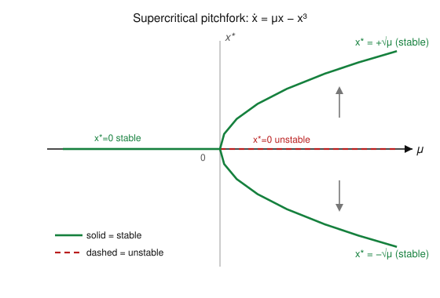
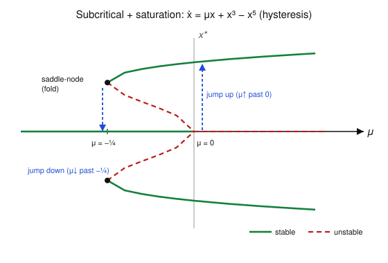

# Dynamical Systems & Chaos · Lesson 3.2: Pitchfork bifurcations and symmetry

> ⏱ ~15 min · Module 3: Bifurcations · Builds on: [Lesson 3.1](03-01-saddle-node-transcritical.md), [Lesson 1.1](01-01-flows-on-the-line.md) · Unlocks: [Lesson 3.3](03-03-hopf-bifurcation.md)

## Why this matters

A magnet above its Curie temperature has no net magnetization — perfectly symmetric, no preferred direction. Cool it past the critical point and it *spontaneously* picks north or south. A straight column under a growing load stays straight until, at a critical load, it buckles left or right. In both, a single symmetric state loses stability and the system is forced to *choose a side*. That is a **pitchfork bifurcation**, and it is the mathematical signature of spontaneous symmetry breaking — the same idea that runs second-order phase transitions in [`stat-mech`](../../stat-mech/syllabus.md) and the onset of convection rolls in [`fluid-dynamics`](../../fluid-dynamics/syllabus.md).

## The idea

Pitchforks show up in systems with a **reflection symmetry** $x \to -x$: the dynamics look identical if you flip the sign of the state. Formally, $f(-x) = -f(x)$ — $f$ is an *odd* function of $x$, so no even-power terms (no constant, no $x^2$) can appear. That symmetry forces $x^*=0$ to always be a fixed point, and it guarantees that if $x^* = a$ is a fixed point, so is $x^* = -a$. Solutions come in mirror pairs.

Now turn the knob $\mu$. While $x^*=0$ is stable, symmetry is respected: the system sits dead-center. Cross the threshold and $x^*=0$ goes unstable — but the state can't stay at $0$ and can't favor $+$ over $-$ (the equations don't). So two new mirror-image fixed points $\pm a$ appear and the state slides into one of them. The *equations* keep the symmetry; the *chosen state* breaks it. Plot the fixed points against $\mu$ and the two new branches sprout from the old one like the tines of a pitchfork.

A clean way to feel it: the flow $\dot x = \mu x - x^3$ is **gradient**, $\dot x = -V'(x)$, with potential
$$V(x) = -\tfrac{\mu}{2}x^2 + \tfrac14 x^4.$$
The state rolls downhill to a minimum of $V$. For $\mu<0$, $V$ is a single well at $x=0$. For $\mu>0$, the center bulges up into a **double well** — $x=0$ becomes a hilltop and two symmetric valleys $\pm\sqrt\mu$ open up. Symmetry breaking is just the ball rolling into one valley. (This $V$ is exactly Landau's free energy for a phase transition.)

## The formal version

**Supercritical pitchfork — normal form.**
$$\dot x = \mu x - x^3.$$
Fixed points: $x(\mu - x^2)=0$, so $x^*=0$ always, plus $x^*=\pm\sqrt\mu$ when $\mu>0$. Stability from $f'(x)=\mu-3x^2$:

- at $x^*=0$: $f'(0)=\mu$ — **stable** for $\mu<0$, **unstable** for $\mu>0$;
- at $x^*=\pm\sqrt\mu$: $f'=\mu-3\mu=-2\mu<0$ — **stable** for $\mu>0$.

*In words:* as $\mu$ crosses $0$, the lone stable point at the origin goes unstable and hands its stability to two brand-new stable points that grow continuously outward like $\sqrt\mu$. Nothing jumps; the transition is smooth.

**Subcritical pitchfork — normal form.**
$$\dot x = \mu x + x^3.$$
The cubic now has a **+** sign. Fixed points: $x^*=0$ and $x^*=\pm\sqrt{-\mu}$ (real only for $\mu<0$). With $f'(x)=\mu+3x^2$:

- at $x^*=0$: $f'(0)=\mu$ — **stable** for $\mu<0$, **unstable** for $\mu>0$;
- at $x^*=\pm\sqrt{-\mu}$: $f'=\mu+3(-\mu)=-2\mu>0$ — **unstable** for $\mu<0$.

*In words:* the two extra branches exist *before* the bifurcation ($\mu<0$), they are **unstable**, and they lean backward. They are not attractors — they mark the edge of the origin's basin. When $\mu$ crosses $0$ the origin loses stability and there is **nothing nearby to catch the state**: it runs off to infinity. Indeed for $\mu>0$ and large $x$, $\dot x\approx x^3$ blows up in *finite* time.

**Saturation and hysteresis.** Real systems don't reach infinity. A stabilizing higher-order term restores a large-amplitude attractor:
$$\dot x = \mu x + x^3 - x^5.$$
Nonzero fixed points solve $x^4 - x^2 - \mu = 0$, i.e. $x^2 = \tfrac12\big(1\pm\sqrt{1+4\mu}\big)$. This produces two events:

- a **subcritical pitchfork at $\mu=0$** (the inner unstable branches collide with $x=0$, killing its stability), and
- a **saddle-node (fold) at $\mu=-\tfrac14$** (where $1+4\mu=0$): a pair of large-amplitude branches — one stable (outer), one unstable (inner) — is born.

*In words:* between $\mu=-\tfrac14$ and $\mu=0$ the system is **bistable** — the origin and the large-amplitude branches are both stable, separated by unstable branches. Sweep $\mu$ up and the state clings to $x=0$ until $\mu=0$, then **jumps** to the large branch. Sweep back down and it clings to the large branch until $\mu=-\tfrac14$, then **jumps** back. The up-jump and down-jump happen at different $\mu$: that path-dependence is **hysteresis**.

## Picture

The supercritical pitchfork — one stable branch splitting into two stable branches plus an unstable middle, growing continuously as $\pm\sqrt\mu$:

And the subcritical case with $-x^5$ saturation — the fold at $\mu=-\tfrac14$, the bistable band, and the two jumps that make a hysteresis loop:

## Worked examples

**Example 1 (mechanical — read the branches).** Analyze $\dot x = \mu x - x^5$ and classify the bifurcation at $\mu=0$.
Fixed points: $x(\mu - x^4)=0$, so $x^*=0$ and $x^*=\pm\mu^{1/4}$ for $\mu>0$ (a mirror pair — the tell-tale of a pitchfork). Stability via $f'(x)=\mu-5x^4$: at $x^*=0$, $f'=\mu$ (stable $\mu<0$, unstable $\mu>0$); at $x^*=\pm\mu^{1/4}$, $f'=\mu-5\mu=-4\mu<0$ (stable). Same *structure* as the supercritical pitchfork — one stable point becomes unstable, two stable branches emerge — so it is a **supercritical pitchfork**. The only difference is cosmetic: the branches open like $\mu^{1/4}$ instead of $\mu^{1/2}$, so the tines rise with infinite slope even more sharply. (This is a *degenerate* pitchfork; Lesson 3.4 explains why the pure $-x^3$ normal form is the generic representative.)

**Example 2 (why you'd care — the mean-field ferromagnet).** In mean-field theory a magnet's dimensionless magnetization $m$ relaxes as
$$\dot m = -m + \tanh(\beta m),$$
where $\beta \propto 1/T$ is inverse temperature. There is no external field, so the system is symmetric under $m\to -m$ (flip every spin). Small-$m$ expansion $\tanh(u)=u-\tfrac13u^3+\cdots$ gives
$$\dot m \approx (\beta-1)\,m - \tfrac{\beta^3}{3}\,m^3.$$
This is precisely $\dot m = \mu\, m - c\,m^3$ with $\mu=\beta-1$ and $c=\beta^3/3>0$: a **supercritical pitchfork at $\beta=1$**. For $\beta<1$ (hot, $T$ high) the only stable state is $m^*=0$ — no magnetization. For $\beta>1$ (cold, past the Curie point) $m^*=0$ goes unstable and two stable states $m^*=\pm\sqrt{3(\beta-1)/\beta^3}$ appear: the material spontaneously magnetizes up or down. The continuous $\sqrt{\beta-1}$ onset of $m$ is a textbook **second-order phase transition** — the same square-root that [`stat-mech`](../../stat-mech/syllabus.md) calls a critical exponent of $\tfrac12$.

## Watch out

- You might think any split of one stable state into three is a pitchfork — but **without the $x\to-x$ symmetry you generically get an *imperfect bifurcation* instead** (a saddle-node plus a surviving branch). Add a small constant $h$ to $\dot x=\mu x-x^3$ and the perfect pitchfork breaks apart. The symmetry is a *prerequisite*, not a bonus (you'll see this in P2).
- You might think the sign of the cubic is a detail — it decides *everything*. **$-x^3$ saturates** (branches stable, forward-opening, $\mu>0$): supercritical, safe, continuous. **$+x^3$ destabilizes** (branches unstable, backward-opening, $\mu<0$): subcritical, dangerous, with jumps. Flip one sign and you flip the physics.
- You might read the subcritical branches as states the system can occupy — but they're **unstable**: you'll never observe them. They are the *basin boundary* (the double-well's ridge), separating "fall back to $0$" from "run away." Only solid branches are observable.
- You might expect the branches to grow linearly out of the bifurcation — they don't. Amplitude $\sim\sqrt\mu$ means **infinite slope $dx^*/d\mu$ at $\mu=0$**: right at onset a tiny change in $\mu$ produces a disproportionately large response. That steepness is why critical points are delicate.

## One-liner

> A symmetric system doesn't ease off-center — at threshold the center goes unstable and the state must pick a side: supercritically it slides out smoothly as $\sqrt\mu$, subcritically it jumps and remembers its history (hysteresis).

## Problems

**P1 (🟢)** For the subcritical normal form $\dot x = \mu x + x^3$, find every fixed point as a function of $\mu$, classify each as stable or unstable, and describe (in words or a quick sketch) the bifurcation diagram. On which side of $\mu=0$ do the extra branches live, and what happens to a trajectory started near $x=0$ when $\mu$ becomes slightly positive?

**P2 (🟡)** *Imperfect bifurcation.* Fix $\mu=1$ and add a small symmetry-breaking constant: $\dot x = h + x - x^3$. (a) For $h=0$ find the three fixed points. (b) Show that once $|h|$ exceeds a critical value $h_c$ only **one** fixed point survives, and find $h_c$. (c) In one sentence, explain why this proves a true pitchfork requires the $x\to-x$ symmetry.

**P3 (🔴, optional)** *Hysteresis, quantitatively.* For $\dot x = \mu x + x^3 - x^5$: (a) find all fixed points and confirm the nonzero ones satisfy $x^2=\tfrac12(1\pm\sqrt{1+4\mu})$; (b) show the saddle-node fold sits at $\mu=-\tfrac14$ and the subcritical pitchfork at $\mu=0$; (c) describe the hysteresis loop when $\mu$ is swept up from $-\tfrac12$ to $+\tfrac12$ and back — give the jump-up and jump-down values of $\mu$ and the width of the loop.

Solutions

**P1** Fixed points: $x(\mu+x^2)=0 \Rightarrow x^*=0$ for all $\mu$, and $x^*=\pm\sqrt{-\mu}$, which is real only for $\mu<0$. So the extra branches live on the $\mu<0$ side (they "open backward"). Stability from $f'(x)=\mu+3x^2$: at $x^*=0$, $f'(0)=\mu$ — stable for $\mu<0$, unstable for $\mu>0$; at $x^*=\pm\sqrt{-\mu}$, $f'=\mu+3(-\mu)=-2\mu>0$ for $\mu<0$ — **unstable**. Diagram: a stable branch along $x=0$ for $\mu<0$ turning into a dashed (unstable) line for $\mu>0$, with two dashed unstable branches $\pm\sqrt{-\mu}$ peeling backward into $\mu<0$. A trajectory started near $x=0$ with $\mu$ slightly positive: $x=0$ is now unstable and there is no other fixed point, so it accelerates away — $\dot x\approx x^3$ for large $x$ drives finite-time blow-up. This is the danger of a subcritical bifurcation: loss of stability with no nearby state to catch you.

**P2** (a) $h=0$: $x-x^3=0\Rightarrow x(1-x^2)=0$, giving $x^*=-1,\,0,\,+1$.
(b) Fixed points solve $g(x):=x-x^3+h=0$, i.e. $h = x^3-x$. The number of real roots changes when two of them merge — a double root, where $g'(x)=1-3x^2=0$, so $x=\pm 1/\sqrt3$. Evaluate $h=x^3-x$ there: at $x=1/\sqrt3$, $h=\tfrac{1}{3\sqrt3}-\tfrac{1}{\sqrt3}=\tfrac{1-3}{3\sqrt3}=-\tfrac{2}{3\sqrt3}$; at $x=-1/\sqrt3$, $h=+\tfrac{2}{3\sqrt3}$. So the two saddle-node folds sit at
$$h_c=\pm\frac{2}{3\sqrt3}\approx\pm 0.385.$$
For $|h|<h_c$ there are three fixed points; for $|h|>h_c$ two of them have annihilated in a saddle-node and only **one** remains.
(c) With $h\neq0$ the state $x=0$ is no longer even a fixed point and the three branches no longer emanate from one point — the pitchfork has dissolved into a saddle-node plus a lone surviving branch (an *imperfect bifurcation*). A genuine pitchfork, with all three branches meeting at a single point, exists only when $h=0$, i.e. only when the exact $x\to-x$ symmetry ($f(-x)=-f(x)$) is enforced.

**P3** (a) $x(\mu+x^2-x^4)=0$: either $x^*=0$, or $x^4-x^2-\mu=0$. Setting $u=x^2\ge0$: $u^2-u-\mu=0\Rightarrow u=\tfrac12(1\pm\sqrt{1+4\mu})$, hence $x^2=\tfrac12(1\pm\sqrt{1+4\mu})$, real and nonnegative where the radicand and $u$ permit.
(b) The two nonzero branches are the $\pm$ roots for $u$; they coincide (a double root — the saddle-node fold) exactly when the discriminant vanishes, $1+4\mu=0\Rightarrow \mu=-\tfrac14$, giving $u=\tfrac12$, $x=\pm 1/\sqrt2$. The inner branch $u_-=\tfrac12(1-\sqrt{1+4\mu})$ reaches $u=0$ (i.e. $x=0$) when $\sqrt{1+4\mu}=1\Rightarrow\mu=0$: there the unstable inner branches merge into the origin and destabilize it — the subcritical pitchfork at $\mu=0$. Stability: $f'(x)=\mu+3x^2-5x^4$; the origin has $f'(0)=\mu$ (stable $\mu<0$), the outer branch is stable and the inner branch unstable (a short computation, or read it off the double-well potential $V=-\tfrac\mu2 x^2-\tfrac14 x^4+\tfrac16 x^6$).
(c) Sweeping **up** from $\mu=-\tfrac12$: only $x=0$ is stable (the folds haven't appeared yet at $\mu<-\tfrac14$; for $-\tfrac14<\mu<0$ the state stays in the $x=0$ well because it started there). At $\mu=0$ the origin loses stability with no inner barrier left, so the state **jumps up** to the large-amplitude outer branch. Continue to $+\tfrac12$ on that branch. Sweeping **down**: the state rides the outer stable branch through $\mu=0$ and past it — the origin being unstable is irrelevant, the outer well still exists — until $\mu=-\tfrac14$, where the outer branch annihilates in the saddle-node and the state **jumps down** to $x=0$. Jump-up at $\mu=0$, jump-down at $\mu=-\tfrac14$; the loop has width $\Delta\mu=\tfrac14$. The response depends on the *direction* of the sweep — hysteresis.

## Flashback

**From Lesson 3.1 (saddle-node and transcritical):** Classify the bifurcation in $\dot x = \mu - (x-1)^2$. Find the bifurcation value of $\mu$, locate the fixed points and their stability on either side, and sketch the bifurcation diagram.

Solution

Fixed points: $(x-1)^2=\mu$, so $x^*=1\pm\sqrt\mu$ — **two** fixed points for $\mu>0$, **none** for $\mu<0$, colliding at the single point $x^*=1$ when $\mu=0$. Two fixed points annihilating as a parameter passes a threshold is the hallmark of a **saddle-node (fold) bifurcation**, here shifted to $x=1$. Bifurcation value $\mu_c=0$.
Stability from $f'(x)=-2(x-1)$: at $x^*=1+\sqrt\mu$, $f'=-2\sqrt\mu<0$ — **stable**; at $x^*=1-\sqrt\mu$, $f'=+2\sqrt\mu>0$ — **unstable**. Diagram: a sideways half-parabola opening toward $\mu>0$, vertex at $(\mu,x)=(0,1)$, upper branch $1+\sqrt\mu$ solid (stable), lower branch $1-\sqrt\mu$ dashed (unstable); to the left of $\mu=0$, empty — no fixed points at all. (Contrast a pitchfork: a saddle-node needs *no* symmetry, and its two branches are one stable + one unstable, not a symmetric mirror pair.)

## Connections

- **Backward:** this is the third normal form of Module 3, sitting beside the saddle-node and transcritical of [Lesson 3.1](03-01-saddle-node-transcritical.md); every stability call reuses the phase-line rule $\operatorname{sign} f'(x^*)$ from [Lesson 1.1](01-01-flows-on-the-line.md). The imperfect pitchfork (P2) is literally a saddle-node in disguise — the symmetry is what fuses two folds into one clean pitchfork.
- **Forward:** [Lesson 3.3](03-03-hopf-bifurcation.md) is the pitchfork's oscillatory cousin — a *limit cycle* of amplitude $\sqrt\mu$ born from a fixed point, complete with supercritical (smooth) and subcritical (jump/hysteresis) versions that mirror this lesson exactly. [Lesson 3.4](03-04-normal-forms-structural-stability.md) explains why the pitchfork is *non-generic*: it needs an imposed symmetry, so it is structurally unstable to symmetry-breaking perturbations.
- **Sideways ([`stat-mech`](../../stat-mech/syllabus.md)):** the supercritical pitchfork **is** a continuous (second-order) phase transition with spontaneous symmetry breaking — the double-well $V(x)=-\tfrac\mu2 x^2+\tfrac14 x^4$ is Landau's free energy, $\mu\propto(T_c-T)$, and Example 2's ferromagnet is the canonical case; the subcritical-with-hysteresis version is the model of a first-order transition. In [`fluid-dynamics`](../../fluid-dynamics/syllabus.md), the onset of Rayleigh–Bénard convection is a supercritical pitchfork — the fluid picks clockwise or counter-clockwise rolls.
