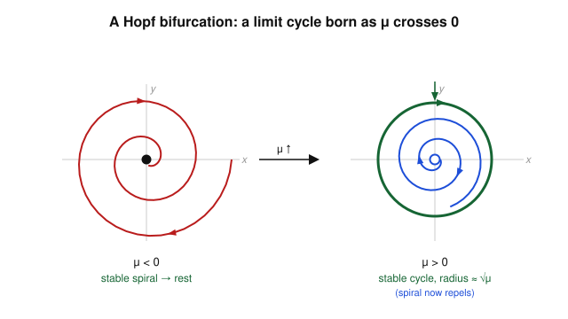

# Dynamical Systems & Chaos · Lesson 3.3: The Hopf bifurcation

> ⏱ ~15 min · Module 3: Bifurcations · Builds on: [limit cycles (2.3)](02-03-limit-cycles.md), [trace–determinant classification (1.3)](01-03-trace-determinant-classification.md) · Unlocks: [normal forms & structural stability (3.4)](03-04-normal-forms-structural-stability.md)

## Why this matters

The bifurcations of Module 3 so far only shuffle *fixed points* around — they collide, exchange stability, split in two. But the most interesting thing a system can do is start to **oscillate**: a quiet steady state that suddenly begins to hum. That birth of a self-sustained oscillation from a resting equilibrium is the **Hopf bifurcation**, and it is everywhere — the onset of a heartbeat's rhythm, a laser starting to pulse, a chemical reaction that begins to tick, and (the bridge we'll name at the end) the moment a heated fluid stops sitting still and begins to roll over in convection. It's the one bifurcation where a whole [limit cycle (2.3)](02-03-limit-cycles.md) appears out of a single point.

## The idea

Back in [Lesson 1.3](01-03-trace-determinant-classification.md), a 2-D fixed point with complex eigenvalues $\lambda = \alpha \pm i\omega$ was a **spiral**: trajectories corkscrew in (if $\alpha < 0$, stable) or out (if $\alpha > 0$, unstable), circling at angular rate $\omega$. Right at $\alpha = 0$ the spiraling neither grows nor decays — a **center**, orbits going round forever.

Now imagine turning a knob $\mu$ that slides $\alpha$ from negative to positive. For $\mu$ small and negative, the spiral winds inward: the system settles to rest. As $\mu$ increases through $0$, the fixed point stops attracting and starts repelling — the corkscrew reverses. But the trajectory can't run off to infinity if the far field still pushes inward. Squeezed between an outward-pushing center and an inward-pushing surround, it has nowhere to go but around: it settles onto a **closed loop**, a limit cycle. The oscillation is born.

The key move is that **you don't need to find that loop by solving anything**. You only need to watch the eigenvalues. When a complex-conjugate pair crosses the imaginary axis — $\operatorname{Re}\lambda$ passing through $0$ while $\operatorname{Im}\lambda = \omega \neq 0$ — a Hopf bifurcation happens, and a small cycle appears with amplitude growing from zero.

## The formal version

**Hopf bifurcation criterion.** Let $\dot{\mathbf x} = \mathbf f(\mathbf x, \mu)$ have a fixed point $\mathbf x^*(\mu)$ whose Jacobian has a complex-conjugate eigenvalue pair
$$\lambda_\pm(\mu) = \alpha(\mu) \pm i\,\omega(\mu).$$
A **Hopf bifurcation** occurs at $\mu = \mu_c$ when
$$\alpha(\mu_c) = 0, \qquad \omega(\mu_c) \neq 0, \qquad \alpha'(\mu_c) \neq 0.$$

*In words:* the pair sits *on* the imaginary axis at $\mu_c$ (so the spiral is momentarily a center), it is genuinely oscillating ($\omega \neq 0$, not just a stalled real eigenvalue), and it is *crossing* the axis rather than grazing it (the transversality condition $\alpha' \neq 0$ — the knob really pushes it through).

In 2-D the eigenvalues are $\lambda_\pm = \tfrac{\tau}{2} \pm \tfrac12\sqrt{\tau^2 - 4\Delta}$, so $\operatorname{Re}\lambda = \tau/2$ whenever $\tau^2 < 4\Delta$ (complex case). The criterion becomes beautifully simple:

$$\boxed{\ \text{Hopf} \iff \tau(\mu_c) = 0 \ \text{ with } \ \Delta(\mu_c) > 0\ }$$

where $\tau = \operatorname{tr} J$ and $\Delta = \det J$. **In words:** a Hopf is exactly the moment the trace of the Jacobian passes through zero while the determinant stays positive — the spiral/center boundary of the [trace–determinant plane (1.3)](01-03-trace-determinant-classification.md), now traversed by a moving parameter.

**The normal form.** Near the bifurcation, *every* Hopf system looks — after a smooth change of coordinates — like this one, written in polar coordinates $(r,\theta)$:
$$\dot r = \mu\, r + a\, r^3, \qquad \dot\theta = \omega.$$
Here $r \ge 0$ is the amplitude, $\theta$ the phase advancing at rate $\omega$, and $a \neq 0$ the cubic coefficient set by the nonlinearity. The angle just spins uniformly; **all the drama is in the radius.**

- If $a < 0$ (rescale to $a = -1$: $\ \dot r = \mu r - r^3$): the bifurcation is **supercritical**.
- If $a > 0$ ($\ \dot r = \mu r + r^3$): it is **subcritical**.

**Supercritical case** $\dot r = \mu r - r^3 = r(\mu - r^2)$. Amplitude fixed points: $r = 0$ always, plus $r^* = \sqrt{\mu}$ when $\mu > 0$. Stability from $\frac{d}{dr}(\mu r - r^3) = \mu - 3r^2$:

| | $r=0$ | $r^* = \sqrt\mu$ |
|---|---|---|
| $\mu < 0$ | $\mu < 0$ → **stable** | (doesn't exist) |
| $\mu > 0$ | $\mu > 0$ → **unstable** | $\mu - 3\mu = -2\mu < 0$ → **stable** |

So for $\mu > 0$ the origin repels and a **stable limit cycle of radius $\sqrt\mu$** encircles it. The amplitude grows continuously from zero like $\sqrt\mu$ — a **soft** onset: nudge the knob past $\mu_c$ and a tiny, gentle oscillation appears and swells.

## Picture



Left ($\mu < 0$): the spiral winds **into** the origin — the system relaxes to rest. Right ($\mu > 0$): the origin now **repels** (blue spiral pushing out), but far-away trajectories are still drawn in (green arrows), and both accumulate on the green **limit cycle** of radius $\sqrt\mu$. The filled dot became hollow; a loop was born around it.

## Worked examples

**Example 1 (the criterion on a 2-D system).** Take
$$\dot x = \mu x - y - x(x^2+y^2), \qquad \dot y = x + \mu y - y(x^2+y^2).$$
The origin is a fixed point for all $\mu$. Its Jacobian: differentiate and set $(x,y)=(0,0)$. The cubic terms have zero derivative at the origin, so
$$J(0,0) = \begin{pmatrix} \mu & -1 \\ 1 & \mu \end{pmatrix}, \qquad \tau = 2\mu, \quad \Delta = \mu^2 + 1.$$
Eigenvalues $\lambda_\pm = \mu \pm i$. So $\alpha(\mu) = \mu$ and $\omega = 1$: the pair crosses the imaginary axis at $\mu_c = 0$ with $\alpha'(0) = 1 \neq 0$ and $\omega = 1 \neq 0$. **Hopf at $\mu = 0$**, equivalently $\tau = 2\mu = 0$ with $\Delta = 1 > 0$. ✓

Now watch the normal form fall out *exactly*. With $r^2 = x^2+y^2$, use $r\dot r = x\dot x + y\dot y$:
$$r\dot r = x(\mu x - y - xr^2) + y(x + \mu y - yr^2) = \mu(x^2+y^2) - r^2(x^2+y^2) = \mu r^2 - r^4,$$
so $\dot r = \mu r - r^3$. And $\dot\theta = (x\dot y - y\dot x)/r^2 = (x^2 + y^2)/r^2 = 1$. This is the supercritical normal form with $\omega = 1$: for $\mu > 0$, a stable limit cycle of radius $\sqrt\mu$, going round once every $2\pi$ time units. We read off the entire post-bifurcation behavior without ever integrating the ODEs.

**Example 2 (supercritical vs subcritical — soft vs hard).** Compare the two amplitude equations, both with a Hopf at $\mu = 0$:

*Supercritical* $\dot r = \mu r - r^3$. Cross $\mu = 0$ upward: the origin gently gives way to a cycle of radius $\sqrt\mu$. At $\mu = 0.01$ the oscillation has amplitude $0.1$; the system barely notices. **Reversible and safe** — dial $\mu$ back down and the cycle shrinks smoothly back to zero.

*Subcritical* $\dot r = \mu r + r^3$. For $\mu < 0$ there is a nonzero fixed point at $r^* = \sqrt{-\mu}$, but now $\frac{d}{dr}(\mu r + r^3) = \mu + 3r^2 = -2\mu > 0$ there — an **unstable** cycle, ringing the *stable* origin. That unstable loop is the edge of the basin of attraction. As $\mu \to 0^-$ the loop shrinks onto the origin and swallows it; at $\mu > 0$ the origin is unstable with *nothing small* to catch the trajectory, which shoots off — in a real system, to some far-away large-amplitude attractor set by higher-order ($-r^5$) terms. The onset is a **hard jump**: amplitude leaps discontinuously, and (Problem 3) it comes with **hysteresis** — you can't undo it just by nudging $\mu$ back. This is the *dangerous* Hopf: the flutter of an aircraft wing, the sudden onset of a large cardiac arrhythmia.

## Watch out

- **You might think** any eigenvalue hitting zero real part is a Hopf — **but** you need $\omega \neq 0$. A single *real* eigenvalue passing through $0$ ($\omega = 0$) is a saddle-node / transcritical / pitchfork ([3.1](03-01-saddle-node-transcritical.md)–[3.2](03-02-pitchfork-symmetry.md)), a fixed-point event, not an oscillation. Hopf needs a genuine complex *pair*.
- **You might think** the linearization tells you whether the cycle is stable — **but** it can't. At $\mu_c$ the fixed point is a non-hyperbolic center; the sign of the cubic coefficient $a$ (super- vs subcritical) is decided entirely by the *nonlinear* terms. The linear part only tells you *that* a Hopf happens, never *which kind*.
- **You might think** a subcritical Hopf has no cycle for $\mu < 0$ because "nothing's oscillating yet" — **but** there is one: an *unstable* cycle, invisible in simulation (trajectories flee it) yet crucial, because it marks the boundary between "relax to rest" and "blow up."
- **You might think** the cycle's amplitude is set by the linear rate — **but** amplitude $\sim\sqrt\mu$ (a square root, growing steeply near $\mu_c$), while the *frequency* is set by $\omega = \operatorname{Im}\lambda$ at the crossing.

## One-liner

> A Hopf bifurcation is a stable spiral going unstable as a complex eigenvalue pair crosses the imaginary axis ($\tau$ through $0$, $\Delta>0$) — and a small limit cycle of radius $\sqrt\mu$ is born to catch the flow.

## Problems

**P1 (🟢)** The van der Pol oscillator $\ddot x - \mu(1-x^2)\dot x + x = 0$, written as a system with $y = \dot x$:
$$\dot x = y, \qquad \dot y = -x + \mu(1-x^2)\,y.$$
Compute the Jacobian at the origin, find its eigenvalues as a function of $\mu$, and show that a Hopf bifurcation occurs at $\mu = 0$. State $\omega$ (the birth frequency) and check transversality.

**P2 (🟡)** For the supercritical normal form $\dot r = \mu r - r^3$, $\dot\theta = \omega$: (a) find the radius, period, and angular frequency of the limit cycle for $\mu > 0$; (b) confirm the cycle is stable and the origin unstable; (c) sketch the bifurcation diagram (cycle amplitude vs $\mu$), marking stable branches solid and unstable dashed.

**P3 (🔴, optional)** The subcritical Hopf with a stabilizing quintic term: $\dot r = \mu r + r^3 - r^5$ (take $r \ge 0$). Find *all* circular limit cycles and their stability as $\mu$ varies, identify the parameter value where two cycles are born together, and explain the **hysteresis loop**: what happens to the amplitude as $\mu$ is slowly ramped up through $0$ and then back down?

<details>
<summary>Solutions</summary>

**P1** Jacobian entries: $\partial\dot x/\partial x = 0$, $\partial\dot x/\partial y = 1$; $\partial\dot y/\partial x = -1 - 2\mu x y$, $\partial\dot y/\partial y = \mu(1-x^2)$. At $(0,0)$:
$$J = \begin{pmatrix} 0 & 1 \\ -1 & \mu \end{pmatrix}, \qquad \tau = \mu, \quad \Delta = 1.$$
Eigenvalues $\lambda_\pm = \tfrac{\mu}{2} \pm \tfrac12\sqrt{\mu^2 - 4}$. For $|\mu| < 2$ they are complex: $\lambda_\pm = \tfrac{\mu}{2} \pm i\,\tfrac12\sqrt{4-\mu^2}$, so $\alpha(\mu) = \mu/2$ and $\omega(\mu) = \tfrac12\sqrt{4-\mu^2}$.

At $\mu_c = 0$: $\alpha(0) = 0$, $\omega(0) = 1 \neq 0$, and $\alpha'(0) = 1/2 \neq 0$ (transversality holds). So a Hopf bifurcation occurs at $\mu = 0$, birth frequency $\omega = 1$. For $\mu > 0$ the origin is an unstable spiral, and van der Pol's famous stable limit cycle appears — the [Lesson 2.3](02-03-limit-cycles.md) oscillator is exactly a supercritical Hopf turning on at $\mu = 0$. $\blacksquare$

**P2** (a) Nonzero amplitude fixed point: $\mu r - r^3 = 0 \Rightarrow r^* = \sqrt\mu$ (for $\mu > 0$). Since $\dot\theta = \omega$ is constant, the angular frequency is $\omega$ and the period is $T = 2\pi/\omega$. The cycle is the circle $r = \sqrt\mu$ traversed at uniform rate.

(b) $\frac{d}{dr}(\mu r - r^3) = \mu - 3r^2$. At $r^* = \sqrt\mu$: $\mu - 3\mu = -2\mu < 0$ → **stable** cycle. At $r = 0$: value $\mu > 0$ → **unstable** origin. ✓

(c) The diagram is a sideways parabola: the branch $r^* = \sqrt\mu$ opens to the right for $\mu > 0$ (solid — stable), and the axis $r = 0$ is solid/stable for $\mu < 0$ and dashed/unstable for $\mu > 0$. Amplitude rises continuously from $0$ — the signature soft, supercritical onset:

```
 r
 |            ___ stable cycle  r=√μ  (solid)
 |        _.-'
 |     _-'
 |___-'________________________ μ
 |======O- - - - - - - -   r=0
   stable   unstable (dashed)
         ↑ μ=0 (Hopf)
```

**P3** Write $f(r) = \mu r + r^3 - r^5 = r(\mu + r^2 - r^4)$. The origin $r=0$ is always a fixed point (stable iff $\mu < 0$, since $f'(0) = \mu$). Nonzero cycles solve $\mu + r^2 - r^4 = 0$; let $u = r^2 \ge 0$:
$$u^2 - u - \mu = 0 \quad\Longrightarrow\quad u = \frac{1 \pm \sqrt{1 + 4\mu}}{2}.$$
Real roots require $\mu \ge -\tfrac14$.

- $\mu < -\tfrac14$: no cycles. Only the stable origin.
- $\mu = -\tfrac14$: a **double** root $u = \tfrac12$, i.e. $r = 1/\sqrt2$ — two cycles are born together (a saddle-node bifurcation *of cycles*).
- $-\tfrac14 < \mu < 0$: both roots positive. Small cycle $r_- = \sqrt{u_-}$ is **unstable**, large cycle $r_+ = \sqrt{u_+}$ is **stable**, and the origin is *also* stable. The system is **bistable**: rest or big oscillation, separated by the unstable cycle.
- $\mu > 0$: $u_- < 0$ (rejected), only $u_+ > 0$ survives → a single **stable** large cycle; the origin is now unstable.

At $\mu = 0$: $u = 1$ or $0$, so the unstable cycle $r_-$ has shrunk into the origin (it destabilizes there) while the stable cycle sits at $r_+ = 1$.

*Hysteresis.* Ramp $\mu$ **up** from below: the system rests at the origin, stable all the way to $\mu = 0$. At $\mu = 0^+$ the origin loses stability and — with no small cycle to catch it — the amplitude **jumps up** to the large cycle $r \approx 1$. Now ramp $\mu$ **back down**: that large stable cycle persists (it exists all the way down to $\mu = -\tfrac14$), so the system keeps oscillating well below $0$, until at $\mu = -\tfrac14$ the stable and unstable cycles collide and annihilate, and the amplitude **drops back** to the origin. The jump-up ($\mu = 0$) and jump-down ($\mu = -\tfrac14$) happen at different parameter values — a hysteresis loop. This discontinuous, path-dependent onset is why subcritical Hopf is the "dangerous" one. $\blacksquare$

</details>

## Flashback

**From [Lesson 1.3](01-03-trace-determinant-classification.md) (spiral vs center from $\tau, \Delta$):** For the parametrized linear system $\dot{\mathbf x} = A(\mu)\,\mathbf x$ with
$$A(\mu) = \begin{pmatrix} \mu & -2 \\ 2 & \mu \end{pmatrix},$$
classify the origin for $\mu < 0$, $\mu = 0$, and $\mu > 0$ using the trace and determinant. At which $\mu$ is it a center, and how does this relate to the Hopf picture above?

<details>
<summary>Solution</summary>

$\tau = \operatorname{tr}A = 2\mu$ and $\Delta = \det A = \mu^2 + 4 > 0$ for all $\mu$. The discriminant $\tau^2 - 4\Delta = 4\mu^2 - 4(\mu^2+4) = -16 < 0$ always, so the eigenvalues are the complex pair $\lambda_\pm = \mu \pm 2i$ for every $\mu$ — always a spiral or center, never a node.

- $\mu < 0$: $\operatorname{Re}\lambda = \mu < 0$ → **stable spiral**.
- $\mu = 0$: $\lambda = \pm 2i$, purely imaginary ($\tau = 0$, $\Delta > 0$) → **center**.
- $\mu > 0$: $\operatorname{Re}\lambda = \mu > 0$ → **unstable spiral**.

This is precisely the *linear skeleton* of a Hopf bifurcation: as $\mu$ increases, $\tau = 2\mu$ slides through $0$ (with $\Delta > 0$), carrying the complex pair across the imaginary axis at $\omega = 2$. The linear system alone only reaches the center; adding the nonlinear cubic (as in Example 1) is what turns that fleeting center into a genuine limit cycle. **Cross-subject bridge:** this crossing is the onset of *oscillatory convection* in [`fluid-dynamics`](../../fluid-dynamics/syllabus.md) — heat a fluid layer past a threshold and the steady conduction state undergoes exactly this Hopf, its Jacobian's leading pair crossing into the right half-plane as the rolls begin to oscillate.

</details>

## Connections

- **Backward:** this *is* the [trace–determinant plane (1.3)](01-03-trace-determinant-classification.md) set in motion — a Hopf is a parameter path crossing the $\tau = 0$, $\Delta > 0$ half-line — and the cycle it produces is the isolated closed orbit of [limit cycles (2.3)](02-03-limit-cycles.md), now with a birth certificate. It contrasts with [3.1](03-01-saddle-node-transcritical.md)–[3.2](03-02-pitchfork-symmetry.md), where a *real* eigenvalue crossed zero and only fixed points changed.
- **Forward:** [Lesson 3.4](03-04-normal-forms-structural-stability.md) explains *why* the polar form $\dot r = \mu r + ar^3$ is the universal template — every Hopf reduces to it — and where such reductions are structurally stable.
- **Sideways (fluid dynamics):** the supercritical Hopf is the mathematical event behind the **onset of oscillatory convection** in [`fluid-dynamics`](../../fluid-dynamics/syllabus.md); push the same convection model further and it becomes the Lorenz system of [Module 4](04-01-lorenz-system.md). It also drives biological and chemical clocks — any steady state that spontaneously begins to tick.
