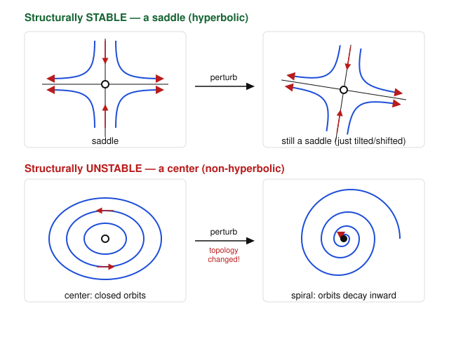

# Dynamical Systems & Chaos · Lesson 3.4: Normal forms and structural stability

> ⏱ ~15 min · Module 3: Bifurcations · Builds on: [3.1](03-01-saddle-node-transcritical.md), [3.2](03-02-pitchfork-symmetry.md), [3.3](03-03-hopf-bifurcation.md) · Unlocks: [4.1 The Lorenz system](04-01-lorenz-system.md)

## Why this matters

The last three lessons each produced a bifurcation with a suspiciously clean equation: the saddle-node was $\dot x = \mu - x^2$, the transcritical $\dot x = \mu x - x^2$, the pitchfork $\dot x = \mu x - x^3$. Those weren't the systems you'd actually meet in a lab — they were *representatives*, the boiled-down essence every messier system reduces to near the bifurcation. This lesson explains why that reduction always works (**normal forms**) and, more deeply, asks a question that governs the whole subject: which phase portraits survive a small nudge to the equations, and which shatter? That property — **structural stability** — is why physical models are trustworthy at all, and why bifurcations are exactly the rare, fragile thresholds where trust breaks down. It's also the hinge into Module 4: chaos will turn out to be structurally stable, which is why a strange attractor is a real, persistent object and not an artifact.

## The idea

Two ideas, tightly linked.

**A normal form is the simplest system with a given local behavior.** Every saddle-node bifurcation — no matter how baroque the original vector field — looks, near the bifurcation point and in the right coordinates, exactly like $\dot x = \mu - x^2$. All the higher-order clutter can be scrubbed away by a smooth change of variables without changing the qualitative picture. So instead of studying infinitely many systems you study *one per bifurcation type*. That's why Lessons 3.1–3.3 could get away with those tidy formulas: they were the normal forms.

**Structural stability asks whether a phase portrait is robust.** Take a system, then perturb the *equations* themselves — add a small arbitrary term to the vector field, not just a small kick to the state. If the phase portrait comes back *qualitatively the same* (same number and type of fixed points, same cycles, same arrangement of who-flows-where), the system is **structurally stable**. If an arbitrarily tiny perturbation can change the qualitative picture, it's **structurally unstable**.

The punchline, which you should hold onto: **hyperbolic things are structurally stable; borderline things are not.** A hyperbolic fixed point (no eigenvalue sitting on the imaginary axis) and a hyperbolic limit cycle keep their character under any small perturbation. A center — eigenvalues exactly $\pm i\omega$, purely imaginary — is the fragile exception: nudge the equations and its closed orbits collapse into a slow spiral. Bifurcation points are structurally unstable *by definition*: they are the parameter values where the picture is about to change, so of course a small push changes it.

## The formal version

**Normal form.** Near a bifurcation, expand the vector field in a Taylor series and use a smooth, near-identity change of coordinates to kill every term that isn't essential. What survives is the **normal form** — the lowest-order polynomial that still produces the bifurcation. The four you've met (and their codimension, defined below):

| Bifurcation | Normal form | Codim |
|---|---|---|
| Saddle-node (fold) | $\dot x = \mu - x^2$ | 1 |
| Transcritical | $\dot x = \mu x - x^2$ | 1 |
| Pitchfork | $\dot x = \mu x - x^3$ | 1 |
| Hopf | $\dot r = \mu r - r^3,\ \dot\theta = \omega$ | 1 |

*In words:* each row is the canonical minimal equation; any real system undergoing that bifurcation is smoothly equivalent to its row near the transition.

**Topological equivalence.** Two systems are **topologically equivalent** if there is a continuous, continuously-invertible map (a homeomorphism) of the phase space onto itself that carries the trajectories of one onto the trajectories of the other, preserving the direction of time. This is the precise meaning of "qualitatively the same picture" — bend and stretch, but don't cut or glue.

**Structural stability.** A vector field $\dot{\mathbf x} = \mathbf f(\mathbf x)$ is **structurally stable** if every sufficiently small perturbation $\mathbf f + \mathbf p$ (with $\mathbf p$ and its first derivatives small) yields a system topologically equivalent to the original.

*In words:* wiggle the equations a little and you get the same phase portrait up to a continuous relabeling of points.

**The hyperbolicity theorem (Peixoto, in spirit).** A fixed point is structurally stable iff it is **hyperbolic** — the linearization has no eigenvalue with zero real part. A limit cycle is structurally stable iff it is hyperbolic (its nontrivial Floquet multiplier, i.e. the slope of the Poincaré return map, has magnitude $\neq 1$). On the plane, roughly, a system is structurally stable iff all its fixed points and cycles are hyperbolic and no trajectory connects two saddles.

*In words:* the borderline cases — eigenvalue exactly on the imaginary axis, cycle with neutral multiplier, saddle-to-saddle connection — are precisely the fragile ones.

**Codimension.** The **codimension** of a phenomenon is the number of parameters you must tune to make it occur *and* not be able to remove it by a small perturbation — equivalently, how many independent conditions the vector field must satisfy. A hyperbolic fixed point is codimension 0: it occurs for an open set of systems, no tuning needed. Hitting a saddle-node, transcritical, pitchfork, or Hopf bifurcation imposes **one** condition (an eigenvalue crosses zero, or a pair crosses the imaginary axis), so each is **codimension 1** — you meet it by turning one knob. A **cusp**, where two saddle-node curves meet tangentially, needs **two** conditions tuned at once: **codimension 2**.

*In words:* codimension counts how many dials must be set to exact values; codimension-1 events are the ones a single-parameter family generically runs into.

**Genericity.** A property is **generic** if it holds for "almost all" systems — an open, dense set in the space of vector fields. Structural stability is generic: a system picked at random is structurally stable with probability one. Bifurcations are the **non-generic exceptions**, a thin measure-zero surface in the space of systems.

*In words:* typical systems are robust; bifurcations are the razor's-edge thresholds you only land on by aiming a parameter at them.

## Picture

A saddle is hyperbolic, so perturbing the equations leaves a saddle — maybe shifted or tilted, but topologically identical (top row). A center is non-hyperbolic (eigenvalues $\pm i\omega$), so a tiny generic perturbation destroys the closed orbits, turning them into a slowly winding spiral — a genuinely different phase portrait (bottom row).

## Worked examples

**Example 1 (reducing a messy family to a normal form).** Consider
$$\dot x = \mu - x^2 + 3x^3 + 7x^4 .$$
Does the extra clutter change the bifurcation at the origin? Near $x=0,\ \mu=0$, compare terms: for small $x$, $|3x^3| \ll |x^2|$ and $|7x^4|\ll|x^2|$, so the quadratic dominates. Formally, the fixed-point condition $\mu = x^2 - 3x^3 - 7x^4 = x^2(1 - 3x - 7x^2)$ still has, for small $\mu>0$, two roots $x \approx \pm\sqrt{\mu}$ splitting off from $x=0$ and none for $\mu<0$ — the saddle-node signature. The higher-order terms only bend the branches slightly. A near-identity change of variable $x = u + a u^2 + \dots$ removes them entirely, leaving $\dot u = \mu - u^2 + O(u^4)$. **Verdict:** the system is smoothly equivalent to the saddle-node normal form $\dot x = \mu - x^2$; the cubic and quartic are irrelevant near the bifurcation. This is exactly why Lesson 3.1 studied only the clean quadratic.

**Example 2 (why the center is the fragile one — the payoff).** Take the linear center
$$\dot x = -y, \qquad \dot y = x,$$
whose Jacobian $\begin{pmatrix} 0 & -1 \\ 1 & 0\end{pmatrix}$ has eigenvalues $\pm i$: purely imaginary, non-hyperbolic. Trajectories are exact circles. Now add the smallest possible perturbation with strength $\varepsilon$:
$$\dot x = \varepsilon x - y, \qquad \dot y = x + \varepsilon y.$$
The new Jacobian $\begin{pmatrix} \varepsilon & -1 \\ 1 & \varepsilon\end{pmatrix}$ has eigenvalues $\varepsilon \pm i$. For *any* $\varepsilon \neq 0$ the real part is nonzero, so the center becomes a spiral — stable if $\varepsilon<0$, unstable if $\varepsilon>0$. In polar form $\dot r = \varepsilon r$: the "circles" now grow or decay. No matter how tiny $\varepsilon$ is, the phase portrait is *qualitatively different* (spiral, not closed orbits). The center is structurally unstable. Contrast a saddle $\dot x = x,\ \dot y = -y$ (eigenvalues $+1,-1$, hyperbolic): the same $\varepsilon$-perturbation moves the eigenvalues to roughly $1+\varepsilon$ and $-1+\varepsilon$, still one positive and one negative — still a saddle. Robust.

This is the same fact from two angles: hyperbolicity is an *open* condition (a small move keeps you in the region "real part $\neq 0$"), while "real part $=0$" is a knife-edge you fall off at the slightest push.

## Watch out

- You might think structural stability is about perturbing the *state* (a kick to the initial condition), but it's about perturbing the *system* — adding a term to the vector field. Lyapunov stability (Lesson 2.2) asks whether trajectories stay near a point; structural stability asks whether the whole phase portrait survives a change to the equations. Different questions.
- You might think a center being "stable" in the everyday sense makes it structurally stable — it doesn't. Its orbits are Lyapunov-stable (neither growing nor decaying), yet the system is structurally *unstable*, because that perfect neutrality is exactly what a perturbation destroys. Neutral = fragile.
- You might think "codimension 1" means "happens often." It's the opposite: codimension-1 events are still non-generic (measure zero in the space of systems). What "codimension 1" buys you is that a *one-parameter family*, sweeping a 1-D curve through system-space, will generically hit them — the way a line generically pierces a surface. A codimension-2 event like the cusp needs a *two*-parameter family to be met robustly; a single knob will miss it.

## One-liner

> Typical systems are structurally stable and hyperbolic; a bifurcation is the rare, non-hyperbolic threshold you only reach by tuning a parameter — and its normal form is the one equation that captures every system crossing it.

## Problems

**P1 (🟢)** Classify each fixed point as hyperbolic or non-hyperbolic, and state whether it is structurally stable. (a) $\dot x = 2x,\ \dot y = 3y$. (b) $\dot x = -x,\ \dot y = 3y$. (c) $\dot x = -y,\ \dot y = x + y^3$ at the origin (use the linearization). (d) A limit cycle whose Poincaré-map slope at the fixed point is $|f'| = 0.4$.

**P2 (🟡)** The two-parameter family $\dot x = \mu_1 + \mu_2 x - x^3$ is the normal form of the **cusp** (codimension 2). (a) Show that when $\mu_1 = 0$ this reduces to a pitchfork in $\mu_2$. (b) For $\mu_2 > 0$ fixed, find the two values of $\mu_1$ at which a saddle-node bifurcation occurs (fixed points collide), by requiring $f = 0$ and $f'=0$ simultaneously. (c) Explain in one sentence why this makes the cusp codimension 2.

**P3 (🔴, optional)** A student claims $\dot x = \mu x - x^2 + x^5$ has a *different* bifurcation at the origin than the plain transcritical $\dot x = \mu x - x^2$, because of the $x^5$ term. Settle it: find the fixed points near the origin for small $\mu$, show their stabilities, and argue whether the $x^5$ term changes the local bifurcation type. (Connect to the normal-form idea from Example 1.)

Solutions

**P1** Hyperbolic means the linearization has *no* eigenvalue with zero real part; hyperbolic $\Rightarrow$ structurally stable.
(a) Eigenvalues $2, 3$ (both real, nonzero) — hyperbolic, an unstable node. **Structurally stable.**
(b) Eigenvalues $-1, 3$ — hyperbolic, a saddle. **Structurally stable.**
(c) Linearization at the origin: Jacobian $\begin{pmatrix} 0 & -1 \\ 1 & 3y^2 \end{pmatrix}\big|_{(0,0)} = \begin{pmatrix} 0 & -1 \\ 1 & 0 \end{pmatrix}$, eigenvalues $\pm i$ — purely imaginary, **non-hyperbolic**. **Not structurally stable** (the nonlinear $y^3$ term decides the true behavior, and a perturbation can flip it — this is the borderline linearization-fails case of Lesson 1.4).
(d) A limit cycle is hyperbolic iff its Poincaré-map slope has magnitude $\neq 1$. Here $|f'| = 0.4 \neq 1$ (and $<1$, so attracting) — hyperbolic, **structurally stable**.

**P2** $f(x) = \mu_1 + \mu_2 x - x^3$.
(a) With $\mu_1 = 0$: $f = \mu_2 x - x^3 = x(\mu_2 - x^2)$. Fixed points $x=0$ and, for $\mu_2>0$, $x = \pm\sqrt{\mu_2}$ — exactly the (supercritical) pitchfork normal form in the parameter $\mu_2$. ✓
(b) Saddle-node = a double root, so require $f=0$ and $f'=0$ together. $f'(x) = \mu_2 - 3x^2 = 0 \Rightarrow x^2 = \mu_2/3 \Rightarrow x = \pm\sqrt{\mu_2/3}$. Substitute into $f=0$: $\mu_1 = x^3 - \mu_2 x = x(x^2 - \mu_2) = x\left(\tfrac{\mu_2}{3} - \mu_2\right) = -\tfrac{2\mu_2}{3}x$. With $x = \pm\sqrt{\mu_2/3}$,
$$\mu_1 = \mp \frac{2\mu_2}{3}\sqrt{\frac{\mu_2}{3}} = \mp \frac{2}{3}\sqrt{\frac{\mu_2^{3}}{3}} = \mp\, 2\left(\frac{\mu_2}{3}\right)^{3/2}.$$
So the two saddle-node values are $\mu_1 = \pm 2\left(\mu_2/3\right)^{3/2}$ — the two branches of the cusp curve $27\mu_1^2 = 4\mu_2^3$, meeting at the origin.
(c) Reaching the cusp point itself (where the two saddle-node curves meet, $\mu_1 = \mu_2 = 0$) requires tuning **two** parameters to exact values simultaneously — two independent conditions — so it is codimension 2; a one-parameter path through parameter space generically misses it.

**P3** $f(x) = \mu x - x^2 + x^5$. Fixed points solve $x(\mu - x + x^4) = 0$: one root at $x=0$, and the others from $\mu = x - x^4$. For small $x$ the $x^4$ is negligible, so the nonzero fixed point sits at $x^* \approx \mu$ (to leading order), just as for the plain transcritical.
Stabilities from $f'(x) = \mu - 2x + 5x^4$:
- At $x=0$: $f'(0) = \mu$. Stable for $\mu<0$, unstable for $\mu>0$.
- At $x^*\approx \mu$: $f'(\mu) \approx \mu - 2\mu + O(\mu^4) = -\mu$. Unstable for $\mu<0$, stable for $\mu>0$.
So the two branches **exchange stability** as $\mu$ passes through $0$ — the defining transcritical signature, identical to $\dot x = \mu x - x^2$. The $x^5$ term shifts the branches by an amount $O(\mu^4)$, invisible near the origin, and a near-identity coordinate change removes it. **Verdict:** same local bifurcation type; the student is wrong. Higher-than-quadratic terms are irrelevant to a transcritical, exactly as in Example 1 — that irrelevance *is* the normal-form theorem at work.

## Flashback

**From Lesson 3.1 (Saddle-node and transcritical):** For the one-parameter family
$$\dot x = \mu + 4x^2,$$
find the bifurcation value of $\mu$, classify the bifurcation, and reduce it to the standard saddle-node normal form $\dot y = \nu - y^2$ by a change of variables (identify $\nu$ and the substitution).

Solution

Fixed points: $\mu + 4x^2 = 0 \Rightarrow x^2 = -\mu/4$, so $x = \pm\tfrac12\sqrt{-\mu}$. Real solutions exist only for $\mu \le 0$: **two** fixed points for $\mu<0$, **one** (double) at $x=0$ when $\mu=0$, **none** for $\mu>0$. Two points colliding and vanishing as $\mu$ increases through $0$ is a **saddle-node bifurcation** at $\mu = 0$.

Stability check with $f'(x) = 8x$: for $\mu<0$ the point $x=-\tfrac12\sqrt{-\mu}$ has $f'<0$ (stable) and $x=+\tfrac12\sqrt{-\mu}$ has $f'>0$ (unstable) — the stable/unstable pair that annihilates.

Reduction to $\dot y = \nu - y^2$: the coefficient sign on $x^2$ is $+$, so substitute $x = -\tfrac12 y$ (the minus flips orientation; the $\tfrac12$ fixes the coefficient). Then $\dot x = -\tfrac12 \dot y$ and
$$-\tfrac12 \dot y = \mu + 4\left(\tfrac14 y^2\right) = \mu + y^2 \;\Longrightarrow\; \dot y = -2\mu - 2y^2.$$
Rescale time $\tau = 2t$ (so $\tfrac{dy}{d\tau} = \tfrac12\dot y$): $\tfrac{dy}{d\tau} = -\mu - y^2$. Setting $\nu = -\mu$ gives the standard form
$$\frac{dy}{d\tau} = \nu - y^2,$$
with $\nu = -\mu$. The bifurcation at $\mu=0$ maps to $\nu=0$, and $\nu>0$ (i.e. $\mu<0$) is the two-fixed-point side — consistent with the count above. ✓

## Connections

- **Backward:** this closes Module 3 by unifying Lessons 3.1–3.3 — every bifurcation you unfolded was a codimension-1 normal form, and now you know *why* those simple equations were legitimate stand-ins (the normal-form theorem). It also reframes Lesson 1.4: "hyperbolic" fixed points, where Hartman–Grobman lets linearization succeed, are precisely the structurally stable ones, and the "linearization fails" cases (centers, zero eigenvalues) are exactly the structurally unstable, non-hyperbolic ones.
- **Forward:** [Lesson 4.1](04-01-lorenz-system.md) enters three dimensions, where a *structurally stable* strange attractor becomes possible — the robustness ideas here are what make a strange attractor a real, persistent object rather than a numerical fluke. The trajectories on it are hyperbolic (positive Lyapunov exponent, Lesson 4.4) yet the attractor as a whole survives perturbation.
- **Sideways (fluid dynamics):** the codimension-1 Hopf bifurcation of Lesson 3.3 is the generic onset of oscillatory convection in [`fluid-dynamics`](../../fluid-dynamics/syllabus.md); "codimension 1" is why a single control parameter (a temperature gradient) reliably drives a fluid across that threshold. Higher-codimension bifurcations require tuning several physical parameters at once, which is why they are rare in practice.
- **Sideways (economics):** in [`grad-micro`](../../grad-micro/syllabus.md), a Walrasian tâtonnement equilibrium is economically meaningful only if it is robust to small changes in the excess-demand functions — that robustness is structural stability, and a hyperbolic (transversal) equilibrium is the generic, trustworthy case, while knife-edge non-hyperbolic equilibria are the fragile exceptions.
