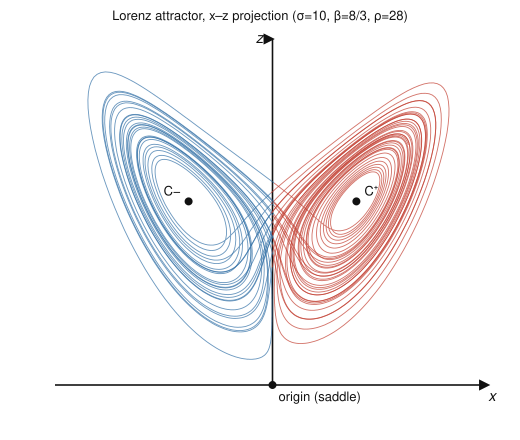

# Dynamical Systems & Chaos · Lesson 4.1: The Lorenz system

> ⏱ ~15 min · Module 4: Chaos in flows · Builds on: [1.4 Linearization](01-04-linearization-hartman-grobman.md), [2.4 Poincaré–Bendixson](02-04-poincare-bendixson.md), [3.3 Hopf bifurcation](03-03-hopf-bifurcation.md) · Unlocks: [4.2 Sensitive dependence](04-02-sensitive-dependence.md)

## Why this matters

In 1963 a meteorologist named Edward Lorenz stripped weather down to three numbers and found something that shouldn't exist: a system with no randomness in it, no stable resting state, no repeating cycle — yet motion that never settles and never repeats. This is the first **strange attractor**, and it is the reason long-range weather forecasting is impossible in principle, not just in practice. Everything Module 2 taught you about the plane — that a bounded trajectory must die at a fixed point or wind onto a cycle — was a *two-dimensional* fact. Add one dimension and that guarantee collapses. This lesson meets the object that breaks it.

## The idea

Heat a shallow layer of fluid from below (a pan of water, the atmosphere over warm ground). Cold heavy fluid sits on top of hot light fluid — an unstable arrangement. Turn up the heat gently and nothing happens; conduction carries it. Past a threshold the fluid gives up and starts to **roll**: warm fluid rises on one side, cools, sinks on the other. This is Rayleigh–Bénard convection.

Lorenz took the (infinite-dimensional) fluid equations and brutally truncated them to just **three modes** — three numbers that summarize the whole flow:

- $x$ — how fast the convection roll is turning (its intensity),
- $y$ — the temperature difference between the rising and descending fluid,
- $z$ — how far the vertical temperature profile has bent away from a straight conduction line.

These are *amplitudes of patterns*, not positions in space. The single knob is $\rho$, proportional to the **Rayleigh number** — how hard you're heating. Crank $\rho$ up and the story runs: no motion → steady rolls → rolls that wobble → rolls that flip chaotically from clockwise to counterclockwise, forever, at unpredictable times. The two lobes of the butterfly you'll draw below *are* those two spin directions, and the trajectory's endless jumping between them is the fluid reversing its roll.

## The formal version

**The Lorenz equations.**
$$\dot x = \sigma(y - x), \qquad \dot y = x(\rho - z) - y, \qquad \dot z = xy - \beta z.$$
Here $\sigma>0$ is the Prandtl number (fluid property), $\beta>0$ a geometric aspect-ratio constant, and $\rho>0$ the driving. The **classic** values, the ones "the Lorenz system" refers to, are
$$\sigma = 10, \qquad \beta = \tfrac{8}{3}, \qquad \rho = 28.$$
*In words:* three coupled quadratic ODEs; the only nonlinearities are the products $xz$ and $xy$ — mild-looking, and yet.

**Symmetry.** The equations are unchanged under $(x,y,z)\mapsto(-x,-y,z)$: flip the sign of the roll and its temperature contrast together and the physics is identical. Every structure comes in mirror pairs — including the two wings.

**Fixed points.** Setting $\dot x=\dot y=\dot z=0$: the first equation forces $y=x$; the second then gives $x(\rho-1-z)=0$; the third gives $x^2=\beta z$. Two cases:

- The **origin** $O=(0,0,0)$ — no convection, pure conduction. Exists for all $\rho$.
- A **symmetric pair**, present only for $\rho>1$:
$$C^{\pm}=\left(\pm\sqrt{\beta(\rho-1)},\ \pm\sqrt{\beta(\rho-1)},\ \rho-1\right),$$
the two steady convection rolls (clockwise / counterclockwise). At the classic $\rho=28$: $C^{\pm}=(\pm 6\sqrt2,\ \pm 6\sqrt2,\ 27)\approx(\pm 8.49,\ \pm 8.49,\ 27)$.

**Stability of the origin.** The Jacobian of $\mathbf f=(\dot x,\dot y,\dot z)$ is
$$J(x,y,z)=\begin{pmatrix} -\sigma & \sigma & 0\\ \rho-z & -1 & -x\\ y & x & -\beta \end{pmatrix},\qquad J(O)=\begin{pmatrix} -\sigma & \sigma & 0\\ \rho & -1 & 0\\ 0 & 0 & -\beta \end{pmatrix}.$$
The $z$-direction decouples with eigenvalue $-\beta<0$; the $x$–$y$ block has trace $-(\sigma+1)$ and determinant $\sigma(1-\rho)$. For $\rho>1$ that determinant is **negative**, so the block has one positive and one negative eigenvalue: the origin is a **saddle** (a 1-D unstable direction, a 2-D stable one). *In words:* once you heat past $\rho=1$, "no motion" becomes a repeller — the flow is pushed off it and can never come back to rest there.

**Stability of $C^{\pm}$, and their Hopf death.** For $1<\rho$ just above $1$, $C^{\pm}$ are stable — steady convection. As $\rho$ grows they lose stability through a **subcritical Hopf bifurcation** (Lesson [3.3](03-03-hopf-bifurcation.md)): a complex-conjugate eigenvalue pair crosses the imaginary axis at
$$\rho_H=\sigma\,\frac{\sigma+\beta+3}{\sigma-\beta-1}\approx 24.74\quad(\text{classic }\sigma,\beta).$$
*In words:* past $\rho_H\approx 24.74$, **both** convection states are unstable too. And because the Hopf is *subcritical*, the limit cycle it involves is unstable and sits on the *low-$\rho$ side* — no stable oscillation is born to catch the flow. So at $\rho=28$ there is **no stable fixed point and no stable limit cycle anywhere.** The trajectory is bounded (energy considerations trap it), it cannot rest, it cannot cycle — it is forced onto a bounded, non-periodic **attractor**.

**Volume contraction.** The flow shrinks phase-space volume everywhere at a constant rate:
$$\nabla\cdot\mathbf f=\frac{\partial\dot x}{\partial x}+\frac{\partial\dot y}{\partial y}+\frac{\partial\dot z}{\partial z}=-\sigma-1-\beta=-(\sigma+1+\beta)<0.$$
By Liouville's theorem a blob of initial conditions of volume $V_0$ has volume $V(t)=V_0\,e^{-(\sigma+1+\beta)t}$ (classic rate $-13\tfrac{2}{3}$). *In words:* the system is **dissipative** — any cloud of states is crushed exponentially fast toward a limit set of **zero volume**. Yet that set is not a point (all fixed points repel) and not a closed curve or surface (the flow stretches nearby trajectories apart — Lesson [4.2](04-02-sensitive-dependence.md)). Something of zero volume that is neither point, curve, nor surface: a **strange attractor**, whose "in-between" fractal dimension is measured in Lesson [4.5](04-05-fractal-dimension.md).

**Why chaos needs three dimensions.** In the plane, Poincaré–Bendixson (Lesson [2.4](02-04-poincare-bendixson.md)) says a bounded trajectory that avoids fixed points must approach a closed orbit — trajectories can't cross, and that alone leaves no room to wander forever. In 3-D a trajectory can pass *over or under* its own earlier path without intersecting it, so the flow can **stretch** volumes in one direction while **contracting** in others and **fold** them back — endlessly, without repeating. Stretch-and-fold in a dissipative 3-D flow is exactly what the Lorenz attractor is doing.

## Picture

The two-lobed $x$–$z$ projection — the Lorenz "butterfly." Each lobe is trajectories spiraling *outward* around one of the unstable convection points $C^{\pm}$; when a spiral grows too large it is flung across to the other lobe, and the flip repeats forever without ever exactly retracing itself.

## Worked examples

**Example 1 (mechanical — locate the fixed points).** Find every fixed point for $\sigma=10,\ \beta=\tfrac83,\ \rho=28$.

Set the right-hand sides to zero. From $\dot x=0$: $\sigma(y-x)=0\Rightarrow y=x$. Substitute into $\dot y=0$: $x(\rho-z)-x=x(\rho-1-z)=0$, so either $x=0$ or $z=\rho-1$.

- If $x=0$ then $y=0$, and $\dot z=0$ gives $-\beta z=0\Rightarrow z=0$: the origin $O=(0,0,0)$.
- If $z=\rho-1=27$, then $\dot z=0$ reads $x^2=\beta z=\tfrac83\cdot 27=72$, so $x=\pm\sqrt{72}=\pm6\sqrt2$ and $y=x$:
$$C^{\pm}=(\pm6\sqrt2,\ \pm6\sqrt2,\ 27)\approx(\pm8.49,\ \pm8.49,\ 27).$$

Three fixed points total — and we already know each is unstable at $\rho=28$ ($O$ a saddle; $C^{\pm}$ past their Hopf threshold $24.74$). No equilibrium can hold the flow.

**Example 2 (why you'd care — the flow has nowhere to land).** Two facts together force the strange attractor.

*(a) Zero-volume target.* The divergence is $-(\sigma+1+\beta)=-(10+1+\tfrac83)=-\tfrac{41}{3}\approx-13.67$. A cloud of initial states of volume $V_0$ becomes
$$V(t)=V_0\,e^{-13.67\,t}.$$
After just one time unit it has shrunk by $e^{-13.67}\approx 1.2\times10^{-6}$ — a millionfold. So whatever the long-run set is, it has **zero volume**: the motion is confined to an infinitely thin sheet.

*(b) Nowhere thin-and-stable to land.* The only zero-volume rest states are the three fixed points, and all three are unstable at $\rho=28$ (Example 1). The subcritical Hopf leaves no stable cycle either. A trajectory is bounded but is repelled by every equilibrium and never closes up — so it must fill out a bounded, non-repeating set of zero volume. That set is the attractor drawn above.

The lesson of (a)+(b): *dissipation says the attractor is infinitely thin; instability of every equilibrium says the motion on it never stops.* Reconciling those is only possible in $\ge 3$ dimensions.

## Watch out

- **You might think $x,y,z$ are positions in space** — they're not. They are *amplitudes* of three convection patterns; "$x<0$" means the roll spins the other way, not "to the left." Likewise $\rho$ is a dimensionless heating strength (Rayleigh number), not a temperature.
- **You might think the Hopf at $\rho_H$ gives birth to a stable oscillation** the way Module 3's supercritical Hopf did — but the Lorenz Hopf is *subcritical*: the cycle it involves is **unstable** and lives *below* $\rho_H$. Nothing periodic and stable exists above it, which is precisely why the flow has no cycle to relax onto. (Strikingly, the chaotic attractor is actually present a bit *before* $\rho_H$, coexisting with the still-stable $C^{\pm}$ — but that subtlety is beyond us here.)
- **You might think "zero volume" means "dimension zero" (a point) or an ordinary surface (dimension 2).** It's neither. Volume-contraction ($\nabla\cdot\mathbf f<0$) kills 3-D volume but says nothing about finer structure; the attractor turns out to have a *fractional* dimension near $2.06$ (Lesson [4.5](04-05-fractal-dimension.md)). Dissipative ≠ collapses-to-a-point.
- **You might think three unstable fixed points imply trajectories escape to infinity.** They don't — the quadratic terms are energy-conserving (they cancel in $\tfrac{d}{dt}(x^2+y^2+z^2)$), so far from the origin the linear damping wins and everything is swept back inward. The flow is trapped in a bounded region *and* repelled from within it: the recipe for a strange attractor.

## One-liner

> Heat a fluid past a threshold and three coupled modes settle onto a bounded, zero-volume, never-repeating butterfly — every equilibrium unstable, every cycle absent, chaos made possible only by the third dimension.

## Problems

**P1 (🟢)** Take $\sigma=10,\ \beta=\tfrac83$ but set $\rho=20$. (a) Locate all three fixed points. (b) Classify the origin by computing the eigenvalues of $J(O)$ (you can use trace/determinant of the $x$–$y$ block plus the decoupled $z$-eigenvalue).

**P2 (🟡)** (a) Verify the Hopf threshold formula gives $\rho_H\approx 24.74$ at the classic $\sigma=10,\beta=\tfrac83$. (b) The formula needs $\sigma>\beta+1$ for a positive, finite $\rho_H$. What does it mean physically if $\sigma\le\beta+1$ — do $C^{\pm}$ ever lose stability by this Hopf? (c) A small blob of initial conditions has volume $V_0$. At the classic parameters, how long until its volume falls to $1\%$ of $V_0$?

**P3 (🔴, optional)** Prove that for $0<\rho<1$ the origin is *globally* asymptotically stable (so no chaos is possible below $\rho=1$). Use the candidate Lyapunov function $V(x,y,z)=\dfrac{x^2}{\sigma}+y^2+z^2$ from Lesson [2.2](02-02-lyapunov-functions.md): compute $\dot V$ along the flow and show it is negative definite when $\rho<1$.

Solutions

**P1.** (a) Same algebra as Example 1. Origin $O=(0,0,0)$. For the pair, $z=\rho-1=19$ and $x^2=\beta z=\tfrac83\cdot 19=\tfrac{152}{3}\approx 50.67$, so
$$C^{\pm}=(\pm\sqrt{50.67},\ \pm\sqrt{50.67},\ 19)\approx(\pm7.12,\ \pm7.12,\ 19).$$

(b) $J(O)=\begin{pmatrix}-10&10&0\\ \rho&-1&0\\ 0&0&-\beta\end{pmatrix}$ with $\rho=20,\beta=\tfrac83$. The $z$-block gives $\lambda_3=-\tfrac83\approx-2.67$. The $x$–$y$ block $\begin{pmatrix}-10&10\\ 20&-1\end{pmatrix}$ has trace $\tau=-11$ and determinant $\Delta=(-10)(-1)-(10)(20)=10-200=-190<0$. A negative determinant means real eigenvalues of opposite sign:
$$\lambda=\frac{\tau\pm\sqrt{\tau^2-4\Delta}}{2}=\frac{-11\pm\sqrt{121+760}}{2}=\frac{-11\pm\sqrt{881}}{2}\approx\frac{-11\pm29.68}{2},$$
so $\lambda_1\approx 9.34$, $\lambda_2\approx -20.34$. Eigenvalues $\{+9.34,\,-20.34,\,-2.67\}$: one positive, two negative — the origin is a **saddle** with a 1-D unstable manifold and a 2-D stable manifold. (As expected for any $\rho>1$.)

**P2.** (a) $\rho_H=\sigma\dfrac{\sigma+\beta+3}{\sigma-\beta-1}=10\cdot\dfrac{10+\tfrac83+3}{10-\tfrac83-1}=10\cdot\dfrac{47/3}{19/3}=10\cdot\dfrac{47}{19}=\dfrac{470}{19}\approx 24.74.$ ✓

(b) If $\sigma\le\beta+1$ the denominator $\sigma-\beta-1$ is $\le 0$, so the formula returns a negative or infinite $\rho_H$ — there is **no** finite positive threshold. Physically: the convection states $C^{\pm}$ never lose stability through this Hopf, so this route to chaos is closed. A low Prandtl number relative to the geometry keeps steady convection stable however hard you heat. (The classic $\sigma=10$ sits comfortably above $\beta+1=\tfrac{11}{3}\approx3.67$.)

(c) $V(t)=V_0e^{-(\sigma+1+\beta)t}$ with rate $\sigma+1+\beta=\tfrac{41}{3}\approx13.67$. Solve $e^{-13.67\,t}=0.01$:
$$t=\frac{\ln 100}{13.67}=\frac{4.605}{13.67}\approx 0.337\ \text{time units}.$$
Volume collapses almost instantly — the flow is strongly dissipative.

**P3.** Compute $\dot V$ along trajectories. With $V=\tfrac{x^2}{\sigma}+y^2+z^2$,
$$\tfrac12\dot V=\frac{x\dot x}{\sigma}+y\dot y+z\dot z.$$
Term by term:
$$\frac{x\dot x}{\sigma}=\frac{x\,\sigma(y-x)}{\sigma}=xy-x^2,$$
$$y\dot y=y\big(x(\rho-z)-y\big)=\rho xy-xyz-y^2,$$
$$z\dot z=z(xy-\beta z)=xyz-\beta z^2.$$
Add: the $\pm xyz$ terms cancel, leaving
$$\tfrac12\dot V=-x^2+(1+\rho)xy-y^2-\beta z^2=-\Big[\,x^2-(1+\rho)xy+y^2\,\Big]-\beta z^2.$$
The bracketed quadratic form has matrix $\begin{pmatrix}1&-\tfrac{1+\rho}{2}\\[2pt]-\tfrac{1+\rho}{2}&1\end{pmatrix}$, which is positive definite iff its determinant $1-\tfrac{(1+\rho)^2}{4}>0$, i.e. iff $(1+\rho)^2<4$, i.e. (for $\rho>0$) iff $\rho<1$. When $\rho<1$ the bracket is $>0$ for all $(x,y)\ne(0,0)$ and $\beta z^2\ge 0$, so $\dot V<0$ for every $(x,y,z)\ne(0,0,0)$. Since $V$ is positive definite and radially unbounded with $\dot V$ negative definite, the origin is **globally asymptotically stable** for $0<\rho<1$. (And $C^{\pm}$ don't even exist there.) Below $\rho=1$ everything decays to no-convection: chaos is impossible until you heat past the threshold. $\blacksquare$

## Flashback

**From Lesson 1.4 (Linearization):** Consider the Lorenz equations with the mild parameters $\sigma=4,\ \rho=\tfrac12,\ \beta=1$. Compute the Jacobian at the origin and classify the fixed point. (This is a Rayleigh–Bénard convection model truncated to three modes — the bridge to [`fluid-dynamics`](../../fluid-dynamics/syllabus.md) — being run *below* its onset of convection.)

Solution

The Jacobian at the origin is
$$J(O)=\begin{pmatrix}-\sigma&\sigma&0\\ \rho&-1&0\\ 0&0&-\beta\end{pmatrix}=\begin{pmatrix}-4&4&0\\ \tfrac12&-1&0\\ 0&0&-1\end{pmatrix}.$$
The $z$-direction decouples: $\lambda_3=-\beta=-1$. The $x$–$y$ block $\begin{pmatrix}-4&4\\ \tfrac12&-1\end{pmatrix}$ has trace $\tau=-5$ and determinant $\Delta=(-4)(-1)-(4)(\tfrac12)=4-2=2$. Here $\Delta=2>0$ and $\tau=-5<0$, and the discriminant $\tau^2-4\Delta=25-8=17>0$, so both eigenvalues are real and negative:
$$\lambda=\frac{-5\pm\sqrt{17}}{2}\approx -0.44,\ -4.56.$$
All three eigenvalues $\{-0.44,\,-4.56,\,-1\}$ are real and negative, so the origin is a **stable node** — every nearby trajectory decays to no-convection. This matches the theory: with $\rho=\tfrac12<1$ the origin is the *only* fixed point and it attracts everything (exactly what P3 proves globally). Only once $\rho$ crosses $1$ does the origin turn saddle and the convection states appear. $\blacksquare$

## Connections

- **Backward:** the whole lesson is Module 1's linearization machinery ([1.4](01-04-linearization-hartman-grobman.md)) run in 3-D — Jacobian, eigenvalues, trace/determinant of a $2\times2$ block — plus Module 3's Hopf bifurcation ([3.3](03-03-hopf-bifurcation.md)) deciding when the convection states die, and the Poincaré–Bendixson prison of Module 2 ([2.4](02-04-poincare-bendixson.md)) — the very theorem the third dimension lets us escape.
- **Forward:** [4.2](04-02-sensitive-dependence.md) makes the "never repeats" precise as *sensitive dependence on initial conditions*; [4.3](04-03-strange-attractors.md) dissects the stretch-and-fold geometry; [4.4](04-04-lyapunov-exponents.md) and [4.5](04-05-fractal-dimension.md) quantify the attractor with a positive Lyapunov exponent and its fractional dimension ($\approx 2.06$).
- **Sideways (fluid dynamics):** the Lorenz system is a three-mode truncation of Rayleigh–Bénard convection — the onset of steady rolls is a bifurcation at $\rho=1$, and their loss of stability is the Hopf of Module 3. See the convection thread in [`fluid-dynamics`](../../fluid-dynamics/syllabus.md); this course is where its *low-dimensional shadow* becomes chaotic.
