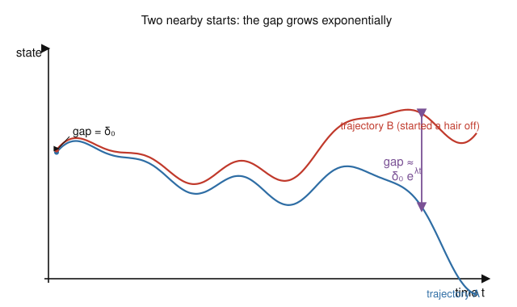

# Dynamical Systems & Chaos · Lesson 4.2: Sensitive dependence and the butterfly effect

> ⏱ ~15 min · Module 4: Chaos in flows · Builds on: [Lesson 4.1](04-01-lorenz-system.md) · Unlocks: [Lesson 4.3](04-03-strange-attractors.md)

## Why this matters

In Lesson 4.1 you watched the Lorenz trajectory wander forever between two lobes, never settling and never repeating. That raises the sharp question this lesson answers: if the equations are perfectly deterministic — the future is a function of the present, no randomness anywhere — why can't we predict it? The answer is the single most famous idea in chaos theory, the "butterfly effect," and it comes with a brutal quantitative punchline: the time you can forecast grows only *logarithmically* in how precisely you know the starting state. This is why weather forecasts die at about two weeks no matter how many sensors you launch, and it's the operational definition of chaos that the rest of the module quantifies.

## The idea

Take two copies of the same system started almost — but not exactly — at the same point. In a *non-chaotic* system (a stable fixed point, a limit cycle) the two copies stay close or even converge: a small error stays small, so the future is predictable from an approximate present. That's the world Modules 1–3 lived in.

Chaos is the opposite reflex. The two nearby trajectories **pull apart exponentially fast**. A gap of one part in a million doesn't stay a millionth — it doubles, and doubles again, on some fixed timescale, until the two copies are as far apart as the attractor is wide and all resemblance is gone. Nothing random happened; the system simply *amplifies* the difference you couldn't measure.

The consequence is savage. Because the gap grows like $e^{\lambda t}$, closing it — buying more forecast time — requires you to *shrink your initial error exponentially*. Ten times more forecast horizon costs you not ten times but astronomically more precision. Determinism guarantees the future is fixed; sensitive dependence guarantees you can't compute it. **Determinism is not predictability.**

## The formal version

Let $\mathbf x(t)$ and $\mathbf x'(t)$ be two trajectories of the same system, and let $\boldsymbol\delta(t) = \mathbf x'(t) - \mathbf x(t)$ be their separation, with initial gap $\boldsymbol\delta_0 = \boldsymbol\delta(0)$. For a chaotic system, as long as the gap is still small,

$$\lVert \boldsymbol\delta(t)\rVert \;\approx\; \lVert\boldsymbol\delta_0\rVert\, e^{\lambda t}, \qquad \lambda > 0.$$

*In words:* nearby trajectories separate exponentially, and the rate constant $\lambda$ — the **largest Lyapunov exponent** — is positive. A positive $\lambda$ *is* the signature of chaos; we compute it properly in [Lesson 4.4](04-04-lyapunov-exponents.md). Here $\lVert\cdot\rVert$ is ordinary distance in state space.

Two immediate readings of $\lambda$:

- **e-folding time** $1/\lambda$: the time for the gap to grow by a factor of $e\approx 2.7$.
- **Doubling time** $t_2 = \dfrac{\ln 2}{\lambda}$: the time for the gap to double.

This exponential law only holds while $\boldsymbol\delta$ is small. Once the gap approaches the size of the attractor it stops growing — the trajectories are trapped on a bounded set and can't separate further; they just visit it in unrelated order. Call that saturation scale $a$ (the "prediction tolerance": the gap at which your forecast is worthless). Setting $\lVert\boldsymbol\delta_0\rVert e^{\lambda t}\approx a$ and solving for $t$ gives the **prediction horizon**:

$$t_{\text{horizon}} \;\sim\; \frac{1}{\lambda}\,\ln\!\left(\frac{a}{\lVert\boldsymbol\delta_0\rVert}\right).$$

*In words:* the length of time you can forecast is set by how many e-foldings fit between your starting error and the attractor's size — and it depends only **logarithmically** on your precision $\lVert\boldsymbol\delta_0\rVert$. That single $\ln$ is the whole tragedy: improving your measurements by a factor of 1000 adds only $\ln(1000)/\lambda \approx 6.9/\lambda$ to the horizon, a fixed constant, not a factor.

**A working definition of chaos.** A deterministic system is **chaotic** if it exhibits:

1. **aperiodic long-term behavior** — trajectories that never settle to a fixed point, periodic orbit, or quasiperiodic orbit;
2. **sensitive dependence on initial conditions** — the $\lambda>0$ exponential separation above;
3. all of it playing out on a **bounded attractor** — the motion stays in a finite region and doesn't escape to infinity.

*In words:* chaos is bounded, deterministic, never-repeating motion that amplifies tiny differences. All three clauses are load-bearing — drop boundedness and you just have a blow-up; drop aperiodicity and $\lambda$ can't stay positive without the trajectory leaving; drop sensitivity and it's predictable. (Problem 3 shows why boundedness can't be dropped.)

## Picture

Two trajectories of the same deterministic system, started a hair apart (the two dots at left, separation $\delta_0$). For a while they shadow each other so closely you'd swear they were one curve — then the exponential wins, the purple gap $\delta_0 e^{\lambda t}$ blows open, and by the right edge the blue and red copies are doing entirely different things. Same equations, same rules, imperceptibly different start.

## Worked examples

**Example 1 (mechanical — reading a horizon off $\lambda$).** A chaotic system has largest Lyapunov exponent $\lambda = 0.5$ per day. You know the initial state to a precision $\lVert\boldsymbol\delta_0\rVert = 10^{-3}$ (in state-space units), and your forecast is useless once the error reaches $a = 1$. How long can you predict, and what's the doubling time?

$$t_{\text{horizon}} \approx \frac{1}{\lambda}\ln\!\frac{a}{\lVert\boldsymbol\delta_0\rVert} = \frac{1}{0.5}\,\ln\!\frac{1}{10^{-3}} = 2\ln(1000) = 2(6.908) \approx 13.8 \text{ days}.$$

Doubling time: $t_2 = \dfrac{\ln 2}{\lambda} = \dfrac{0.693}{0.5} \approx 1.4$ days. So the error doubles every day and a bit; after about ten doublings ($\approx$ 14 days) a millimeter of initial uncertainty has grown to the full scale of the system. That's a toy model of why numerical weather prediction saturates near two weeks.

**Example 2 (why you'd care — precision buys almost nothing).** Same system as Example 1. A rival forecasting center spends a fortune and improves the initial precision by a factor of $1000$, to $\lVert\boldsymbol\delta_0'\rVert = 10^{-6}$. How much further ahead can they forecast?

$$t_{\text{horizon}}' = \frac{1}{0.5}\ln\!\frac{1}{10^{-6}} = 2\ln(10^{6}) = 2(13.816) \approx 27.6 \text{ days}.$$

A **thousandfold** improvement in measurement precision merely doubled the horizon, from 13.8 to 27.6 days — it bought a flat $\tfrac{1}{\lambda}\ln(1000) \approx 13.8$ extra days, and the *next* thousandfold would buy the same 13.8 again, not more. Turn it around: to **double** your horizon you must **square** your precision (drive $\delta_0 \to \delta_0^2/a$). Against exponential divergence, throwing accuracy at the problem is a losing race — the reason long-range weather prediction is not an engineering problem but a mathematical wall.

## Watch out

- **You might think "sensitive dependence" means the system is random or noisy — but it's perfectly deterministic.** No noise is added anywhere; the same initial condition always gives the exact same trajectory. The unpredictability lives entirely in your *uncertainty about the start*, which the dynamics then magnify. Chaos is amplification, not randomness.
- **You might think exponential separation alone means chaos — it doesn't.** A saddle point, or the linear system $\dot x = x$, separates nearby points like $e^{t}$, yet neither is chaotic: the trajectories fly off to infinity (unbounded) and never come back to interweave. Chaos needs the separation to happen *on a bounded attractor*, which forces the stretching to coexist with folding (Lesson 4.3). Positive $\lambda$ **and** boundedness together.
- **You might think a bigger $\lambda$ or better computer meaningfully extends the horizon — but the dependence on precision is logarithmic.** Doubling your sensor budget, or your floating-point digits, shifts $t_{\text{horizon}}$ by an additive constant, never a multiplicative one. The horizon is essentially fixed by $\lambda$ and the size of the attractor.

## One-liner

> Chaos is deterministic amplification: nearby trajectories split like $e^{\lambda t}$ on a bounded attractor, so the future is fixed yet unforecastable, and precision buys only $\ln$-slow gains in horizon.

## Problems

**P1 (🟢)** A chaotic flow has largest Lyapunov exponent $\lambda = 0.9$ per time-unit (roughly the Lorenz value at its classic parameters). You know the initial state to $\lVert\boldsymbol\delta_0\rVert = 10^{-4}$ and lose all skill once the separation reaches $a = 10$. (a) Estimate the prediction horizon. (b) Find the doubling time. (c) Roughly how many doublings occur before the forecast dies?

**P2 (🟡)** Using $t_{\text{horizon}} \approx \frac{1}{\lambda}\ln(a/\lVert\boldsymbol\delta_0\rVert)$ with $a$ fixed, suppose your current precision gives a horizon of exactly $10$ days. You want a $20$-day horizon. By what factor must you shrink $\lVert\boldsymbol\delta_0\rVert$? Show that the required precision is the *square* (relative to $a$) of your current one, and explain in one sentence why this makes long-range forecasting hopeless.

**P3 (🔴, optional)** The linear system $\dot x = \lambda x$ with $\lambda>0$ has solutions $x(t)=x_0 e^{\lambda t}$, so two starts $x_0$ and $x_0'$ separate as $|x'(t)-x(t)| = |x_0'-x_0|\,e^{\lambda t}$ — textbook exponential sensitivity with a positive rate. Yet this system is **not** chaotic. Point to the exact clause of the working definition it violates, and explain why that clause is what forces genuine chaos to also *fold* trajectories back rather than only stretch them.

Solutions

**P1** (a) $\displaystyle t_{\text{horizon}} \approx \frac{1}{0.9}\ln\!\frac{10}{10^{-4}} = \frac{1}{0.9}\ln(10^{5}) = \frac{11.513}{0.9} \approx 12.8$ time-units.
(b) $t_2 = \dfrac{\ln 2}{\lambda} = \dfrac{0.693}{0.9} \approx 0.77$ time-units.
(c) Number of doublings $= t_{\text{horizon}}/t_2 \approx 12.8/0.77 \approx 16.6$, i.e. about $16$–$17$ doublings. Check directly: the gap must grow by a factor $a/\delta_0 = 10^5$, and $\log_2(10^5) = 5\log_2 10 \approx 5(3.32) = 16.6$ doublings. ✓ (The two routes agree because $t_{\text{horizon}}/t_2 = \ln(a/\delta_0)/\ln 2 = \log_2(a/\delta_0)$.)

**P2** Write the two horizons with the same $\lambda$ and $a$:
$$10 = \frac{1}{\lambda}\ln\!\frac{a}{\delta_0}, \qquad 20 = \frac{1}{\lambda}\ln\!\frac{a}{\delta_0'}.$$
Dividing, $\ln(a/\delta_0') = 2\ln(a/\delta_0) = \ln\big((a/\delta_0)^2\big)$, so
$$\frac{a}{\delta_0'} = \left(\frac{a}{\delta_0}\right)^2 \quad\Longrightarrow\quad \delta_0' = \frac{\delta_0^{\,2}}{a}.$$
The new precision is the *square* of the old one (measured relative to $a$). Concretely, if $a=1$ and the current $\delta_0 = 10^{-3}$ (10-day horizon), a 20-day horizon needs $\delta_0' = 10^{-6}$ — the error factor jumps from $10^{-3}$ to $10^{-6}$, a further factor of $1000$. Each *additive* doubling of the horizon costs a *multiplicative squaring* of precision, so horizons grow like the logarithm of effort: long-range forecasting is defeated by arithmetic, not by better instruments.

**P3** It violates clause **3, boundedness** (equivalently, it has no attractor — trajectories escape to infinity). With $x_0 \ne x_0'$ the separation $|x_0'-x_0|e^{\lambda t}\to\infty$ and the states themselves run off to $\pm\infty$; there is no bounded region the motion is confined to, and the behavior is not aperiodic-on-an-attractor — it's just monotone blow-up. Sensitive dependence (clause 2) holds, but pure stretching without a bounded arena isn't chaos.

Why boundedness forces folding: on a *bounded* attractor the exponential stretching of clause 2 cannot continue indefinitely in the same direction — there's nowhere for the gap to go once it approaches the attractor's diameter. The only way to keep stretching locally while staying globally bounded is to repeatedly stretch and then **fold** the flow back on itself, like kneading dough. That stretch-and-fold is exactly the mechanism behind the strange attractor of [Lesson 4.3](04-03-strange-attractors.md); the linear system, being unbounded, never has to fold and so never becomes chaotic.

## Flashback

**From [Lesson 4.1](04-01-lorenz-system.md) (the Lorenz system — volume contraction):** The Lorenz equations are
$$\dot x = \sigma(y-x), \qquad \dot y = rx - y - xz, \qquad \dot z = xy - bz.$$
Compute the divergence of this vector field, $\nabla\cdot\mathbf f = \partial\dot x/\partial x + \partial\dot y/\partial y + \partial\dot z/\partial z$, and use it to find how a small blob of phase-space volume $V(t)$ evolves. Evaluate the contraction rate at the classic parameters $\sigma=10,\ b=8/3$, and say in one sentence what a *contracting* volume together with the *diverging* trajectories of this lesson implies about the attractor.

Solution

The three diagonal partials are
$$\frac{\partial \dot x}{\partial x} = -\sigma, \qquad \frac{\partial \dot y}{\partial y} = -1, \qquad \frac{\partial \dot z}{\partial z} = -b,$$
so $\nabla\cdot\mathbf f = -(\sigma + 1 + b)$, a **negative constant**. By Liouville's formula a phase-space volume obeys $\dot V = (\nabla\cdot\mathbf f)\,V$, hence
$$V(t) = V_0\, e^{-(\sigma+1+b)\,t}.$$
At $\sigma=10,\ b=8/3$ the rate is $\sigma+1+b = 10+1+2.667 = 13.667$, so $V(t)=V_0 e^{-13.667\,t}$ — volumes collapse toward zero extremely fast (by a factor $e^{-13.667}\approx 10^{-6}$ per unit time).

Interpretation: volumes shrink to **zero** (the attractor has zero volume — it's infinitely thin) while nearby trajectories on it *separate* exponentially ($\lambda>0$). Zero volume but positive stretching is the paradox that only a **strange attractor** resolves: an object of measure zero yet fractal, filigreed structure. That's Lesson 4.3 and 4.5.

## Connections

- **Backward:** this operationalizes the wandering, non-settling Lorenz trajectory of [Lesson 4.1](04-01-lorenz-system.md) — its refusal to reach any of the three fixed points is clause 1 (aperiodicity), and its unpredictability is clause 2 (sensitive dependence). The saddle's $e^{\lambda t}$ separation from Module 1 is the *local* seed; here it becomes a *global*, permanent feature.
- **Forward:** [Lesson 4.3](04-03-strange-attractors.md) explains geometrically how stretching (this lesson) and folding coexist on a bounded set; [Lesson 4.4](04-04-lyapunov-exponents.md) turns the hand-wavy $\lambda$ into a precisely defined, computable Lyapunov spectrum, and the flashback's contraction rate reappears there as the *sum* of the exponents.
- **Sideways (fluid dynamics):** the Lorenz system is a truncated model of thermal convection, so this horizon is literally the origin of the two-week limit on weather prediction — the concrete stakes of sensitive dependence show up when Module 4's ideas meet the onset of convection in [`fluid-dynamics`](../../fluid-dynamics/syllabus.md).
