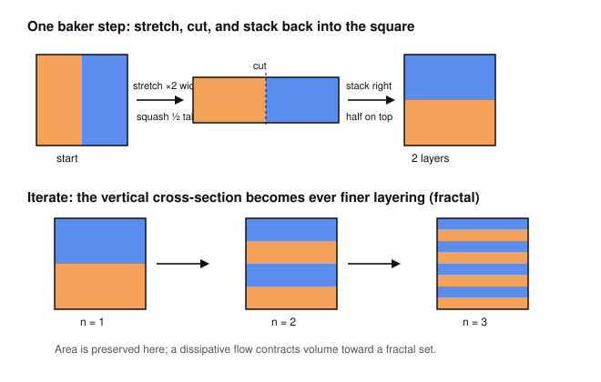

# Dynamical Systems & Chaos · Lesson 4.3: Strange attractors

> ⏱ ~15 min · Module 4: Chaos in flows · Builds on: [4.1](04-01-lorenz-system.md), [4.2](04-02-sensitive-dependence.md) · Unlocks: [4.4](04-04-lyapunov-exponents.md)

## Why this matters

Lesson 4.2 handed you a paradox. The Lorenz trajectory never escapes to infinity — it loops forever inside a bounded blob of phase space — yet any two nearby starts pull apart exponentially. How can motion be *trapped* and *diverging* at the same time? A curve that keeps stretching should run out of room. The resolution is the single most important geometric idea in chaos: the trajectory lives on a **strange attractor**, a set that reconciles the two by stretching in one direction while folding everything back on itself. Understanding this mechanism is what lets you see chaos as *structured* rather than random — and it's the reason the Lorenz "butterfly," the onset of turbulence in [`fluid-dynamics`](../../fluid-dynamics/syllabus.md), and the flicker of a dripping tap all wear the same geometry.

## The idea

First, plain **attractor**: a set the system settles onto. A stable fixed point is an attractor (a single point); a stable limit cycle from Module 2 is an attractor (a loop). The defining features — a closed, invariant set that pulls in every nearby trajectory — are what "settling down" means.

A **strange attractor** is one that pulls trajectories in *and yet* keeps neighbors on it flying apart. Picture kneading dough. You **stretch** it — two raisins that were touching drift apart as the dough elongates (this is the exponential divergence of 4.2). Then, because the dough won't fit on the counter forever, you **fold** it back over itself and press down. Stretch, fold, stretch, fold. Two consequences, both essential:

- **Stretching** separates nearby trajectories → sensitive dependence, unpredictability.
- **Folding** bends the stretched-out sheet back into the bounded region → trajectories stay trapped, and can never cross themselves.

Repeat forever and the dough develops infinitely many layers packed into finite space — a leaf that is not quite a surface, riddled with structure at every scale. That layered object *is* the strange attractor. "Bounded but diverging" stops being a contradiction the moment you allow folding: locally the map expands, globally it recycles.

One more piece the folding forces. The Lorenz flow is **dissipative** — it shrinks volumes (you'll verify this in P1). So the attractor has **zero volume**. But it can't be a smooth surface either, because a surface has no room for the infinitely-layered fine structure that folding builds. The only way to be zero-volume *and* infinitely layered is to be a **fractal** (dimension explored in [4.5](04-05-fractal-dimension.md)). Contraction of volume *plus* exponential stretch in one direction forces a fractal cross-section — that is the whole story in one line.

## The formal version

**Definition (attractor).** A closed set $A$ in phase space is an **attractor** if:
1. $A$ is **invariant** — a trajectory starting in $A$ stays in $A$ for all time;
2. $A$ **attracts an open neighborhood** — there is an open set $U \supseteq A$ such that every trajectory starting in $U$ converges to $A$ as $t \to \infty$;
3. $A$ is **minimal** — no proper closed subset satisfies (1) and (2).

*In words:* an attractor is the smallest trapped set that a whole open cloud of starting points drains into.

**Definition (basin of attraction).** The **basin** of $A$ is the set of *all* initial conditions whose trajectories converge to $A$ — the largest such $U$ in condition (2).

*In words:* the attractor is where you end up; the basin is everywhere you could have started and still ended up there. Do not conflate them — the basin can be huge (an open, full-volume region) while the attractor it feeds is a thin zero-volume set inside it.

**Definition (strange attractor).** An attractor $A$ is **strange** if it exhibits **sensitive dependence on initial conditions** (two neighbors on $A$ separate exponentially, 4.2) — and, as a consequence of the stretch-and-fold dynamics, has **fractal structure** (non-integer dimension, 4.5).

*In words:* a strange attractor is an attractor you still can't predict on. "Attracting" governs how you approach it from *outside*; "strange" governs what happens to neighbors already *on* it.

**Volume contraction.** For a flow $\dot{\mathbf x} = \mathbf f(\mathbf x)$, a small phase-space volume $V(t)$ evolves by

$$\frac{dV}{dt} = \int_V (\nabla \cdot \mathbf f)\, dV .$$

*In words:* the divergence of the vector field is the local rate at which volume expands ($>0$) or contracts ($<0$). If $\nabla \cdot \mathbf f < 0$ everywhere, all volumes shrink, so any attractor must have zero volume.

## Picture

The baker's map makes the mechanism literal: stretch the square to twice its width and half its height, cut it, and stack the halves back into the square. Each step doubles the number of horizontal layers. Track the two starting halves (orange, blue) and watch a smooth block become finely striped — the vertical cross-section marching toward a fractal (Cantor-like) set. Horizontal stretch = sensitive dependence; the stack = folding that keeps everything bounded.

Real strange attractors are just this run continuously in 3-D. The **Lorenz attractor** is two spiral sheets (the butterfly's wings): the flow spirals outward on one wing, and when it gets too far it is *folded* across to the other wing — stretch on each wing, fold between them. The **Rössler attractor** is even more transparently a single stretch-and-fold: a sheet spirals outward in a plane, then gets lifted and folded back onto itself in the third dimension. Same kneading, fewer moving parts.

## Worked examples

**Example 1 (basin vs. attractor — the two are different objects).** Take the simple planar system $\dot r = r(1-r)$, $\dot\theta = 1$ in polar coordinates. The radial equation has a stable fixed point at $r^* = 1$ (since $\tfrac{d}{dr}[r(1-r)]\big|_{r=1} = 1 - 2r\big|_{1} = -1 < 0$) and an unstable one at $r=0$. So every trajectory except the origin spirals onto the **unit circle** — that circle is the attractor $A$ (a limit cycle, *not* strange: neighbors on it just go around together, no stretching). The **basin** is the entire punctured plane $\{ \mathbf x \neq \mathbf 0\}$: a full, two-dimensional open region draining onto a one-dimensional loop. Big basin, thin attractor. Nothing here is chaotic — this is a *tame* attractor, and it's the contrast that makes "strange" meaningful.

**Example 2 (why the Lorenz attractor has zero volume).** The Lorenz system is

$$\dot x = \sigma(y-x), \qquad \dot y = x(\rho - z) - y, \qquad \dot z = xy - \beta z.$$

Compute the divergence of the vector field:

$$\nabla \cdot \mathbf f = \frac{\partial \dot x}{\partial x} + \frac{\partial \dot y}{\partial y} + \frac{\partial \dot z}{\partial z} = (-\sigma) + (-1) + (-\beta) = -(\sigma + 1 + \beta).$$

This is a **negative constant** — the same everywhere. So $dV/dt = -(\sigma+1+\beta)\,V$, giving

$$V(t) = V(0)\, e^{-(\sigma + 1 + \beta)\, t}.$$

At the classic parameters $\sigma = 10$, $\beta = 8/3$: the rate is $-(10 + 1 + 8/3) = -13.67$, so a blob of initial conditions shrinks by a factor $e^{-13.67} \approx 1.2\times 10^{-6}$ *every* time unit. Any set the flow settles onto is squeezed to **zero volume**. Yet 4.2 showed the motion never collapses to a point or a cycle — it stretches. Zero volume + relentless stretch = a fractal sheet. That is the strange attractor.

## Watch out

- **You might think a strange attractor is unstable** because trajectories on it fly apart — but the *set itself* is powerfully attracting. Push the state off the attractor and it snaps right back (transverse contraction); the exponential divergence happens strictly *along* the attractor, between neighbors that are both on it. Attracting transversely, expanding tangentially — both at once.
- **You might think "attractor" and "basin" are the same region** — they're opposites in size and role. The attractor is the zero-volume destination; the basin is the fat open set of origins. A system can have several attractors, each with its own basin, and the **basin boundaries** can themselves be fractal.
- **You might think stretching alone makes chaos** — but pure stretching on a bounded set is impossible; you'd run out of room. **Folding is not optional.** It's what lets a bounded system stretch *forever*, and it's the source of the layering (hence the fractal geometry). No fold, no strange attractor.
- **You might think any fractal-looking attractor is strange** — strangeness is about the *dynamics* (sensitive dependence), fractality is about the *geometry*. They almost always come together via stretch-and-fold, but "strange" is the dynamical claim; some authors even distinguish "strange" (fractal) from "chaotic" (sensitive). For this course they travel together.

## One-liner

> A strange attractor is dough kneaded forever: stretched so neighbors diverge, folded so nothing escapes — zero volume, infinite layering, deterministic yet unpredictable.

## Problems

**P1 (🟢)** The Rössler system is $\dot x = -y - z$, $\dot y = x + ay$, $\dot z = b + z(x - c)$. (a) Compute $\nabla\cdot\mathbf f$. (b) At the classic value $a = 0.2$, is the flow volume-contracting *everywhere*? If not, where does it expand, and why can the long-run motion still live on a zero-volume attractor? (Hint: what matters is the sign of the divergence *averaged along the trajectory*, not at every instant.)

**P2 (🟡)** The tent map $T:[0,1]\to[0,1]$, $T(x) = 2x$ for $x \le \tfrac12$ and $T(x) = 2(1-x)$ for $x > \tfrac12$, is stretch-and-fold stripped to one dimension. (a) Identify which branch is the "stretch" and which is the "fold," and give the stretch factor $|T'|$. (b) Show $[0,1]$ is invariant (bounded — the fold does this). (c) A measurement pins the state to an interval of width $\delta_0 = 10^{-3}$. Each step the interval's width doubles until it can no longer fit in $[0,1]$. After how many iterations $n$ is all predictive information gone (width $\ge 1$)? Comment on how this reproduces the "stretch = unpredictability, fold = boundedness" split.

**P3 (🔴, optional — previews [4.5](04-05-fractal-dimension.md))** Stretch-and-fold with *contraction* leaves a fractal cross-section. Model it: at each stage, a strip is replaced by **two** copies of itself, each scaled down by a factor $r = \tfrac14$, with the middle discarded (the fold keeps two survivor bands and throws away what's stretched out of range). (a) After $n$ stages, what is the total length of the surviving set, and what does it tend to? (b) A self-similar set made of $N$ copies each scaled by $r$ has box-counting dimension $d = \dfrac{\ln N}{\ln(1/r)}$. Find $d$ for this cross-section. (c) The full attractor is this Cantor set stacked along a smooth 1-D direction (the flow direction), so its dimension is $d + 1$. Report it, and explain in one sentence why "somewhere strictly between a curve and a surface" is exactly what "not a simple curve or surface" means.

Solutions

**P1** (a) $\nabla\cdot\mathbf f = \dfrac{\partial \dot x}{\partial x} + \dfrac{\partial \dot y}{\partial y} + \dfrac{\partial \dot z}{\partial z} = 0 + a + (x - c) = a + x - c.$

(b) This depends on position: it is negative where $x < c - a$ and **positive** where $x > c - a$. So volume *expands* in the region of large $x$ — precisely the excursion where the trajectory shoots up in $z$ and gets folded back. The flow is therefore *not* contracting everywhere instantaneously. It can still support a zero-volume attractor because what governs the long-run volume of a bounded orbit is the **time-average** of the divergence along the trajectory: as long as $\langle \nabla\cdot\mathbf f\rangle < 0$ over a full loop, volumes shrink on average, and the invariant set has zero volume. The Rössler orbit spends most of its time in the spiral sheet where $x$ is small and the divergence is negative, so the average comes out negative despite the brief expanding fold. (This is the honest picture: dissipation is a *net* statement, not a pointwise one.)

**P2** (a) The **stretch** branch is $T(x) = 2x$ on $[0,\tfrac12]$: it maps that half onto all of $[0,1]$, doubling lengths. The second branch $T(x) = 2(1-x)$ on $(\tfrac12,1]$ also maps onto $[0,1]$ but *orientation-reversed* — that reversal is the **fold** (the right half is flipped back over the left). In both cases $|T'(x)| = 2$ everywhere it's defined, so the stretch factor is $2$ (and the Lyapunov exponent is $\ln 2 > 0$: chaos).

(b) Each branch maps its half onto exactly $[0,1]$, so $T([0,1]) = [0,1]$: the image never leaves the interval. The system is bounded — the fold is what accomplishes this, bending the over-long stretched image back inside.

(c) The width after $n$ steps is $2^n \delta_0 = 2^n \cdot 10^{-3}$. Predictive information is gone once this reaches the size of the whole interval:
$$2^n \cdot 10^{-3} \ge 1 \iff 2^n \ge 10^{3} \iff n \ge \frac{\ln 10^3}{\ln 2} = \frac{6.908}{0.693} \approx 9.97.$$
So at $n = 10$ iterations the initial interval has been stretched to cover $[0,1]$ and you can no longer say where in the interval the state is. The **stretch** ($\times 2$ each step) is what destroys the information exponentially fast; the **fold** is what keeps the growing interval inside $[0,1]$ so the process can continue indefinitely instead of running off to infinity. Same two-part split as the continuous strange attractor.

**P3** (a) Start from length $1$. Each stage keeps $2$ copies each of length $r = \tfrac14$ of the previous piece, so total length multiplies by $2 \cdot \tfrac14 = \tfrac12$ per stage. After $n$ stages the total length is $\left(\tfrac12\right)^n \to 0$. The surviving set has **zero length** (zero measure) — yet it still contains uncountably many points (one for each choice of "left/right band" at every stage). Zero-volume, non-empty: the hallmark of a fractal cross-section.

(b) With $N = 2$ copies and scale $r = \tfrac14$:
$$d = \frac{\ln N}{\ln(1/r)} = \frac{\ln 2}{\ln 4} = \frac{\ln 2}{2\ln 2} = \frac12.$$

(c) Full attractor dimension $= d + 1 = \tfrac12 + 1 = \boxed{1.5}$. A smooth curve has dimension $1$ and a smooth surface has dimension $2$; a value of $1.5$ sits strictly between them. That is literally what "neither a curve nor a surface" means — the object is too intricate (too many folded layers) to be a $1$-D curve, but too thin (zero area) to be a $2$-D surface. A non-integer dimension is the precise, quantitative statement of "strange," which is exactly why [4.5](04-05-fractal-dimension.md) makes dimension *the* number attached to a strange attractor.

## Flashback

**From Lesson 4.2 (sensitive dependence and the unpredictability horizon):** A chaotic system has largest Lyapunov exponent $\lambda = 0.5\ \text{(time)}^{-1}$: an initial error $\delta_0$ grows as $\delta(t) \approx \delta_0\, e^{\lambda t}$. Your instrument fixes the initial state to within $\delta_0 = 10^{-4}$, and you declare a prediction useless once the error reaches $a = 1$. (a) Estimate the prediction horizon $t_{\text{h}}$. (b) A rival wants to forecast $10$ time units *further*. By what factor must they improve their instrument's precision $\delta_0$? What does the size of that factor say about predicting chaos?

Solution

(a) Set $\delta_0 e^{\lambda t_{\text h}} = a$ and solve:
$$t_{\text h} = \frac{1}{\lambda}\ln\!\frac{a}{\delta_0} = \frac{1}{0.5}\ln\!\frac{1}{10^{-4}} = 2\ln(10^4) = 2 \times 9.21 = 18.4 \text{ time units.}$$

(b) To push the horizon from $t_{\text h}$ to $t_{\text h} + \Delta t$ with $\Delta t = 10$, the new precision $\delta_0'$ must satisfy $\tfrac{1}{\lambda}\ln(a/\delta_0') = t_{\text h} + \Delta t$. Subtracting the two horizon equations kills $a$ and $t_{\text h}$:
$$\Delta t = \frac{1}{\lambda}\ln\!\frac{\delta_0}{\delta_0'} \;\Longrightarrow\; \frac{\delta_0}{\delta_0'} = e^{\lambda \Delta t} = e^{0.5 \times 10} = e^{5} \approx 148.$$
So they must measure roughly **$148\times$ more precisely** just to buy $10$ more time units. Because the horizon depends only *logarithmically* on precision ($t_{\text h}\propto \ln(1/\delta_0)$), each extra stretch of predictability costs an exponentially better instrument. This is why "just measure more carefully" is a losing battle against chaos — and it's the same exponential stretch that, folded back, builds the strange attractor of this lesson.

## Connections

- **Backward:** the exponential divergence of [4.2](04-02-sensitive-dependence.md) is the *stretch*; this lesson supplies the missing *fold* that reconciles it with the boundedness of the [4.1](04-01-lorenz-system.md) Lorenz flow. Contrast with the tame limit-cycle attractor of Module 2 ([2.3](02-03-limit-cycles.md)): same word "attractor," but no stretching, so not strange.
- **Forward:** [4.4](04-04-lyapunov-exponents.md) turns "stretch" into a number — the Lyapunov exponent, positive exactly when the attractor is strange — and [4.5](04-05-fractal-dimension.md) turns "fold" into a number, the fractal dimension you previewed in P3. A strange attractor is precisely one with a positive exponent and a non-integer dimension.
- **Sideways (fluid dynamics):** the Lorenz system is a stripped-down model of convection rolls, so its strange attractor *is* the geometry of the transition to turbulent thermal convection studied in [`fluid-dynamics`](../../fluid-dynamics/syllabus.md); the stretch-and-fold you kneaded here is literally how a turbulent flow mixes a dye streak — elongating and folding fluid filaments until they're finely layered.
