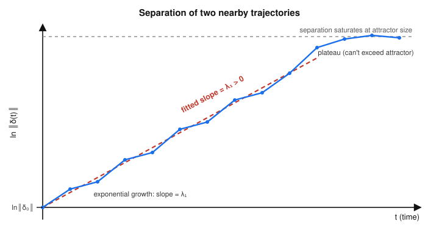

# Dynamical Systems & Chaos · Lesson 4.4: Lyapunov exponents

> ⏱ ~15 min · Module 4: Chaos in flows · Builds on: [Lesson 4.3](04-03-strange-attractors.md) · Unlocks: [Lesson 4.5](04-05-fractal-dimension.md)

## Why this matters

"Sensitive dependence" (Lesson 4.2) and "strange attractor" (Lesson 4.3) are qualitative words. A physicist wants a *number*: how chaotic, exactly? The **Lyapunov exponent** is that number — the average exponential rate at which two nearby trajectories fly apart. Its sign is a verdict (positive means chaos, full stop), its size sets the prediction horizon (weather goes blind after roughly $1/\lambda$ worth of time), and the full **spectrum** of exponents — one per dimension — encodes both the chaos and the dissipation at once. It is the single most-quoted diagnostic in all of nonlinear dynamics, and in Lesson 4.5 it will even hand you the attractor's fractal dimension.

## The idea

Drop two initial conditions a tiny distance $\lVert\delta_0\rVert$ apart and watch the gap $\lVert\delta(t)\rVert$ between the trajectories. On a chaotic attractor the gap grows, on average, *exponentially*:
$$\lVert\delta(t)\rVert \sim \lVert\delta_0\rVert\, e^{\lambda t}.$$
The number $\lambda$ in the exponent is the **largest Lyapunov exponent**. Take a logarithm and it becomes a slope: $\ln\lVert\delta(t)\rVert$ rises like a straight line of slope $\lambda$. So the whole measurement is "plot $\ln$ of the separation against time and read off the slope."

Two refinements make it honest. First, "on average": the local stretching rate flickers as the trajectory wanders across the attractor, so $\lambda$ is a *long-time average* of those local rates, not an instantaneous one. Second, the gap can't grow forever — once it reaches the size of the attractor the trajectories are just two unrelated points on the same object, and the log-separation plot flattens into a plateau. You read $\lambda$ off the early, linear, still-exponential part, before saturation.

And there isn't just one exponent. In $n$ dimensions a little *ball* of initial conditions is stretched into an ellipsoid; each principal axis grows (or shrinks) at its own rate $\lambda_i$. Those $n$ numbers, sorted $\lambda_1\ge\lambda_2\ge\cdots\ge\lambda_n$, are the **Lyapunov spectrum**, and their sum is the growth rate of the ellipsoid's *volume* — which is exactly the average divergence of the flow.

## The formal version

Let $\dot{\mathbf x}=\mathbf f(\mathbf x)$ be a flow in $\mathbb R^n$, and let $\boldsymbol\delta(t)$ be an infinitesimal separation between a reference trajectory and a neighbor, evolving under the linearized ("variational") equation $\dot{\boldsymbol\delta}=J(\mathbf x(t))\,\boldsymbol\delta$, where $J$ is the Jacobian of $\mathbf f$.

**Definition (largest Lyapunov exponent).**
$$\lambda \;=\; \lim_{t\to\infty}\;\frac{1}{t}\,\ln\frac{\lVert\boldsymbol\delta(t)\rVert}{\lVert\boldsymbol\delta_0\rVert}.$$

*In words:* $\lambda$ is the long-run average exponential rate of separation of nearby trajectories. A generic starting perturbation aligns with the fastest-growing direction, so this limit picks out the *largest* exponent.

**The sign is the classification.**
$$\lambda>0 \;\Rightarrow\; \textbf{chaos},\qquad \lambda=0 \;\Rightarrow\; \textbf{marginal},\qquad \lambda<0 \;\Rightarrow\; \textbf{stable}.$$

*In words:* positive means neighbors separate exponentially (sensitive dependence — the operational definition of chaos); zero means they drift apart only polynomially, the signature of a limit cycle or quasiperiodic torus; negative means they collapse together, i.e. onto a stable fixed point.

**Definition (Lyapunov spectrum).** Track the growth rates of the $n$ orthogonal axes of an infinitesimal ball and sort them:
$$\lambda_1\ge\lambda_2\ge\cdots\ge\lambda_n .$$
$\lambda_1$ is the $\lambda$ above. Two structural facts pin the rest down:

**(1) The sum is the average divergence (volume growth rate).**
$$\sum_{i=1}^{n}\lambda_i \;=\; \big\langle \nabla\!\cdot\mathbf f\big\rangle \;=\; \big\langle \operatorname{tr} J\big\rangle,$$
the long-time average of $\nabla\!\cdot\mathbf f=\partial f_1/\partial x_1+\cdots+\partial f_n/\partial x_n$.

*In words:* a small ball of states has volume changing at the rate $\nabla\!\cdot\mathbf f$ (Liouville's picture), and stretching it along the axes multiplies the exponents — so the exponents *add up* to the average volume-growth rate. For a **dissipative** system, volume contracts, so $\sum_i\lambda_i<0$. A dissipative *chaotic* flow therefore needs $\lambda_1>0$ (stretch in some direction) while the total stays negative (net contraction) — stretching in one direction, stronger squeezing overall. That is the defining tension of a strange attractor from Lesson 4.3, now in numbers.

**(2) A bounded flow that isn't a fixed point has at least one zero exponent.** The perturbation that points *along* the trajectory — i.e. $\boldsymbol\delta \parallel \mathbf f(\mathbf x)$ — is just "the same orbit, nudged slightly ahead in time." Since the motion stays bounded, that nudge neither blows up nor decays exponentially, so its exponent is exactly $0$.

*In words:* nudging a state *forward along its own path* costs nothing in the long run, so one direction always has exponent zero — the flow direction.

**The Lorenz signature.** For the classic Lorenz system ($\sigma=10,\ b=8/3,\ r=28$) the spectrum is
$$(\lambda_1,\lambda_2,\lambda_3)\approx(+0.906,\;0,\;-14.57),\qquad \text{sign pattern } (+,0,-).$$
Positive $\lambda_1$: chaos. Zero $\lambda_2$: the flow direction. Negative $\lambda_3$: strong contraction onto the attractor. Their sum $\approx-13.66$ equals $\nabla\!\cdot\mathbf f=-\sigma-1-b=-(10+1+\tfrac{8}{3})=-13.67$ — a constant here, so the average is trivial. That $(+,0,-)$ pattern is the fingerprint of a strange attractor in a 3-D flow.

## Picture

Measure the separation $\lVert\delta(t)\rVert$ of two nearby trajectories and plot its logarithm against time. The noisy blue data rises with average slope $\lambda_1>0$; the red dashed line is the fit whose slope *is* the exponent. Once the gap reaches the size of the attractor it can grow no further, and the curve flattens — you read $\lambda_1$ off the linear stretch *before* that plateau.

The whole method is in this picture: **the largest Lyapunov exponent is the slope of $\ln$-separation versus time.**

## Worked examples

**Example 1 (estimate $\lambda_1$ by fitting a slope).** Two Lorenz trajectories start $\lVert\delta_0\rVert=1.0\times10^{-5}$ apart. Their measured separation:

| $t$ | $\lVert\delta(t)\rVert$ | $\ln\lVert\delta(t)\rVert$ |
|----|----|----|
| 0 | $1.0\times10^{-5}$ | $-11.51$ |
| 1 | $2.5\times10^{-5}$ | $-10.60$ |
| 2 | $6.0\times10^{-5}$ | $-9.72$ |
| 3 | $1.5\times10^{-4}$ | $-8.80$ |
| 4 | $3.7\times10^{-4}$ | $-7.90$ |

The $\ln$ column marches up in almost equal steps — the hallmark of exponential growth. Fit the slope endpoint-to-endpoint:
$$\lambda_1 \approx \frac{\ln\lVert\delta(4)\rVert-\ln\lVert\delta(0)\rVert}{4-0}=\frac{-7.90-(-11.51)}{4}=\frac{3.61}{4}\approx 0.90.$$
(Consecutive differences are $0.91,\,0.88,\,0.92,\,0.90$ — reassuringly constant, so a single slope is trustworthy.) We get $\lambda_1\approx0.90$, right on the textbook Lorenz value $0.906$. Positive $\Rightarrow$ chaos. Note we must stop before saturation: had the data reached $\lVert\delta\rVert\sim 30$ (the attractor's extent) the last points would flatten and drag the fit *down*, underestimating $\lambda_1$.

**Example 2 (classify by the sign pattern).** Read off the verdict for each spectrum of a **bounded 3-D flow**:

- $(-2,\,-5,\,-9)$ — all negative, sum $<0$. Every direction contracts: trajectories collapse together onto a **stable fixed point**. (Only a fixed point may have *no* zero exponent.)
- $(0,\,-1,\,-3)$ — largest is $0$, rest negative. The single zero is the flow direction, nothing grows: a **stable limit cycle** (attracting periodic orbit).
- $(0,\,0,\,-4)$ — two zeros, one contracting. Two neutral directions means motion on a **2-torus**: **quasiperiodic**.
- $(+0.9,\,0,\,-14.6)$ — one positive, one zero, one strongly negative, sum $<0$. Chaos with net contraction: a **strange attractor**. This is Lorenz.

The rule of thumb: **any $\lambda_i>0$ means chaos**; if the largest is $0$ you're on a cycle or torus; if all are $<0$ you're heading to a point. And for anything bounded and moving, exactly one of them should be $0$.

## Watch out

- **You might think** a positive exponent means the gap grows without bound — **but** it only grows exponentially *while infinitesimal*. Real separations saturate at the attractor's diameter; the exponential law and the number $\lambda$ live strictly in the linearized, small-$\delta$ regime. Always fit before the plateau.
- **You might think** "at least one exponent is zero" applies to every system — **but** it needs the motion to be *bounded and not a fixed point*. A stable fixed point has all-negative exponents and no zero (nudging it forward in time does nothing — there's no motion to nudge). The zero exponent *is* the flow direction, so you need a flow.
- **You might think** a single positive $\lambda_i$ contradicts an *attractor* (attractors contract) — **but** the two coexist precisely because it's the *sum* that must be negative for dissipation. Lorenz stretches along one axis ($+0.9$) yet contracts far harder along another ($-14.6$): net volume shrinks even as neighbors separate. Stretch-and-fold in one line of arithmetic.
- **You might think** $\lambda$ depends on the norm you chose or the starting perturbation — **but** the long-time limit washes both out: $\lambda_1$ is a property of the attractor (and the invariant measure on it), not of your measuring stick.

## One-liner

> The largest Lyapunov exponent is the slope of $\ln$-separation versus time — positive is chaos — and the whole spectrum sums to the average divergence, so a strange attractor is the sign pattern $(+,0,-)$ with a negative total.

## Problems

**P1 (🟢)** Two trajectories on an attractor start $\lVert\delta_0\rVert=2\times10^{-6}$ apart and, before saturating, reach $\lVert\delta(t)\rVert=2\times10^{-2}$ at $t=8$. Estimate the largest Lyapunov exponent $\lambda_1$, state whether the system is chaotic, and give the approximate "prediction horizon" — the time for an initial uncertainty to grow by a factor of $e$.

**P2 (🟡)** A dissipative 3-D flow has constant divergence $\nabla\!\cdot\mathbf f=-3$ everywhere, and its attractor is measured to have $\lambda_1=+0.4$. Using the spectrum's structural facts, determine $\lambda_2$ and $\lambda_3$ (assume the attractor is a bounded strange attractor, not a fixed point or cycle). What is the sign pattern, and what kind of object is it?

**P3 (🔴, optional)** Prove that a bounded trajectory of $\dot{\mathbf x}=\mathbf f(\mathbf x)$ which is not a fixed point has a Lyapunov exponent equal to $0$ in the flow direction. (Hint: show that $\boldsymbol\delta(t)=\mathbf f(\mathbf x(t))$ solves the variational equation $\dot{\boldsymbol\delta}=J\boldsymbol\delta$, then bound $\ln\lVert\boldsymbol\delta(t)\rVert$ using that the trajectory — and hence $\mathbf f$ along it — stays bounded and bounded away from $0$.)

Solutions

**P1** Fit the slope of $\ln$-separation:
$$\lambda_1\approx\frac{1}{t}\ln\frac{\lVert\delta(t)\rVert}{\lVert\delta_0\rVert}=\frac{1}{8}\ln\frac{2\times10^{-2}}{2\times10^{-6}}=\frac{1}{8}\ln\!\big(10^{4}\big)=\frac{4\ln 10}{8}=\frac{9.21}{8}\approx 1.15.$$
Positive, so the system is **chaotic**. The prediction horizon is the $e$-folding time $\tau=1/\lambda_1\approx 1/1.15\approx 0.87$ time units: after roughly that long, any initial uncertainty has grown by a factor $e$, and after a handful of $\tau$ it fills the attractor and prediction fails.

**P2** Structural facts for a bounded non-fixed-point flow:
- At least one exponent is $0$ (flow direction). Since it's a strange attractor with $\lambda_1=+0.4>0$, the zero must be the *second* exponent: $\lambda_2=0$.
- The sum equals the average divergence: $\lambda_1+\lambda_2+\lambda_3=\langle\nabla\!\cdot\mathbf f\rangle=-3$ (constant, so the average is just $-3$).

Hence $0.4+0+\lambda_3=-3\Rightarrow \lambda_3=-3.4$. Spectrum $(+0.4,\,0,\,-3.4)$, sign pattern $(+,0,-)$, sum $-3<0$: a **strange attractor** — chaotic (a positive exponent) yet dissipative (negative total volume-growth rate).

**P3** Differentiate $\boldsymbol\delta(t):=\mathbf f(\mathbf x(t))$ along the trajectory. By the chain rule,
$$\dot{\boldsymbol\delta}=\frac{d}{dt}\mathbf f(\mathbf x(t))=J(\mathbf x(t))\,\dot{\mathbf x}=J(\mathbf x(t))\,\mathbf f(\mathbf x(t))=J\,\boldsymbol\delta,$$
so $\boldsymbol\delta(t)=\mathbf f(\mathbf x(t))$ is indeed a solution of the variational equation — the flow direction is a genuine perturbation direction.

Now bound its Lyapunov exponent. Because the trajectory is bounded, it lives on a compact set $K$, and the continuous field $\mathbf f$ attains a finite maximum there: $\lVert\boldsymbol\delta(t)\rVert=\lVert\mathbf f(\mathbf x(t))\rVert\le M<\infty$. Because the trajectory is *not* a fixed point (and, on a compact invariant set with no fixed point on it, $\mathbf f$ is bounded away from zero along the orbit), there is $m>0$ with $\lVert\mathbf f(\mathbf x(t))\rVert\ge m>0$. Therefore for all $t$,
$$0<m\le \lVert\boldsymbol\delta(t)\rVert\le M,$$
so $\ln\lVert\boldsymbol\delta(t)\rVert$ stays trapped between the constants $\ln m$ and $\ln M$. The exponent is then
$$\lambda_{\text{flow}}=\lim_{t\to\infty}\frac1t\ln\frac{\lVert\boldsymbol\delta(t)\rVert}{\lVert\boldsymbol\delta_0\rVert}=\lim_{t\to\infty}\frac{(\text{bounded quantity})}{t}=0. \qquad\blacksquare$$
Intuition: a perturbation along the flow just shifts you slightly ahead or behind on the *same* orbit; on a bounded set that lead never compounds, so it grows at rate zero.

## Flashback

**From Lesson 4.2 (Sensitive dependence and the unpredictability horizon):** A weather model is chaotic with largest Lyapunov exponent $\lambda=0.5\ \text{day}^{-1}$. Today's initial state is known only to a relative precision $\lVert\delta_0\rVert=10^{-6}$ (in the model's units), and a forecast is worthless once the error grows to order $1$. (a) Estimate the horizon time $t_{\text{h}}$ after which prediction fails. (b) Roughly how much longer would the horizon become if a better sensor network shrank the initial error to $10^{-9}$? Comment on the payoff.

Solution

The error grows as $\lVert\delta(t)\rVert\approx\lVert\delta_0\rVert e^{\lambda t}$; set it to $1$ and solve for $t$:
$$1\approx \lVert\delta_0\rVert e^{\lambda t_{\text{h}}}\;\Rightarrow\; t_{\text{h}}\approx\frac1\lambda\ln\frac{1}{\lVert\delta_0\rVert}.$$

(a) $t_{\text{h}}\approx\dfrac{1}{0.5}\ln(10^{6})=2\times(6\ln 10)=2\times13.82\approx 27.6\ \text{days}.$

(b) With $\lVert\delta_0\rVert=10^{-9}$: $t_{\text{h}}\approx\dfrac{1}{0.5}\ln(10^{9})=2\times(9\ln 10)=2\times20.72\approx 41.4\ \text{days}.$

Cutting the initial error by a thousand-fold ($10^{-6}\!\to\!10^{-9}$) buys only about $41.4-27.6\approx 13.8$ extra days — because the horizon grows like $\ln(1/\lVert\delta_0\rVert)$, i.e. *logarithmically* in the precision. This is the quantitative heart of the butterfly effect: since $t_{\text{h}}=\frac1\lambda\ln(1/\lVert\delta_0\rVert)$, each factor-of-$10$ improvement in measurement adds only the fixed increment $\frac{\ln 10}{\lambda}\approx 4.6$ days. Chasing a long-range forecast by measuring harder is a losing battle against an exponent.

## Connections

- **Backward:** this quantifies Lesson 4.2's "sensitive dependence" (the exponential divergence is now the number $\lambda_1>0$, and the unpredictability horizon is $\frac1\lambda\ln(1/\lVert\delta_0\rVert)$) and Lesson 4.3's stretch-and-fold strange attractor (stretching is $\lambda_1>0$; net contraction is $\sum_i\lambda_i<0$). The whole spectrum is built from the Jacobian and linearization of [Lesson 1.4](01-04-linearization-hartman-grobman.md) — Lyapunov exponents are the time-averaged eigenvalue rates *along a trajectory* rather than at a single fixed point, and $\sum_i\lambda_i=\langle\operatorname{tr}J\rangle$ generalizes the trace of [Lesson 1.3](01-03-trace-determinant-classification.md).
- **Forward:** [Lesson 4.5](04-05-fractal-dimension.md) turns the spectrum into geometry — the Kaplan–Yorke formula reads a strange attractor's fractal (non-integer) dimension straight off the ordered exponents, so the numbers you measured here *become* the attractor's dimension.
- **Sideways ([stat-mech](../../stat-mech/syllabus.md)):** a positive $\lambda_1$ is what lets a deterministic system explore its attractor as if randomly — the microscopic engine behind mixing and the equality of time averages and ensemble averages that Module 5 ([Lesson 5.5](05-05-symbolic-dynamics-ergodicity.md)) makes precise and that statistical mechanics rests on. The volume-contraction reading of $\sum_i\lambda_i<0$ is Liouville's theorem with dissipation, the same phase-space bookkeeping used in [analytical-mechanics](../../analytical-mechanics/syllabus.md).
