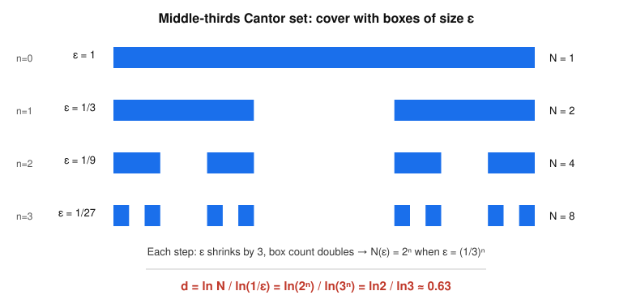

# Dynamical Systems & Chaos · Lesson 4.5: Fractal dimension

> ⏱ ~15 min · Module 4: Chaos in flows · Builds on: [Lesson 4.3 (strange attractors)](04-03-strange-attractors.md), [Lesson 4.4 (Lyapunov exponents)](04-04-lyapunov-exponents.md) · Unlocks: [Module 5, Lesson 5.1 (maps and cobwebs)](05-01-maps-cobweb.md)

## Why this matters

You now know a strange attractor is the object a chaotic flow lives on: trajectories are squeezed onto it (attraction) yet stretched apart along it (sensitive dependence, Lesson 4.4). The last question is *what shape is that object?* The Lorenz attractor has zero volume — trajectories collapse onto it — but it is plainly not a curve or a surface either. It sits **between** dimensions. This lesson gives you the ruler for that in-between: a dimension that can come out to $2.06$, not $2$ or $3$. That single number is the geometric fingerprint of chaos, and it's how experimentalists (who only have a time series, not the equations) confirm they're looking at a strange attractor rather than noise.

## The idea

Think about how you'd measure the "size" of a set by covering it with little boxes of side $\epsilon$ and counting how many you need, $N(\epsilon)$.

- A **line segment** of length $L$: you need $N \approx L/\epsilon$ boxes. Halve $\epsilon$, double the count. $N \propto \epsilon^{-1}$.
- A **filled square** of area $A$: you need $N \approx A/\epsilon^2$ boxes. Halve $\epsilon$, quadruple the count. $N \propto \epsilon^{-2}$.
- A **solid cube**: $N \propto \epsilon^{-3}$.

The exponent — $1$, $2$, $3$ — *is* the dimension. So define dimension as "the power of $1/\epsilon$ by which the box count grows." Written out, if $N(\epsilon)\propto \epsilon^{-d}$ then $d = \ln N / \ln(1/\epsilon)$.

Now here's the twist. Some sets are built by a rule that is **self-similar**: the whole is made of scaled-down copies of itself. Feed such a set into the box-count and the exponent $d$ need not be a whole number. That's a fractal. And a strange attractor is exactly this kind of object, because the stretch-and-fold mechanism from Lesson 4.3 stacks the sheet into infinitely many layers — a Cantor-set cross-section — so counting boxes gives a fractional power.

## The formal version

**Definition (box-counting dimension).** Let $S$ be a bounded set. Cover space with a grid of boxes of side $\epsilon$ and let $N(\epsilon)$ be the number of boxes that contain at least one point of $S$. The **box-counting** (or capacity) dimension is
$$d \;=\; \lim_{\epsilon\to 0}\frac{\ln N(\epsilon)}{\ln(1/\epsilon)}.$$

*In words:* count the boxes needed to cover the set at finer and finer resolution; $d$ is the rate at which that count blows up as the boxes shrink. For ordinary shapes it returns $1,2,3$; for fractals it returns something in between.

**Self-similar shortcut.** If $S$ is exactly built from $m$ copies of itself, each scaled down by a factor $r<1$, then choosing $\epsilon=r^n$ needs $N=m^n$ boxes, so
$$d=\frac{\ln m}{\ln(1/r)}.$$

*In words:* dimension = (log of how many pieces) ÷ (log of how much you shrank to get each piece). This is the whole computation for the clean textbook fractals.

**Three clean fractals.**

| Set | pieces $m$ | scale $1/r$ | $d=\ln m/\ln(1/r)$ |
|---|---|---|---|
| Cantor set (remove middle third) | $2$ | $3$ | $\ln 2/\ln 3\approx 0.63$ |
| Koch curve (each segment → 4, length $1/3$) | $4$ | $3$ | $\ln 4/\ln 3\approx 1.26$ |
| Sierpiński triangle (3 half-size copies) | $3$ | $2$ | $\ln 3/\ln 2\approx 1.58$ |

Read the values as verdicts. The Cantor set is $0.63$: more than a scatter of isolated points (dimension $0$) but less than a line — it's a "dust." The Koch curve is $1.26$: more than a curve, because it wiggles so violently it starts to fill area, yet it never actually covers a patch. Sierpiński at $1.58$ sits between a curve and the plane.

**Why a strange attractor is non-integer.** The Lorenz flow contracts volume everywhere (Lesson 4.3: the divergence of the vector field is negative, $-(\sigma+1+b)<0$), so the attractor has zero volume — $d<3$. But the positive Lyapunov exponent (Lesson 4.4) stretches trajectories apart along the attractor, and to reconcile "stretch forever" with "stay bounded," the sheet is repeatedly folded back over itself. A transverse slice through those infinitely many stacked layers looks like a Cantor set. So across the sheet the attractor is a fractal dust; the measured dimension is $d\approx 2.06$ for the classic Lorenz parameters.

*Reading $d\approx2.06$:* it's a **thickened sheet** — essentially a $2$-D surface ($d>2$) with an extra $0.06$ of fractal fuzz from the Cantor-layering across it. Not a clean surface ($d=2$ exactly), not a solid ($d=3$).

**Correlation dimension (the practical one).** Box-counting is hard to estimate from data: you rarely have enough points to fill the fine boxes, and empty-box counting is noisy. The **correlation dimension** $d_C$ replaces "count occupied boxes" with "count pairs of points closer than $\epsilon$": form the correlation sum $C(\epsilon)=\dfrac{(\text{number of point-pairs within distance }\epsilon)}{(\text{total pairs})}$, and take
$$d_C=\lim_{\epsilon\to0}\frac{\ln C(\epsilon)}{\ln\epsilon}.$$

*In words:* instead of asking "how many boxes," ask "how does the number of nearby neighbors grow as you widen the radius." It uses the data points you actually have, so it's what the Grassberger–Procaccia algorithm computes from an experimental time series. In general $d_C\le d_{\text{box}}$, but for the standard attractors they agree to the digits anyone measures.

## Picture

Each level removes the open middle third of every surviving interval. At resolution $\epsilon=(1/3)^n$ the set is covered by exactly $N=2^n$ boxes — the count doubles while the box size shrinks threefold. That fixed ratio *is* the dimension.

## Worked examples

**Example 1 (the full box-count for the Cantor set — do it from the limit, not the shortcut).**
Build the middle-thirds Cantor set $C$: start with $[0,1]$, delete the open middle third $(1/3,2/3)$, then delete the middle third of each remaining piece, forever.

Cover with boxes of side $\epsilon_n=(1/3)^n$ (a grid aligned to thirds). At stage $n$ the surviving set is $2^n$ intervals, each of length $(1/3)^n=\epsilon_n$ — so each fits in exactly one box and no box is wasted:
$$N(\epsilon_n)=2^n,\qquad \epsilon_n=3^{-n}\ \Rightarrow\ 1/\epsilon_n=3^{n}.$$
Plug into the definition:
$$\frac{\ln N(\epsilon_n)}{\ln(1/\epsilon_n)}=\frac{\ln(2^n)}{\ln(3^n)}=\frac{n\ln 2}{n\ln 3}=\frac{\ln 2}{\ln 3}\approx 0.6309.$$
The ratio is *independent of $n$*, so the limit as $n\to\infty$ (i.e. $\epsilon\to0$) is the same value:
$$\boxed{\,d=\frac{\ln 2}{\ln 3}\approx 0.63\,.}$$
Sanity checks. (i) $0<d<1$: fatter than a point set, thinner than a line — matches "dust." (ii) The Cantor set has **length zero** (total removed length $=\tfrac13+2\cdot\tfrac19+4\cdot\tfrac1{27}+\cdots=\tfrac13\sum(2/3)^k=1$), yet it is **uncountable** — a genuinely infinite set of measure zero. Fractional dimension is precisely the tool that distinguishes such a set from a mere handful of points.

**Example 2 (why you'd care — reading a real attractor's dimension).**
Suppose you sample a chaotic signal, reconstruct the attractor, and run the box-count. You get:

| $\epsilon$ | $1$ | $1/2$ | $1/4$ | $1/8$ | $1/16$ |
|---|---|---|---|---|---|
| $N(\epsilon)$ | $1$ | $4$ | $17$ | $68$ | $275$ |

Estimate $d$ by the slope of $\ln N$ against $\ln(1/\epsilon)$ (dividing successive rows approximates the local exponent, $\ln[N(\epsilon/2)/N(\epsilon)]/\ln 2$):
$$\tfrac{\ln(4/1)}{\ln2}=2.00,\quad \tfrac{\ln(17/4)}{\ln2}=2.09,\quad \tfrac{\ln(68/17)}{\ln2}=2.00,\quad \tfrac{\ln(275/68)}{\ln2}=2.02.$$
The counts multiply by roughly $4$ each time you halve $\epsilon$ ($2^{d}\approx4\Rightarrow d\approx2$), settling near $d\approx 2.02$–$2.06$. Verdict: **not** an integer, and just above $2$ — a thickened sheet, the fingerprint of a Lorenz-type strange attractor. If instead $N$ had multiplied by $8$ each halving you'd read $d=3$ (space-filling noise, no attractor); by $2$ you'd read $d=1$ (a mere limit cycle). The fractional value between the boring integers is the whole point.

## Watch out

- **You might think** $N(\epsilon)$ is the number of boxes in the grid — **actually** it's only the boxes that *touch the set* (contain at least one point). Empty boxes never count.
- **You might think** halving $\epsilon$ and seeing $N$ merely "increase" tells you the dimension — **actually** only the *rate* matters: dimension is the exponent, i.e. the slope of $\ln N$ vs. $\ln(1/\epsilon)$, not $N$ itself. Always work in logs.
- **You might think** zero volume forces dimension $2$ (or less) — **actually** a set can have zero $3$-D volume and still have dimension strictly between $2$ and $3$. "Measure zero" and "integer dimension" are different statements; the Cantor set already shows a length-zero set with dimension $0.63$.
- **You might think** box-counting and correlation dimension are interchangeable — **actually** they're distinct definitions ($d_C\le d_{\text{box}}$ in general) that happen to agree numerically for the standard attractors. Quote which one you computed.

## One-liner

> Dimension is the exponent in $N(\epsilon)\propto\epsilon^{-d}$ — count boxes as they shrink — and a strange attractor's stretch-and-fold layering makes that exponent a fraction like $2.06$: a sheet too crumpled to be a surface, too thin to be a solid.

## Problems

**P1 (🟢)** Compute the box-counting dimension of the **Cantor set that removes the middle *fifth*** at each stage (from $[0,1]$ delete the open middle interval of length $1/5$, leaving two intervals each of length $2/5$; repeat on each). Use the self-similar shortcut, then say whether it's larger or smaller than the middle-thirds value $0.63$ and why that's the right direction.

**P2 (🟡)** A "fat Cantor set" is built by removing, at stage $n$, a middle piece of length $4^{-n}$ from each of the $2^{n-1}$ surviving intervals (so at stage $1$ remove length $1/4$ from $[0,1]$; at stage $2$ remove length $1/16$ from each of the $2$ intervals; etc.). (a) Show the total removed length is $\tfrac12$, so the set has **positive** length $\tfrac12$. (b) What must its box-counting dimension be, and why? (No box-counting needed — reason from part (a).)

**P3 (🔴, optional)** The Lorenz attractor has Lyapunov spectrum $(\lambda_1,\lambda_2,\lambda_3)\approx(0.906,\,0,\,-14.57)$ (units: per unit time; from Lesson 4.4). The **Kaplan–Yorke conjecture** estimates the attractor's dimension as
$$d_{KY}=k+\frac{\lambda_1+\cdots+\lambda_k}{|\lambda_{k+1}|},$$
where $k$ is the largest number of leading exponents whose sum is still $\ge 0$. Compute $d_{KY}$ and compare to the measured $d\approx2.06$.

Solutions

**P1** At each stage an interval of length $\ell$ becomes two intervals each of length $\tfrac{2}{5}\ell$ (remove the middle fifth $\tfrac15\ell$, leaving $\tfrac45\ell$ split in two). So $m=2$ copies, each scaled by $r=\tfrac25$, i.e. $1/r=\tfrac52$. Then
$$d=\frac{\ln m}{\ln(1/r)}=\frac{\ln 2}{\ln(5/2)}=\frac{0.6931}{0.9163}\approx 0.756.$$
This is **larger** than $\ln2/\ln3\approx0.63$. Right direction: you remove a *smaller* fraction ($1/5$ vs. $1/3$), so the surviving pieces are fatter ($2/5$ each vs. $1/3$ each) and the set is "denser" — closer to filling the line, hence a bigger dimension. In the limit of removing nothing you'd approach $d=1$ (the whole interval); removing more approaches a thinner dust.

**P2** (a) Total removed length $=\sum_{n\ge1}(\text{number of pieces removed at stage }n)\times(\text{length each})$. At stage $n$ there are $2^{n-1}$ surviving intervals, each donating one removed piece of length $4^{-n}$:
$$\sum_{n=1}^{\infty}2^{n-1}\cdot 4^{-n}=\sum_{n=1}^{\infty}\frac{2^{n-1}}{4^{n}}=\frac12\sum_{n=1}^{\infty}\frac{2^{n}}{4^{n}}=\frac12\sum_{n=1}^{\infty}\left(\frac12\right)^{n}=\frac12\cdot 1=\frac12.$$
So the remaining set has length $1-\tfrac12=\tfrac12>0$.
(b) Its box-counting dimension must be **$d=1$**. A set of positive length (positive $1$-D Lebesgue measure) needs at least $\sim(\text{length})/\epsilon$ boxes to cover it, so $N(\epsilon)\gtrsim (1/2)/\epsilon\propto\epsilon^{-1}$, forcing $d\ge1$; and it sits inside $[0,1]$ so $d\le1$. Hence $d=1$ — even though the set is nowhere-dense and totally disconnected (looks like a dust, has empty interior). Moral: positive measure pins the dimension to the integer, so fractional dimension is a *measure-zero* phenomenon.

**P3** Order the exponents descending: $\lambda_1=0.906,\ \lambda_2=0,\ \lambda_3=-14.57$. Partial sums: $\lambda_1=0.906\ge0$; $\lambda_1+\lambda_2=0.906\ge0$; $\lambda_1+\lambda_2+\lambda_3=0.906-14.57=-13.66<0$. The largest $k$ with a nonnegative leading sum is $k=2$. Then
$$d_{KY}=2+\frac{\lambda_1+\lambda_2}{|\lambda_3|}=2+\frac{0.906}{14.57}=2+0.0622\approx 2.062.$$
This matches the measured box-counting value $d\approx2.06$ beautifully — the Kaplan–Yorke formula turns the *dynamics* (how fast things stretch vs. contract, Lesson 4.4) directly into the *geometry* (fractal dimension of the attractor), linking the two headline numbers of Module 4.

## Flashback

**From Lesson 4.3 (strange attractors):** A 3-D flow contracts phase-space volume everywhere (its divergence $\nabla\cdot\mathbf f<0$ at every point), yet its trajectories never settle to a fixed point or a closed loop and never leave a bounded region. (a) Explain why "volume shrinks to zero" does **not** imply "trajectories collapse to a point or a curve." (b) What geometric mechanism reconciles *bounded* + *volume-contracting* + *trajectories forever pulling apart*, and what does it do to a transverse cross-section of the attractor?

Solution

(a) Volume contraction says the *3-D* measure of any blob of initial conditions shrinks to zero — the attractor occupies no volume, so $d<3$. But a set can have zero volume and still be far richer than a point or a curve: a plane has zero volume, and so does a fractal dust of dimension $2.06$. "Zero volume" only rules out dimension $3$; it says nothing about whether the limiting set is $0$-, $1$-, $2$-, or fractionally-dimensional. Collapse to a point would require *all three* directions to contract, but a chaotic flow has a **positive** Lyapunov exponent (Lesson 4.4) — one direction *expands*. So volume can shrink (the contracting directions win overall) while trajectories still separate along the expanding direction.

(b) The mechanism is **stretch and fold**. The expanding direction pulls nearby trajectories apart exponentially; to keep everything inside the bounded trapping region, the flow must fold the stretched sheet back over itself, over and over. Stretching then folding then stretching again stacks the sheet into infinitely many layers pressed arbitrarily close together. A cut transverse to the sheet therefore meets it in a **Cantor-set-like dust** — infinitely many layers, measure zero across the cut — which is exactly why the attractor's dimension is a non-integer just above the sheet's $2$ (this lesson: $d\approx2.06$).

## Connections

- **Backward:** this closes the loop opened in [Lesson 4.3](04-03-strange-attractors.md) (stretch-and-fold gives the Cantor cross-section) and [Lesson 4.4](04-04-lyapunov-exponents.md) (the positive exponent forces the expansion that makes folding necessary). Kaplan–Yorke (P3) literally computes dimension from the Lyapunov spectrum — geometry read off from dynamics.
- **Forward:** [Module 5](05-01-maps-cobweb.md) strips the flow away and studies maps directly. The logistic map's chaotic attractor and the Cantor-set structure of its parameter windows are the same fractal geometry in discrete time; the tent/shift map of [Lesson 5.5](05-05-symbolic-dynamics-ergodicity.md) is the cleanest place to *see* a Cantor set generated by dynamics.
- **Sideways ([`fluid-dynamics`](../../fluid-dynamics/syllabus.md)):** the Lorenz system is a truncated model of thermal convection, so its fractal attractor dimension is a coarse geometric summary of how many effective degrees of freedom a weakly turbulent convecting fluid explores — the bridge flagged in Module 4 between chaos onset and the onset of convection.
- **Sideways ([`stat-mech`](../../stat-mech/syllabus.md)):** correlation dimension counts *how points cluster*, which is the same neighbor-counting idea behind the radial distribution function and correlation functions in statistical mechanics — a foretaste of the ergodicity bridge that closes [Module 5](05-05-symbolic-dynamics-ergodicity.md).
