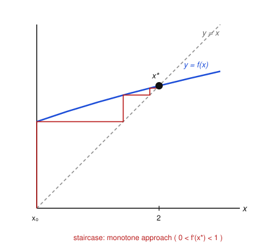
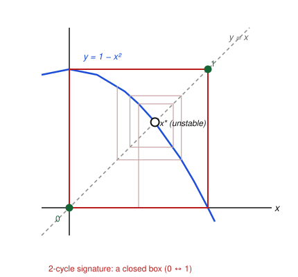

# Dynamical Systems & Chaos · Lesson 5.1: 1-D maps and cobweb diagrams

> ⏱ ~15 min · Module 5: Maps and the routes to chaos · Builds on: [Lesson 1.1](01-01-flows-on-the-line.md) · Unlocks: [Lesson 5.2](05-02-logistic-map-period-doubling.md)

## Why this matters

Everything you've done so far runs in continuous time: a vector field $f$ pushes a point along smoothly, and on the line that motion is so constrained it can't even oscillate (Lesson 1.1). Now we chop time into ticks. A **map** updates the state in discrete jumps, $x_{n+1}=f(x_n)$ — the population *next* year as a function of *this* year, the price after one round of bidding, the state of a chaotic flow sampled once per loop. That single change of setting is where chaos becomes cheap: one quadratic map, iterated, produces the entire period-doubling cascade of Lesson 5.2. This lesson gives you the graphical microscope — the **cobweb diagram** — that reads a map's fate off a single picture, exactly as the phase line did for flows.

## The idea

A map is a rule you apply over and over. Start at $x_0$, compute $x_1=f(x_0)$, then $x_2=f(x_1)$, and so on. The sequence $x_0,x_1,x_2,\dots$ is the **orbit** — the discrete analogue of a trajectory.

Iterating by hand is tedious, but there's a beautiful trick that turns it into geometry. Draw two curves on the same axes: the graph $y=f(x)$ and the diagonal $y=x$. Now:

- **Vertical to the curve.** From your current $x_n$ on the horizontal axis, go straight up (or down) to the curve. The height you hit is $f(x_n)=x_{n+1}$ — the *next* value.
- **Horizontal to the diagonal.** That next value is stuck on the vertical axis; to feed it back in as the new input, slide horizontally to the diagonal $y=x$, which copies a height onto the horizontal position.
- **Repeat.** You're now sitting above $x_{n+1}$. Go vertical to the curve again.

The zig-zag path you trace is the **cobweb**. Where does it go? Watch the two curves. Wherever they cross, $f(x)=x$: the map spits back exactly what you fed it, so the orbit stops. Those crossings are the **fixed points**. And the *way* the cobweb behaves near a crossing — climbing a staircase toward it, spiralling into it, or being flung away — is the entire story of stability.

## The formal version

**Map, orbit, iterate.** A one-dimensional map is a function $f$ and the update rule
$$x_{n+1}=f(x_n),\qquad n=0,1,2,\dots$$
The **orbit** of $x_0$ is the sequence $\{x_n\}$. We write $f^n$ for the $n$-fold **composition** $f\circ f\circ\cdots\circ f$, so $x_n=f^n(x_0)$.

*In words:* $f^n$ means "apply $f$ $n$ times," **not** the $n$-th power $f(x)^n$ — this is the one notation trap of the whole subject.

**Fixed point.** A point $x^*$ is a fixed point if
$$x^*=f(x^*).$$

*In words:* a fixed point is where the graph of $f$ meets the diagonal $y=x$ — not where $f=0$. (Contrast the flow $\dot x=f(x)$, whose equilibria are the *zeros* of $f$. Same symbol $f$, different question.)

**Linear stability.** Let $\eta_n=x_n-x^*$ be a small displacement. Taylor-expand:
$$\eta_{n+1}=x_{n+1}-x^*=f(x^*+\eta_n)-f(x^*)=f'(x^*)\,\eta_n+O(\eta_n^2).$$
Keeping the linear term, $\eta_{n+1}\approx f'(x^*)\,\eta_n$, so after $n$ steps $\eta_n\approx\big[f'(x^*)\big]^{\,n}\eta_0$. Writing $\lambda=f'(x^*)$ (the **multiplier**):
$$|\lambda|<1\Rightarrow\text{stable},\qquad |\lambda|>1\Rightarrow\text{unstable},\qquad |\lambda|=1\Rightarrow\text{marginal (test fails).}$$

*In words:* each step multiplies the error by $\lambda$. Errors shrink to zero exactly when $|\lambda|<1$ — so **for maps it's the magnitude that decides, not the sign.** This is the crucial break from flows, where the *sign* $f'(x^*)<0$ meant stable. A geometric $\lambda^n$ can decay while flipping sign, so the sign now controls something else:

- $0<\lambda<1$: $\eta_n$ keeps one sign and shrinks — the cobweb climbs a **staircase** into $x^*$ (monotone approach).
- $-1<\lambda<0$: $\eta_n$ flips sign each step while shrinking — the cobweb **spirals** into $x^*$ (oscillatory approach).
- $|\lambda|>1$ likewise gives a diverging staircase ($\lambda>1$) or diverging spiral ($\lambda<-1$).

**Periodic orbits.** A point $x^*$ has **period $p$** if
$$f^{\,p}(x^*)=x^*\quad\text{but}\quad f^{\,k}(x^*)\neq x^*\ \text{for }0<k<p.$$
So a period-$p$ point is a *fixed point of the $p$-th iterate* $f^p$. Its stability uses the same rule applied to $f^p$, and the chain rule collapses the derivative into a product over the cycle. If the orbit is $x_0^*\to x_1^*\to\cdots\to x_{p-1}^*\to x_0^*$, then
$$\big(f^{\,p}\big)'(x_0^*)=\prod_{i=0}^{p-1}f'(x_i^*)=:\lambda,\qquad\text{stable}\iff|\lambda|<1.$$

*In words:* to judge a cycle, multiply the slopes of $f$ at every point the cycle visits; the same $|\lambda|<1$ test decides. A **2-cycle** ($x_0^*\rightleftarrows x_1^*$) shows up on the cobweb as a closed **box** — vertical–horizontal around a rectangle whose corners sit alternately on the curve and the diagonal.

## Picture

A cobweb for $f(x)=\sqrt{x+2}$, whose only fixed point solves $x=\sqrt{x+2}$, i.e. $x^2-x-2=(x-2)(x+1)=0$, giving $x^*=2$. The slope there is $f'(2)=\tfrac{1}{2\sqrt{4}}=\tfrac14$, and $0<\tfrac14<1$, so the point is stable and approached monotonically — the cobweb is a **staircase** climbing into the crossing.

Start at $x_0=0$ on the axis, go up to the curve (that height is $x_1=\sqrt2\approx1.41$), across to the diagonal, up to the curve again ($x_2=\sqrt{3.41}\approx1.85$), and so on: $1.41,\,1.85,\,1.96,\,1.99,\dots\to2$. You never wrote down a formula for $x_n$ — the staircase already told you the orbit converges to $x^*=2$.

## Worked examples

**Example 1 (mechanical — classify a linear map two ways).** Consider $f(x)=-\tfrac12 x+3$.
Fixed point: $x^*=-\tfrac12 x^*+3\Rightarrow\tfrac32 x^*=3\Rightarrow x^*=2$. Multiplier $\lambda=f'(2)=-\tfrac12$. Since $|\lambda|=\tfrac12<1$, the point is **stable**; since $\lambda<0$, the approach is **oscillatory** — the cobweb spirals inward. Check by hand from $x_0=0$: $x_1=3$, $x_2=1.5$, $x_3=2.25$, $x_4=1.875,\dots$, the values straddling $2$ from alternating sides while closing in, exactly the spiral signature.

Contrast with the flow $\dot x=-\tfrac12 x+3$ from Lesson 1.1: there the *sign* $f'(2)=-\tfrac12<0$ would already mean stable, with no oscillation possible on the line. Same $f$, but the discrete rule reads its magnitude and permits the overshoot.

**Example 2 (why you'd care — a fixed point loses out to a 2-cycle).** Take $f(x)=1-x^2$, the simplest quadratic map.

*Fixed points* (curve meets diagonal): $x=1-x^2\Rightarrow x^2+x-1=0\Rightarrow x^*=\tfrac{-1\pm\sqrt5}{2}$. The relevant one is $x^*=\tfrac{-1+\sqrt5}{2}\approx0.618$. Slope $f'(x)=-2x$, so $\lambda=f'(0.618)\approx-1.236$. Because $|\lambda|>1$, this fixed point is **unstable** — the cobweb spirals *away* from it.

*Where does the orbit go instead?* Look for a 2-cycle. Try the pair $\{0,1\}$: $f(0)=1$ and $f(1)=0$, so $0\rightleftarrows1$ is a genuine period-2 orbit. Its multiplier is the product of slopes,
$$\lambda=f'(0)\cdot f'(1)=(-2\cdot0)\,(-2\cdot1)=0,$$
and $|\lambda|=0<1$, so the 2-cycle is **stable** (in fact superstable — the flattest possible attraction). Iterating from $x_0=0.5$ confirms it: $0.5,0.75,0.44,0.81,0.35,0.88,\dots$ locks onto the alternation $0\leftrightarrow1$.

The cobweb makes both facts visible at once: the orbit is repelled from the lone fixed point and settles into the closed **box** through $(0,0)\to(0,1)\to(1,1)\to(1,0)$ — the unmistakable signature of a stable 2-cycle. This is the whole mechanism of Lesson 5.2 in miniature: turn a knob, a fixed point goes unstable, and a 2-cycle inherits the dynamics.

## Watch out

- **You might think** fixed points are where $f(x)=0$ — **but** for a map they're where $f(x)=x$, the intersections with the diagonal. Setting $f=0$ is the *flow* rule from Lesson 1.1; carrying it over is the single most common mistake when you switch to discrete time.
- **You might think** a negative slope means instability, as it did for flows — **but** for maps the sign only sets *monotone vs. oscillatory*; stability is the *magnitude* $|f'(x^*)|<1$. A fixed point with $f'(x^*)=-0.9$ is perfectly stable (it just spirals in), while $f'(x^*)=-1.5$ is unstable.
- **You might think** $f^2$ means $f(x)^2$ — **but** $f^2=f\circ f$ is the second *iterate*. A period-2 point satisfies $f^2(x^*)=x^*$; a fixed point is automatically a (degenerate) solution of that too, so when hunting genuine 2-cycles you must discard the fixed points from the roots of $f^2(x)=x$.

## One-liner

> Draw $y=f(x)$ and $y=x$, then bounce vertical-to-curve / horizontal-to-diagonal: crossings are fixed points, and the orbit is stable exactly when the slope there has magnitude below one.

## Problems

**P1 (🟢)** For the map $x_{n+1}=\tfrac12 x_n+1$, find the fixed point and its multiplier, classify it (stable/unstable, staircase/spiral), and hand-iterate three steps from $x_0=0$ to confirm the cobweb pattern.

**P2 (🟡)** For $f(x)=\cos x$ (radians), argue there is exactly one fixed point $x^*$ in $[0,1]$, and show it is stable with an *oscillatory* (spiral) approach — i.e. $-1<f'(x^*)<0$. (You don't need the numerical value $x^*\approx0.739$; reason from the shape of $\cos$ and the sign/size of its slope on $(0,1)$.)

**P3 (🔴, optional)** For the quadratic map $f(x)=x^2-1$: (a) find both fixed points and show each is unstable; (b) verify that $\{0,-1\}$ is a 2-cycle and compute its multiplier to classify it. (Hint: to find 2-cycles in general, solve $f(f(x))=x$ and factor out the fixed-point roots.)

Solutions

**P1** Fixed point: $x^*=\tfrac12 x^*+1\Rightarrow\tfrac12 x^*=1\Rightarrow x^*=2$. Multiplier $\lambda=f'(x)=\tfrac12$ everywhere, so $\lambda=\tfrac12$. Since $|\lambda|=\tfrac12<1$ the point is **stable**, and since $0<\lambda<1$ the approach is **monotone** — a staircase. Iterating from $x_0=0$: $x_1=\tfrac12(0)+1=1$, $x_2=\tfrac12(1)+1=1.5$, $x_3=\tfrac12(1.5)+1=1.75$. The values climb monotonically toward $2$: a staircase cobweb, as predicted.

**P2** On $[0,1]$ define $g(x)=\cos x-x$. Then $g(0)=1>0$ and $g(1)=\cos1-1\approx0.540-1<0$, so by the intermediate value theorem $g$ has a root $x^*\in(0,1)$: a fixed point. It is unique there because $g'(x)=-\sin x-1<0$ on $(0,1)$ (indeed everywhere), so $g$ is strictly decreasing and crosses zero once. Stability: $f'(x)=-\sin x$, and for $x^*\in(0,1)$ we have $0<\sin x^*<\sin1\approx0.841<1$, hence
$$-1<-\sin x^*=f'(x^*)<0.$$
Thus $|f'(x^*)|<1$ (**stable**) and $f'(x^*)<0$ (**oscillatory/spiral approach**). This is the famous "keep pressing cosine on a calculator" fact: the display spirals into $\approx0.739$ no matter where you start.

**P3** (a) Fixed points: $x=x^2-1\Rightarrow x^2-x-1=0\Rightarrow x^*=\tfrac{1\pm\sqrt5}{2}$, i.e. $x^*\approx1.618$ and $x^*\approx-0.618$. Slope $f'(x)=2x$, so $\lambda=2x^*$: at $1.618$, $\lambda\approx3.24$; at $-0.618$, $\lambda\approx-1.236$. Both have $|\lambda|>1$, so **both fixed points are unstable**.

(b) Check $\{0,-1\}$: $f(0)=0^2-1=-1$ and $f(-1)=(-1)^2-1=0$, so $0\rightleftarrows-1$ is a 2-cycle. Multiplier by the chain rule:
$$\lambda=f'(0)\cdot f'(-1)=(2\cdot0)(2\cdot(-1))=0.$$
Since $|\lambda|=0<1$, the 2-cycle is **stable** (superstable). *General method check:* $f(f(x))=(x^2-1)^2-1=x^4-2x^2$. Setting $f(f(x))=x$ gives $x^4-2x^2-x=0$; the fixed-point factor is $x^2-x-1$, and dividing out leaves $x^2+x=x(x+1)=0$, whose roots $\{0,-1\}$ are exactly the 2-cycle. ✓

## Flashback

**From Lesson 1.1 (flows on the line):** Consider the *continuous* system $\dot x=f(x)$ with $f(x)=x^2-3x=x(x-3)$. (a) Find its fixed points and classify each from the sign of $f'$. (b) Now reinterpret the very same $f$ as the *map* $x_{n+1}=f(x_n)$. Is $x^*=0$ still a fixed point? Reclassify it using the discrete rule, and explain why the flow and the map disagree.

Solution

(a) **Flow.** Fixed points are the *zeros* of $f$: $x(x-3)=0\Rightarrow x^*\in\{0,3\}$. With $f'(x)=2x-3$: $f'(0)=-3<0$ → **stable**; $f'(3)=+3>0$ → **unstable**. (Sign of $f'$ decides, per Lesson 1.1.)

(b) **Map.** Fixed points are now where $f(x)=x$: $x^2-3x=x\Rightarrow x^2-4x=x(x-4)=0\Rightarrow x^*\in\{0,4\}$. So $x^*=0$ **is** still a fixed point (because $f(0)=0$), but $x^*=3$ is not, while a new fixed point $x^*=4$ appears — the equilibria genuinely differ between the two dynamics. At $x^*=0$ the multiplier is $\lambda=f'(0)=-3$, and $|\lambda|=3>1$, so as a map the origin is **unstable**.

The punchline: the identical number $f'(0)=-3$ makes the origin **stable for the flow** (because $-3<0$) yet **unstable for the map** (because $|-3|>1$). Flows read the *sign*; maps read the *magnitude*.

## Connections

- **Backward:** this is Lesson 1.1's phase-line logic transplanted to discrete time. The Taylor-expansion stability argument is identical in spirit; only the criterion changes from "sign of $f'$" to "magnitude of $f'$," and the phase line is replaced by the cobweb. Fixed points move from zeros of $f$ to intersections with $y=x$.
- **Forward:** [Lesson 5.2](05-02-logistic-map-period-doubling.md) turns the knob on the logistic map $x_{n+1}=rx_n(1-x_n)$ and watches exactly the Example 2 event repeat forever — fixed point → 2-cycle → 4-cycle → $\cdots$ — the period-doubling road to chaos, all read off cobwebs. Maps also reappear as **Poincaré sections** of the chaotic *flows* in Module 4: sample a 3-D trajectory once per loop and its dynamics collapse to a 1-D map like this one.
- **Sideways:** the discrete update $x_{n+1}=f(x_n)$ is precisely the tâtonnement price-adjustment process economists study in [grad-micro](../../grad-micro/syllabus.md) — a competitive equilibrium is a stable fixed point of that map, and $|f'(x^*)|<1$ is the convergence condition for the auction to settle. The same magnitude criterion governs the stability of iterative numerical schemes throughout applied math.
