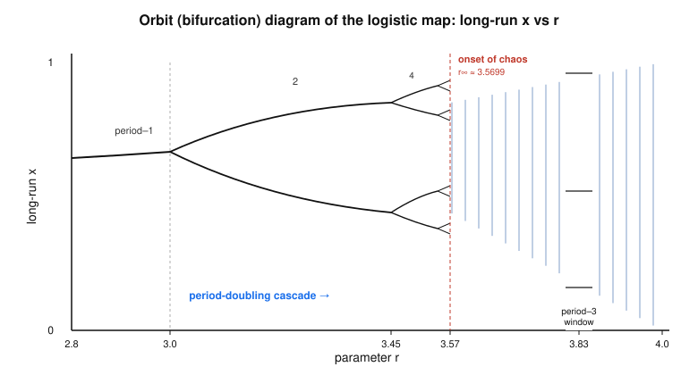

# Dynamical Systems & Chaos · Lesson 5.2: The logistic map and period-doubling

> ⏱ ~15 min · Module 5: Maps and the routes to chaos · Builds on: [Lesson 5.1 (maps and cobwebs)](05-01-maps-cobweb.md) · Unlocks: [Lesson 5.3 (Feigenbaum universality)](05-03-feigenbaum-universality.md)

## Why this matters

Here is the most famous single equation in chaos, and it is almost insultingly simple: $x_{n+1}=r\,x_n(1-x_n)$. One quadratic, one knob $r$. Turn the knob slowly and the map does something extraordinary — a steady state splits into a 2-cycle, which splits into a 4-cycle, then 8, 16, 32, faster and faster, until at a finite value of $r$ the periods pile up and the orbit becomes chaotic. This is the **period-doubling route to chaos**, and it is not a curiosity of this one map: dripping faucets, oscillating chemical reactions, and cardiac rhythms all march down the same road. This lesson traces that road with pencil-and-paper stability analysis you already own from Lesson 5.1, and it sets up the miracle of Lesson 5.3 — that the *rate* of doubling is a universal constant.

## The idea

The logistic map is a toy population model: $x_n\in[0,1]$ is this year's population as a fraction of the maximum the environment can hold. The rule has two competing instincts. The $r\,x_n$ part is **growth** — more parents, more offspring. The $(1-x_n)$ part is **crowding** — when $x_n$ is near $1$ the habitat is full and reproduction crashes. The single parameter $r\in[0,4]$ (kept in this range so the output stays in $[0,1]$) sets how aggressive the growth is.

Everything hinges on that knob:

- **Gentle $r$:** the population settles to a single steady value — a stable fixed point. Boring, and alive.
- **Crank it up:** the steady value destabilizes and the population starts *alternating* between a high year and a low year — a period-2 cycle. Crank more: a four-year pattern. Then eight.
- **Past a critical $r$:** no pattern ever repeats. The population wanders forever, never settling, never cycling — chaos.

The tool for finding *where* each transition happens is exactly the map-stability rule from Lesson 5.1: a fixed point $x^*$ of $x_{n+1}=f(x_n)$ is stable when $|f'(x^*)|<1$ and loses stability when the slope crosses the unit circle. For maps there are two ways to cross: $f'$ hits $+1$ (a fixed point collides with another — saddle-node/transcritical) or $f'$ hits $-1$. That second crossing is new and it is the whole story here: **$f'(x^*)=-1$ is a period-doubling (flip) bifurcation**, and it manufactures a 2-cycle out of thin air.

## The formal version

The map is
$$f(x)=r\,x(1-x),\qquad x\in[0,1],\ r\in[0,4],\qquad f'(x)=r(1-2x).$$

**Fixed points.** Solve $f(x)=x$, i.e. $rx(1-x)=x$, so $x\big[r(1-x)-1\big]=0$. This gives
$$x^*_0=0 \qquad\text{and}\qquad x^*=1-\tfrac1r.$$
*In words:* extinction ($x=0$) is always an equilibrium; the interesting nonzero equilibrium $x^*=1-1/r$ exists (lies in $(0,1)$) only once $r>1$.

**Stability.** Evaluate the derivative:
$$f'(0)=r,\qquad f'(x^*)=r\Big(1-2\big(1-\tfrac1r\big)\Big)=2-r.$$
So $x=0$ is stable exactly when $r<1$ (below that, the population dies out), and the nonzero point is stable when
$$|f'(x^*)|=|2-r|<1 \iff 1<r<3.$$
*In words:* for $1<r<3$ the population homes in on the single value $1-1/r$; at $r=1$ stability passes from extinction to $x^*$ (a transcritical exchange), and at $r=3$ something must give.

**The first period-doubling.** At $r=3$, $f'(x^*)=2-3=-1$. The multiplier hits $-1$: this is a **flip bifurcation**. For $r$ just above $3$ the fixed point is unstable ($|2-r|>1$), and a **stable 2-cycle** is born — a pair of points $p\neq q$ with $f(p)=q$, $f(q)=p$. You verify a 2-cycle's stability through the *composed* map $f^2=f\circ f$: the cycle is stable when $\big|(f^2)'\big|=|f'(p)\,f'(q)|<1$. A short computation (P3) gives this 2-cycle multiplier as $-r^2+2r+4$, which itself passes through $-1$ at $r_2=1+\sqrt6\approx3.449$ — and *that* is the next doubling.

**The cascade.** The pattern repeats without end. Writing $r_n$ for the parameter at which the $2^{n-1}$-cycle turns into a $2^{n}$-cycle:
$$r_1=3,\quad r_2=1+\sqrt6\approx3.449,\quad r_3\approx3.544,\quad r_4\approx3.5644,\ \dots$$
These values converge geometrically to a finite accumulation point
$$r_\infty\approx3.5699,$$
where the period has doubled infinitely often. *In words:* beyond $r_\infty$ the "period" is effectively infinite — the orbit never repeats. **This is the onset of chaos.**

**Inside the chaos.** For $r>r_\infty$ the long-run behavior is mostly chaotic, but not uniformly: the chaotic band is riddled with **periodic windows** where order briefly returns. The most prominent is a **period-3 window** opening near $r\approx3.83$; as $r$ rises through it you see a clean 3-cycle that then itself period-doubles (3, 6, 12, …) back into chaos. The existence of a period-3 orbit is a big deal — by a theorem you'll meet later (Sharkovskii / "period three implies chaos"), period 3 forces orbits of *every* period to coexist.

## Picture

The **orbit (bifurcation) diagram** plots the long-run values of $x$ (after transients die) against $r$. Read it left to right: one branch, then the fork at $r=3$, then $2\to4\to8$ splitting ever faster, the branches accumulating at $r_\infty$ and dissolving into the shaded chaotic band — which is punctured by white periodic windows, the widest being period-3.

## Worked examples

**Example 1 (the fixed point and its stability — mechanical).** Take $r=2.5$. The nonzero fixed point is
$$x^*=1-\tfrac1{2.5}=1-0.4=0.6,$$
and its multiplier is $f'(x^*)=2-r=2-2.5=-0.5$. Since $|-0.5|<1$, $x^*=0.6$ is **stable** — every initial condition in $(0,1)$ is drawn to $0.6$. The negative sign matters: because $f'(x^*)<0$, the approach is *oscillatory*, alternating above and below $0.6$ while closing in (an inward-spiralling cobweb, not a staircase). Compare $r=1.8$: $x^*=1-1/1.8\approx0.444$, $f'=2-1.8=0.2>0$, so there the approach is monotone. The knob controls not just *where* the population settles but *how* it gets there.

**Example 2 (locating the first bifurcation — why you'd care).** *At what $r$ does the steady population first give way to a boom–bust cycle?* We need the value where $x^*$ loses stability. Stability holds while $|2-r|<1$; the upper edge is
$$2-r=-1 \implies r=3.$$
At $r=3$ exactly, $f'(x^*)=-1$: the multiplier reaches the far side of the unit interval, the fixed point goes marginally unstable, and a stable 2-cycle appears. Ecologically: push the growth rate past $3$ and a population that used to hold steady now *must* alternate between a crowded year and a sparse one — the deterministic rule alone, no randomness, produces the oscillation. This single crossing $f'=-1$ is the seed the whole cascade grows from.

## Watch out

- **You might think** $f'(x^*)=-1$ means "neutral, nothing happens," as a zero derivative would for a smooth extremum. **Actually** at $f'=-1$ the fixed point is *losing* stability and shedding a 2-cycle — the linear test is inconclusive *only about the fixed point itself*, and you must look to $f^2$ to see the new cycle. Slope $-1$ is an event, not a non-event.
- **You might think** the doublings are evenly spaced in $r$. **Actually** they bunch up geometrically: each window of stability is roughly $4.669\times$ shorter than the last (that ratio is the Feigenbaum constant of Lesson 5.3), which is exactly why infinitely many of them fit below the finite value $r_\infty\approx3.5699$.
- **You might think** everything past $r_\infty$ is chaos. **Actually** the chaotic region is shot through with periodic windows — order and chaos interleave densely. The period-3 window near $r\approx3.83$ is the famous one; miss it and you'd wrongly report "pure chaos" throughout.
- **You might think** $r$ can be pushed arbitrarily high. **Actually** for $r>4$ the parabola's peak exceeds $1$ and orbits escape $[0,1]$ (most initial conditions run off to $-\infty$); the whole story lives on $0\le r\le4$.

## One-liner

> Turn one knob and a steady state doubles its period again and again — $f'(x^*)=-1$ each time — until at $r_\infty\approx3.5699$ the doublings accumulate and determinism turns into chaos.

## Problems

**P1 (🟢)** For the logistic map with $r=2.8$: (a) find both fixed points; (b) compute $f'$ at each and classify them as stable or unstable; (c) will the approach to the stable one be monotone or oscillatory?

**P2 (🟡)** You increase $r$ from $3.2$. (a) Is the nonzero fixed point $x^*$ stable at $r=3.2$? Compute its multiplier and decide. (b) Given the cascade values $r_1=3$, $r_2\approx3.449$, what is the long-run behavior at $r=3.2$ — a fixed point, a 2-cycle, a 4-cycle, or chaos? (c) Reading the orbit diagram, what changes qualitatively as you push $r$ from $3.2$ to $3.5$?

**P3 (🔴)** Derive the location $r_2$ of the *second* period-doubling. The 2-cycle points $p,q$ are the roots of $r^2x^2-r(r+1)x+(r+1)=0$ (the quadratic factor left after dividing $f(f(x))-x$ by the two fixed points). Using $p+q=\tfrac{r+1}{r}$ and $pq=\tfrac{r+1}{r^2}$, show the 2-cycle multiplier is $(f^2)'=f'(p)f'(q)=-r^2+2r+4$, and find the $r$ at which it equals $-1$.

Solutions

**P1** (a) Fixed points $x=0$ and $x^*=1-\tfrac1{2.8}=1-0.3571=0.6429$.
(b) $f'(0)=r=2.8$, so $|f'(0)|=2.8>1$ — **unstable**. $f'(x^*)=2-r=2-2.8=-0.8$, so $|f'(x^*)|=0.8<1$ — **stable**.
(c) Since $f'(x^*)=-0.8<0$, the multiplier is negative, so the orbit approaches $0.6429$ **oscillating** from side to side (alternating high/low years), shrinking each step by the factor $0.8$. (This is consistent with $r=2.8<3$: still one stable equilibrium, just approached in a spiralling cobweb.)

**P2** (a) $f'(x^*)=2-r=2-3.2=-1.2$, so $|f'(x^*)|=1.2>1$: the fixed point is **unstable**. (Makes sense — we are past $r_1=3$.)
(b) We have $r_1=3<r=3.2<r_2\approx3.449$, so we are in the first doubled window: the fixed point is gone but the *2-cycle* is stable and its own doubling hasn't happened yet. Long-run behavior is a **stable period-2 cycle** (the population alternates between two values).
(c) Pushing $r$ from $3.2$ toward $3.5$ you cross $r_2\approx3.449$: the 2-cycle destabilizes and a **stable 4-cycle** appears (the two branches each split in two). Approaching $r_3\approx3.544$ you'd get an 8-cycle, and the branches keep splitting faster — the run-up to the cascade's accumulation.

**P3** With $f'(x)=r(1-2x)$,
$$f'(p)f'(q)=r^2(1-2p)(1-2q)=r^2\big[1-2(p+q)+4pq\big].$$
Substitute $p+q=\tfrac{r+1}{r}$ and $pq=\tfrac{r+1}{r^2}$:
$$1-2\cdot\tfrac{r+1}{r}+4\cdot\tfrac{r+1}{r^2}=\frac{r^2-2r(r+1)+4(r+1)}{r^2}=\frac{r^2-2r^2-2r+4r+4}{r^2}=\frac{-r^2+2r+4}{r^2}.$$
Multiplying by $r^2$ gives the 2-cycle multiplier
$$(f^2)'=f'(p)f'(q)=-r^2+2r+4.$$
Quick sanity check: at $r=3$ this equals $-9+6+4=1$, i.e. the 2-cycle is born (multiplier $+1$) exactly where the fixed point flips — consistent. Now set it to $-1$ for the next doubling:
$$-r^2+2r+4=-1 \implies r^2-2r-5=0 \implies r=1+\sqrt6\approx3.449=r_2.\ \blacksquare$$
So the 2-cycle is stable precisely on $3<r<1+\sqrt6$, then doubles to a 4-cycle — matching the diagram.

## Flashback

**From Lesson 5.1 (maps and cobwebs):** Consider the map $x_{n+1}=g(x_n)$ with $g(x)=\sqrt{2x}$ on $x\ge0$. (a) Find all fixed points. (b) Use $|g'(x^*)|$ to classify each. (c) Sketch what a cobweb from $x_0=1$ would do.

Solution

(a) Fixed points solve $\sqrt{2x}=x$. Squaring, $2x=x^2$, so $x(x-2)=0$: $x^*=0$ and $x^*=2$.

(b) $g'(x)=\dfrac{d}{dx}(2x)^{1/2}=\dfrac{1}{\sqrt{2x}}$. At $x^*=2$: $g'(2)=\dfrac1{\sqrt4}=\tfrac12$, and $|\tfrac12|<1$ — **stable**. At $x^*=0$: $g'(0)=1/\sqrt0\to+\infty>1$ — **unstable** (the slope is vertical there). So $x=2$ attracts and $x=0$ repels.

(c) Since $g'(2)=\tfrac12>0$, the cobweb from $x_0=1$ climbs **monotonically** (a staircase, not a spiral) up toward $x^*=2$: $x_1=\sqrt2\approx1.414$, $x_2=\sqrt{2\sqrt2}\approx1.682$, $x_3\approx1.834$, … converging to $2$. Each step the staircase treads between the curve $y=g(x)$ and the diagonal $y=x$, gaps shrinking by roughly the factor $g'(2)=\tfrac12$. (Contrast the logistic case above, where $f'(x^*)<0$ made the cobweb spiral inward.)

## Connections

- **Backward:** the entire analysis is the Lesson 5.1 map-stability rule $|f'(x^*)|<1$ applied twice — once to $f$ (finding the fixed point and its flip at $f'=-1$) and once to the composed map $f^2$ (finding the 2-cycle and its flip). Nothing new but the bookkeeping of iterating the derivative test.
- **Forward:** Lesson 5.3 measures the *geometric rate* at which the $r_n$ accumulate — the Feigenbaum constant $\delta\approx4.669$ — and reveals it is universal across all maps with a smooth quadratic maximum, explained by a renormalization idea. The period-3 window you saw here is the springboard for Lesson 5.5's symbolic dynamics.
- **Sideways (physics):** this same period-doubling cascade is measured in fluid convection near onset — the Lorenz truncation of Module 4 and the convection instabilities studied in [`fluid-dynamics`](../../fluid-dynamics/syllabus.md) show the same route, so a bench experiment reproduces this diagram's forks.
- **Sideways (stat-mech):** once the orbit is chaotic (past $r_\infty$), asking for its long-run *average* rather than its exact trajectory is the ergodic move that underlies [`stat-mech`](../../stat-mech/syllabus.md) — trading a hopeless point-by-point prediction for a stable statistical one, the theme that closes this module.
