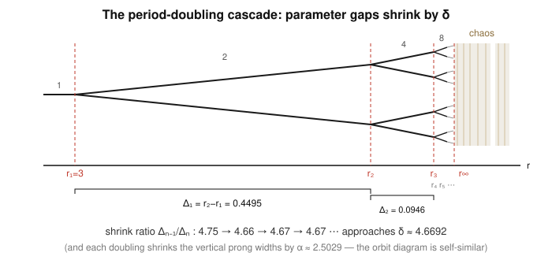

# Dynamical Systems & Chaos · Lesson 5.3: Feigenbaum universality

> ⏱ ~15 min · Module 5: Maps and the routes to chaos · Builds on: [Lesson 5.2 (the logistic map and period-doubling)](05-02-logistic-map-period-doubling.md) · Unlocks: [Lesson 5.4 (intermittency and other routes)](05-04-intermittency-routes.md)

## Why this matters

In Lesson 5.2 you watched the logistic map cascade to chaos: a stable point, then a 2-cycle at $r_1=3$, a 4-cycle at $r_2$, an 8-cycle at $r_3$, faster and faster until the doublings pile up at $r_\infty\approx3.5699$. That looked like a fact about one particular quadratic map. It isn't. Buried in the *rate* at which those doublings accelerate is a pure number, $\delta\approx4.6692$, that turns out to be the same for the sine map, for a dripping faucet, for oscillating chemical reactions, and for convecting liquid helium. Feigenbaum found a constant of nature hiding in a first-year exercise — and the reason it recurs everywhere is one of the deepest ideas in dynamics: **renormalization**. This is the payoff of the whole maps module.

## The idea

Look at the parameter gaps between successive doublings: $r_2-r_1$, then $r_3-r_2$, then $r_4-r_3$. Each is much smaller than the last — the cascade is speeding up. Feigenbaum's question was quantitative: *by what factor does each gap shrink?*

Take the ratio of consecutive gaps,
$$\frac{r_n-r_{n-1}}{r_{n+1}-r_n},$$
and it doesn't wander around — it homes in on $4.6692\ldots$ as you go deeper. Every doubling window is about $4.669$ times wider than the next. That single number, $\delta$, controls how fast the map runs out of parameter room and tips into chaos.

The shock is the second half. Compute the same ratio for a *completely different* map — say $x_{n+1}=r\sin(\pi x_n)$, which has no algebraic resemblance to $rx(1-x)$ — and you get $4.6692$ again. The doubling *values* $r_n$ are different, the accumulation point is different, but the shrink rate is identical. This is **universality**: any smooth map with a single hump that is *quadratic* at its top (curves like a parabola, not a sharp peak) follows the same cascade with the same $\delta$. The geometry of the top of the hump is the only thing that matters; everything else washes out.

## The formal version

**The Feigenbaum ratio.** For a period-doubling cascade with doubling parameters $r_1<r_2<r_3<\cdots\to r_\infty$, define
$$\delta=\lim_{n\to\infty}\frac{r_n-r_{n-1}}{r_{n+1}-r_n}\approx 4.669201609\ldots$$

*In words:* consecutive parameter gaps shrink by a constant factor $\delta$ in the limit, so the cascade is (asymptotically) a geometric progression closing in on $r_\infty$.

**The scaling constant.** There is a companion number governing the *state* variable. In the orbit diagram, each doubling splits every branch into two nearby prongs; the width of those prongs shrinks by a factor
$$\alpha\approx 2.502907875\ldots$$
at each stage. Together $(\delta,\alpha)$ make the orbit diagram **self-similar**: zoom into one prong, rescale the parameter axis by $\delta$ and the state axis by $\alpha$, and you recover the same branching structure.

*In words:* $\delta$ is how much narrower the next window is horizontally (in $r$); $\alpha$ is how much narrower the next fork is vertically (in $x$).

**Universality (Feigenbaum, 1975).** For *every* smooth unimodal map — one hump, with a non-degenerate quadratic maximum — that undergoes a period-doubling cascade, the constants $\delta$ and $\alpha$ take these *same* values, independent of the specific map.

*In words:* the numbers $4.6692$ and $2.5029$ don't belong to the logistic map; they belong to the *class* of all quadratic-topped maps.

**Why — the renormalization idea (stated, not proved).** Ask what the map looks like *near its peak* after one period-doubling: the second iterate $f\circ f$, restricted to a small box around the top and flipped and rescaled to fill the original box, looks like a new unimodal map. That "look at the second iterate, then zoom" operation is a map *on the space of maps*, the **doubling operator**
$$T[f](x)=\alpha\,f\!\big(f(x/\alpha)\big).$$
$T$ has a **fixed-point function** $g$ (a specific even function with $g(0)=1$) satisfying $g(x)=\alpha\,g(g(x/\alpha))$. Because every quadratic-topped map, under repeated doubling-and-zooming, is pulled toward this *same* $g$, they all inherit its constants. And $\delta$ is precisely the **unstable eigenvalue** of the linearization of $T$ about $g$: it measures how fast nearby maps are pushed *away* along the one relevant direction — which in the parameter picture is exactly the rate at which the doublings accelerate. That is the whole mechanism: one universal fixed point, one governing eigenvalue.

## Picture

The tree splits at $r_1,r_2,r_3,\dots$, the gaps between splits collapsing geometrically toward the accumulation point $r_\infty$, beyond which lies chaos. The ratio of consecutive gaps (bottom) settles onto $\delta\approx4.6692$; each doubling also squeezes the vertical prong widths by $\alpha\approx2.5029$, which is why zooming into any fork reproduces the whole picture.

## Worked examples

**Example 1 (the computation — watch $\delta$ emerge from the table).** Here are the logistic map's first six period-doubling parameters (from careful numerics):

| $n$ | period born | $r_n$ | gap $\Delta_n=r_n-r_{n-1}$ | ratio $\Delta_{n-1}/\Delta_n$ |
|---|---|---|---|---|
| 1 | 2  | 3.0000000 | — | — |
| 2 | 4  | 3.4494897 | 0.4494897 | — |
| 3 | 8  | 3.5440903 | 0.0946006 | 4.7514 |
| 4 | 16 | 3.5644073 | 0.0203170 | 4.6562 |
| 5 | 32 | 3.5687594 | 0.0043521 | 4.6683 |
| 6 | 64 | 3.5696916 | 0.0009322 | 4.6685 |

Read the last column top to bottom: $4.75$, then $4.66$, then $4.67$, $4.67$. It is converging, and it is converging to $4.6692$. For instance the deepest ratio available here,
$$\frac{\Delta_4}{\Delta_5}=\frac{0.0043521}{0.0009322}=4.6686,$$
already agrees with $\delta$ to three digits. Notice how *fast* the numbers are collapsing: by $n=6$ the whole cascade is squeezed into a window of width under $0.001$. Just past this table sits $r_\infty\approx3.5699456$, the edge of chaos.

**Example 2 (why you'd care — the same number, a different map, a real experiment).** Replace the parabola by a sine hump: $x_{n+1}=r\sin(\pi x_n)$ on $[0,1]$. Nothing about $\sin$ resembles $x(1-x)$ algebraically, and its doubling values $r_n$ are entirely different numbers. Yet tabulate *its* gap ratios and they too march to $4.6692$ — because near the top of the hump $\sin(\pi x)$ is quadratic, so it lives in the same universality class and is dragged to the same fixed-point function $g$.

This is not a curiosity of arithmetic. In 1979 Libchaber and Maurer drove a tiny cell of liquid helium through the onset of convection and watched the fluid oscillation period double, then double again, as they turned up the heat; the measured ratio of successive threshold intervals was consistent with Feigenbaum's $\delta$. A number extracted from iterating a one-line map predicted the behavior of a boiling fluid governed by partial differential equations. That is what "universal" means here — and it's the map-side face of the same convection story you met in the [Lorenz system](04-01-lorenz-system.md) and that [`fluid-dynamics`](../../fluid-dynamics/syllabus.md) treats directly.

## Watch out

- **You might think $\delta$ is a property of the logistic map — but it isn't.** The $r_n$ *are* map-specific; $r_\infty$ is map-specific. What's universal is the *rate* $\delta$ (and the state-scaling $\alpha$). Quoting "$\delta$ for the logistic map" is a category error: $\delta$ is shared by the whole class.
- **Universality needs a *quadratic* maximum.** The magic requires the hump to be locally parabolic ($f''\neq0$ at the top). A map with a sharp, tent-like peak, or a quartic-flat top, is in a *different* class with *different* constants. The tent map (Lesson 5.5) doesn't period-double this way at all.
- **The ratio only settles asymptotically.** The first ratio ($4.75$) is noticeably off; convergence to $4.6692$ is itself geometric (the corrections die like $\delta^{-n}$). Don't expect three-digit accuracy from $r_1,r_2,r_3$ alone — you need to go a few doublings deep, exactly where the $r_n$ get hardest to compute.
- **$\delta$ is not the Lyapunov exponent.** $\delta$ describes the *approach* to chaos in *parameter* space; the Lyapunov exponent (Lesson 4.4) measures divergence of trajectories in *state* space *at* a fixed parameter. Different spaces, different questions.

## One-liner

> The rate at which period-doublings accelerate is a universal constant, $\delta\approx4.6692$ — the same for every one-humped map with a rounded top, because they all flow to one renormalization fixed point whose governing eigenvalue is $\delta$.

## Problems

**P1 (🟢)** Using the table in Example 1, estimate $\delta$ from the single ratio $(r_5-r_4)/(r_6-r_5)$ with $r_4=3.5644073$, $r_5=3.5687594$, $r_6=3.5696916$. How many digits does it match?

**P2 (🟡)** Because the gaps eventually shrink by the factor $\delta$ each step ($\Delta_{n+1}\approx\Delta_n/\delta$), the distance still remaining to the accumulation point after the $n$-th doubling is a geometric tail. Show that
$$r_\infty-r_n\;\approx\;\frac{\Delta_n}{\delta-1},$$
and evaluate it at $n=5$ using $\Delta_5=r_5-r_4=0.0043521$ and $\delta=4.6692$. Compare with the known $r_\infty\approx3.5699456$.

**P3 (🔴, optional)** In one paragraph, explain — using the renormalization picture — *why* the sine map $x_{n+1}=r\sin(\pi x_n)$ must exhibit the same $\delta$ as the logistic map, and state clearly which quantities of its cascade are universal and which are not.

Solutions

**P1** Compute the two gaps, then their ratio:
$$\Delta_5=r_5-r_4=3.5687594-3.5644073=0.0043521,$$
$$\Delta_6=r_6-r_5=3.5696916-3.5687594=0.0009322,$$
$$\frac{\Delta_5}{\Delta_6}=\frac{0.0043521}{0.0009322}=4.6686.$$
Against $\delta=4.66920$ this agrees to three digits ($4.669$ vs $4.6686$) — the fourth digit is off by about $0.0006$, the residual geometric error you'd shave down with one more doubling.

**P2** Summing the geometric tail: after $r_n$, the remaining gaps are $\Delta_{n+1}+\Delta_{n+2}+\cdots$. Using $\Delta_{n+k}\approx\Delta_n/\delta^{\,k}$,
$$r_\infty-r_n=\sum_{k=1}^{\infty}\Delta_{n+k}\approx\Delta_n\sum_{k=1}^{\infty}\delta^{-k}=\Delta_n\cdot\frac{\delta^{-1}}{1-\delta^{-1}}=\frac{\Delta_n}{\delta-1}.$$
At $n=5$ with $\Delta_5=0.0043521$ and $\delta-1=3.6692$,
$$r_\infty-r_5\approx\frac{0.0043521}{3.6692}=0.0011861,\qquad r_\infty\approx 3.5687594+0.0011861=3.5699455.$$
The tabulated value is $3.5699456$ — agreement to seven digits. The geometric-tail estimate is superb this deep into the cascade precisely because by $n=5$ the ratio has already locked onto $\delta$.

**P3** Zooming in on the top of either map after one period-doubling — taking the second iterate and rescaling it to fill the original box — is the doubling operator $T[f]=\alpha f(f(\,\cdot\,/\alpha))$ acting on the map. Iterating $T$ repeatedly, both $rx(1-x)$ and $r\sin(\pi x)$ are attracted to the *same* fixed-point function $g$, because $T$'s only requirement for this pull is that the map have a smooth quadratic maximum — which both do. Once a map is near $g$, its cascade is governed by the linearization of $T$ about $g$, whose unstable eigenvalue is $\delta$ and whose associated state-rescaling is $\alpha$; these are properties of $g$, not of the starting map. **Universal:** $\delta\approx4.6692$, $\alpha\approx2.5029$, and the qualitative period-doubling route itself. **Not universal:** the specific doubling values $r_n$, the accumulation point $r_\infty$, and the numerical locations of the branches — all of which depend on the individual map.

## Flashback

**From Lesson 5.2 (the logistic map and period-doubling):** For the logistic map $x_{n+1}=rx_n(1-x_n)$ at $r=2.8$, find the nonzero fixed point $x^*$, compute the multiplier $f'(x^*)$, and decide whether $x^*$ is stable. Then say what happens to this multiplier as $r$ climbs to $3$.

Solution

Fixed points solve $x=rx(1-x)$, i.e. $x[1-r(1-x)]=0$, giving $x^*=0$ and the nonzero root
$$x^*=1-\frac1r=1-\frac{1}{2.8}=1-0.3571=0.6429.$$
The derivative is $f'(x)=r(1-2x)$, so at the nonzero fixed point
$$f'(x^*)=r\Big(1-2\big(1-\tfrac1r\big)\Big)=r\Big(-1+\tfrac2r\Big)=2-r.$$
At $r=2.8$ this is $f'(x^*)=2-2.8=-0.8$. Since $|{-0.8}|=0.8<1$, the fixed point is **stable** (the negative sign means approach is oscillatory — iterates alternate sides as they close in). As $r\to3$, the multiplier $2-r\to-1$: at $r=3$ it hits $|f'(x^*)|=1$, the fixed point loses stability, and the period-2 cycle is born — that's $r_1=3$, the first rung of this lesson's cascade.

## Connections

- **Backward:** this quantifies the cascade of [Lesson 5.2](05-02-logistic-map-period-doubling.md). The multiplier crossing $-1$ (the flashback) is the *event* at each $r_n$; $\delta$ is the *rate* those events accelerate. The self-similarity of the orbit diagram is the same fractal self-similarity you measured in [Lesson 4.5 (fractal dimension)](04-05-fractal-dimension.md), now in the parameter/state plane.
- **Forward:** [Lesson 5.4](05-04-intermittency-routes.md) shows period-doubling is not the *only* road to chaos — intermittency arrives through a tangent (saddle-node) bifurcation of the map, with its own scaling law. Universality classes reappear there.
- **Sideways (fluid dynamics):** the period-doubling route and its $\delta$ were confirmed experimentally in convecting liquid helium and other fluids; this is the map-level shadow of the convection onset modeled by the [Lorenz system](04-01-lorenz-system.md) and studied in [`fluid-dynamics`](../../fluid-dynamics/syllabus.md). The renormalization-group logic — a fixed point in the space of models whose eigenvalues give universal exponents — is the very same machinery that explains universal critical exponents at phase transitions in [`stat-mech`](../../stat-mech/syllabus.md).
