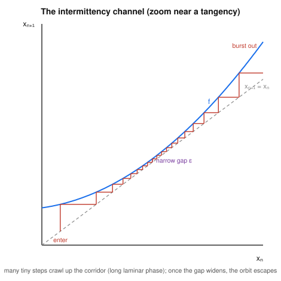

# Dynamical Systems & Chaos · Lesson 5.4: Intermittency and other routes to chaos

> ⏱ ~15 min · Module 5: Maps and the routes to chaos · Builds on: [Lesson 5.2](05-02-logistic-map-period-doubling.md) (period-doubling), [Lesson 3.1](03-01-saddle-node-transcritical.md) (saddle-node bifurcation) · Unlocks: [Lesson 5.5](05-05-symbolic-dynamics-ergodicity.md) (symbolic dynamics and ergodicity)

## Why this matters

The period-doubling cascade of [Lesson 5.2](05-02-logistic-map-period-doubling.md) is the famous road into chaos — but it is not the only one, and if you only know that road you will misread half the systems you meet. Turn the logistic knob *down* out of the stable period-3 window and chaos arrives with a completely different signature: long stretches of clean, almost-periodic motion, punctuated at unpredictable moments by a sudden chaotic burst — then clean again. Rayleigh–Bénard convection cells do this; so do dripping faucets and certain lasers. This is **intermittency**, and its mechanism turns out to be an old friend from Module 3 — the saddle-node bifurcation — hiding inside a map. Recognizing it tells you *how close to threshold you are* just from the timing of the bursts.

## The idea

Watch a time series that is intermittent. For a long time the system looks like it has settled onto a period-3 cycle — three values repeating, tick, tick, tick, almost boringly regular. This calm stretch is called a **laminar phase**. Then, with no external kick, the regularity dissolves into a short chaotic **burst**; moments later the system re-collects itself into the near-periodic rhythm again. As you tune a parameter *toward* the threshold, the bursts don't get bigger — they get *rarer*: the laminar phases stretch out longer and longer, until at threshold they last forever and the motion is exactly periodic.

Why would nearly-periodic motion keep almost-repeating and then blow up? Picture the map's cobweb. A period-3 cycle of the map $f$ is a fixed point of the third iterate $f^3$ — a place where the graph of $f^3$ crosses the diagonal. Just below the period-3 window, that crossing has *just barely vanished*: the graph of $f^3$ has lifted so it no longer touches the diagonal, leaving a paper-thin **channel** between the curve and the line. The cobweb orbit, funneling into this channel, is nearly a fixed point — so it takes hundreds of tiny steps to crawl through (the laminar phase). Once it squeezes out the far end, the map's global folding takes over and it wanders chaotically (the burst) until it is re-injected into the channel mouth and the slow crawl begins again.

That "graph lifting off the diagonal until the crossing disappears" is *exactly* a saddle-node bifurcation — two fixed points colliding and annihilating — now happening to $f^3$. This is **Pomeau–Manneville type-I intermittency**.

## The formal version

**Type-I intermittency.** Let $g = f^k$ (here $k=3$) depend on a parameter $r$, and suppose $g$ has a **tangent (saddle-node) bifurcation** at $r = r_c$: at $r_c$ the graph of $g$ is tangent to the diagonal at a point $x_c$, so
$$g(x_c) = x_c, \qquad g'(x_c) = 1.$$

*In words:* at the threshold the curve just kisses the 45-degree line — a fixed point that is exactly marginal, born from a stable/unstable pair merging (compare the normal form $\dot x=\mu+x^2$ from [Lesson 3.1](03-01-saddle-node-transcritical.md), the flow version of the same collision).

Just past threshold the tangency lifts. Near $x_c$ write the local displacement $u_n = x_n - x_c$; Taylor-expanding a tangency ($g'=1$) with the parameter pushing the curve off the diagonal gives the **normal form of the map**
$$u_{n+1} = u_n + \varepsilon + a\,u_n^2,$$
with $\varepsilon \propto (r - r_c)$ the size of the gap and $a$ the curvature $\tfrac12 g''(x_c)$. When $\varepsilon<0$ there are two fixed points ($u^*=\pm\sqrt{-\varepsilon/a}$, a stable/unstable pair — the period-3 cycle exists); at $\varepsilon=0$ they merge; for $\varepsilon>0$ **no** fixed point remains, only a narrow channel of width $\sim\varepsilon$ through which $u$ must climb.

*In words:* the discrete map near the tangency is the exact saddle-node normal form. The channel is what's left when the fixed points annihilate.

**Laminar-length scaling.** Because the steps through the channel are tiny, approximate the recursion by a differential equation, $\dfrac{du}{dn} \approx \varepsilon + a\,u^2$. The number of iterations $N$ to traverse the channel (from $u=-\infty$ to $u=+\infty$, in the approximation) is
$$N \;\approx\; \int_{-\infty}^{\infty} \frac{du}{\varepsilon + a\,u^2} \;=\; \frac{\pi}{\sqrt{a\,\varepsilon}} \;\propto\; \varepsilon^{-1/2}.$$

*In words:* the average laminar phase lasts on the order of $(r-r_c)^{-1/2}$ iterations — halve your distance to threshold and the calm stretches grow by a factor $\sqrt 2$. That inverse-square-root divergence is the experimental fingerprint of type-I intermittency.

## Picture

This is a zoom on the channel. The map curve $f$ (blue) hangs just *above* the diagonal (grey dashed) — the fixed point has already annihilated, so the two never cross; the purple tick marks the **narrow gap** $\varepsilon$ at the throat. The cobweb (red) enters at the lower left and must ascend through the corridor: because $f(x)-x$ is tiny there, every vertical step is minuscule, and the orbit takes **many** of them (here 19, and in a real system it could be thousands) to inch through. Only once it clears the throat, where the gap widens, do the steps grow and the orbit bursts out of the frame into the chaotic part of the map. Shrink $\varepsilon$ and the throat gets tighter, the steps smaller, the crawl longer — the $\varepsilon^{-1/2}$ law made visible.

## Worked examples

**Example 1 (the channel and its scaling, concretely).** Take the map normal form $u_{n+1} = u_n + \varepsilon + u_n^2$ (so $a=1$), and compare the laminar length at $\varepsilon = 0.01$ versus $\varepsilon = 0.0025$.

The estimate is $N \approx \pi/\sqrt{a\varepsilon} = \pi/\sqrt{\varepsilon}$.
- At $\varepsilon=0.01$: $N \approx \pi/0.1 = 31.4$ iterations.
- At $\varepsilon=0.0025$: $N \approx \pi/0.05 = 62.8$ iterations.

Quartering $\varepsilon$ **doubled** the laminar phase — exactly the $\varepsilon^{-1/2}$ prediction ($\sqrt 4 = 2$). Notice we never solved the recursion; the integral approximation is legitimate precisely because the steps in the channel are small, which is the same reason the laminar phase is long. The bursts themselves take a roughly *fixed* number of steps regardless of $\varepsilon$, so as threshold nears, the orbit spends an ever-larger *fraction* of its time laminar — the intermittency becomes visually cleaner even as the underlying map barely changed.

**Example 2 (how a period-3 window ends — reading the logistic map).** In the logistic map $x_{n+1}=r\,x_n(1-x_n)$, a wide window of stable period-3 motion opens at $r = 1+\sqrt 8 \approx 3.8284$. What happens right at that lower edge?

At $r_c = 1+\sqrt8$ the third iterate $f^3$ is *tangent* to the diagonal at three points simultaneously — three tangencies being born, i.e. a saddle-node bifurcation of $f^3$ that creates the stable period-3 cycle (and its unstable twin) all at once. For $r$ just **above** $r_c$ the tangencies have opened into genuine crossings: a stable 3-cycle exists and the orbit locks onto it. For $r$ just **below** $r_c$ the crossings are gone — only the three narrow channels remain. An orbit then shadows the ghost of the 3-cycle for a long laminar stretch (crawling through channel 1, then 2, then 3, then 1, ...), bursts chaotically when it finally exits, and is re-injected to shadow the ghost again. So *decreasing* $r$ through $r_c$ takes you from clean period-3 into intermittent chaos — chaos arriving with **no period-doubling at all**. (This same $r_c$ and its symbolic reading are the heart of Boss problem 5.)

## Watch out

- **You might think** intermittency is period-doubling seen from the other side — but they are distinct routes with distinct fingerprints. Period-doubling ([Lesson 5.2](05-02-logistic-map-period-doubling.md)) approaches chaos through $2,4,8,\dots$ cycles governed by Feigenbaum's $\delta\approx 4.669$ ([Lesson 5.3](05-03-feigenbaum-universality.md)); type-I intermittency approaches it through a *tangent* bifurcation with laminar lengths scaling as $(r-r_c)^{-1/2}$. Different mechanism, different scaling law.
- **You might think** the bursts grow as you near threshold — but it's the *laminar phases* that grow (as $\varepsilon^{-1/2}$); the bursts stay about the same length. Approaching threshold makes the motion look *more* regular, not less, right up until it snaps to exactly periodic.
- **You might think** "$g'(x_c)=1$" is a typo for the flow condition "$f'=0$" — but for **maps** the marginal-stability boundary is $|g'|=1$, not $g'=0$. A map fixed point is stable when $|g'(x^*)|<1$ ([Lesson 5.1](05-01-maps-cobweb.md)); tangency to the diagonal, $g'=1$, is the saddle-node edge (a period-doubling edge would instead be $g'=-1$).

## Other routes to chaos (a brief tour)

Intermittency and period-doubling are two of the three classical routes; the third rounds out the map. Chaos does not have one door.

- **Period-doubling (Feigenbaum).** An infinite cascade $2\to4\to8\to\cdots$ accumulating at $r_\infty$, with universal geometric spacing $\delta\approx4.669$. Covered in [Lesson 5.2](05-02-logistic-map-period-doubling.md)–[5.3](05-03-feigenbaum-universality.md).
- **Intermittency (Pomeau–Manneville).** Laminar phases interrupted by bursts, born at a tangent bifurcation, laminar length $\sim (r-r_c)^{-1/2}$. This lesson.
- **Quasiperiodic (Ruelle–Takens–Newhouse).** A system develops **two incommensurate frequencies** $\omega_1,\omega_2$ (an irrational ratio), so its motion winds densely around a 2-torus — quasiperiodic, not yet chaotic. As a parameter turns, that torus **wrinkles and breaks up**, and chaos appears after only a *few* such frequency-adding bifurcations. This overturned the older Landau picture (chaos as infinitely many piled-up frequencies): you need just a handful. It is the onset scenario for [`fluid-dynamics`](../../fluid-dynamics/syllabus.md) turbulence in small convection cells.
- **Crises.** Not a slow route but a *sudden* one: as a parameter varies, a chaotic attractor collides with an unstable fixed point or cycle (or with its own basin boundary), and abruptly **grows, shrinks, or vanishes**. The period-3 window in the logistic map ends at its *upper* edge in exactly such an interior crisis — the small chaotic bands suddenly widening. Crises explain the abrupt appearance and disappearance of chaotic behavior as a knob turns, without any cascade.

## One-liner

> Intermittency is a saddle-node bifurcation hiding in a map: kill the fixed point and the orbit crawls through the leftover channel for $\sim(r-r_c)^{-1/2}$ laminar steps before each chaotic burst.

## Problems

**P1 (🟢)** For the map normal form $u_{n+1}=u_n+\varepsilon+a\,u_n^2$ with $a=2$, use $N\approx \pi/\sqrt{a\varepsilon}$ to estimate the mean laminar length at $\varepsilon=0.02$. Then find the factor by which the laminar length changes when $\varepsilon$ is reduced to $\varepsilon=0.005$, and state the general scaling law you're using.

**P2 (🟡)** Explain, using only the cobweb picture, why the laminar phase gets *longer* as $\varepsilon\to0^+$ but the map barely changes. In particular, why does an orbit near the channel behave almost like a fixed point, and what specifically about the geometry makes each step small?

**P3 (🔴, optional)** Consider $u_{n+1}=u_n+\varepsilon+u_n^2$ with $\varepsilon<0$. (a) Find the two fixed points. (b) A map fixed point is stable iff $|g'(u^*)|<1$; here $g'(u)=1+2u$. Classify each fixed point. (c) As $\varepsilon\to0^-$ describe what happens to the pair, and name the bifurcation and the value of $g'$ at the merged point. Connect this to why $\varepsilon>0$ produces intermittency.

Solutions

**P1** At $\varepsilon=0.02$, $a=2$: $\sqrt{a\varepsilon}=\sqrt{0.04}=0.2$, so $N\approx \pi/0.2 \approx 15.7$ iterations. Reducing $\varepsilon$ from $0.02$ to $0.005$ is a factor of $4$ decrease; since $N\propto \varepsilon^{-1/2}$, the laminar length grows by $\sqrt 4 = 2$, so $N\approx 31.4$ iterations. The scaling law is $N\propto \varepsilon^{-1/2} \propto (r-r_c)^{-1/2}$: the mean laminar phase diverges like the inverse square root of the distance to threshold. (Check: directly, $\pi/\sqrt{2\cdot0.005}=\pi/0.1=31.4$. ✓)

**P2** In the channel the map curve $f$ lies just barely above the diagonal, so $f(x)-x=\varepsilon+a u^2$ is very small everywhere in the throat. A cobweb step moves vertically from the diagonal up to the curve — a distance $f(x)-x$ — then horizontally back to the diagonal. Since $f(x)-x$ is tiny, each vertical step is tiny and each horizontal step advances $x$ only slightly: the orbit inches forward, behaving *almost* like a fixed point (where $f(x)-x$ would be exactly zero). As $\varepsilon\to0^+$ the throat's minimum gap shrinks to $0$, so the smallest steps get even smaller and the orbit needs proportionally more of them to traverse the same corridor — the laminar phase lengthens — even though the curve has moved only infinitesimally. The map "barely changes," but the *number of steps to cross a nearly-closed gap* is exquisitely sensitive to how nearly-closed it is.

**P3** (a) Fixed points solve $u=u+\varepsilon+u^2$, i.e. $u^2=-\varepsilon$. With $\varepsilon<0$, $u^*=\pm\sqrt{-\varepsilon}$ (real, two of them).
(b) $g'(u)=1+2u$. At $u^*=-\sqrt{-\varepsilon}$: $g'=1-2\sqrt{-\varepsilon}$, which lies in $(0,1)$ for small $|\varepsilon|$, so $|g'|<1$ → **stable**. At $u^*=+\sqrt{-\varepsilon}$: $g'=1+2\sqrt{-\varepsilon}>1$, so $|g'|>1$ → **unstable**. A stable/unstable pair — the period-3 cycle and its twin.
(c) As $\varepsilon\to0^-$ the two fixed points $\pm\sqrt{-\varepsilon}$ slide together and merge at $u^*=0$; there $g'(0)=1$. Two fixed points colliding and annihilating with $g'=1$ is a **tangent (saddle-node) bifurcation** — the discrete image of $\dot x=\mu+x^2$ from [Lesson 3.1](03-01-saddle-node-transcritical.md). For $\varepsilon>0$ the fixed points are gone (roots of $u^2=-\varepsilon$ are complex), leaving only the narrow channel; an orbit must crawl through it, producing the laminar phase, then burst — which is exactly type-I intermittency.

## Flashback

**From Lesson 3.1 (saddle-node bifurcation):** For the flow $\dot x = \mu + x^2$, (a) find the fixed points as a function of $\mu$ and classify their stability from the sign of $f'(x^*)$; (b) identify the bifurcation at $\mu=0$ by name; (c) in one sentence, state the precise analogy between this flow bifurcation and the *map* tangency $g'(x_c)=1$ that drives intermittency.

Solution

(a) Fixed points solve $\mu+x^2=0$, i.e. $x^2=-\mu$. For $\mu<0$: $x^*=\pm\sqrt{-\mu}$. With $f'(x)=2x$: at $x^*=-\sqrt{-\mu}$, $f'=-2\sqrt{-\mu}<0$ → **stable**; at $x^*=+\sqrt{-\mu}$, $f'=+2\sqrt{-\mu}>0$ → **unstable**. For $\mu=0$: a single degenerate half-stable point at $x^*=0$. For $\mu>0$: no fixed point ($\dot x=\mu+x^2>0$ everywhere, so $x$ drifts to $+\infty$).

(b) A **saddle-node (fold) bifurcation** at $\mu=0$: a stable/unstable pair collides and annihilates.

(c) In the flow, the marginal fixed point at the collision has $f'(x^*)=0$ (the linearization is silent); in the map, the marginal fixed point at the tangency has $g'(x_c)=1$ — the two conditions are the flow-vs-map versions of "neutral stability," and in both cases $\mu>0$ (resp. $\varepsilon>0$) leaves *no* fixed point, only a channel the trajectory must slide through. For the flow that channel gives a long *transit time* $\sim\mu^{-1/2}$; for the map it gives a long *laminar phase* $\sim\varepsilon^{-1/2}$ — the same integral, the same square-root law. (The flow's bottleneck time is literally $\int dx/(\mu+x^2)=\pi/\sqrt\mu$, mirroring the map result.)

## Connections

- **Backward:** this is the [Lesson 3.1](03-01-saddle-node-transcritical.md) saddle-node bifurcation reincarnated in discrete time — applied to the iterate $f^3$ rather than to a flow — plus the map-stability rule $|g'|<1$ from [Lesson 5.1](05-01-maps-cobweb.md). The channel bottleneck is the same $\pi/\sqrt{\varepsilon}$ integral that governs slow passage through a near-saddle-node in a flow.
- **Forward:** [Lesson 5.5](05-05-symbolic-dynamics-ergodicity.md) encodes the period-3 window and its intermittent collapse in the language of symbolic sequences — the ghost 3-cycle becomes a repeating symbol block, and the bursts become the shuffling of the shift map.
- **Sideways (physics):** the quasiperiodic (Ruelle–Takens) route is the modern picture of how [`fluid-dynamics`](../../fluid-dynamics/syllabus.md) convection cells become turbulent — a few frequency-adding bifurcations and a torus breakup, not Landau's infinite cascade — and type-I intermittency is observed directly in Rayleigh–Bénard cells near onset, the same convection setting whose truncation gave the Lorenz system of [Lesson 4.1](04-01-lorenz-system.md).
