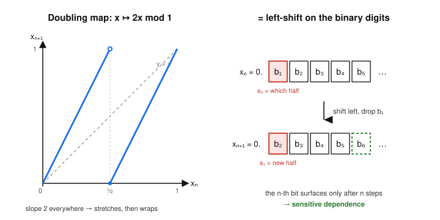

# Dynamical Systems & Chaos · Lesson 5.5: Symbolic dynamics, the shift map, and ergodicity

> ⏱ ~15 min · Module 5: Maps and the routes to chaos · Builds on: [Lesson 5.2](05-02-logistic-map-period-doubling.md), [Lesson 4.2](04-02-sensitive-dependence.md), [Lesson 4.4](04-04-lyapunov-exponents.md) · Unlocks: course complete

## Why this matters

You have watched chaos appear — the period-doubling cascade, the Lorenz butterfly, positive Lyapunov exponents — but always as something *analog*: a real number iterated by a smooth formula. This final lesson strips chaos down to its skeleton. We coarse-grain the state space into a handful of symbols, turn every trajectory into a string of those symbols, and discover that the entire dynamics is nothing more than **reading off one digit at a time**. That single move demystifies sensitive dependence (the $n$-th digit of your initial condition doesn't matter until step $n$), proves the logistic map at $r=4$ is *the same system* as a coin-flip sequence, and hands us **ergodicity** — the statement that a single long orbit samples the whole space. Ergodicity is the hidden hinge of statistical mechanics: it is why a physicist may replace the impossible time-average over a real trajectory with a tractable average over an ensemble.

## The idea

Forget the exact value of $x_n$. Just record *which region of the state space* it's in. Chop $[0,1)$ into two halves, $I_0 = [0,\tfrac12)$ and $I_1 = [\tfrac12,1)$, and at each step write down a single bit: $0$ if the point is in the left half, $1$ if it's in the right. A whole trajectory becomes a string like $0110100\ldots$ — its **itinerary**. This is the same trick a weather log uses: instead of the exact temperature every hour, "warm, warm, cold, warm" already tells you a lot.

The magic is a map for which the itinerary is *everything*. Take the **doubling map** $D(x) = 2x \bmod 1$: double the number, throw away the integer part. Write $x$ in **binary**, $x = 0.b_1 b_2 b_3\ldots$ Doubling shifts the binary point one place right: $2x = b_1.b_2 b_3\ldots$, and dropping the integer part $b_1$ leaves $0.b_2 b_3 b_4\ldots$ So $D$ does one thing: **delete the leading bit and shift everything left.** The dynamics is a conveyor belt of digits.

Now the two mysteries of chaos become obvious. *Sensitive dependence:* the digit $b_n$ is invisible — it sits far down the expansion — until $n-1$ shifts drag it to the front, where it finally decides which half you land in. Two numbers agreeing to a million bits behave identically for a million steps, then diverge. *Unpredictability:* to know the orbit far into the future you'd need to know infinitely many digits *now*, exactly. Chaos is just "shift left and reveal the next unknown bit."

## The formal version

**The itinerary.** Partition the state space into pieces $I_0, I_1$ (a "generating partition"). For a map $f$, the **itinerary** of a point $x_0$ is the symbol sequence $\mathbf s = (s_0 s_1 s_2 \ldots)$ where $s_n = j$ whenever the iterate $x_n = f^n(x_0)$ lies in $I_j$.

*In words:* follow the orbit and, at each step, write down which box it's sitting in.

**The shift map.** On the space $\Sigma$ of infinite binary sequences, the **left-shift** $\sigma$ is
$$\sigma(s_0 s_1 s_2 s_3 \ldots) = (s_1 s_2 s_3 \ldots).$$
*In words:* $\sigma$ throws away the first symbol and slides the rest left by one.

**The key identity.** For the doubling map with the partition $I_0=[0,\tfrac12), I_1=[\tfrac12,1)$, the itinerary of $x_0 = 0.b_1 b_2 b_3\ldots$ is *exactly its binary expansion*, $\mathbf s = (b_1 b_2 b_3 \ldots)$, because $x_n = 0.b_{n+1}b_{n+2}\ldots$ lies in $I_1$ precisely when its leading bit $b_{n+1}=1$. And applying $D$ corresponds to applying $\sigma$:
$$\text{itinerary}\big(D(x)\big) = \sigma\big(\text{itinerary}(x)\big).$$
*In words:* iterating the doubling map on numbers **is** the left-shift on their binary digits. The map and the shift are two views of one system.

**Topological conjugacy.** Two maps $f:X\to X$ and $g:Y\to Y$ are **topologically conjugate** if there is a homeomorphism (continuous bijection with continuous inverse) $h:X\to Y$ such that
$$h \circ f = g \circ h, \qquad \text{equivalently} \qquad g = h\circ f\circ h^{-1}.$$
*In words:* $h$ is a change of coordinates that turns one map into the other; it carries orbits to orbits, fixed points to fixed points, period-$n$ cycles to period-$n$ cycles. Conjugate maps are the *same dynamical system* wearing different clothes.

The headline example: the **logistic map at $r=4$**, $F(x)=4x(1-x)$, is conjugate to the **tent map** $T(\theta)=\begin{cases}2\theta & \theta\le\tfrac12\\ 2(1-\theta) & \theta\ge\tfrac12\end{cases}$ via $h(\theta) = \sin^2(\tfrac{\pi\theta}{2})$. One line proves it (worked in Example 2). The tent map in turn is a full two-symbol shift, so the innocent-looking parabola $4x(1-x)$ is *secretly a coin-flip machine* — dense periodic orbits, a dense orbit, Lyapunov exponent $\ln 2$, all inherited.

**Devaney chaos.** A map $f$ on a metric space is **chaotic in Devaney's sense** if:
1. **sensitive dependence** — nearby points eventually separate by a fixed amount (Lesson 4.2);
2. **dense periodic orbits** — periodic points are sprinkled everywhere; and
3. **topological transitivity** — some single orbit is dense (it eventually visits every region).

*In words:* chaos = regularity everywhere (periodic seeds are dense) shot through with mixing (one orbit reaches everywhere) and amplification (errors blow up). In symbol space all three are transparent: periodic sequences (repeat a block) are dense, and the sequence listing every finite block in turn has a dense orbit.

**Ergodicity.** A map $T$ that preserves a probability measure $\mu$ is **ergodic** if every invariant set $A$ (one with $T^{-1}A = A$) has $\mu(A)=0$ or $\mu(A)=1$.

*In words:* you cannot split the space into two fat invariant pieces — the dynamics stirs everything together, so almost every orbit roams the *entire* space rather than being trapped in a sub-region.

**Birkhoff's ergodic theorem (intuition level).** If $T$ is ergodic for $\mu$ and $g$ is any integrable observable, then for $\mu$-almost every starting point $x_0$,
$$\underbrace{\lim_{N\to\infty}\frac{1}{N}\sum_{n=0}^{N-1} g\big(T^n x_0\big)}_{\text{time average, one orbit}} \;=\; \underbrace{\int g \, d\mu}_{\text{space (ensemble) average}}.$$
*In words:* watch one typical trajectory for a long time and average any quantity along it — you get the same number as averaging that quantity over the whole state space at once. **A single orbit samples the space with exactly the right frequencies.** That is the entire content of the ergodic hypothesis, and (see Connections) the reason statistical mechanics is allowed to trade dynamics for integrals.

## Picture

Left: the graph of $D(x)=2x\bmod 1$ — two segments of slope $2$ over the diagonal $y=x$; the slope-2 stretch is what pulls nearby points apart, the wrap at $x=\tfrac12$ is what keeps them bounded. Right: the same map as a conveyor belt of bits. One iteration deletes the leading bit $b_1$ and slides the rest left, so the deep digit $b_6$ (green, dashed) only reaches the "which-half" slot after five steps — a picture of sensitive dependence.

## Worked examples

**Example 1 (mechanical — an itinerary and why dyadics escape chaos).** Take $x_0 = \tfrac{3}{8}$ under the doubling map. In binary $\tfrac38 = 0.011_2$. Iterate by shifting:
$$0.011 \xrightarrow{D} 0.11 = \tfrac34 \xrightarrow{D} 0.1=\tfrac12 \xrightarrow{D} 0.0 = 0 \xrightarrow{D} 0 \to \cdots$$
So the orbit is $\tfrac38, \tfrac34, \tfrac12, 0, 0, \ldots$ and the itinerary is the binary expansion read off the front: $s = 0\,1\,1\,0\,0\,0\ldots$ (that is, $x_0\in I_0$, then $I_1, I_1, I_0, I_0,\ldots$). Because $\tfrac38$ has a *terminating* binary expansion, after finitely many shifts only zeros remain and the point is stuck at the fixed point $0$. Every dyadic rational $k/2^m$ does this — it is eventually swallowed by $0$. **The chaotic orbits live on the non-terminating (irrational) expansions**, which is almost every point.

**Example 2 (why you'd care — the logistic map is a disguised shift).** Verify $F\circ h = h\circ T$ for $F(x)=4x(1-x)$, $h(\theta)=\sin^2(\tfrac{\pi\theta}{2})$. Compute the left side using the double-angle identity $\sin(2\alpha)=2\sin\alpha\cos\alpha$:
$$F(h(\theta)) = 4\sin^2\!\tfrac{\pi\theta}{2}\Big(1-\sin^2\!\tfrac{\pi\theta}{2}\Big) = 4\sin^2\!\tfrac{\pi\theta}{2}\cos^2\!\tfrac{\pi\theta}{2} = \big(2\sin\tfrac{\pi\theta}{2}\cos\tfrac{\pi\theta}{2}\big)^2 = \sin^2(\pi\theta).$$
Now the right side. For $\theta\le\tfrac12$, $T(\theta)=2\theta$, so $h(T(\theta))=\sin^2(\pi\theta)$. For $\theta\ge\tfrac12$, $T(\theta)=2(1-\theta)$, so $h(T(\theta))=\sin^2(\pi(1-\theta))=\sin^2(\pi-\pi\theta)=\sin^2(\pi\theta)$. Both cases match:
$$F(h(\theta)) = h(T(\theta)) = \sin^2(\pi\theta). \qquad\blacksquare$$
Since $h$ is a homeomorphism of $[0,1]$, the logistic map at $r=4$ *is* the tent map in disguise — and the tent map is $\sigma$ on binary sequences. Its Lyapunov exponent is $\ln 2$ (slope $\pm 2$ everywhere), matching the $\lambda=\ln 2$ you would measure numerically. The whole apparatus of Modules 4–5 collapses to "shift and reveal the next bit."

## Watch out

- **You might think** coarse-graining loses the dynamics — it's *only* an approximation. **Actually**, for a map with a *generating* partition (like the doubling map's two halves), the symbol sequence determines the point uniquely: the itinerary *is* the binary expansion, no information lost. The right partition makes the reduction exact, not lossy.
- **You might think** conjugacy is just "looks similar." **Actually** it is an exact equivalence: $h$ must be a genuine homeomorphism and satisfy $h\circ f = g\circ h$ *on the nose*. Everything dynamical — period spectrum, transitivity, topological entropy — transfers. (Lyapunov exponents transfer only under *smooth* conjugacy, which is why we can quote $\lambda=\ln 2$ for logistic $r=4$.)
- **You might think** ergodicity means *every* orbit fills the space. **Actually** it's "$\mu$-*almost* every." Periodic points (like $\tfrac13\mapsto\tfrac23\mapsto\tfrac13$) and dyadic rationals are genuine exceptions — but they form a measure-zero set, so Birkhoff's "for almost every $x_0$" quietly excludes them. The exceptions are real; they just don't weigh anything.

## One-liner

> Coarse-grain a chaotic map and it becomes the shift on symbol sequences — chaos is "reveal the next unknown digit," and ergodicity is the promise that one long orbit averages to the whole space.

## Problems

**P1 (🟢)** Under the doubling map $D(x)=2x\bmod 1$: (a) write $x_0=\tfrac{5}{16}$ in binary and list its full orbit and itinerary $(s_0 s_1 s_2\ldots)$ with respect to $I_0=[0,\tfrac12), I_1=[\tfrac12,1)$. (b) In one sentence, say why this orbit is *not* chaotic.

**P2 (🟡)** Find every period-2 point of the doubling map by solving $D^2(x)=x$ on $[0,1)$. Which solution is actually a fixed point, and which two form a genuine 2-cycle? Give the 2-cycle points as fractions *and* as repeating-binary itineraries, and confirm $\sigma$ shifts one into the other.

**P3 (🔴, optional)** The doubling map preserves Lebesgue measure on $[0,1)$ and is ergodic for it. (a) Using Birkhoff with the indicator $g=\mathbf 1_{[1/2,1)}$, state the long-run fraction of iterates that a.e. orbit spends in the right half, and translate it into a statement about the binary digits of almost every number. (b) Using $g(x)=x$, give the long-time average $\frac1N\sum x_n$ for almost every $x_0$. (c) Exhibit one specific $x_0$ for which the average in (b) is *not* that value, and explain why this doesn't contradict the theorem.

Solutions

**P1** (a) $\tfrac{5}{16}=0.0101_2$. Shifting left each step:
$$0.0101 \xrightarrow{D} 0.101=\tfrac58 \xrightarrow{D} 0.01=\tfrac14 \xrightarrow{D} 0.1=\tfrac12 \xrightarrow{D} 0 \to 0 \to\cdots$$
Orbit: $\tfrac{5}{16},\tfrac58,\tfrac14,\tfrac12,0,0,\ldots$ Itinerary (leading bit at each step): $s = 0\,1\,0\,1\,0\,0\,0\ldots$ (equivalently: $I_0,I_1,I_0,I_1,I_0,I_0,\ldots$). (b) It has a terminating binary expansion (it's a dyadic rational), so after finitely many shifts only zeros remain and the orbit is trapped at the fixed point $0$ — eventually constant, hence not aperiodic and not chaotic.

**P2** Solve $D^2(x)=4x\bmod 1 = x$, i.e. $4x - x = 3x$ must be an integer, so $3x\in\{0,1,2\}$ giving $x\in\{0,\tfrac13,\tfrac23\}$ on $[0,1)$. 
- $x=0$ is a **fixed point** ($D(0)=0$), not period-2. 
- $x=\tfrac13=0.\overline{01}_2$ and $x=\tfrac23=0.\overline{10}_2$ form the **2-cycle**: $D(\tfrac13)=\tfrac23$ and $D(\tfrac23)=\tfrac43\bmod1=\tfrac13$. 
In symbols, $\sigma(\overline{01}) = \sigma(010101\ldots) = 101010\ldots = \overline{10}$, and $\sigma(\overline{10})=\overline{01}$ — the shift swaps the two, exactly mirroring $D$. (In general the period-$n$ points are $x=k/(2^n-1)$, of which there are infinitely many across all $n$, and they are dense — Devaney's "dense periodic orbits.")

**P3** (a) Birkhoff gives $\frac1N\sum_{n=0}^{N-1}\mathbf 1_{[1/2,1)}(x_n) \to \int_0^1 \mathbf 1_{[1/2,1)}\,dx = \tfrac12$ for a.e. $x_0$. Since $x_n\in[\tfrac12,1)$ iff its leading bit is $1$, this says: **in the binary expansion of almost every number, the digit $1$ occurs with limiting frequency $\tfrac12$** — the digits are "normal." (b) $\frac1N\sum_{n=0}^{N-1} x_n \to \int_0^1 x\,dx = \tfrac12$ for a.e. $x_0$. (c) Take $x_0=\tfrac14=0.01_2$: its orbit is $\tfrac14,\tfrac12,0,0,\ldots$, so $\frac1N\sum x_n \to 0 \neq \tfrac12$. No contradiction — $\tfrac14$ is a dyadic rational, one of the measure-zero exceptional points that Birkhoff's "almost every" is entitled to exclude. (Even the 2-cycle $\{\tfrac13,\tfrac23\}$ averages to $\tfrac12$ by coincidence, but it too is a measure-zero orbit; the theorem's force is that the *typical* aperiodic point also gives $\tfrac12$.)

## Flashback

**From Lesson 5.2 (the logistic map and period-doubling):** For the logistic map $x_{n+1}=r\,x_n(1-x_n)$ with $r=3.3$: (a) find both fixed points, (b) classify each using the cobweb-stability test $|F'(x^*)|<1$, and (c) identify the exact value of $r$ at which the nonzero fixed point first loses stability, and what is born there.

Solution

Fixed points solve $x=rx(1-x)$: either $x^*=0$, or dividing by $x$, $1=r(1-x)\Rightarrow x^* = 1-\tfrac1r = 1-\tfrac{1}{3.3}\approx 0.697$.

Stability from $F'(x)=r(1-2x)$:
- At $x^*=0$: $F'(0)=r=3.3$, so $|F'|=3.3>1$ — **unstable** (the origin repels for any $r>1$).
- At $x^*=1-\tfrac1r$: $F'(x^*)=r\big(1-2(1-\tfrac1r)\big)=r\big(-1+\tfrac2r\big)=2-r = 2-3.3=-1.3$, so $|F'|=1.3>1$ — **unstable**. The cobweb spirals *away* from it.

(c) The nonzero fixed point is stable exactly when $|2-r|<1$, i.e. $1<r<3$. It loses stability at $r=3$, where $F'(x^*)=-1$: a **period-doubling (flip) bifurcation** — the derivative passing through $-1$ spawns a stable **period-2 cycle**. At $r=3.3$ we are just past that threshold, which is why the fixed point is unstable and the orbit settles onto the 2-cycle instead. (This is the first rung of the cascade whose shift-map endpoint at $r=4$ we conjugated to the tent map above.)

## Connections

- **Backward:** this closes the chaos arc. The positive Lyapunov exponent of [Lesson 4.4](04-04-lyapunov-exponents.md) is here *derived*, not measured — slope $2$ everywhere gives $\lambda=\ln 2$ — and the sensitive dependence of [Lesson 4.2](04-02-sensitive-dependence.md) becomes the concrete statement "the $n$-th digit surfaces after $n$ steps." The period-doubling road of [Lesson 5.2](05-02-logistic-map-period-doubling.md) ends at $r=4$, which Example 2 reveals to be a disguised full shift.
- **Sideways (statistical mechanics):** ergodicity is the microscopic license for `stat-mech`. A thermometer reports the **time average** of a molecule's energy along its true (chaotic, unknowable) trajectory on the constant-energy surface; statistical mechanics computes the **ensemble average** — an integral over that surface against the microcanonical measure. Birkhoff's theorem is precisely the claim that these two coincide for an ergodic system, so the field may discard the intractable dynamics and just integrate. Our normal-numbers result (P3) is the toy version: one orbit visits each region with the frequency of its measure. This is the bridge named in the syllabus — *time average = ensemble average*.
- **Sideways (celestial & analytical mechanics):** symbolic dynamics was born in Hadamard's and Poincaré's study of the three-body problem; coding orbits by which region they pass through is how one proves chaos exists in `analytical-mechanics` Hamiltonian systems without solving them.

---

**Course complete.** The final item on the Dangerous Checklist — *"connect the shift map and symbolic dynamics to the idea of chaos, and name where ergodicity meets statistical mechanics"* — is now covered, and with it every box on the list. You can read a nonlinear system's fate from its phase portrait, track how that fate rewrites itself through saddle-node, pitchfork, and Hopf bifurcations, recognize and quantify chaos with Lyapunov exponents and fractal dimension, walk the logistic map through its cascade, and finally see all of it as the shift on symbol sequences. That is the qualitative theory of nonlinear dynamics, Strogatz-style, start to finish.
