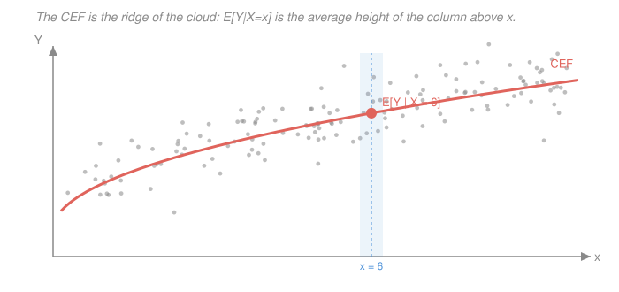

# Econometrics · Lesson 1.1: The conditional expectation function

> ⏱ ~15 min · Module 1: The linear regression model · Builds on: [`prob-stat-refresher` 3.1 (joint distributions)](../../prob-stat-refresher/lessons/03-01-joint-distributions-covariance.md), [`probability-theory` 5.1 (conditional expectation)](../../probability-theory/lessons/05-01-conditional-expectation.md) · Unlocks: 1.2 (the best linear predictor)

## Why this matters

Every regression you will ever run is an attempt to learn something about one object: the average value of an outcome among people who share a set of characteristics. Wage by years of schooling. Test score by class size. Mortality by pollution exposure. That object — the **conditional expectation function** — exists whether or not anyone runs a regression, and it exists whether or not it happens to be a straight line.

Starting here rather than with $\hat\beta=(X'X)^{-1}X'y$ buys you the one thing that makes the rest of the course make sense: a target that is defined *before* any estimator, so that later you can ask the only question that matters — does this estimator recover that target, and under what assumptions?

## The idea

Picture the joint distribution of two variables as a cloud of dots. Pick a value of $x$ and look at the thin vertical column of dots sitting above it. That column has an average height. Do it for every $x$, string the averages together, and you have drawn a curve through the cloud.

That curve is the CEF. It is not a model, not a fit, not an approximation — it is a feature of the population, as real as the mean or the variance. Two facts make it the natural target:

1. **It is the best possible predictor under squared loss.** Of every function of $X$ you could use to guess $Y$, the CEF minimises average squared error. No cleverness beats it.
2. **Whatever it does not explain is uncorrelated with $X$** — not merely uncorrelated, but *mean-independent*, which is stronger. The leftovers carry no systematic information about $X$ at all.

## The formal version

Let $(Y, X)$ be random, with $X$ a $k$-vector of **regressors** (also called covariates or right-hand-side variables) and $Y$ a scalar **outcome**. Assume $E[Y^2] < \infty$ throughout, which is what makes squared-error talk meaningful.

> **Definition (CEF).** The conditional expectation function is
> $$m(x) \;=\; E[Y \mid X = x] \;=\; \int y \, f_{Y\mid X}(y \mid x)\, dy .$$

*In words:* $m(x)$ is the average outcome among the subpopulation whose characteristics equal $x$.

> **Theorem (CEF decomposition).** Define $\varepsilon = Y - m(X)$. Then
> $$Y = m(X) + \varepsilon, \qquad E[\varepsilon \mid X] = 0 .$$

*In words:* any outcome splits, with no assumptions at all, into the part explained by $X$ on average plus a residual that averages to zero within every single group defined by $X$.

The proof is one line: $E[\varepsilon \mid X] = E[Y \mid X] - E[m(X)\mid X] = m(X) - m(X) = 0$. Nothing was assumed. This decomposition is a **tautology**, and that is exactly why it is safe to build on — it cannot be false, so any later trouble must come from something else you assumed.

Two consequences you will use constantly. First, by the [law of iterated expectations](../reference.md#law-of-iterated-expectations), $E[\varepsilon] = E\bigl[E[\varepsilon\mid X]\bigr] = 0$. Second, for *any* function $h$,
$$E[h(X)\,\varepsilon] = E\bigl[h(X)\,E[\varepsilon \mid X]\bigr] = 0 ,$$
so $\varepsilon$ is uncorrelated with every transformation of $X$ — with $X$, with $X^2$, with $\log X$, with indicators of any set. That is far stronger than $\operatorname{Cov}(X,\varepsilon)=0$, and the gap between the two is where a lot of econometrics lives.

> **Theorem (CEF prediction property).** For any function $g$ with $E[g(X)^2]<\infty$,
> $$E\bigl[(Y - g(X))^2\bigr] \;=\; E\bigl[(Y-m(X))^2\bigr] \;+\; E\bigl[(m(X)-g(X))^2\bigr] .$$

*In words:* your squared error splits into irreducible noise plus the squared distance between your guess and the CEF. Since the first term does not involve $g$, the error is minimised by taking $g = m$, and the minimum is attained only there.

The proof adds and subtracts $m(X)$ inside the square; the cross term is $2E[(Y-m(X))(m(X)-g(X))] = 2E[\varepsilon\,h(X)] = 0$ by the fact above, with $h = m - g$.

## Picture

The highlighted band is one conditioning event. The coral dot is the average height inside it. The CEF is what you get by sliding that band across the support and recording the average each time — no functional form has been imposed anywhere.

## Worked examples

**Example 1 (mechanical): a CEF from a joint distribution.** Let $X \in \{0,1,2\}$ with equal probability, and let $Y \mid X=x$ be Bernoulli with success probability $(x+1)/4$. Then
$$m(0) = \tfrac14, \qquad m(1) = \tfrac24 = \tfrac12, \qquad m(2) = \tfrac34 .$$
Here the CEF happens to be linear: $m(x) = \tfrac14 + \tfrac14 x$. Notice what "linear" cost us — nothing. Linearity is a property the population may or may not have; it is not something we imposed.

Check the decomposition. Take $X=1$: $\varepsilon = Y - \tfrac12$ takes values $+\tfrac12$ and $-\tfrac12$ with probability $\tfrac12$ each, so $E[\varepsilon\mid X=1]=0$. But $\operatorname{Var}(\varepsilon \mid X=x) = \frac{x+1}{4}\bigl(1-\frac{x+1}{4}\bigr)$, which equals $\tfrac{3}{16}$, $\tfrac{4}{16}$, $\tfrac{3}{16}$ at $x=0,1,2$. The error has mean zero everywhere but *not* constant variance. Hold on to that — it is heteroskedasticity, and it arrives here without anyone doing anything wrong.

**Example 2 (why you'd care): a nonlinear CEF, and what a line does to it.** Suppose annual earnings satisfy $m(s) = 8 + 14\sqrt{s}$ where $s$ is years of schooling past compulsory, measured in thousands of dollars. The return to one more year is $m'(s) = 7/\sqrt{s}$: about 7,000 dollars at $s=1$, but only about 2,300 dollars at $s=9$.

Ask a policy question — "what does one more year of school pay?" — and the honest answer is *it depends who you ask*. There is no single number. If you now run a linear regression, you will get a single number anyway. Lesson [1.2](01-02-best-linear-predictor.md) is entirely about what that number is and whether you should believe it.

## Watch out

- **You might think** $E[\varepsilon \mid X]=0$ is an assumption about your model — **but actually** it is a definition. Once you *define* $\varepsilon$ as $Y - E[Y\mid X]$, mean-independence is automatic. The assumption comes later, when you write $Y = X'\beta + u$ with a *linear* function and claim $E[u\mid X]=0$; that claim can absolutely be false.
- **You might think** "uncorrelated" and "mean-independent" are the same thing — **but actually** $E[\varepsilon\mid X]=0$ implies $\operatorname{Cov}(X,\varepsilon)=0$ but not conversely. Let $X$ be symmetric about zero and $\varepsilon = X^2 - E[X^2]$. Then $\operatorname{Cov}(X,\varepsilon)=E[X^3]=0$, yet $\varepsilon$ is a deterministic function of $X$ — knowing $X$ tells you $\varepsilon$ exactly. Uncorrelated is a single number being zero; mean-independent is a whole function being zero.
- **You might think** the CEF is causal because it is a population object — **but actually** it is pure description. $E[\text{wage}\mid \text{college}]$ compares people who went to college with people who did not; those groups differ in a hundred other ways. Module 3 spends eight lessons on the distance between this curve and a causal effect.

## One-liner

> The CEF is the average of $Y$ within each group defined by $X$; it is the best predictor under squared loss, it exists without any modelling, and everything it leaves behind is mean-independent of $X$ by construction.

## Problems

**P1 (🟢)** Let $X\in\{1,2\}$ each with probability $\tfrac12$, and let $Y\mid X=x \sim \text{Uniform}(0, 2x)$. Find $m(x)$, verify $E[\varepsilon]=0$, and compute $\operatorname{Var}(\varepsilon\mid X=x)$. Is the error homoskedastic?

**P2 (🟡)** Prove that $\operatorname{Var}(Y) = \operatorname{Var}(m(X)) + E[\operatorname{Var}(Y\mid X)]$, and state in one sentence what each term is measuring. (This is the analysis-of-variance decomposition; it is the population version of the $R^2$ you will meet in [1.5](01-05-goodness-of-fit-interpretation.md).)

**P3 (🔴, optional)** Show that if $E[\varepsilon\mid X]=0$ then $E[h(X)\varepsilon]=0$ for every $h$ with $E[h(X)^2]<\infty$, and then construct a joint distribution where $\operatorname{Cov}(X,\varepsilon)=0$ but $E[X^2\varepsilon]\neq 0$. Explain in one sentence why this matters for whether a regression of $Y$ on $X$ alone is "right".

Solutions

**P1** For a $\text{Uniform}(0,2x)$ distribution the mean is the midpoint, so
$$m(x) = E[Y\mid X=x] = x, \qquad\text{i.e.}\quad m(1)=1,\ m(2)=2 .$$
Then $\varepsilon = Y - X$, and $E[\varepsilon\mid X=x] = x - x = 0$ for each $x$, so by iterated expectations $E[\varepsilon]=0$.

The variance of $\text{Uniform}(a,b)$ is $(b-a)^2/12$, so
$$\operatorname{Var}(\varepsilon\mid X=x) = \operatorname{Var}(Y\mid X=x) = \frac{(2x)^2}{12} = \frac{x^2}{3} .$$
This is $\tfrac13$ at $x=1$ and $\tfrac43$ at $x=2$ — the conditional variance quadruples. The error is **heteroskedastic**. Note again that nothing was misspecified: the CEF is exactly right and the errors are exactly mean-zero. Non-constant variance is a property of the population, not a symptom of a mistake.

**P2** Start from the CEF decomposition $Y = m(X) + \varepsilon$ and take variances:
$$\operatorname{Var}(Y) = \operatorname{Var}(m(X)) + \operatorname{Var}(\varepsilon) + 2\operatorname{Cov}(m(X),\varepsilon).$$
The cross term vanishes: $\operatorname{Cov}(m(X),\varepsilon) = E[m(X)\varepsilon] - E[m(X)]E[\varepsilon] = 0 - 0 = 0$, using $E[h(X)\varepsilon]=0$ with $h=m$ and $E[\varepsilon]=0$.

For the remaining term, $\operatorname{Var}(\varepsilon) = E[\varepsilon^2] - 0 = E\bigl[E[\varepsilon^2\mid X]\bigr] = E\bigl[\operatorname{Var}(Y\mid X)\bigr]$, since $E[\varepsilon^2\mid X] = \operatorname{Var}(Y\mid X)$ because $\varepsilon$ has conditional mean zero. Hence
$$\operatorname{Var}(Y) = \operatorname{Var}(m(X)) + E[\operatorname{Var}(Y\mid X)] .$$
The first term is **between-group** variation: how much the group averages move as $X$ changes — the part $X$ explains. The second is **within-group** variation: how much outcomes scatter among people with identical $X$ — the part $X$ can never explain, averaged over groups.

**P3** *First part.* Condition and use that $h(X)$ is fixed given $X$:
$$E[h(X)\varepsilon] = E\Bigl[E[h(X)\varepsilon \mid X]\Bigr] = E\Bigl[h(X)\,E[\varepsilon\mid X]\Bigr] = E[h(X)\cdot 0] = 0 .$$
(The interchange is legal because $E[h(X)^2]<\infty$ and $E[\varepsilon^2]<\infty$ make $h(X)\varepsilon$ integrable by Cauchy–Schwarz.)

*Second part.* Let $X\sim\text{Uniform}(-1,1)$ and set $\varepsilon = X^2 - \tfrac13$. Note $E[X^2]=\tfrac13$, so $E[\varepsilon]=0$. Then
$$\operatorname{Cov}(X,\varepsilon) = E[X\varepsilon] = E[X^3] - \tfrac13 E[X] = 0 - 0 = 0 ,$$
since all odd moments of a symmetric distribution vanish. But
$$E[X^2\varepsilon] = E[X^4] - \tfrac13 E[X^2] = \tfrac15 - \tfrac13\cdot\tfrac13 = \tfrac15 - \tfrac19 = \tfrac{4}{45} \neq 0 .$$

*Why it matters.* A regression of $Y$ on a constant and $X$ only forces two moments to zero: $E[u]=0$ and $E[Xu]=0$. Those can both hold while the true CEF still has curvature that $X$ alone does not capture — exactly the $\varepsilon = X^2 - \tfrac13$ situation. So "the residuals are uncorrelated with the regressor" is not evidence the model is right; it is guaranteed by construction and tells you nothing. Detecting misspecification requires looking at *other* functions of $X$, which is what a RESET test does and what the added-variable plots of [1.5](01-05-goodness-of-fit-interpretation.md) do by eye.

## Connections

- **Backward:** this is [`probability-theory` 5.1](../../probability-theory/lessons/05-01-conditional-expectation.md)'s conditional expectation put to work. There it was constructed as an $L^2$ projection onto the sigma-algebra generated by $X$; the prediction property proved here is exactly that projection's optimality, restated without measure theory. The law of iterated expectations used throughout is [`probability-theory` 5.2](../../probability-theory/lessons/05-02-conditional-expectation-properties.md).
- **Forward:** [1.2](01-02-best-linear-predictor.md) asks what happens when you insist on a straight line even though $m$ curves — the answer is the best linear predictor, and it is *not* generally the tangent, the secant, or the average slope. [1.5](01-05-goodness-of-fit-interpretation.md) turns P2's variance decomposition into $R^2$.
- **Sideways:** the same "condition, then average" object appears as the regression function in [`statistical-learning` 1.1](../../statistical-learning/lessons/01-01-what-is-learning-loss-risk-and-erm.md), where it is called the Bayes predictor for squared loss. That course wants to *predict* $m(X)$ well out of sample; this course wants to know whether a particular slope of $m$ has a causal reading. Same object, opposite goals — worth reading the two definitions side by side.
