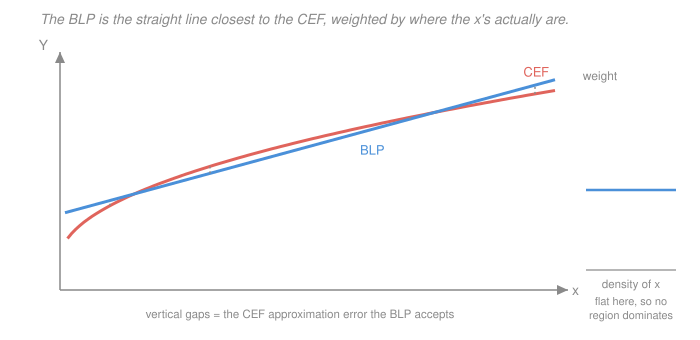

# Econometrics · Lesson 1.2: The best linear predictor

> ⏱ ~15 min · Module 1: The linear regression model · Builds on: [1.1 (the CEF)](01-01-conditional-expectation-function.md) · Unlocks: 1.3 (OLS algebra and projection)

## Why this matters

Real CEFs curve. Real regressions are straight. So when you run a regression on a population whose CEF bends — which is every population — you still get a number back, and that number is not nothing. It is a specific, well-defined feature of the joint distribution, and knowing exactly *which* feature is the difference between reporting a result and reporting a rumour.

This is also where the phrase "controlling for" gets its precise meaning. Not "holding fixed in the world" — nobody held anything fixed — but a particular partialling-out operation on the joint distribution, which sometimes means what you want and often does not.

## The idea

Give up on tracking the whole CEF and settle for the best straight-line summary of it. "Best" under squared loss again, so: among all linear functions $x'b$, pick the one whose average squared distance from $Y$ is smallest.

Two things follow immediately, and both are more useful than they look.

First, the answer exists and is unique as long as the regressors are not redundant. You never need the CEF to be linear for the BLP to be defined — the BLP is defined *for you*, by the population, whether or not it is a good summary.

Second, the BLP is a **weighted** average of the CEF's local slopes, and the weights are decided by where the $x$'s actually are. Regions of $x$-space with lots of data and lots of spread pull the line; sparse regions barely matter. Two researchers studying the same causal mechanism in two countries with different schooling distributions will get different linear coefficients even if the CEF is identical, and neither is wrong.

## The formal version

> **Definition (best linear predictor).** With $X$ a $k$-vector including a constant, the BLP coefficient is
> $$\beta \;=\; \arg\min_{b\in\mathbb R^k} \; E\bigl[(Y - X'b)^2\bigr] .$$

Differentiating and setting the gradient to zero gives the **population normal equations** $E[X(Y-X'\beta)]=0$, hence

$$\boxed{\;\beta = \bigl(E[XX']\bigr)^{-1} E[XY]\;}$$

*In words:* the projection coefficient is the population second-moment matrix inverted against the population cross-moment. The inverse exists exactly when $E[XX']$ is positive definite, i.e. when no regressor is a linear combination of the others — the population version of **no perfect collinearity**.

Define the **projection error** $u = Y - X'\beta$. By construction $E[Xu]=0$: the error is uncorrelated with each regressor. Note carefully what this is *not*: it is not $E[u\mid X]=0$. The BLP forces $k$ numbers to zero, not a whole function. That single distinction generates most of the difference between this lesson and [1.1](01-01-conditional-expectation-function.md).

**The BLP is the best linear approximation to the CEF, not to $Y$.** Substituting $Y = m(X)+\varepsilon$ and using $E[X\varepsilon]=0$,
$$\beta = \bigl(E[XX']\bigr)^{-1}E\bigl[X\,m(X)\bigr] ,$$
which involves only $m$. So regressing $Y$ on $X$ and regressing the CEF on $X$ give the identical coefficient; the noise $\varepsilon$ affects the sampling variability but not the target.

**What the weights are.** In the single-regressor case with a constant, $\beta_1 = \operatorname{Cov}(X,Y)/\operatorname{Var}(X)$. When $m$ is differentiable this can be written as an average of local slopes,
$$\beta_1 \;=\; \frac{E\bigl[w(X)\,m'(X)\bigr]}{E[w(X)]}, \qquad w(x) = E\bigl[(X - E[X])\mathbf 1\{X > x\}\bigr] \ \ge 0 ,$$
a non-negative weighting that is largest in the middle of the $X$ distribution and vanishes at the tails. *In words:* the regression slope is a weighted average of the CEF's slopes, weighted toward where $X$ has mass and spread.

**What "controlling for" means.** With $X = (1, x_1, x_2)'$, the coefficient $\beta_1$ equals the BLP slope of $Y$ on the part of $x_1$ that is linearly unpredictable from $x_2$. Not "the effect at fixed $x_2$" — that would be a statement about the CEF's partial derivative, which coincides only if the CEF is linear. It is a *statistical* removal of the linear component of $x_2$ from both sides. Lesson [1.3](01-03-ols-algebra-geometry-projection.md) proves this (Frisch–Waugh–Lovell) and [3.3](03-03-regression-anatomy-good-and-bad-controls.md) shows how badly it can diverge from the causal reading.

## Picture

The dashed segments are approximation error the BLP simply accepts. Change the density panel on the right — pile the $x$'s up near zero — and the blue line tilts to fit that region better, while the coral curve does not move at all. The CEF is a property of the world; the BLP is a property of the world *and* your sample's $x$-distribution.

## Worked examples

**Example 1 (mechanical): the BLP of a quadratic CEF.** Let $X\sim\text{Uniform}(0,1)$ and $m(x)=x^2$, with $Y = m(X)+\varepsilon$, $E[\varepsilon\mid X]=0$. Then $E[X]=\tfrac12$, $\operatorname{Var}(X)=\tfrac1{12}$, $E[X^3]=\tfrac14$, and
$$\operatorname{Cov}(X,Y)=E[X\cdot X^2]-E[X]E[X^2]=\tfrac14-\tfrac12\cdot\tfrac13=\tfrac1{12},$$
so $\beta_1 = (1/12)/(1/12) = 1$ and $\beta_0 = E[Y]-\beta_1 E[X] = \tfrac13-\tfrac12 = -\tfrac16$.

The BLP is $-\tfrac16 + x$. Its slope, $1$, is the CEF slope $m'(x)=2x$ evaluated at $x=\tfrac12$ — the midpoint. That coincidence is real but fragile: it holds because $m'$ is linear and the weights are symmetric. Change $X$ to $\text{Uniform}(0,2)$ and the BLP slope becomes $2$, matching $m'(1)$. Same CEF, different coefficient, purely because the $x$'s moved.

**Example 2 (why you'd care): a slope that is positive everywhere but negative in the regression.** This cannot happen with the non-negative weights above in a *bivariate* regression — but it happens routinely once you condition. Suppose hospital quality $q$ and mortality $Y$ satisfy $m(q, s) = 5 - 2q + 3s$ where $s$ is patient severity, and sicker patients go to better hospitals: $E[s\mid q] = q$. The CEF slope in $q$ holding $s$ fixed is $-2$: better hospitals help.

Now regress $Y$ on $q$ alone. The BLP slope is
$$\frac{\operatorname{Cov}(q, Y)}{\operatorname{Var}(q)} = \frac{\operatorname{Cov}(q, 5-2q+3s)}{\operatorname{Var}(q)} = -2 + 3\,\frac{\operatorname{Cov}(q,s)}{\operatorname{Var}(q)} = -2 + 3(1) = +1 .$$
Positive. The population says better hospitals *raise* mortality. Nothing was estimated badly; the BLP faithfully reported a feature of the joint distribution that simply is not the causal effect. This is omitted-variable bias, which [3.4](03-04-omitted-variable-bias.md) develops in general — but notice you already have the whole mechanism from the definition of the BLP alone.

## Watch out

- **You might think** the BLP is the tangent to the CEF at the mean, or the average of $m'$ — **but actually** it is a *specific weighted* average of $m'$, with weights that depend on the distribution of $X$. It equals $m'(E[X])$ only in special cases (as in Example 1).
- **You might think** $E[Xu]=0$ means the linear model is correctly specified — **but actually** it holds *by construction*, always, for any joint distribution, correct model or not. It is the definition of $\beta$, not a testable claim about it. Testing specification requires checking $E[h(X)u]=0$ for functions $h$ you did not force to zero.
- **You might think** two studies of the same relationship should get the same coefficient — **but actually** if the two populations have different $X$ distributions they should be *expected* to differ, even with the same CEF and no bias anywhere. When you compare estimates across samples, compare the estimands first.

## One-liner

> The BLP is the straight line the population hands you whether or not the CEF is straight: a covariance ratio, a weighted average of local slopes, and a faithful description of nothing in particular unless you can argue the CEF was linear and causal to begin with.

## Problems

**P1 (🟢)** Let $X\sim\text{Uniform}(0,1)$ and $m(x)=\sqrt{x}$. Compute the BLP coefficients $\beta_0,\beta_1$. Compare $\beta_1$ to $m'(1/2)$ and to $m(1)-m(0)$, and say in one sentence which — if either — the regression slope matches.

**P2 (🟡)** Show that the projection error $u=Y-X'\beta$ satisfies $E[u]=0$ whenever $X$ contains a constant, and give a one-line example showing this fails if the constant is dropped.

**P3 (🔴, optional)** Suppose $Y = \alpha + \gamma D + \delta W + \varepsilon$ with $E[\varepsilon\mid D,W]=0$, $D$ binary, and $W$ scalar. Derive the BLP slope from regressing $Y$ on $D$ alone, and express the bias in terms of the regression of $W$ on $D$. Then state the exact condition under which the short and long coefficients coincide, and give a case where they coincide *even though* $W$ matters ($\delta\neq0$).

Solutions

**P1** With $X\sim\text{Uniform}(0,1)$: $E[X]=\tfrac12$, $\operatorname{Var}(X)=\tfrac1{12}$.
$$E[Y]=E[\sqrt X]=\int_0^1 x^{1/2}dx = \tfrac23, \qquad E[XY]=E[X^{3/2}]=\int_0^1 x^{3/2}dx=\tfrac25 .$$
So $\operatorname{Cov}(X,Y)=\tfrac25-\tfrac12\cdot\tfrac23=\tfrac25-\tfrac13=\tfrac{1}{15}$, giving
$$\beta_1=\frac{1/15}{1/12}=\frac{12}{15}=\frac45=0.8,\qquad \beta_0=\tfrac23-\tfrac45\cdot\tfrac12=\tfrac23-\tfrac25=\tfrac{4}{15}\approx 0.2667 .$$

Comparisons: $m'(1/2)=\tfrac1{2\sqrt{1/2}}=\tfrac{1}{\sqrt2}\approx 0.7071$, and the secant $m(1)-m(0)=1$. The regression slope $0.8$ matches **neither** — it sits between them. It is a weighted average of $m'(x)=\tfrac1{2\sqrt x}$ over $[0,1]$, and because $m'$ blows up near $0$ while the weights die there, the answer lands above the midpoint slope and below the secant. (Sanity check: $\int_0^1 m'(x)dx = 1$, the *unweighted* average, which is the secant — so the weighting is what pulls $0.8$ below it.)

**P2** Let $X=(1,\tilde X')'$. The normal equations $E[Xu]=0$ hold coordinate by coordinate; the coordinate corresponding to the constant reads $E[1\cdot u]=E[u]=0$. Done — the intercept exists precisely to absorb the mean.

Without a constant, take $X$ degenerate at $1$... more simply, let $Y\equiv 5$ and $X\equiv 2$ (no intercept term). Then $\beta = E[X^2]^{-1}E[XY] = 10/4=2.5$ and $u = 5-2.5(2)=0$, which is a poor counterexample because it fits exactly. Instead let $X\sim\text{Uniform}(0,1)$ and $Y=1$ (constant outcome), fitting $Y\approx \beta X$ with no intercept:
$$\beta = \frac{E[XY]}{E[X^2]}=\frac{1/2}{1/3}=\tfrac32,\qquad E[u]=E[Y-\tfrac32 X]=1-\tfrac32\cdot\tfrac12=\tfrac14\neq 0 .$$
The residuals average to a quarter. With no constant in the regressor list there is no normal equation forcing the mean of $u$ to zero.

**P3** *Derivation.* The "long" model gives $\operatorname{Cov}(D,Y)=\gamma\operatorname{Var}(D)+\delta\operatorname{Cov}(D,W)$, since $\operatorname{Cov}(D,\varepsilon)=0$. Dividing by $\operatorname{Var}(D)$,
$$\beta_1^{\text{short}} \;=\; \frac{\operatorname{Cov}(D,Y)}{\operatorname{Var}(D)} \;=\; \gamma \;+\; \delta\,\frac{\operatorname{Cov}(D,W)}{\operatorname{Var}(D)} \;=\; \gamma + \delta\,\pi ,$$
where $\pi$ is the slope from regressing the omitted variable $W$ on the included one $D$. This is the **omitted-variable bias formula**: bias $=\delta\pi$, the product of "how much the omitted variable matters" and "how much it moves with the included one". For binary $D$, $\pi = E[W\mid D=1]-E[W\mid D=0]$, the raw imbalance in $W$ between groups.

*Exact condition for short $=$ long.* $\delta\pi=0$, i.e. **either** $\delta=0$ ($W$ does not enter the CEF) **or** $\pi=0$ ($W$ is uncorrelated with $D$).

*Coincidence with $\delta\neq0$.* Take $D$ randomly assigned — a coin flip independent of $W$. Then $\operatorname{Cov}(D,W)=0$, so $\pi=0$ and the short regression recovers $\gamma$ exactly, no matter how large $\delta$ is. This is the entire statistical case for randomisation: it does not make omitted variables irrelevant to the outcome, it makes them *orthogonal to the treatment*, which is what kills the bias term. Everything Module 3 does is an attempt to manufacture $\pi=0$ without a coin.

## Connections

- **Backward:** [1.1](01-01-conditional-expectation-function.md) gave the CEF as the unconstrained best predictor; this lesson restricts the search to lines and shows the restriction costs you approximation error but buys a closed form. The identity $\beta=(E[XX'])^{-1}E[Xm(X)]$ says the two lessons target the same object viewed through different-sized windows.
- **Forward:** [1.3](01-03-ols-algebra-geometry-projection.md) replaces population moments with sample averages and gets $\hat\beta=(X'X)^{-1}X'y$ — the entire content of OLS is "plug in". [3.4](03-04-omitted-variable-bias.md) generalises Example 2 and P3 into the OVB formula; [3.3](03-03-regression-anatomy-good-and-bad-controls.md) shows what the multivariate weights really average.
- **Sideways:** the minimisation here is an orthogonal projection in $L^2$, the same operation as [`linalg-refresher` 4.2](../../linalg-refresher/lessons/04-02-projection-least-squares.md) with the inner product $\langle A,B\rangle = E[AB]$ instead of a dot product. Every projection theorem you know transfers verbatim; only the inner product changed.
