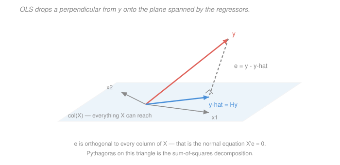

# Econometrics · Lesson 1.3: OLS algebra and the geometry of projection

> ⏱ ~15 min · Module 1: The linear regression model · Builds on: [1.2 (the best linear predictor)](01-02-best-linear-predictor.md), [`linalg-refresher` 4.2 (projection and least squares)](../../linalg-refresher/lessons/04-02-projection-least-squares.md) · Unlocks: 1.4 (Gauss–Markov), 1.5 (goodness of fit)

## Why this matters

Everything in [1.2](01-02-best-linear-predictor.md) was about a population you cannot see. This lesson swaps population moments for sample averages and gets the formula every statistical package computes. But the payoff is not the formula — it is the *picture*. Once you see OLS as dropping a perpendicular onto a plane, three things that look like separate results (the normal equations, the sum-of-squares decomposition, and the Frisch–Waugh–Lovell theorem) become the same result seen from three angles.

FWL in particular is the workhorse of the rest of the course. Fixed effects, difference-in-differences, and every "controlling for" argument in Module 3 are FWL wearing a costume.

## The idea

Stack your $n$ observations of the outcome into a vector $y\in\mathbb R^n$ and your regressors into an $n\times k$ matrix $X$. Now think of $y$ as a single point in $n$-dimensional space, and think of all the fitted values you *could* produce — every $Xb$ as $b$ ranges over $\mathbb R^k$ — as a $k$-dimensional plane through the origin.

$y$ almost certainly does not lie on that plane. Least squares picks the point on the plane closest to $y$, which is the foot of the perpendicular. That is the whole algorithm. The residual is the perpendicular itself, and "perpendicular" means orthogonal to every direction in the plane — which is literally the normal equations.

The word "normal" in "normal equations" means normal in the geometric sense: perpendicular. That is not a coincidence anyone should have to discover twice.

## The formal version

Minimise the sum of squared residuals $S(b) = (y-Xb)'(y-Xb)$. The first-order condition $\partial S/\partial b = -2X'(y-Xb)=0$ gives the **normal equations**
$$X'X\hat\beta = X'y \qquad\Longrightarrow\qquad \hat\beta = (X'X)^{-1}X'y ,$$
valid when $X$ has full column rank $k$ (no exact linear dependence among regressors, and necessarily $n\ge k$). $S$ is convex in $b$, so this stationary point is the global minimum.

*In words:* $\hat\beta$ is exactly [1.2](01-02-best-linear-predictor.md)'s $\beta = (E[XX'])^{-1}E[XY]$ with sample second moments $\frac1n X'X$ and $\frac1n X'y$ substituted for population ones. OLS is the **analogy principle**: replace expectations by averages.

Define the **hat matrix** and the **residual maker**
$$H = X(X'X)^{-1}X', \qquad M = I_n - H ,$$
so $\hat y = Hy$ and $\hat e = My$. Both are symmetric and idempotent ($H'=H$, $H^2=H$, and likewise for $M$), $HX=X$, $MX=0$, and $HM=0$. $H$ is the orthogonal projection onto $\operatorname{col}(X)$; $M$ projects onto its orthogonal complement. Their ranks are their traces: $\operatorname{tr}(H)=k$ and $\operatorname{tr}(M)=n-k$.

Three facts fall straight out of $X'\hat e = 0$:

- **Residuals are orthogonal to every regressor.** If $X$ contains a constant, one of those equations reads $\sum_i \hat e_i = 0$: residuals sum to zero.
- **The regression line passes through the means.** $\bar y = \bar x'\hat\beta$, again provided a constant is included.
- **Pythagoras.** Since $y = \hat y + \hat e$ with $\hat y \perp \hat e$,
$$\underbrace{y'y}_{\text{total}} \;=\; \underbrace{\hat y'\hat y}_{\text{explained}} \;+\; \underbrace{\hat e'\hat e}_{\text{residual}} .$$
Centring around $\bar y$ turns this into the familiar $\mathrm{TSS}=\mathrm{ESS}+\mathrm{RSS}$ of [1.5](01-05-goodness-of-fit-interpretation.md).

> **Theorem (Frisch–Waugh–Lovell).** Partition $X = [X_1\ X_2]$ and write $M_2 = I - X_2(X_2'X_2)^{-1}X_2'$ for the residual maker of $X_2$. Then the OLS coefficient on $X_1$ in the full regression satisfies
> $$\hat\beta_1 = \bigl(X_1'M_2X_1\bigr)^{-1}X_1'M_2\,y = \bigl(\tilde X_1'\tilde X_1\bigr)^{-1}\tilde X_1'\tilde y ,$$
> where $\tilde X_1 = M_2X_1$ and $\tilde y = M_2 y$. The full-regression residuals equal the residuals from that short regression.

*In words:* to get the coefficient on $X_1$ controlling for $X_2$, sweep $X_2$ out of $X_1$ and out of $y$, then regress the leftovers on each other. "Controlling for" **is** "residualising against".

Two refinements worth carrying: because $M_2$ is idempotent and symmetric, $X_1'M_2 y = X_1'M_2M_2y = \tilde X_1'\tilde y$, so you may residualise **only $X_1$** and regress $y$ (uncentred) on $\tilde X_1$ — same coefficient. And if $X_1 \perp X_2$ already, $M_2X_1=X_1$ and the multivariate coefficient equals the bivariate one: **orthogonal regressors do not contaminate each other.**

## Picture

The right-angle mark is the entire content of $X'\hat e = 0$. Note the dimension counting: $y$ lives in $\mathbb R^n$, $\hat y$ in a $k$-dimensional subspace, $\hat e$ in the $(n-k)$-dimensional complement. Those two numbers, $k$ and $n-k$, are the degrees of freedom that will run every test in Module 2.

## Worked examples

**Example 1 (mechanical): FWL on six observations.** Take
$$y=(3,7,5,11,9,14)', \quad x_1=(1,2,3,4,5,6)', \quad x_2=(2,1,4,3,6,5)' .$$
Full regression of $y$ on $(1,x_1,x_2)$ gives
$$\hat\beta_0 = 2.479167,\qquad \hat\beta_1 = 3.3125,\qquad \hat\beta_2 = -1.6875 .$$

Now do it the FWL way. Regress $x_1$ on $(1,x_2)$ and keep the residuals $\tilde x_1$; regress $y$ on $(1,x_2)$ and keep $\tilde y$. The simple no-intercept slope is
$$\frac{\tilde x_1'\tilde y}{\tilde x_1'\tilde x_1} = 3.3125 ,$$
matching $\hat\beta_1$ exactly. Residualising only $x_1$ and regressing the raw $y$ on it gives $x_1'M_2y/(x_1'M_2x_1) = 3.3125$ too, confirming the one-sided version.

Compare this with the *simple* regression of $y$ on $x_1$ alone, whose slope is $1.914286$. The gap between $1.914286$ and $3.3125$ is exactly what "controlling for $x_2$" did, and [3.4](03-04-omitted-variable-bias.md) will give it a name.

**Example 2 (why you'd care): demeaning is FWL.** Let $X_2$ be a full set of group dummies — one column per firm, per state, per person. Then $M_2$ subtracts the group mean from whatever it touches: $M_2 z$ has entries $z_{ig} - \bar z_g$.

FWL therefore says: *regressing $y$ on $x_1$ and a full set of group dummies is identical to regressing group-demeaned $y$ on group-demeaned $x_1$.* This is not an approximation and not an "equivalent estimator" — it is the same number.

That single observation is why panel data is computationally tractable at all. A dataset with 3 million workers has 3 million dummy variables, and no computer will invert that $X'X$. Demeaning within worker takes one pass. Lesson [4.1](04-01-panel-data-fixed-effects.md) is built entirely on this, and it also tells you immediately *what variation identifies the coefficient*: only the within-group deviations, since the between-group differences were swept away by $M_2$.

## Watch out

- **You might think** the FWL residualisation has to be done on both $y$ and $X_1$ — **but actually** residualising $X_1$ alone gives the identical coefficient (idempotency of $M_2$). Doing both is still worth it if you want the *plot*, since the added-variable plot in [1.5](01-05-goodness-of-fit-interpretation.md) needs both axes residualised to show the right slope and the right scatter.
- **You might think** perfect collinearity is a data problem you can fix by rescaling — **but actually** it means $X'X$ is singular and $\hat\beta$ is not unique: infinitely many $b$ give identical fitted values. The classic trap is the **dummy variable trap** — including a constant plus dummies for *every* category, whose sum equals the constant. Drop one category or drop the constant.
- **You might think** the sum-of-squares decomposition $y'y = \hat y'\hat y + \hat e'\hat e$ needs the model to be true — **but actually** it needs only orthogonality, which holds by construction. Every identity in this lesson is an algebraic fact about the numbers in front of you, true even if the model is nonsense. Statistical assumptions do not appear until [1.4](01-04-gauss-markov-theorem.md).

## One-liner

> OLS is the foot of the perpendicular from $y$ onto the span of the regressors — so the normal equations are a right angle, the sum of squares is Pythagoras, and "controlling for $X_2$" is literally sweeping $X_2$ out of both sides.

## Problems

**P1 (🟢)** With $H=X(X'X)^{-1}X'$, verify directly that $H$ is symmetric and idempotent, that $HX=X$, and that $\operatorname{tr}(H)=k$. (For the trace, use $\operatorname{tr}(AB)=\operatorname{tr}(BA)$.)

**P2 (🟡)** In Example 1 the regression of $y$ on a constant and $x_1$ has slope $1.914286$, while adding $x_2$ raises the coefficient on $x_1$ to $3.3125$. Explain, in terms of $\widehat{\operatorname{Cov}}(x_1,x_2)$ and the sign of $\hat\beta_2$, why controlling for $x_2$ moved the coefficient *up* — and verify the short-long identity numerically.

**P3 (🔴, optional)** Prove the Frisch–Waugh–Lovell theorem. Then use it to show that in a regression of $y$ on a constant and $x$, the slope is $\widehat{\operatorname{Cov}}(x,y)/\widehat{\operatorname{Var}}(x)$ — i.e. derive the bivariate formula as a special case rather than by direct algebra.

Solutions

**P1** *Symmetry:* $H' = \bigl(X(X'X)^{-1}X'\bigr)' = X\bigl((X'X)^{-1}\bigr)'X' = X(X'X)^{-1}X' = H$, using that $X'X$ is symmetric so its inverse is too.

*Idempotency:*
$$H^2 = X(X'X)^{-1}\underbrace{X'X(X'X)^{-1}}_{=\,I_k}X' = X(X'X)^{-1}X' = H .$$

*$HX=X$:* $HX = X(X'X)^{-1}X'X = X I_k = X$. Geometrically: projecting something already in the plane leaves it alone.

*Trace:* using $\operatorname{tr}(AB)=\operatorname{tr}(BA)$ with $A=X$ and $B=(X'X)^{-1}X'$,
$$\operatorname{tr}(H)=\operatorname{tr}\bigl(X(X'X)^{-1}X'\bigr)=\operatorname{tr}\bigl((X'X)^{-1}X'X\bigr)=\operatorname{tr}(I_k)=k .$$
Since $H$ is a symmetric idempotent, its eigenvalues are all 0 or 1, so the trace equals the rank equals the dimension of $\operatorname{col}(X)$ — namely $k$. Correspondingly $\operatorname{tr}(M)=n-k$.

**P2** The short and long slopes are related by the short-long identity (equivalently, by FWL):
$$\hat\beta_1^{\text{short}} = \hat\beta_1^{\text{long}} + \hat\beta_2\,\hat\pi, \qquad \hat\pi = \frac{\widehat{\operatorname{Cov}}(x_1,x_2)}{\widehat{\operatorname{Var}}(x_1)} ,$$
where $\hat\pi$ is the slope from regressing the *added* variable $x_2$ on the *kept* one $x_1$.

For this data, with $\bar x_1 = 3.5$ and $\bar x_2 = 3.5$:
$$\textstyle\sum_i (x_{1i}-\bar x_1)^2 = 17.5, \qquad \sum_i (x_{1i}-\bar x_1)(x_{2i}-\bar x_2) = 14.5 ,$$
so $\hat\pi = 14.5/17.5 = 0.828571$. Checking the identity:
$$\hat\beta_1^{\text{long}} + \hat\beta_2\hat\pi = 3.3125 + (-1.6875)(0.828571) = 3.3125 - 1.398214 = 1.914286 = \hat\beta_1^{\text{short}} .\ \checkmark$$

*The explanation.* Both factors in the omitted term matter, and here they have opposite signs: $x_2$ moves **with** $x_1$ ($\hat\pi = +0.83$) but pushes $y$ **down** ($\hat\beta_2 = -1.69$). Their product is negative, so leaving $x_2$ out *understates* $x_1$'s coefficient — some of $x_1$'s genuine positive association with $y$ was being cancelled by $x_2$ riding along and dragging $y$ downward. Controlling for $x_2$ removes that drag and the coefficient rises from $1.914$ to $3.313$.

The general rule to carry forward: the direction of the move is the sign of $\hat\beta_2 \hat\pi$, so you need **both** "does the control affect $y$" and "does the control move with the regressor" — either one being zero leaves the coefficient untouched.

**P3** *Proof of FWL.* Write the full regression as $y = X_1\hat\beta_1 + X_2\hat\beta_2 + \hat e$ with $X_1'\hat e = 0$ and $X_2'\hat e = 0$. Premultiply by $M_2$:
$$M_2y = M_2X_1\hat\beta_1 + \underbrace{M_2X_2}_{=\,0}\hat\beta_2 + M_2\hat e .$$
Now $M_2\hat e = \hat e$, because $\hat e$ is orthogonal to $X_2$ and $M_2$ leaves anything orthogonal to $X_2$ untouched. So
$$\tilde y = \tilde X_1\hat\beta_1 + \hat e .$$
Premultiply by $\tilde X_1' = X_1'M_2$: the term $\tilde X_1'\hat e = X_1'M_2\hat e = X_1'\hat e = 0$ drops out, leaving $\tilde X_1'\tilde y = \tilde X_1'\tilde X_1\hat\beta_1$, hence
$$\hat\beta_1 = (\tilde X_1'\tilde X_1)^{-1}\tilde X_1'\tilde y = (X_1'M_2X_1)^{-1}X_1'M_2y .$$
The displayed equation $\tilde y = \tilde X_1\hat\beta_1 + \hat e$ also shows the short regression's residuals *are* the long regression's residuals.

*Bivariate formula as a special case.* Take $X_1 = x$ (the regressor of interest) and $X_2 = \iota$, the vector of ones. Then
$$M_2 = I - \iota(\iota'\iota)^{-1}\iota' = I - \tfrac1n \iota\iota' ,$$
which is the demeaning operator: $M_2 z = z - \bar z\,\iota$. FWL gives
$$\hat\beta_1 = \frac{(x-\bar x\iota)'(y-\bar y \iota)}{(x-\bar x\iota)'(x-\bar x\iota)} = \frac{\sum_i (x_i-\bar x)(y_i-\bar y)}{\sum_i (x_i-\bar x)^2} = \frac{\widehat{\operatorname{Cov}}(x,y)}{\widehat{\operatorname{Var}}(x)} .$$
So the familiar slope formula is just "control for the constant" — the intercept is a regressor like any other, and partialling it out is demeaning.

## Flashback

**From Lesson 1.1 (the conditional expectation function):** Let $X\in\{1,2,3\}$ with probabilities $\tfrac12,\tfrac14,\tfrac14$, and let $Y\mid X=x$ be exponential with rate $1/x$ (so mean $x$). Write down $m(x)$, compute $\operatorname{Var}(Y)$ two ways — directly, and via the decomposition $\operatorname{Var}(Y)=\operatorname{Var}(m(X))+E[\operatorname{Var}(Y\mid X)]$ — and check they agree.

Solution

An exponential with rate $1/x$ has mean $x$ and variance $x^2$. So $m(x)=x$ and $\operatorname{Var}(Y\mid X=x)=x^2$.

*Via the decomposition.* First $E[X] = \tfrac12(1)+\tfrac14(2)+\tfrac14(3) = 0.5+0.5+0.75 = 1.75$ and
$$E[X^2] = \tfrac12(1)+\tfrac14(4)+\tfrac14(9) = 0.5+1+2.25 = 3.75 ,$$
so $\operatorname{Var}(m(X)) = \operatorname{Var}(X) = 3.75 - 1.75^2 = 3.75 - 3.0625 = 0.6875$. Next
$$E[\operatorname{Var}(Y\mid X)] = E[X^2] = 3.75 .$$
Total: $\operatorname{Var}(Y) = 0.6875 + 3.75 = 4.4375$.

*Directly.* $E[Y] = E[m(X)] = E[X] = 1.75$. For the second moment, $E[Y^2\mid X=x] = \operatorname{Var} + \text{mean}^2 = x^2+x^2 = 2x^2$, so
$$E[Y^2] = E[2X^2] = 2(3.75) = 7.5, \qquad \operatorname{Var}(Y) = 7.5 - 1.75^2 = 7.5 - 3.0625 = 4.4375 .$$
They agree. Notice how lopsided the split is: only $0.6875/4.4375 \approx 15.5\%$ of the variance in $Y$ is between-group. An $R^2$ of about $0.155$ is the *ceiling* here — attainable only by a model that nails the CEF exactly. A low $R^2$ can mean the conditional variance is simply large, not that the model is wrong; [1.5](01-05-goodness-of-fit-interpretation.md) makes that argument carefully.

## Connections

- **Backward:** this is [1.2](01-02-best-linear-predictor.md)'s population projection with sample moments plugged in, and it is [`linalg-refresher` 4.2](../../linalg-refresher/lessons/04-02-projection-least-squares.md)'s normal equations verbatim — symmetry, idempotency and $HX=X$ are taken from there and not reproved. What is new is FWL, which that course did not need.
- **Forward:** [1.4](01-04-gauss-markov-theorem.md) adds statistical assumptions and asks whether this algebra has good sampling properties; [1.5](01-05-goodness-of-fit-interpretation.md) turns Pythagoras into $R^2$ and FWL into the added-variable plot. FWL reappears as the engine of [4.1](04-01-panel-data-fixed-effects.md) (fixed effects are demeaning) and of the partialling-out step in [3.7](03-07-two-stage-least-squares.md).
- **Sideways:** the same projection matrix $H$ is [`statistical-learning` 2.1](../../statistical-learning/lessons/02-01-linear-regression-as-learning.md)'s hat matrix, where $\operatorname{tr}(H)=k$ counts effective parameters and drives the optimism of training error. Identical algebra, used there to measure overfitting rather than to define a target.
