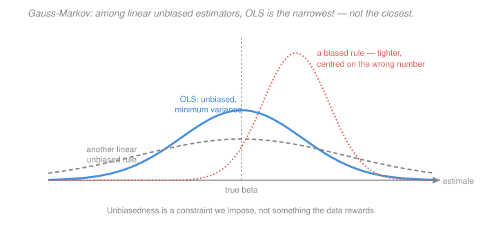

# Econometrics · Lesson 1.4: The Gauss–Markov theorem

> ⏱ ~15 min · Module 1: The linear regression model · Builds on: [1.3 (OLS algebra and projection)](01-03-ols-algebra-geometry-projection.md) · Unlocks: 1.5 (goodness of fit), 2.1 (the sampling distribution of OLS)

## Why this matters

Up to now every statement has been algebra: true of the numbers in front of you, true even if the model is garbage. This lesson is where assumptions enter, and it is worth being pedantic about *which assumption buys which conclusion*, because the rest of the course is a tour of what happens when each one fails.

The reason to keep the ledger straight: when a referee says "your errors are heteroskedastic," you need to know instantly that your point estimates are still fine and only your standard errors are wrong. When someone says "your regressor is endogenous," you need to know that this one is fatal. Those are different assumptions failing, and confusing them wastes years.

## The idea

Gauss–Markov is a *competition with rigged entry rules*. Restrict attention to estimators that are (a) linear in $y$ and (b) unbiased for $\beta$. Among those, OLS has the smallest variance. That is a genuine theorem and a genuinely useful one.

But read the entry rules again. Unbiasedness is a constraint we imposed, not something the data rewards. Drop it and you can often do better in mean-squared error — ridge regression does exactly that on purpose. The theorem does not say OLS is best; it says OLS wins a race it was allowed to enter.

The reason unbiasedness earns its place *here* and not in a prediction course: in econometrics the coefficient itself is the object of interest, and a systematically-off answer to "what does one more year of schooling pay" is worse than a noisy one. Get the estimand right first, then argue about variance.

## The formal version

The classical linear regression assumptions, stated one at a time so you can see what each one does.

> **GM1 (linearity).** $y = X\beta + u$ for some fixed $\beta\in\mathbb R^k$.
> **GM2 (full rank).** $X$ has rank $k$ almost surely.
> **GM3 (strict exogeneity).** $E[u\mid X]=0$.
> **GM4 (spherical errors).** $\operatorname{Var}(u\mid X)=\sigma^2 I_n$ — that is, homoskedasticity ($\operatorname{Var}(u_i\mid X)=\sigma^2$ for all $i$) and no autocorrelation ($\operatorname{Cov}(u_i,u_j\mid X)=0$ for $i\neq j$).
> **GM5 (normality).** $u \mid X \sim \mathcal N(0,\sigma^2 I_n)$. *Not needed for Gauss–Markov* — it is here only to be used, and then dropped, in [2.1](02-01-sampling-distribution-of-ols.md).

Now the ledger. Substituting $y=X\beta+u$ into $\hat\beta = (X'X)^{-1}X'y$:
$$\hat\beta = \beta + (X'X)^{-1}X'u .$$
Everything follows from this one line.

**Unbiasedness needs GM1–GM3 only.**
$$E[\hat\beta\mid X] = \beta + (X'X)^{-1}X'\,E[u\mid X] = \beta ,$$
and by iterated expectations $E[\hat\beta]=\beta$. Note GM4 was never used: *heteroskedasticity does not bias OLS.* Note also that GM3 is doing the real work, and it is strictly stronger than $E[X'u]=0$ — it says every error is mean-independent of *every* observation's regressors, which rules out feedback from past outcomes to future regressors and is why GM3 fails routinely in time series and dynamic panels.

**The variance formula needs GM4.**
$$\operatorname{Var}(\hat\beta\mid X) = (X'X)^{-1}X'\operatorname{Var}(u\mid X)X(X'X)^{-1} = \sigma^2 (X'X)^{-1} .$$
The middle step is where $\operatorname{Var}(u\mid X)=\sigma^2 I$ collapses a sandwich into a single inverse. Without GM4 the sandwich survives, and that surviving sandwich *is* the robust variance of [2.4](02-04-heteroskedasticity-robust-standard-errors.md).

> **Theorem (Gauss–Markov).** Under GM1–GM4, for any estimator $\tilde\beta = Cy$ with $C$ a function of $X$ satisfying $E[\tilde\beta\mid X]=\beta$ for all $\beta$,
> $$\operatorname{Var}(\tilde\beta\mid X) - \operatorname{Var}(\hat\beta\mid X) \ \text{ is positive semidefinite.}$$

*In words:* OLS is the **Best Linear Unbiased Estimator** — best meaning minimum variance, in the strong matrix sense that every linear combination $c'\hat\beta$ has variance no larger than $c'\tilde\beta$'s.

*Proof.* Unbiasedness for all $\beta$ requires $E[Cy\mid X] = CX\beta = \beta$, hence $CX = I_k$. Write $D = C - (X'X)^{-1}X'$, so $DX = CX - I_k = 0$. Then
$$\operatorname{Var}(\tilde\beta\mid X) = \sigma^2 CC' = \sigma^2\bigl((X'X)^{-1}X' + D\bigr)\bigl(X(X'X)^{-1} + D'\bigr) = \sigma^2(X'X)^{-1} + \sigma^2 DD' ,$$
because the cross terms contain $DX = 0$ and $X'D' = 0$. Since $DD'$ is positive semidefinite, the difference is $\sigma^2 DD' \succeq 0$. Equality holds only when $D=0$, i.e. only for OLS itself. $\square$

Finally, an unbiased estimator of the error variance: $s^2 = \hat e'\hat e/(n-k)$, with $E[s^2\mid X]=\sigma^2$. The divisor is $n-k$, not $n$, because $\hat e = Mu$ lives in an $(n-k)$-dimensional space — you spent $k$ dimensions fitting.

## Picture

Blue beats grey — that is the theorem. Coral beats both on spread and still loses on the thing econometrics cares about, because it is centred on the wrong number. The theorem's whole content is the comparison between blue and grey; the existence of coral is why the theorem is weaker than it sounds.

## Worked examples

**Example 1 (mechanical): which assumption does each failure break?** Work through the ledger for four common situations.

| Situation | Which assumption fails | Is $\hat\beta$ still unbiased? | Is $\sigma^2(X'X)^{-1}$ still right? |
|---|---|---|---|
| Error variance rises with income | GM4 (homoskedasticity) | Yes | **No** |
| Observations clustered by village | GM4 (no autocorrelation) | Yes | **No** |
| Omitted ability correlated with schooling | GM3 (exogeneity) | **No** | No |
| True CEF is quadratic, you fit a line | GM1 (linearity) | **No** for the CEF slope; yes for the BLP | Depends |

The pattern is worth memorising: **GM4 failures are standard-error problems; GM3 failures are identification problems.** Module 2 fixes the first kind, and it is mostly bookkeeping. Module 3 confronts the second kind, and it takes eight lessons and a different way of thinking.

**Example 2 (why you'd care): what unbiasedness costs.** Consider the simplest possible case — a single regressor, no constant, $y_i = \beta x_i + u_i$ with $\operatorname{Var}(u_i)=\sigma^2$. OLS gives $\hat\beta = \sum x_iy_i/\sum x_i^2$ with $\operatorname{Var}(\hat\beta) = \sigma^2/\sum x_i^2$. Now consider the shrunken estimator $\tilde\beta = c\hat\beta$ for a constant $c\in(0,1)$. It is linear in $y$ but biased:
$$E[\tilde\beta] = c\beta, \qquad \operatorname{Bias} = (c-1)\beta, \qquad \operatorname{Var}(\tilde\beta) = c^2\frac{\sigma^2}{\sum x_i^2} .$$
Its mean squared error is
$$\mathrm{MSE}(c) = (c-1)^2\beta^2 + c^2 V, \qquad V=\frac{\sigma^2}{\sum x_i^2} .$$
Minimising over $c$: $2(c-1)\beta^2 + 2cV = 0$, so
$$c^* = \frac{\beta^2}{\beta^2+V} \;<\; 1 .$$
The MSE-optimal shrinkage factor is **always** strictly less than one whenever $V>0$. Some shrinkage always beats OLS in mean squared error — Gauss–Markov notwithstanding, because $\tilde\beta$ was never eligible.

This is exactly what ridge regression exploits, and it is why [`statistical-learning` 2.3](../../statistical-learning/lessons/02-03-ridge-regression-and-shrinkage.md) gives up unbiasedness on purpose. The catch for us: $c^*$ depends on the unknown $\beta$, and more importantly, a coefficient you report as "the return to schooling" should not be systematically 20 percent too small because that made it less noisy.

## Watch out

- **You might think** Gauss–Markov requires normal errors — **but actually** GM5 plays no role in it. Normality buys *exact* finite-sample $t$ and $F$ distributions in [2.1](02-01-sampling-distribution-of-ols.md), nothing more. The theorem needs only two moments.
- **You might think** BLUE means "best" — **but actually** it means best *within the linear-and-unbiased class*. Nonlinear estimators can beat it (under normality none do, by a separate and much deeper argument); biased ones routinely beat it in MSE.
- **You might think** $E[u\mid X]=0$ and $E[x_iu_i]=0$ are interchangeable — **but actually** strict exogeneity (GM3) is much stronger: it involves the *whole* matrix $X$, so it rules out $u_i$ being correlated with $x_j$ for $j\neq i$. The weaker **contemporaneous** condition $E[x_iu_i]=0$ is all that consistency needs in [2.2](02-02-consistency-and-asymptotic-normality.md), which is why asymptotics is the right frame for time series and panels.

## One-liner

> OLS is unbiased on GM1–GM3 alone and minimum-variance-among-linear-unbiased once GM4 is added — so heteroskedasticity breaks your standard errors while endogeneity breaks your estimate, and only one of those is fixable with better arithmetic.

## Problems

**P1 (🟢)** Show that $\hat\beta$ is unbiased under GM1–GM3 without assuming GM4, and then show that under GM4 $\operatorname{Var}(\hat\beta\mid X)=\sigma^2(X'X)^{-1}$. State explicitly at which line GM4 first gets used.

**P2 (🟡)** Two students each estimate $\beta$ in $y_i=\beta x_i+u_i$ (no constant, $\operatorname{Var}(u_i)=\sigma^2$, independent). Student A uses OLS. Student B uses $\tilde\beta = \bar y/\bar x$ (the ratio of means). Show B is unbiased conditional on $X$, and verify Gauss–Markov by showing $\operatorname{Var}(\tilde\beta)\ge \operatorname{Var}(\hat\beta)$ with equality only in a case you should identify.

**P3 (🔴, optional)** Prove $E[s^2\mid X]=\sigma^2$ where $s^2=\hat e'\hat e/(n-k)$, using $\hat e = Mu$ and the trace trick $E[u'Au] = \operatorname{tr}(A\operatorname{Var}(u)) + E[u]'AE[u]$. Then say in one sentence what goes wrong with $s^2$ under heteroskedasticity — is it still unbiased for anything meaningful?

Solutions

**P1** *Unbiasedness.* From $\hat\beta = \beta + (X'X)^{-1}X'u$ (which uses GM1 for the model and GM2 so the inverse exists),
$$E[\hat\beta \mid X] = \beta + (X'X)^{-1}X'\,E[u\mid X] = \beta + (X'X)^{-1}X'\cdot 0 = \beta .$$
Only GM3 was used. Unconditionally, $E[\hat\beta]=E\bigl[E[\hat\beta\mid X]\bigr]=\beta$.

*Variance.* Since $E[\hat\beta\mid X]=\beta$, the deviation is $\hat\beta-\beta = (X'X)^{-1}X'u$, so
$$\operatorname{Var}(\hat\beta\mid X) = (X'X)^{-1}X'\ \underbrace{\operatorname{Var}(u\mid X)}_{\text{GM4 enters HERE}}\ X(X'X)^{-1} = (X'X)^{-1}X'(\sigma^2 I_n)X(X'X)^{-1} .$$
Pulling out the scalar and cancelling $X'X$ against one inverse:
$$= \sigma^2 (X'X)^{-1}X'X(X'X)^{-1} = \sigma^2(X'X)^{-1} .$$
GM4 is used exactly once, at the substitution $\operatorname{Var}(u\mid X)=\sigma^2I_n$. Without it you are left with the sandwich $(X'X)^{-1}X'\Omega X(X'X)^{-1}$, which is the object [2.4](02-04-heteroskedasticity-robust-standard-errors.md) estimates.

**P2** *Unbiasedness of B.* $\tilde\beta = \bar y/\bar x = \frac{\frac1n\sum(\beta x_i+u_i)}{\frac1n\sum x_i} = \beta + \frac{\sum u_i}{\sum x_i}$, so
$$E[\tilde\beta\mid X] = \beta + \frac{\sum_i E[u_i\mid X]}{\sum_i x_i} = \beta ,$$
provided $\sum x_i \neq 0$. It is linear in $y$ (with $C = \iota'/\sum x_i$), so it is eligible for the Gauss–Markov comparison.

*Variances.* By independence and homoskedasticity,
$$\operatorname{Var}(\tilde\beta\mid X) = \frac{\operatorname{Var}(\sum u_i)}{(\sum x_i)^2} = \frac{n\sigma^2}{\bigl(\sum_i x_i\bigr)^2}, \qquad \operatorname{Var}(\hat\beta\mid X) = \frac{\sigma^2}{\sum_i x_i^2} .$$
Gauss–Markov predicts $\operatorname{Var}(\tilde\beta)\ge\operatorname{Var}(\hat\beta)$, i.e.
$$\frac{n}{(\sum x_i)^2} \ \ge\ \frac{1}{\sum x_i^2} \qquad\Longleftrightarrow\qquad n\sum_i x_i^2 \ \ge\ \Bigl(\sum_i x_i\Bigr)^2 .$$
That is exactly the Cauchy–Schwarz inequality applied to the vectors $(1,1,\dots,1)$ and $(x_1,\dots,x_n)$:
$$\Bigl(\sum_i 1\cdot x_i\Bigr)^2 \le \Bigl(\sum_i 1^2\Bigr)\Bigl(\sum_i x_i^2\Bigr) = n\sum_i x_i^2 .\ \checkmark$$

*Equality case.* Cauchy–Schwarz is tight exactly when the two vectors are proportional, i.e. when $x_i$ is the **same value for every $i$**. That makes sense: if all $x_i$ equal $c$, then $\bar y/\bar x$ and $\sum x_iy_i/\sum x_i^2$ both reduce to $\bar y/c$ — the two estimators are literally the same statistic, so of course their variances match. Whenever the regressor has any variation at all, OLS is strictly better.

**P3** *Derivation.* Under GM1–GM3, $\hat e = My = M(X\beta + u) = MX\beta + Mu = Mu$, since $MX=0$. Then
$$\hat e'\hat e = u'M'Mu = u'Mu ,$$
using symmetry and idempotency of $M$. Apply the trace identity with $A=M$, $E[u\mid X]=0$ and $\operatorname{Var}(u\mid X)=\sigma^2 I$:
$$E[\hat e'\hat e\mid X] = \operatorname{tr}\bigl(M\cdot\sigma^2 I_n\bigr) + 0 = \sigma^2\operatorname{tr}(M) = \sigma^2 (n-k) ,$$
because $\operatorname{tr}(M)=\operatorname{tr}(I_n)-\operatorname{tr}(H)=n-k$ from [1.3](01-03-ols-algebra-geometry-projection.md). Dividing,
$$E[s^2\mid X] = \frac{\sigma^2(n-k)}{n-k} = \sigma^2 .\ \checkmark$$
The $n-k$ divisor is not a fudge: it is the dimension of the space the residual vector is confined to.

*Under heteroskedasticity.* Now $\operatorname{Var}(u\mid X)=\Omega=\operatorname{diag}(\sigma_1^2,\dots,\sigma_n^2)$, and the trace identity gives
$$E[\hat e'\hat e\mid X] = \operatorname{tr}(M\Omega) = \sum_i (1-h_{ii})\sigma_i^2 ,$$
where $h_{ii}$ is the $i$-th diagonal of the hat matrix (the **leverage** of observation $i$). So $s^2$ is unbiased for a *leverage-weighted average* of the individual error variances, $\sum_i(1-h_{ii})\sigma_i^2/(n-k)$ — a real number, but not one anybody wants. The genuine problem is not that $s^2$ estimates the wrong scalar; it is that under heteroskedasticity **no single scalar** describes $\operatorname{Var}(\hat\beta)$, because the sandwich $(X'X)^{-1}X'\Omega X(X'X)^{-1}$ does not collapse. Replacing $\sigma^2$ with a better scalar cannot fix a formula whose *shape* is wrong, which is precisely why [2.4](02-04-heteroskedasticity-robust-standard-errors.md) estimates the meat of the sandwich rather than patching $s^2$.

## Flashback

**From Lesson 1.2 (the best linear predictor):** Let $X\sim\text{Uniform}(0,2)$ and let the CEF be $m(x)=e^{x}$. Compute the BLP slope $\beta_1$ of $Y$ on $X$, and compare it with $m'(1)$, the CEF slope at the mean of $X$. Which is larger, and why should you have expected that from the shape of $m$?

Solution

For $X\sim\text{Uniform}(0,2)$: $E[X]=1$, $\operatorname{Var}(X)=\frac{(2-0)^2}{12}=\frac13$.

Moments of $Y = e^X$ (recalling $\beta$ depends only on the CEF, from [1.2](01-02-best-linear-predictor.md)):
$$E[Y] = \frac12\int_0^2 e^x dx = \frac{e^2-1}{2}, \qquad E[XY] = \frac12\int_0^2 x e^x dx = \frac12\Bigl[xe^x - e^x\Bigr]_0^2 = \frac{e^2+1}{2} .$$
So
$$\operatorname{Cov}(X,Y) = \frac{e^2+1}{2} - 1\cdot\frac{e^2-1}{2} = \frac{(e^2+1)-(e^2-1)}{2} = 1 ,$$
and therefore
$$\beta_1 = \frac{\operatorname{Cov}(X,Y)}{\operatorname{Var}(X)} = \frac{1}{1/3} = 3 .$$

Meanwhile $m'(1) = e^{1} \approx 2.71828$. So $\beta_1 = 3 > m'(1)$.

*Why that was predictable.* $m(x)=e^x$ is **convex**, so its slope $m'(x)=e^x$ is increasing in $x$. The BLP slope is a weighted average of $m'$ across the support — and averaging an increasing function over a symmetric distribution gives something larger than its value at the centre. Concretely, by Jensen applied to the convex $m'$: the average slope $E[m'(X)] = \frac{e^2-1}{2}\approx 3.19$ exceeds $m'(E[X]) = e \approx 2.72$, and the BLP's particular weighting lands at $3$, in between. Convex CEF means the regression slope overstates the slope at the mean; concave means it understates it. That is a useful sanity check to keep whenever you regress on a variable whose effect you believe is diminishing.

## Connections

- **Backward:** every algebraic ingredient — $M$, $H$, $\operatorname{tr}(M)=n-k$, $\hat e = Mu$ — comes from [1.3](01-03-ols-algebra-geometry-projection.md); this lesson adds only probability on top. GM3 is the assumption that makes the sample analogue of [1.2](01-02-best-linear-predictor.md)'s BLP coincide with the CEF slope.
- **Forward:** [2.1](02-01-sampling-distribution-of-ols.md) adds GM5 and gets exact $t$ and $F$ distributions; [2.2](02-02-consistency-and-asymptotic-normality.md) throws GM4 and GM5 away and keeps only consistency and asymptotic normality; [2.4](02-04-heteroskedasticity-robust-standard-errors.md) estimates the sandwich this lesson collapsed. The entire Module 3 is about GM3 failing.
- **Sideways:** the shrinkage calculation in Example 2 is [`statistical-learning` 2.3](../../statistical-learning/lessons/02-03-ridge-regression-and-shrinkage.md)'s bias-variance trade made in miniature. That course takes the deal because it wants small prediction error; this course usually refuses it because it wants an interpretable number. Note the two courses use different normalisations for the ridge penalty, so compare the *logic* rather than the formulas.
