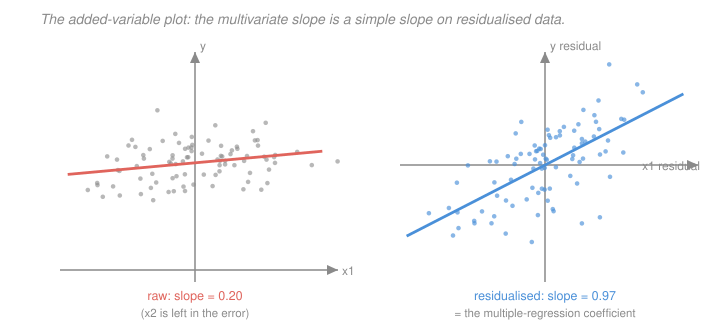

# Econometrics · Lesson 1.5: Goodness of fit and what a coefficient means

> ⏱ ~15 min · Module 1: The linear regression model · Builds on: [1.3 (OLS algebra and projection)](01-03-ols-algebra-geometry-projection.md), [1.4 (Gauss–Markov)](01-04-gauss-markov-theorem.md) · Unlocks: 1.6 (functional form), 2.1 (the sampling distribution of OLS)

## Why this matters

$R^2$ is the most-reported and least-useful number in applied economics. It is reported because it is easy; it is useless for the question this course cares about, because a model can have an $R^2$ of $0.95$ and identify nothing, or an $R^2$ of $0.02$ and nail a causal effect precisely.

The genuinely useful diagnostics live next door: the added-variable plot, which shows you the variation actually producing your coefficient, and a clear-eyed account of what multicollinearity does and does not do. This lesson keeps $R^2$ in its place and spends the time on the two things that will change your mind about a regression.

## The idea

Pythagoras from [1.3](01-03-ols-algebra-geometry-projection.md) says total variation splits into explained plus residual. $R^2$ is the explained share. That is all it is — a *description of the sample*, not evidence about the world.

The reason it cannot answer a causal question: $R^2$ measures how much of $y$'s variation your regressors soak up, while identification is about whether one particular coefficient means what you say it means. Those are unrelated. Adding a hundred irrelevant-but-correlated variables raises $R^2$ and can destroy the coefficient you care about. Running an experiment with one binary treatment can give $R^2 = 0.01$ and a perfectly credible causal estimate.

The added-variable plot is the useful cousin. It takes FWL literally: residualise both $y$ and the regressor of interest against everything else, and plot. What you see is precisely the data your coefficient is computed from — and whether that coefficient rests on three influential points or on the whole cloud.

## The formal version

With a constant included, centre everything around $\bar y$ and write
$$\underbrace{\sum_i (y_i-\bar y)^2}_{\mathrm{TSS}} \;=\; \underbrace{\sum_i(\hat y_i - \bar y)^2}_{\mathrm{ESS}} \;+\; \underbrace{\sum_i \hat e_i^2}_{\mathrm{RSS}} ,$$
which is the orthogonal decomposition of [1.3](01-03-ols-algebra-geometry-projection.md) applied to demeaned data (legal because the constant is in the model, so $\bar{\hat e}=0$).

> **Definition.** $R^2 = \dfrac{\mathrm{ESS}}{\mathrm{TSS}} = 1 - \dfrac{\mathrm{RSS}}{\mathrm{TSS}} \in [0,1]$.

*In words:* the fraction of the outcome's sample variance that the fitted values reproduce.

Three algebraic facts, each of which kills a common misuse:

1. **$R^2$ never falls when you add a regressor.** The larger model's column space contains the smaller one's, so its RSS cannot be larger. Adding pure noise weakly raises $R^2$; adding $n-k$ noise columns drives it to $1$.
2. **Adjusted $R^2$ penalises but does not fix.** $\bar R^2 = 1 - \frac{\mathrm{RSS}/(n-k)}{\mathrm{TSS}/(n-1)}$ can fall when a regressor is added, and it rises exactly when the added variable's $|t|$ exceeds $1$ — a threshold so lax it is not a model-selection rule anyone should use.
3. **$R^2$ is not comparable across different left-hand sides.** Regressions of $y$ and of $\log y$ have different TSS, so their $R^2$s answer different questions.

**Population analogue.** By [1.1](01-01-conditional-expectation-function.md)'s P2, $\operatorname{Var}(Y)=\operatorname{Var}(m(X))+E[\operatorname{Var}(Y\mid X)]$. So even a model that recovers the CEF *exactly* has population $R^2$ equal to $\operatorname{Var}(m(X))/\operatorname{Var}(Y)$, which can be tiny. A low $R^2$ may mean nothing more than that outcomes are noisy at fixed $X$.

**The added-variable plot.** By FWL, $\hat\beta_1 = \tilde x_1'\tilde y/(\tilde x_1'\tilde x_1)$ where tildes denote residuals after regressing on all other regressors. Plot $\tilde y$ against $\tilde x_1$: the OLS slope of that scatter *is* $\hat\beta_1$, its residuals are the full model's residuals, and its visual spread is the honest picture of your identifying variation.

**Multicollinearity.** For regressor $j$,
$$\operatorname{Var}(\hat\beta_j\mid X) = \frac{\sigma^2}{\mathrm{TSS}_j\,(1-R_j^2)}, \qquad \mathrm{VIF}_j = \frac{1}{1-R_j^2} ,$$
where $R_j^2$ is from regressing $x_j$ on the other regressors and $\mathrm{TSS}_j=\sum_i(x_{ij}-\bar x_j)^2$. *In words:* the more of $x_j$ is predictable from the other regressors, the less independent variation is left to identify $\beta_j$, and the wider the interval.

Crucially, this formula is **not a bias**. Multicollinearity leaves $\hat\beta$ unbiased and the standard errors correct; it just makes them large. It is the statistical system honestly reporting that the data cannot separate two things. The bad response is dropping a variable to "fix" it — that trades an honest wide interval for a biased narrow one.

## Picture

Same 90 observations, same variables. On the left, the raw relationship between $y$ and $x_1$ has slope $0.20$. On the right, after sweeping $x_2$ out of both axes, the slope is $0.97$ — the multiple-regression coefficient, and close to the true $\beta_1=1$ used to generate the data. The left panel is not a worse estimate of the same thing; it is an estimate of a different thing.

## Worked examples

**Example 1 (mechanical): $R^2$ rises on pure noise.** Take $n=20$ observations, regress $y$ on a constant, and get $R^2=0$ by construction. Now add $k$ columns of independent standard normal noise, unrelated to $y$ by construction. The expected $R^2$ from fitting $k$ pure-noise regressors plus a constant is
$$E[R^2] \;=\; \frac{k}{n-1} .$$
At $n=20$: five noise regressors give an expected $R^2$ of $5/19\approx 0.263$; ten give $10/19 \approx 0.526$; nineteen give exactly $1$, a perfect fit to nothing at all.

The mechanism is the dimension count from [1.3](01-03-ols-algebra-geometry-projection.md): the residual lives in $n-1-k$ dimensions out of $n-1$, so on average that fraction of the variance survives. Adjusted $R^2$ has expectation $0$ here, which is exactly what it was built for — and is the strongest thing that can be said for it.

**Example 2 (why you'd care): high $R^2$, worthless coefficient; low $R^2$, credible one.**

*Case A.* Regress a country's GDP this year on its GDP last year plus a policy dummy. $R^2 = 0.998$, because GDP is enormously persistent. The policy coefficient is nonetheless uninterpretable: last year's GDP is a post-treatment variable if the policy has been running, and it absorbs most of the treatment's effect. High fit, no identification. (Why lagged outcomes are dangerous controls is [3.3](03-03-regression-anatomy-good-and-bad-controls.md)'s subject.)

*Case B.* A randomised trial assigns a job-training program by lottery. Regress earnings on the treatment dummy alone. $R^2 = 0.004$ — earnings vary hugely for reasons training cannot touch. But the coefficient is an unbiased estimate of the average treatment effect, because randomisation makes $\pi=0$ in [1.2](01-02-best-linear-predictor.md)'s bias formula. Low fit, clean identification.

The lesson generalises: **$R^2$ answers "how predictable is $y$", identification answers "does this coefficient mean what I claim". Nothing links them.** If a referee asks you to raise your $R^2$, the correct response is to ask what quantity they think it would improve.

## Watch out

- **You might think** a high $R^2$ means the model is well specified — **but actually** it means the regressors jointly predict $y$ in this sample. A regression of $y_t$ on an unrelated trending series will show $R^2$ above $0.9$ routinely; that is spurious regression, which [5.5](05-05-a-taste-of-time-series.md) treats.
- **You might think** multicollinearity biases your coefficients — **but actually** it inflates their variance and nothing else. $\hat\beta$ stays unbiased, the standard errors stay valid, the joint $F$-test stays valid. The familiar symptom — a jointly significant $F$ with no individually significant $t$ — is not a paradox; it is the data saying "something here matters, and I cannot tell you which".
- **You might think** dropping a collinear regressor is a fix — **but actually** if that regressor belongs in the model, dropping it reintroduces omitted-variable bias ([3.4](03-04-omitted-variable-bias.md)). You have replaced an honest wide interval with a dishonest narrow one. The real fixes are more data, better-designed variation, or accepting the imprecision.

## One-liner

> $R^2$ tells you how much of $y$ you can predict, never whether a coefficient means what you say — so report it, ignore it, and look at the added-variable plot instead, because that is the variation your estimate actually rests on.

## Problems

**P1 (🟢)** A regression on $n=100$ observations with $k=5$ (including the constant) reports $\mathrm{TSS}=400$ and $\mathrm{RSS}=150$. Compute $R^2$, $\bar R^2$, and $s^2$. Then state what $\bar R^2$ would become if a sixth regressor cut RSS to $148$, and say whether you should keep it.

**P2 (🟡)** Show that adding a regressor cannot increase RSS, using only the fact that the smaller model's column space is contained in the larger one's. Then show $\bar R^2$ rises if and only if the new regressor's $|t|$ statistic exceeds $1$.

**P3 (🔴, optional)** In the model $y = \beta_0+\beta_1x_1+\beta_2x_2+u$ with $\operatorname{Var}(u)=\sigma^2$, derive $\operatorname{Var}(\hat\beta_1) = \sigma^2/\bigl(\mathrm{TSS}_1(1-r^2)\bigr)$ where $r$ is the sample correlation between $x_1$ and $x_2$. Then compute how much the standard error inflates as $r$ goes from $0$ to $0.9$ to $0.99$, and use this to argue why "VIF above 10" is an arbitrary threshold.

Solutions

**P1** $\mathrm{ESS} = 400-150 = 250$, so
$$R^2 = 1 - \frac{150}{400} = 0.625 .$$
For adjusted $R^2$ with $n=100$, $k=5$:
$$\bar R^2 = 1 - \frac{\mathrm{RSS}/(n-k)}{\mathrm{TSS}/(n-1)} = 1 - \frac{150/95}{400/99} = 1 - \frac{1.578947}{4.040404} = 1 - 0.390789 = 0.609211 .$$
And $s^2 = \mathrm{RSS}/(n-k) = 150/95 = 1.578947$.

*With a sixth regressor*, $k=6$ and $\mathrm{RSS}=148$:
$$\bar R^2_{\text{new}} = 1 - \frac{148/94}{400/99} = 1 - \frac{1.574468}{4.040404} = 1 - 0.389681 = 0.610319 .$$
So $\bar R^2$ rises very slightly ($0.6092 \to 0.6103$), which by P2 means the new regressor's $|t|$ exceeds $1$. Should you keep it? **The question is not answerable from these numbers.** $|t|>1$ corresponds to a p-value around $0.32$ — nowhere near conventional significance, and in any case statistical significance is not why a variable belongs in a causal specification. Whether to include it depends on whether it is a confounder, a bad control, or post-treatment ([3.3](03-03-regression-anatomy-good-and-bad-controls.md)) — a question about the world, not about RSS.

**P2** *RSS cannot rise.* Let $X_A$ be the smaller design matrix and $X_B = [X_A\ z]$ the larger. Every vector of the form $X_Ab$ equals $X_B\binom{b}{0}$, so $\operatorname{col}(X_A)\subseteq\operatorname{col}(X_B)$. OLS minimises $\lVert y - v\rVert^2$ over $v$ in the column space; minimising over a *larger* set cannot yield a larger minimum. Hence $\mathrm{RSS}_B \le \mathrm{RSS}_A$, with equality iff the extra column adds nothing to the span (i.e. $\hat\beta_z = 0$ exactly). Since TSS is unchanged, $R^2$ weakly rises.

*The $|t|>1$ threshold.* Write $\mathrm{RSS}_A$, $\mathrm{RSS}_B$ for the two residual sums with $k$ and $k+1$ regressors. Adjusted $R^2$ rises iff
$$\frac{\mathrm{RSS}_B}{n-k-1} \;<\; \frac{\mathrm{RSS}_A}{n-k} .$$
The $F$-statistic for the single added regressor is
$$F = \frac{\mathrm{RSS}_A - \mathrm{RSS}_B}{\mathrm{RSS}_B/(n-k-1)} = t^2 ,$$
since for one restriction $F=t^2$. Rearranging the inequality:
$$(n-k)\mathrm{RSS}_B < (n-k-1)\mathrm{RSS}_A = (n-k-1)\bigl(\mathrm{RSS}_B + (\mathrm{RSS}_A-\mathrm{RSS}_B)\bigr) ,$$
$$\mathrm{RSS}_B < (n-k-1)(\mathrm{RSS}_A - \mathrm{RSS}_B) \qquad\Longleftrightarrow\qquad \frac{(n-k-1)(\mathrm{RSS}_A-\mathrm{RSS}_B)}{\mathrm{RSS}_B} > 1 ,$$
and the left side is exactly $F = t^2$. So $\bar R^2$ rises iff $t^2>1$, i.e. $|t|>1$. $\checkmark$

**P3** *Derivation.* By FWL, $\hat\beta_1$ is the no-intercept slope of $\tilde y$ on $\tilde x_1$, where $\tilde x_1$ is $x_1$ residualised on a constant and $x_2$. So $\operatorname{Var}(\hat\beta_1)=\sigma^2/(\tilde x_1'\tilde x_1)$. Now $\tilde x_1'\tilde x_1$ is the RSS from regressing $x_1$ on a constant and $x_2$, which by the definition of $R^2$ equals
$$\tilde x_1'\tilde x_1 = \mathrm{TSS}_1\,(1-R_1^2), \qquad R_1^2 = r^2 ,$$
where $r$ is the sample correlation between $x_1$ and $x_2$ (with one regressor, $R^2$ is the squared correlation). Hence
$$\operatorname{Var}(\hat\beta_1) = \frac{\sigma^2}{\mathrm{TSS}_1(1-r^2)} .\ \checkmark$$

*Inflation.* The standard error scales as $1/\sqrt{1-r^2}$, so relative to $r=0$:

| $r$ | $1-r^2$ | VIF $=1/(1-r^2)$ | SE inflation $=1/\sqrt{1-r^2}$ |
|---|---|---|---|
| $0$ | $1$ | $1.00$ | $1.00\times$ |
| $0.9$ | $0.19$ | $5.26$ | $2.29\times$ |
| $0.95$ | $0.0975$ | $10.26$ | $3.20\times$ |
| $0.99$ | $0.0199$ | $50.25$ | $7.09\times$ |

*Why "VIF > 10" is arbitrary.* The threshold $\mathrm{VIF}=10$ corresponds to $r\approx 0.949$ and an SE inflation of about $3.2\times$ — a real cost, but the function $1/\sqrt{1-r^2}$ is perfectly smooth and has no kink there. Nothing changes qualitatively as you cross it. Worse, the rule ignores the two things that actually matter: $\sigma^2$ and $\mathrm{TSS}_1$. A VIF of $50$ with a huge sample and small residual variance can still give a usefully tight interval, while a VIF of $2$ with $n=30$ can be hopeless. **The right diagnostic is the width of your confidence interval relative to the effect sizes you care about distinguishing** — a question about your economics — not a threshold on a variance ratio.

## Flashback

**From Lesson 1.3 (OLS algebra and the geometry of projection):** You regress $y$ on a constant, $x_1$, and $x_2$, and obtain residuals $\hat e$. A colleague now regresses $\hat e$ on a constant and $x_1$. Without computing anything, state what slope coefficient and what $R^2$ they will get, and justify each in one line. Then say what happens instead if they regress $\hat e$ on a constant and a *new* variable $x_3$ that was not in the original model.

Solution

**Slope: exactly zero. $R^2$: exactly zero.**

*Slope.* The normal equations of the original regression are $X'\hat e = 0$, and $x_1$ is a column of $X$, so $x_1'\hat e = 0$. The constant is also a column, so $\iota'\hat e = 0$, i.e. $\bar{\hat e}=0$. The slope from regressing $\hat e$ on a constant and $x_1$ is
$$\frac{\sum_i (x_{1i}-\bar x_1)(\hat e_i - \bar{\hat e})}{\sum_i (x_{1i}-\bar x_1)^2} = \frac{x_1'\hat e - \bar x_1 \iota'\hat e}{\sum_i(x_{1i}-\bar x_1)^2} = \frac{0-0}{\;\cdot\;} = 0 .$$

*$R^2$.* With a zero slope and a zero-mean outcome, every fitted value is $0$, so $\mathrm{ESS}=0$ and $R^2 = 0$.

*Geometrically:* $\hat e$ lies in the orthogonal complement of $\operatorname{col}(X)$, and $x_1$ lies inside $\operatorname{col}(X)$. Projecting a vector onto a direction it is already perpendicular to returns nothing. This is why "the residuals are uncorrelated with my regressors" is never evidence of anything — it is forced by construction, exactly as [1.2](01-02-best-linear-predictor.md)'s Watch-out warned.

*With a new variable $x_3$.* Now all bets are off: $x_3\notin\operatorname{col}(X)$, so $x_3'\hat e$ need not vanish and the slope will generally be nonzero. In fact this regression is informative — by FWL, regressing $\hat e$ on the residualised $x_3$ recovers exactly the coefficient $x_3$ would get in the full four-variable regression. That is the added-variable plot of this lesson, and it is the principled way to ask "does this extra variable have anything to add?".

## Connections

- **Backward:** the sum-of-squares split is [1.3](01-03-ols-algebra-geometry-projection.md)'s Pythagoras applied to demeaned data, and the added-variable plot is FWL made visual. The population ceiling on $R^2$ is [1.1](01-01-conditional-expectation-function.md)'s variance decomposition.
- **Forward:** [1.6](01-06-functional-form-logs-interactions.md) takes the "what does a coefficient mean" question seriously once the model is in logs or has interactions; [2.3](02-03-hypothesis-tests-confidence-intervals.md) turns the RSS comparison of P2 into the $F$-test formally. The multicollinearity variance formula reappears as the *weak instrument* problem in [3.8](03-08-weak-instruments-and-late.md), where the collinearity is between the fitted first stage and the controls.
- **Sideways:** [`statistical-learning` 1.3](../../statistical-learning/lessons/01-03-overfitting-and-train-validation-test.md) treats the same "$R^2$ always rises" fact as the central danger of model selection and answers it with held-out data. This course answers it differently — by refusing to select specifications on fit at all, and choosing them from causal reasoning instead. Both answers are right for their own question.
