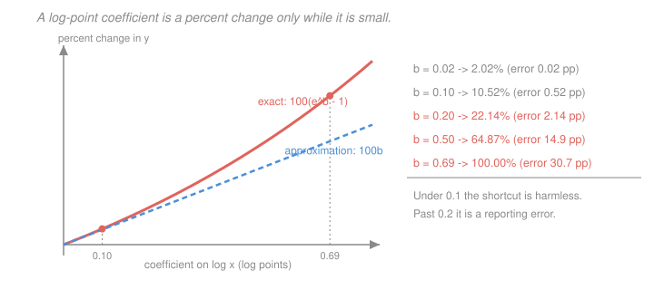

# Econometrics · Lesson 1.6: Functional form — logs, polynomials, interactions

> ⏱ ~15 min · Module 1: The linear regression model · Builds on: [1.2 (the best linear predictor)](01-02-best-linear-predictor.md), [1.5 (goodness of fit and interpretation)](01-05-goodness-of-fit-interpretation.md) · Unlocks: 2.2 (the delta method), 3.3 (regression anatomy)

## Why this matters

Essentially no applied regression is linear in levels. Wages are in logs, prices are in logs, trade flows are in logs, and half the coefficients you will ever read are elasticities. "Linear regression" means linear *in the parameters* — the regressors can be any transformation you like, and choosing those transformations is where a coefficient acquires the units it will be quoted in for the next decade.

This is also where a specific, embarrassing, and extremely common reporting error lives: reading a coefficient of $0.4$ on a logged variable as "a 40 percent effect". It is 49 percent. Getting this right costs one exponential.

## The idea

Taking a log converts a difference into a **proportional** difference: $\log(1.10) - \log(1.00) \approx 0.0953$, so a 10 percent rise is about $0.095$ log points. That approximation is what makes logs so pleasant to interpret — and it is only good while the change is small.

Three shapes cover most of applied work:

- **Both sides logged** gives an **elasticity**: a percent for a percent, a unit-free number you can compare across countries and currencies.
- **Outcome logged, regressor in levels** gives a **semi-elasticity**: a percent per unit. This is the standard wage regression.
- **Regressor logged, outcome in levels** gives units per percent — useful when the outcome has a natural scale (test scores, mortality rates) but the regressor spans orders of magnitude (income, population).

Polynomials and interactions then let the *slope itself* vary — with the level of the regressor, or with someone's group. The price is that no single number summarises the effect any more, and you must say at which value you are evaluating it.

## The formal version

**Log-log.** If $\log y = \beta_0 + \beta_1 \log x + u$, then
$$\beta_1 = \frac{\partial \log y}{\partial \log x} = \frac{\partial y / y}{\partial x / x} ,$$
the **elasticity** of $y$ with respect to $x$: the percent change in $y$ per one percent change in $x$. Unit-free, so rescaling either variable leaves it untouched.

**Log-linear.** If $\log y = \beta_0 + \beta_1 x + u$, then $\beta_1 = \partial \log y/\partial x$ is a **semi-elasticity**: the proportional change in $y$ per one-unit change in $x$.

Here is the part people get wrong. For a *discrete* change of one unit in $x$, the exact proportional change in $y$ is
$$\frac{y_{\text{new}}-y_{\text{old}}}{y_{\text{old}}} = e^{\beta_1}-1, \qquad\text{not}\qquad \beta_1 .$$
The approximation $e^{\beta_1}-1 \approx \beta_1$ comes from $e^z \approx 1+z$, and its error grows fast:

| $\beta_1$ | exact $100(e^{\beta_1}-1)$ | shortcut $100\beta_1$ | error |
|---|---|---|---|
| $0.02$ | $2.02\%$ | $2\%$ | $0.02$ pp |
| $0.10$ | $10.52\%$ | $10\%$ | $0.52$ pp |
| $0.20$ | $22.14\%$ | $20\%$ | $2.14$ pp |
| $0.50$ | $64.87\%$ | $50\%$ | $14.87$ pp |
| $0.693$ | $100.00\%$ | $69.3\%$ | $30.7$ pp |

*In words:* a coefficient of $\log 2 \approx 0.693$ means the outcome **doubles**, not that it rises 69 percent. Report log-point coefficients as log points, or exponentiate — never call a large one a percent.

**Dummy variables.** With $D\in\{0,1\}$ and $y$ in levels, $\beta_1$ is the difference in means between groups. With $\log y$, the exact proportional gap is again $e^{\beta_1}-1$. For a categorical variable with $J$ levels, include $J-1$ dummies plus a constant (the omitted level is the **base category**, and every coefficient is a comparison to it); including all $J$ plus a constant is the dummy variable trap from [1.3](01-03-ols-algebra-geometry-projection.md).

A regression on a full set of dummies for every distinct value of $X$ is called **saturated**. It imposes no functional form at all: its fitted values are exactly the group means, so a saturated regression *is* the sample CEF. That is the bridge back to [1.1](01-01-conditional-expectation-function.md), and it matters in [3.3](03-03-regression-anatomy-good-and-bad-controls.md).

**Polynomials.** With $y = \beta_0+\beta_1x+\beta_2x^2+u$,
$$\frac{\partial y}{\partial x} = \beta_1 + 2\beta_2 x ,$$
so there is no single "effect of $x$" — you must name an $x$. The turning point is at $x^* = -\beta_1/(2\beta_2)$; always check it lies inside your data range, because a peak located outside the support is an artefact of extrapolation, not a finding.

**Interactions.** With $y = \beta_0+\beta_1 x+\beta_2 D+\beta_3 (x\cdot D)+u$ and $D$ binary,
$$\frac{\partial y}{\partial x} = \beta_1 + \beta_3 D ,$$
so $\beta_1$ is the slope for the $D=0$ group and $\beta_3$ is the *difference* in slopes. The trap: once an interaction is present, $\beta_1$ is no longer "the effect of $x$" — it is the effect of $x$ **at $D=0$**. If $D=0$ is not a meaningful state, centre the interacted variable so that zero means something.

## Picture

Below about $0.1$ the two lines are indistinguishable and the shortcut is harmless. Past $0.2$ they visibly separate, and by $\log 2$ the shortcut understates the true effect by 31 percentage points.

## Worked examples

**Example 1 (mechanical): reading four specifications off the same data.** Suppose a wage regression on schooling $s$ (years) and experience $x$ (years) returns the following, with wages in dollars per hour.

| Specification | Coefficient | Correct reading |
|---|---|---|
| $\text{wage} = \beta_0+\beta_1 s$ | $\hat\beta_1 = 2.30$ | one more year of school is associated with 2.30 more dollars per hour |
| $\log(\text{wage}) = \beta_0 + \beta_1 s$ | $\hat\beta_1 = 0.094$ | one more year is associated with $100(e^{0.094}-1) = 9.86$ percent higher wages |
| $\log(\text{wage}) = \beta_0+\beta_1\log(\text{firm size})$ | $\hat\beta_1 = 0.031$ | a 1 percent larger firm pays 0.031 percent more — an elasticity |
| $\log(\text{wage}) = \dots + \beta_2 \,\text{female}$ | $\hat\beta_2 = -0.185$ | women earn $100(e^{-0.185}-1) = -16.9$ percent, i.e. 16.9 percent less |

Note the last row: the naive reading "18.5 percent less" overstates the gap by 1.6 percentage points. For negative coefficients the shortcut errs the other way — it exaggerates.

**Example 2 (why you'd care): a returns-to-experience profile.** Fit
$$\log(\text{wage}) = \beta_0 + \beta_1 x + \beta_2 x^2 + u, \qquad \hat\beta_1 = 0.042, \quad \hat\beta_2 = -0.00072 .$$
The semi-elasticity of experience is $\hat\beta_1 + 2\hat\beta_2 x = 0.042 - 0.00144x$:

- at $x=0$: $0.042$, so about $4.3$ percent per year for a new entrant;
- at $x=10$: $0.042-0.0144 = 0.0276$, about $2.8$ percent per year;
- at $x=20$: $0.042-0.0288 = 0.0132$, about $1.3$ percent per year;
- turning point: $x^* = -\hat\beta_1/(2\hat\beta_2) = 0.042/0.00144 = 29.2$ years.

So wages peak after about 29 years of experience and decline slowly thereafter — a shape familiar from every Mincer regression ever run. Two habits this should install. First, **always report the derivative at named values**, never "the effect of experience is $0.042$". Second, **check the turning point is inside the data**: if it had come out at 65 years, the quadratic would be fitting curvature you have no observations to support, and the sensible move is a spline or a set of experience-bin dummies instead.

## Watch out

- **You might think** you can log a variable that takes the value zero by using $\log(1+y)$ — **but actually** that transformation is not scale-invariant: its coefficient changes if you measure $y$ in dollars rather than thousands of dollars, so the "elasticity" you report depends on your units. It is a genuinely contested choice. Poisson pseudo-maximum-likelihood, which handles zeros natively and still delivers an elasticity, is the standard alternative — see [5.1](05-01-maximum-likelihood-estimation.md).
- **You might think** $\beta_1$ in a model with an interaction is "the main effect" — **but actually** it is the effect at $D=0$ (or at $x=0$ for a continuous interaction). Reporting it as an overall effect is one of the most common errors in published tables. Centre your variables, or state the evaluation point.
- **You might think** exponentiating a log-wage prediction gives the predicted wage — **but actually** $E[y\mid x] \neq e^{E[\log y\mid x]}$ by Jensen's inequality. Under log-normal errors the correct retransformation multiplies by $e^{\sigma^2/2}$; without normality you need Duan's smearing estimator. Coefficients are safe to exponentiate; *predictions of the level* are not.

## One-liner

> Linear regression is linear in parameters, not in variables — so logs buy you elasticities, interactions buy you slopes that vary, and the only cost is that you must now say exactly whose effect, at what value, in what units.

## Problems

**P1 (🟢)** A regression of $\log(\text{earnings})$ on a union-membership dummy gives a coefficient of $0.223$. Report the union premium as an exact percentage, and as the ratio of union to non-union earnings. How far off is the naive "22.3 percent" reading?

**P2 (🟡)** In $\log(y) = \beta_0+\beta_1 x + \beta_2 x^2 + \beta_3 (x \cdot D) + u$ with $D$ binary, write the semi-elasticity of $y$ with respect to $x$ for each group. Then suppose $\hat\beta_1 = 0.05$, $\hat\beta_2=-0.001$, $\hat\beta_3=0.02$: at what value of $x$ do the two groups' semi-elasticities differ by a factor of two, and does the answer depend on $\hat\beta_2$?

**P3 (🔴, optional)** You estimate $\log y = \beta_0 + \beta_1 \log x + u$ and get $\hat\beta_1 = 1.4$. A colleague insists the relationship is really linear in levels and estimates $y = \gamma_0 + \gamma_1 x + v$ on the same data. Explain why comparing the two $R^2$ values cannot settle the argument, and describe a comparison that *would* be legitimate.

Solutions

**P1** The exact proportional premium is
$$e^{0.223} - 1 = 1.249821 - 1 = 0.249821 \;\approx\; 25.0\% .$$
The ratio of union to non-union earnings is $e^{0.223} = 1.2498$, so union members earn about $1.25$ times as much.

The naive reading of "22.3 percent" understates the premium by $25.0 - 22.3 = 2.7$ percentage points, a relative error of about 11 percent of the effect itself. At this magnitude the shortcut has stopped being harmless — which is roughly the point (coefficients around $0.2$) where you should switch to reporting the exponentiated figure.

**P2** Differentiate: $\dfrac{\partial \log y}{\partial x} = \beta_1 + 2\beta_2 x + \beta_3 D$. So

$$\text{group } D=0: \ \ \beta_1 + 2\beta_2 x, \qquad\qquad \text{group } D=1: \ \ \beta_1 + \beta_3 + 2\beta_2 x .$$

The two differ by the constant $\beta_3 = 0.02$ at every $x$ — the interaction shifts the whole profile up without changing its curvature, since $D$ interacts with $x$ but not with $x^2$.

*Factor of two.* We need $\beta_1+\beta_3+2\beta_2 x = 2(\beta_1+2\beta_2x)$, i.e.
$$\beta_1 + \beta_3 + 2\beta_2 x = 2\beta_1 + 4\beta_2 x \quad\Longrightarrow\quad \beta_3 - \beta_1 = 2\beta_2 x \quad\Longrightarrow\quad x = \frac{\beta_3-\beta_1}{2\beta_2} .$$
With the given numbers: $x = (0.02-0.05)/(2\times(-0.001)) = (-0.03)/(-0.002) = 15$.

*Does it depend on $\beta_2$?* **Yes, entirely** — $\beta_2$ appears in the denominator, and if $\beta_2 = 0$ there is no such $x$ at all (the two semi-elasticities would then be the constants $0.05$ and $0.07$, whose ratio $1.4$ is never $2$). Sanity check at $x=15$: group $D=0$ has $0.05 - 0.03 = 0.02$; group $D=1$ has $0.07-0.03 = 0.04$. Exactly double. $\checkmark$

**P3** *Why the $R^2$ comparison is illegitimate.* $R^2 = 1 - \mathrm{RSS}/\mathrm{TSS}$, and the two regressions have **different left-hand-side variables**, hence different TSS: one decomposes the variance of $\log y$, the other the variance of $y$. They are shares of two different totals, so neither being larger tells you anything about which model is closer to the truth. Worse, the transformation is nonlinear and variance-changing: logging compresses the right tail, so a few large outliers that dominate the level regression's TSS barely register in the log regression's.

*A legitimate comparison.* Put both models on the same scale before comparing. Three standard routes:

1. **Compare on the level scale.** Generate fitted values from the log model, retransform them properly to $\hat y$ — remembering the Jensen correction from the Watch-out, so $\hat y_i = e^{\hat{\log y}_i}\cdot \widehat{e^{u}}$, using either $e^{\hat\sigma^2/2}$ under log-normality or Duan's smearing factor $\frac1n\sum_i e^{\hat u_i}$ — then compute each model's RSS *in levels* against the same $y$. Now both numbers answer the same question.
2. **Nest them in an encompassing model.** Estimate $y = \gamma_0+\gamma_1 x + \gamma_2 \log x + v$ and test each restriction. If only $\gamma_2$ survives, the log specification is doing the work.
3. **Use a formal non-nested test** such as the Davidson–MacKinnon $J$-test: add the fitted values of model B (retransformed to A's scale) as a regressor in model A, and test their coefficient. Do it in both directions — and be prepared for the honest outcome that *both* are rejected, or *neither* is.

The deeper point: this is a specification question, and specification questions are settled by economics and by out-of-sample behaviour, not by an in-sample fit statistic that [1.5](01-05-goodness-of-fit-interpretation.md) already showed rises mechanically. If the elasticity is what you want to report, the log-log model is the one that *defines* the parameter you want, and that is a better reason to prefer it than any $R^2$.

## Flashback

**From Lesson 1.4 (the Gauss–Markov theorem):** In the model $y = X\beta+u$ with $E[u\mid X]=0$ and $\operatorname{Var}(u\mid X)=\Omega$ where $\Omega = \operatorname{diag}(\sigma_1^2,\dots,\sigma_n^2)$ is *not* $\sigma^2 I$, answer three things. Is $\hat\beta_{\text{OLS}}$ still unbiased? Is $\sigma^2(X'X)^{-1}$ still its variance? Is OLS still BLUE?

Solution

**Unbiased: yes.** From $\hat\beta = \beta + (X'X)^{-1}X'u$,
$$E[\hat\beta\mid X] = \beta + (X'X)^{-1}X'E[u\mid X] = \beta ,$$
which used only $E[u\mid X]=0$. The variance assumption never entered, so heteroskedasticity leaves unbiasedness untouched.

**Variance formula: no.** The correct conditional variance is the sandwich
$$\operatorname{Var}(\hat\beta\mid X) = (X'X)^{-1}X'\Omega X(X'X)^{-1} ,$$
which collapses to $\sigma^2(X'X)^{-1}$ only when $\Omega = \sigma^2 I$. Using the classical formula here gives standard errors that are wrong in an unpredictable direction — they can be too small *or* too large, depending on whether the high-variance observations sit at high or low leverage.

**BLUE: no.** Gauss–Markov assumed GM4. Under a known $\Omega$ the efficient linear unbiased estimator is **generalised least squares**,
$$\hat\beta_{\text{GLS}} = (X'\Omega^{-1}X)^{-1}X'\Omega^{-1}y ,$$
which is OLS applied to the transformed data $\Omega^{-1/2}y$ on $\Omega^{-1/2}X$ — the transformation makes the errors spherical again, so Gauss–Markov applies in the transformed problem. With $\Omega$ diagonal this is **weighted least squares**, weighting each observation by $1/\sigma_i$: noisy observations count less.

The practical footnote worth carrying: GLS requires knowing (or correctly modelling) $\Omega$, and getting it wrong can leave you worse off than OLS while also breaking the unbiasedness that OLS keeps for free. Modern practice therefore usually keeps OLS for the point estimate and fixes only the standard errors — which is exactly the plan of [2.4](02-04-heteroskedasticity-robust-standard-errors.md).

## Connections

- **Backward:** the saturated-regression remark closes the loop with [1.1](01-01-conditional-expectation-function.md) — with enough dummies, the BLP of [1.2](01-02-best-linear-predictor.md) *is* the CEF, and the approximation error the BLP accepted disappears. Every transformation here is still a linear model in the sense of [1.3](01-03-ols-algebra-geometry-projection.md), so all the projection algebra survives untouched.
- **Forward:** [2.2](02-02-consistency-and-asymptotic-normality.md)'s delta method is what gives you a standard error for $e^{\hat\beta}-1$, a nonlinear function of an estimate. [3.3](03-03-regression-anatomy-good-and-bad-controls.md) uses saturated regressions to say exactly what OLS averages. Interaction terms become the engine of difference-in-differences in [4.3](04-03-difference-in-differences.md), where the DiD estimate *is* an interaction coefficient.
- **Sideways:** the elasticity interpretation is what makes regression coefficients comparable to the elasticities derived structurally in [`micro-refresher` 1.4](../../micro-refresher/lessons/01-04-slutsky-comparative-statics.md) — a demand elasticity estimated here and one derived from a utility function there are the same object, which is precisely how structural and reduced-form work talk to each other.
