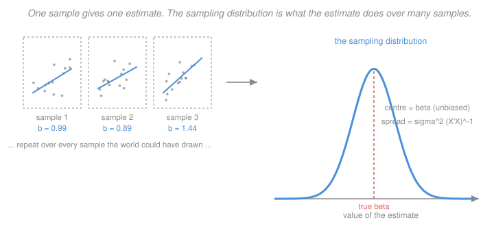

# Econometrics · Lesson 2.1: The sampling distribution of OLS

> ⏱ ~15 min · Module 2: Inference and asymptotics · Builds on: [1.4 (Gauss–Markov)](01-04-gauss-markov-theorem.md), [`prob-stat-refresher` 4.4 (sampling distributions)](../../prob-stat-refresher/lessons/04-04-sampling-distributions-t-and-chi-square.md) · Unlocks: 2.2 (consistency and asymptotic normality), 2.3 (tests and intervals)

## Why this matters

You have one dataset. You compute one number. That number is not the truth — it is one draw from a distribution of numbers you would have computed had the world dealt you a different sample. Everything called "inference" is an attempt to say how far that draw might be from the target.

This lesson does the finite-sample case, where adding normality gives exact answers with no approximation at all. It is worth doing properly for two reasons: the exact results explain where $t$ and $F$ distributions come from rather than asking you to accept them, and the degrees-of-freedom bookkeeping ($n-k$, again) turns out to be the same dimension count from [1.3](01-03-ols-algebra-geometry-projection.md).

## The idea

Fix the regressors and imagine re-drawing the errors. Each draw gives a new $y$, hence a new $\hat\beta$. Because $\hat\beta = \beta + (X'X)^{-1}X'u$ is a **linear** function of $u$, the randomness passes through cleanly: whatever distribution $u$ has, $\hat\beta$ has a linearly transformed version of it, centred on $\beta$.

If the errors are normal, the transform of a normal is normal, and $\hat\beta$ is *exactly* normal in any sample size — even $n=5$. That is the one genuinely free lunch in finite-sample econometrics, and it is why the classical theory assumed normality.

The complication is that the variance $\sigma^2(X'X)^{-1}$ contains an unknown $\sigma^2$. Replacing it by $s^2$ introduces a second source of randomness, and dividing a normal by the square root of an independent chi-square is exactly what defines a $t$ distribution. The $t$ is not a fudge for small samples; it is the exact answer to "what happens when you have to estimate the scale".

## The formal version

Work conditionally on $X$ throughout — treating regressors as fixed is the **fixed-design** convention, appropriate when $X$ is genuinely controlled or when you simply want statements that hold for the $X$ you have. ([2.2](02-02-consistency-and-asymptotic-normality.md) switches to random design.)

Under GM1–GM3 with $\operatorname{Var}(u\mid X)=\sigma^2I$ (GM4):
$$E[\hat\beta\mid X]=\beta, \qquad \operatorname{Var}(\hat\beta\mid X)=\sigma^2(X'X)^{-1} .$$
These hold with no distributional assumption. Now add GM5, $u\mid X\sim\mathcal N(0,\sigma^2 I_n)$.

> **Theorem (exact normality).** Under GM1–GM5,
> $$\hat\beta \mid X \;\sim\; \mathcal N\bigl(\beta,\ \sigma^2 (X'X)^{-1}\bigr) .$$

*In words:* the estimator is exactly normal, centred on the truth, with the stated variance — in *any* sample size. This follows because $\hat\beta-\beta = Au$ with $A=(X'X)^{-1}X'$ nonrandom given $X$, and a linear map of a multivariate normal is multivariate normal, with mean $A\cdot 0 = 0$ and variance $A(\sigma^2I)A' = \sigma^2(X'X)^{-1}$.

For a single coefficient, writing $[\,\cdot\,]_{jj}$ for the $j$-th diagonal entry,
$$\frac{\hat\beta_j - \beta_j}{\sigma\sqrt{[(X'X)^{-1}]_{jj}}} \ \sim\ \mathcal N(0,1) .$$
This is useless as it stands: $\sigma$ is unknown. Two more results fix that.

> **Theorem (distribution of $s^2$).** Under GM1–GM5, $\dfrac{(n-k)s^2}{\sigma^2} \mid X \ \sim\ \chi^2_{n-k}$, and $s^2$ is **independent** of $\hat\beta$.

The chi-square degrees of freedom are $\operatorname{tr}(M)=n-k$: the residual vector $\hat e = Mu$ is a normal vector confined to an $(n-k)$-dimensional subspace, and the squared length of a standard normal restricted to $d$ dimensions is $\chi^2_d$. The independence comes from $\hat\beta$ depending on $u$ only through $Hu$ and $s^2$ only through $Mu$, with $HM=0$ — and for jointly normal vectors, zero covariance means independence.

Substituting $s$ for $\sigma$ and using the definition of a $t$ variable (standard normal over the root of an independent chi-square divided by its degrees of freedom):

> **Theorem (exact $t$).** Under GM1–GM5, with $\mathrm{se}(\hat\beta_j) = s\sqrt{[(X'X)^{-1}]_{jj}}$,
> $$t_j = \frac{\hat\beta_j - \beta_j}{\mathrm{se}(\hat\beta_j)} \ \sim\ t_{n-k} \quad\text{exactly.}$$

*In words:* the usual $t$-statistic has a $t$ distribution with $n-k$ degrees of freedom — exactly, in any sample size, provided the errors really are normal.

**How much does the $t$ correction matter?** The two-sided 5 percent critical value:

| $n-k$ | $t$ critical value | vs normal $1.960$ |
|---|---|---|
| $5$ | $2.571$ | 31% wider |
| $10$ | $2.228$ | 14% wider |
| $30$ | $2.042$ | 4% wider |
| $100$ | $1.984$ | 1.2% wider |
| $\infty$ | $1.960$ | — |

Past about 100 degrees of freedom the distinction is cosmetic. Below 30 it is real, and below 10 it is large.

## Picture

The three boxes on the left are three worlds you might have lived in; each hands you one number. The curve on the right is the population of numbers those worlds would produce. Unbiasedness is a statement about where that curve is centred. A standard error is an estimate of how wide it is. You never see the curve — you see one draw from it.

## Worked examples

**Example 1 (mechanical): reading a small regression.** A regression on $n=20$ observations with $k=3$ (constant plus two regressors) reports $\hat\beta_2 = 0.84$ and $s^2 = 4.0$, with $[(X'X)^{-1}]_{22} = 0.0225$.

$$\mathrm{se}(\hat\beta_2) = s\sqrt{[(X'X)^{-1}]_{22}} = \sqrt{4.0}\times\sqrt{0.0225} = 2.0\times 0.15 = 0.30 .$$
$$t = \frac{0.84 - 0}{0.30} = 2.80 .$$

With $n-k = 17$ degrees of freedom the 5 percent two-sided critical value is $2.110$, so reject at 5 percent. The 95 percent interval is
$$0.84 \pm 2.110(0.30) = 0.84 \pm 0.633 = [0.207,\ 1.473] .$$

Had you lazily used $1.96$ you would have reported $[0.252, 1.428]$ — an interval 7 percent too narrow. With $n=20$ that is a real error; with $n=2000$ it would not be.

**Example 2 (why you'd care): what happens when normality fails.** Errors are rarely normal. Wages are right-skewed; firm sizes are Pareto; counts are Poisson. So does the exact theory collapse?

Partly. The *point estimate* results — unbiasedness, the variance formula, Gauss–Markov — never used normality, so they survive untouched. What breaks is the claim that $t_j$ has an exact $t_{n-k}$ distribution.

Two rescues, and they are different in kind. **Asymptotics** ([2.2](02-02-consistency-and-asymptotic-normality.md)) says the CLT delivers approximate normality of $\hat\beta$ as $n$ grows regardless of the error distribution, so the $t$-statistic is approximately standard normal in large samples. **The bootstrap** ([2.6](02-06-bootstrap-and-few-clusters.md)) says: stop guessing the distribution and simulate it from the data you have.

Neither rescue helps if the sample is small *and* the errors are wildly non-normal — that combination genuinely is hard, and honest practice is to say so. But note the asymmetry that makes life livable: the CLT applies to $\hat\beta$, an *average* of the $x_iu_i$ terms, not to $u$ itself. Averages become normal much faster than the things they average, which is why the approximation is usually decent by $n$ in the low hundreds even with ugly errors.

## Watch out

- **You might think** the $t$ distribution is a small-sample *approximation* — **but actually** under GM1–GM5 it is exact at every $n$. The approximation runs the other way: in large samples the $t$ is well approximated by the normal.
- **You might think** normality of $y$ is what is required — **but actually** the assumption is on $u\mid X$. If $X$ is skewed, $y$ will be skewed too, and that is fine; what matters is the conditional distribution of the errors around the CEF.
- **You might think** a large $t$-statistic means a large effect — **but actually** $t = \hat\beta/\mathrm{se}$, so it grows with $\sqrt n$ for a fixed effect. With a million observations, an economically meaningless coefficient will have $t=40$. **Always report the coefficient and its units**, and ask whether the interval excludes effect sizes you would care about — a habit [2.7](02-07-multiple-testing-specification-search.md) makes central.

## One-liner

> $\hat\beta$ is a linear function of the errors, so normal errors make it exactly normal at any $n$ — and having to estimate $\sigma$ turns the normal into a $t_{n-k}$, where the degrees of freedom are the same $n-k$ dimensions the residual lives in.

## Problems

**P1 (🟢)** A regression with $n=25$, $k=4$ reports $\hat\beta_3 = -1.60$, $s = 3.0$, and $[(X'X)^{-1}]_{33} = 0.16$. Compute the standard error, the $t$-statistic, and the 95 percent confidence interval. Would your conclusion change if you used the normal critical value?

**P2 (🟡)** Show that $\hat\beta$ and $\hat e$ are independent under GM1–GM5, by computing $\operatorname{Cov}(\hat\beta, \hat e\mid X)$ and invoking joint normality. Explain in one sentence why this independence is what makes the $t$-statistic's distribution tractable.

**P3 (🔴, optional)** Suppose you *knew* $\sigma^2$. Show that the resulting statistic is exactly standard normal, and explain why the $t$ distribution has fatter tails than the normal by describing what randomness in $s$ does to the ratio. Then quantify: at $n-k=10$, what is $P(|t|>1.96)$ under $t_{10}$, and how does it compare to the nominal $0.05$?

Solutions

**P1** Standard error:
$$\mathrm{se}(\hat\beta_3) = s\sqrt{[(X'X)^{-1}]_{33}} = 3.0\times\sqrt{0.16} = 3.0\times 0.4 = 1.20 .$$
$t$-statistic:
$$t = \frac{-1.60}{1.20} = -1.3\overline{3} .$$
Degrees of freedom $n-k = 25-4=21$; the two-sided 5 percent critical value is $t_{0.975,21} = 2.080$. Since $|{-1.333}| < 2.080$, **do not reject** at 5 percent. The interval is
$$-1.60 \pm 2.080(1.20) = -1.60 \pm 2.496 = [-4.096,\ 0.896] .$$

With the normal critical value $1.96$ the interval would be $-1.60\pm 2.352 = [-3.952, 0.752]$ — still comfortably containing zero. **The conclusion does not change here**, because the statistic is nowhere near either critical value. That is the general lesson about the $t$-versus-normal choice: it only matters for statistics sitting in the narrow band between the two critical values (here, between $1.96$ and $2.08$ in absolute value).

**P2** Both $\hat\beta - \beta = (X'X)^{-1}X'u$ and $\hat e = Mu$ are linear in the same normal vector $u$, so conditional on $X$ they are **jointly** normal. Their covariance is
$$\operatorname{Cov}(\hat\beta,\hat e\mid X) = E\bigl[(X'X)^{-1}X'u\,u'M'\bigr] = (X'X)^{-1}X'\,\operatorname{Var}(u\mid X)\,M = \sigma^2 (X'X)^{-1}\underbrace{X'M}_{=\,0} = 0 ,$$
using $MX=0$ so $X'M = (MX)' = 0$. For jointly normal vectors, zero covariance implies independence. Hence $\hat\beta \perp \hat e$, and since $s^2$ is a function of $\hat e$ alone, $\hat\beta\perp s^2$.

*Why it matters.* The $t$-statistic is a ratio of a normal to a function of $s$. If numerator and denominator were dependent, the ratio's distribution would depend on their joint law and would not be a standard tabulated object. Independence is exactly the condition in the definition of Student's $t$: $Z/\sqrt{W/d}$ with $Z\sim\mathcal N(0,1)$, $W\sim\chi^2_d$, and $Z\perp W$. Without it there is no $t$ distribution to appeal to.

Note this independence is a *normality* result. Without GM5, $\hat\beta$ and $s^2$ are uncorrelated but generally dependent, which is another reason the exact theory is fragile.

**P3** *Known $\sigma^2$.* Then $\mathrm{se}$ is nonrandom and
$$z_j = \frac{\hat\beta_j-\beta_j}{\sigma\sqrt{[(X'X)^{-1}]_{jj}}}$$
is a standard normal divided by a constant that is exactly its own standard deviation, so $z_j\sim\mathcal N(0,1)$ exactly. No approximation, no degrees of freedom.

*Why the $t$ has fatter tails.* Write $t_j = z_j / \sqrt{s^2/\sigma^2}$, where the denominator is an independent random variable with mean $1$. Two effects compound. First, the denominator is sometimes small, and dividing by a small number produces a large $|t|$ — so extreme values arise both when $z$ is extreme and when $s$ happens to be small. Second, this extra multiplicative noise cannot be averaged away, because the mixture of normals with random scale is genuinely heavier-tailed than any single normal. Formally $\operatorname{Var}(t_d) = d/(d-2) > 1$ for $d>2$: at $d=10$ the variance is $10/8 = 1.25$.

*Quantification at $d=10$.* Under $t_{10}$,
$$P(|t| > 1.96) = 0.0784 ,$$
against the nominal $0.05$. So using normal critical values with 10 degrees of freedom gives a test with a true size of about **7.8 percent** when you believe it is 5 percent — you would reject a true null more than half again as often as intended. Equivalently, the honest 5 percent critical value at $d=10$ is $2.228$, not $1.96$.

The size distortion by degrees of freedom, using the normal critical value $1.96$:

| $n-k$ | true size | intended |
|---|---|---|
| $5$ | $0.107$ | $0.05$ |
| $10$ | $0.078$ | $0.05$ |
| $30$ | $0.059$ | $0.05$ |
| $100$ | $0.053$ | $0.05$ |

This same table, with "degrees of freedom" replaced by "number of clusters", is the entire argument of [2.5](02-05-clustered-standard-errors.md) and [2.6](02-06-bootstrap-and-few-clusters.md) — and there the distortion is far worse, because the effective degrees of freedom can be single digits even when $n$ is enormous.

## Flashback

**From Lesson 1.5 (goodness of fit and what a coefficient means):** A regression reports $R^2 = 0.91$ on $n=40$ observations with $k=12$. Compute $\bar R^2$. Then a colleague adds eight more regressors, all pure noise, and reports $R^2 = 0.96$. Compute the new $\bar R^2$ and say what the comparison tells you.

Solution

Using $\bar R^2 = 1 - \dfrac{(1-R^2)(n-1)}{n-k}$ (an equivalent rearrangement of the definition in [1.5](01-05-goodness-of-fit-interpretation.md)):

*Original model*, $n=40$, $k=12$, $R^2=0.91$:
$$\bar R^2 = 1 - \frac{(1-0.91)(39)}{40-12} = 1 - \frac{0.09\times 39}{28} = 1 - \frac{3.51}{28} = 1 - 0.125357 = 0.874643 .$$

*Expanded model*, $k=20$, $R^2=0.96$:
$$\bar R^2 = 1 - \frac{(1-0.96)(39)}{40-20} = 1 - \frac{0.04\times 39}{20} = 1 - \frac{1.56}{20} = 1 - 0.078 = 0.922 .$$

**Adjusted $R^2$ went UP** — from $0.875$ to $0.922$ — even though the eight added regressors are pure noise by construction. So the comparison tells you something uncomfortable: $\bar R^2$ did not protect you. It penalises parameters, but the penalty is weak (recall from [1.5](01-05-goodness-of-fit-interpretation.md) that it rises whenever $|t|>1$, and with eight noise regressors it is unremarkable for the fit to improve enough to clear that bar by chance).

Two things worth taking away. First, with $n=40$ and $k=20$ you have $n-k = 20$ residual degrees of freedom, and $E[R^2]$ from noise alone is roughly $k/(n-1)$ — here about $0.49$ before the real regressors contribute anything. The model is in a regime where fit statistics are close to meaningless. Second, this is exactly why [1.5](01-05-goodness-of-fit-interpretation.md) insisted that specification decisions come from causal reasoning rather than fit: no in-sample criterion, adjusted or not, reliably tells you a regressor does not belong. The honest tools are held-out data (if prediction is the goal) or an argument about confounding (if identification is).

## Connections

- **Backward:** the mean and variance come straight from [1.4](01-04-gauss-markov-theorem.md); the $n-k$ appearing as chi-square degrees of freedom is [1.3](01-03-ols-algebra-geometry-projection.md)'s $\operatorname{tr}(M)$, so the dimension count of the projection geometry *is* the degrees-of-freedom bookkeeping. The $t$ and $\chi^2$ facts themselves are from [`prob-stat-refresher` 4.4](../../prob-stat-refresher/lessons/04-04-sampling-distributions-t-and-chi-square.md) and are used, not reproved.
- **Forward:** [2.2](02-02-consistency-and-asymptotic-normality.md) drops GM4 and GM5 and rebuilds all of this from the LLN and CLT, gaining generality and losing exactness; [2.3](02-03-hypothesis-tests-confidence-intervals.md) turns these distributions into tests and intervals. The size-distortion table in P3 previews why few clusters are so dangerous in [2.5](02-05-clustered-standard-errors.md).
- **Sideways:** the exact-normality result is the reason classical statistics could do so much before computers: [`prob-stat-refresher` 4.2](../../prob-stat-refresher/lessons/04-02-confidence-intervals.md) builds intervals for a mean by the identical normal-over-root-chi-square argument, with $k=1$.
