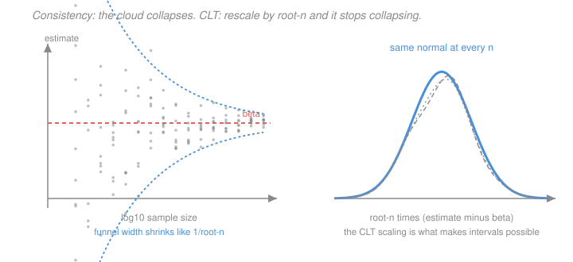

# Econometrics · Lesson 2.2: Consistency and the CLT for estimators

> ⏱ ~15 min · Module 2: Inference and asymptotics · Builds on: [2.1 (the sampling distribution of OLS)](02-01-sampling-distribution-of-ols.md), [`probability-theory` 4.2 (laws of large numbers)](../../probability-theory/lessons/04-02-laws-of-large-numbers.md), [`probability-theory` 4.5 (CLT)](../../probability-theory/lessons/04-05-central-limit-theorem.md) · Unlocks: 2.3 (tests), 2.4 (robust standard errors)

## Why this matters

[2.1](02-01-sampling-distribution-of-ols.md) bought exact answers with two assumptions nobody believes: homoskedastic errors and normal errors. This lesson buys approximate answers with assumptions that are often defensible — and the approximate answers turn out to be the ones applied work actually uses.

The payoff is bigger than "it still works without normality". Asymptotics **weakens the exogeneity requirement** from $E[u\mid X]=0$ to $E[x_iu_i]=0$, which is the difference between an assumption that fails in every time series and dynamic panel and one that often holds. It also produces the sandwich variance formula in a form that makes [2.4](02-04-heteroskedasticity-robust-standard-errors.md) and [2.5](02-05-clustered-standard-errors.md) obvious rather than mysterious.

## The idea

Two separate questions, often confused.

**Consistency** asks: as the sample grows, does the estimator settle on the right number? This is a statement about a limit, and it comes from the law of large numbers — sample averages converge to population means, so an estimator built out of sample averages converges to the same thing built out of population means.

**Asymptotic normality** asks: how does it wobble on the way? Rescale the error $\hat\beta - \beta$ by $\sqrt n$ — just enough to stop it collapsing to zero — and the CLT says the rescaled thing has a normal limit. That normal limit is where every standard error comes from.

The mental image: consistency says the funnel narrows to a point; asymptotic normality says that if you zoom in on the funnel at rate $\sqrt n$, you always see the same bell curve.

## The formal version

Switch to **random design**: $(y_i, x_i)$ are i.i.d. draws from a joint distribution. This is the right frame for survey and cross-sectional data, and it makes the LLN directly applicable.

Assume:
> **A1.** $(y_i,x_i)$ i.i.d., $y_i = x_i'\beta + u_i$.
> **A2.** $Q = E[x_ix_i']$ exists and is invertible.
> **A3 (contemporaneous exogeneity).** $E[x_iu_i]=0$.
> **A4.** $\Omega = E[x_ix_i'u_i^2]$ exists and is finite.

Note A3 is much weaker than [1.4](01-04-gauss-markov-theorem.md)'s GM3: it is $k$ moment conditions, not a whole conditional-mean function, and it says nothing about $u_i$ and $x_j$ for $j\ne i$.

**Consistency.** Write
$$\hat\beta = \beta + \Bigl(\frac1n\sum_i x_ix_i'\Bigr)^{-1}\Bigl(\frac1n\sum_i x_iu_i\Bigr) .$$
By the LLN, $\frac1n\sum x_ix_i' \xrightarrow{p} Q$ and $\frac1n\sum x_iu_i\xrightarrow{p} E[x_iu_i] = 0$. Matrix inversion is continuous where the limit is invertible, so by the continuous mapping theorem
$$\hat\beta \xrightarrow{p} \beta + Q^{-1}\cdot 0 = \beta .$$

*In words:* OLS is consistent as long as the regressors are uncorrelated with the error. That is it. Heteroskedasticity, autocorrelation, non-normality — none of them appear.

**Asymptotic normality.** Multiply the error by $\sqrt n$:
$$\sqrt n(\hat\beta-\beta) = \Bigl(\frac1n\sum_i x_ix_i'\Bigr)^{-1}\ \frac{1}{\sqrt n}\sum_i x_iu_i .$$
The second factor is $\sqrt n$ times the average of the mean-zero i.i.d. vectors $x_iu_i$, so by the CLT it converges in distribution to $\mathcal N(0,\Omega)$. Combined with the first factor's limit $Q^{-1}$ (Slutsky's theorem):

> **Theorem (asymptotic normality of OLS).** Under A1–A4,
> $$\sqrt n\,(\hat\beta - \beta) \ \xrightarrow{d}\ \mathcal N\bigl(0,\ \underbrace{Q^{-1}\Omega Q^{-1}}_{\text{the sandwich}}\bigr) .$$

*In words:* in large samples $\hat\beta$ behaves like a normal centred on $\beta$ with variance $\frac1n Q^{-1}\Omega Q^{-1}$, whatever the shape of the error distribution.

**Reading the sandwich.** $Q^{-1}$ is the *bread* and $\Omega = E[x_ix_i'u_i^2]$ is the *meat*. Under homoskedasticity, $E[u_i^2\mid x_i]=\sigma^2$ gives
$$\Omega = E\bigl[x_ix_i'E[u_i^2\mid x_i]\bigr] = \sigma^2 E[x_ix_i'] = \sigma^2 Q ,$$
so the sandwich collapses to $\sigma^2 Q^{-1}Q Q^{-1} = \sigma^2 Q^{-1}$ — exactly [2.1](02-01-sampling-distribution-of-ols.md)'s formula. **Heteroskedasticity is precisely the failure of that collapse**, and [2.4](02-04-heteroskedasticity-robust-standard-errors.md) simply estimates $\Omega$ directly instead of assuming it away.

**The delta method.** You usually want a function of $\hat\beta$ — an elasticity, a ratio, $e^{\hat\beta}-1$ from [1.6](01-06-functional-form-logs-interactions.md).

> **Theorem (delta method).** If $\sqrt n(\hat\theta - \theta)\xrightarrow{d}\mathcal N(0,V)$ and $g$ is continuously differentiable at $\theta$ with $G = \partial g/\partial\theta'$ of full row rank, then
> $$\sqrt n\bigl(g(\hat\theta)-g(\theta)\bigr) \ \xrightarrow{d}\ \mathcal N\bigl(0,\ GVG'\bigr) .$$

*In words:* linearise $g$ at $\theta$ by a first-order Taylor expansion; the slope of the transformation scales the standard deviation. Scalar case: $\mathrm{se}(g(\hat\theta)) \approx |g'(\hat\theta)|\cdot\mathrm{se}(\hat\theta)$.

## Picture

The left panel is consistency: the funnel closes at rate $1/\sqrt n$. The right panel is the CLT: rescaling by exactly $\sqrt n$ freezes the picture, and the frozen picture is normal. The two panels are the same data viewed with different microscopes, and the second one is the one that gives you a confidence interval.

## Worked examples

**Example 1 (mechanical): a delta-method standard error for a log-point effect.** From [1.6](01-06-functional-form-logs-interactions.md), a coefficient $\hat\beta = 0.10$ on a dummy in a log-wage regression means an exact percentage effect of $100(e^{\hat\beta}-1)$. Suppose $\mathrm{se}(\hat\beta) = 0.02$. What is the standard error of the percentage?

Let $g(\beta) = 100(e^{\beta}-1)$, so $g'(\beta) = 100e^{\beta}$. Then
$$g(0.10) = 100(e^{0.10}-1) = 10.5171 , \qquad g'(0.10) = 100e^{0.10} = 110.5171 ,$$
$$\mathrm{se}\bigl(g(\hat\beta)\bigr) \approx 110.5171 \times 0.02 = 2.2103 \text{ percentage points} .$$
So report "$10.52$ percent, standard error $2.21$ pp", giving a 95 percent interval of roughly $[6.19, 14.85]$ percent.

A useful cross-check: transforming the *endpoints* of the coefficient interval gives $100(e^{0.10\pm 1.96(0.02)}-1) = [6.27, 14.94]$. The two differ slightly because the delta method linearises while endpoint-transformation does not. **Prefer the endpoint transformation** when $g$ is monotone — it respects the nonlinearity and cannot produce impossible values.

**Example 2 (why you'd care): consistency without unbiasedness.** Consider the IV estimator you will meet in [3.6](03-06-instrumental-variables.md), $\hat\beta_{IV} = (Z'X)^{-1}Z'y$. Substituting $y = X\beta+u$:
$$\hat\beta_{IV} = \beta + (Z'X)^{-1}Z'u = \beta + \Bigl(\tfrac1n\sum z_ix_i'\Bigr)^{-1}\Bigl(\tfrac1n \sum z_iu_i\Bigr) .$$
By the LLN this converges in probability to $\beta + (E[z_ix_i'])^{-1}E[z_iu_i] = \beta$ whenever $E[z_iu_i]=0$ and $E[z_ix_i']$ is invertible. **Consistent.**

But is it unbiased? Take expectations of the middle expression and you are stuck: $E\bigl[(Z'X)^{-1}Z'u\bigr] \neq (E[Z'X])^{-1}E[Z'u]$, because expectation does not pass through the inverse of a random matrix. In fact IV is biased in finite samples, and the just-identified IV estimator does not even have a finite mean.

This is not a technicality — it is why Module 3 lives in the asymptotic world. Under endogeneity there is *no* unbiased estimator to hope for, so the entire toolkit is justified by consistency plus asymptotic normality, and the finite-sample behaviour must be checked separately. [3.8](03-08-weak-instruments-and-late.md) is about exactly the case where the asymptotic approximation is bad, and it is bad at sample sizes people routinely call large.

## Watch out

- **You might think** consistency implies unbiasedness or vice versa — **but actually** neither implies the other. IV is consistent and biased. Conversely, an estimator that ignores all but the first observation ($\hat\beta = y_1/x_1$) is unbiased under GM3 and hopelessly inconsistent, since its variance never shrinks.
- **You might think** $\hat\beta\xrightarrow{p}\beta$ means $E[\hat\beta]\to\beta$ — **but actually** convergence in probability says nothing about moments. A sequence can converge in probability while its mean diverges, if the exceptional set is rare enough but extreme enough — which is precisely what the just-identified IV estimator does.
- **You might think** "asymptotically valid" means "fine at $n=200$" — **but actually** the sample size needed depends on the *shape* of the problem: skewed errors, heavy tails, rare binary regressors, weak instruments and few clusters all delay the approximation, sometimes past any sample you will ever have. When the diagnosis is "asymptotics has not arrived", the answer is [2.6](02-06-bootstrap-and-few-clusters.md), not a bigger asterisk.

## One-liner

> The LLN makes OLS consistent under nothing more than $E[x_iu_i]=0$, and the CLT makes $\sqrt n(\hat\beta-\beta)$ normal with the sandwich variance $Q^{-1}\Omega Q^{-1}$ — which collapses to $\sigma^2Q^{-1}$ only if the errors happen to be homoskedastic.

## Problems

**P1 (🟢)** In a log-log demand regression the price elasticity is $\hat\beta = -1.30$ with $\mathrm{se} = 0.15$. Use the delta method to find the standard error of $\hat\theta = 1/\hat\beta$ (the inverse elasticity, sometimes reported as a markup-related quantity), and give a 95 percent interval for $\theta$.

**P2 (🟡)** Show that under homoskedasticity the sandwich $Q^{-1}\Omega Q^{-1}$ collapses to $\sigma^2 Q^{-1}$, stating exactly where you use the law of iterated expectations. Then show that if $\operatorname{Var}(u_i\mid x_i)=\sigma^2 h(x_i)$ for a known positive $h$, the sandwich does *not* collapse, and identify what $\Omega$ becomes.

**P3 (🔴, optional)** Prove that OLS is consistent under A1–A3 but need not be unbiased, by constructing an example where $E[x_iu_i]=0$ yet $E[u_i\mid x_i]\neq 0$. Then explain what this buys you in a time-series regression of $y_t$ on $y_{t-1}$.

Solutions

**P1** Let $g(\beta) = 1/\beta$, so $g'(\beta) = -1/\beta^2$. At $\hat\beta = -1.30$:
$$\hat\theta = \frac{1}{-1.30} = -0.769231, \qquad g'(\hat\beta) = -\frac{1}{(-1.30)^2} = -\frac{1}{1.69} = -0.591716 .$$
Delta method:
$$\mathrm{se}(\hat\theta) \approx |g'(\hat\beta)|\cdot\mathrm{se}(\hat\beta) = 0.591716\times 0.15 = 0.088757 .$$
95 percent interval:
$$-0.769231 \pm 1.96(0.088757) = -0.769231 \pm 0.173964 = [-0.943195,\ -0.595267] .$$

*Cross-check by transforming endpoints.* The coefficient interval is $-1.30\pm 1.96(0.15) = [-1.594, -1.006]$, and $1/x$ is monotone on this interval (which safely excludes zero), giving $[1/(-1.006), 1/(-1.594)] = [-0.994036, -0.627353]$. The two intervals differ noticeably — the delta method's is narrower and shifted — because $1/\beta$ has substantial curvature over this range. **Report the transformed endpoints.** And note the warning embedded here: if the interval for $\hat\beta$ had contained zero, $1/\hat\beta$ would have no finite interval at all, and the delta method would have cheerfully produced a meaningless number anyway.

**P2** *The collapse.* By definition $\Omega = E[x_ix_i'u_i^2]$. Apply the law of iterated expectations, conditioning on $x_i$ (this is the step in question):
$$\Omega = E\Bigl[E\bigl[x_ix_i'u_i^2 \,\big|\, x_i\bigr]\Bigr] = E\Bigl[x_ix_i'\,E[u_i^2\mid x_i]\Bigr] ,$$
where $x_ix_i'$ came out of the inner expectation because it is a function of $x_i$. Under homoskedasticity $E[u_i^2\mid x_i]=\sigma^2$, a constant, so
$$\Omega = \sigma^2 E[x_ix_i'] = \sigma^2 Q, \qquad Q^{-1}\Omega Q^{-1} = \sigma^2 Q^{-1}QQ^{-1} = \sigma^2 Q^{-1} .\ \checkmark$$

*The general case.* With $\operatorname{Var}(u_i\mid x_i)=\sigma^2h(x_i)$ (and $E[u_i\mid x_i]=0$, so the conditional second moment equals the conditional variance),
$$\Omega = E\bigl[x_ix_i'\,\sigma^2h(x_i)\bigr] = \sigma^2\,E\bigl[h(x_i)\,x_ix_i'\bigr] ,$$
which is $\sigma^2$ times a **$h$-weighted** second-moment matrix, not $\sigma^2 Q$. The sandwich becomes
$$\sigma^2\,Q^{-1}E[h(x_i)x_ix_i']\,Q^{-1} ,$$
and it equals $\sigma^2Q^{-1}$ only if $h$ is constant. Whether the classical formula is too small or too large depends on whether $h$ is large where $x_ix_i'$ is large — that is, whether the noisy observations sit at high or low leverage. There is no general direction, which is why "the classical standard errors are too small" is a folk claim rather than a theorem.

**P3** *Construction.* Let $x_i \sim \mathcal N(0,1)$ and set $u_i = x_i^2 - 1$. Then
$$E[x_iu_i] = E[x_i^3] - E[x_i] = 0 - 0 = 0 ,$$
so A3 holds and OLS is consistent for the projection coefficient. But
$$E[u_i\mid x_i] = x_i^2 - 1 \neq 0 ,$$
so GM3 fails badly — $u_i$ is a deterministic function of $x_i$. Unbiasedness required GM3 (see [1.4](01-04-gauss-markov-theorem.md) P1), so it is unavailable here; consistency required only the weaker A3, which holds.

This is exactly [1.1](01-01-conditional-expectation-function.md)'s "uncorrelated is not mean-independent" doing work: asymptotics needs only the correlation to vanish, while finite-sample unbiasedness needs the whole conditional mean to vanish.

*What it buys in a time series.* Regress $y_t$ on $y_{t-1}$ in an AR(1), $y_t = \rho y_{t-1}+u_t$ with $u_t$ white noise. Strict exogeneity is **impossible** here: $E[u_t\mid y_1,\dots,y_T]$ cannot be zero, because $y_t$ depends on $u_t$ and $y_t$ appears among the regressors for period $t+1$. So the regressor $y_{t-1}$ is correlated with *future* errors by construction, and GM3 fails not by accident but structurally. There is no way to assume it back.

Contemporaneous exogeneity, $E[y_{t-1}u_t]=0$, holds whenever $u_t$ is unpredictable from the past — which is exactly what "white noise" means. So OLS on an AR(1) is **biased in finite samples** (the well-known downward bias in $\hat\rho$, of order $-(1+3\rho)/n$) but **consistent**, and asymptotically normal. Without the asymptotic framework there would be no theory of dynamic models at all. The same structural failure of strict exogeneity is why dynamic panel models need their own estimators, a point [4.2](04-02-first-differencing-random-effects.md) returns to, and why [5.5](05-05-a-taste-of-time-series.md) can say anything useful about autoregressions.

## Flashback

**From Lesson 1.6 (functional form — logs, polynomials, interactions):** A regression of $\log(\text{output})$ on $\log(\text{labour})$ and $\log(\text{capital})$ gives coefficients $0.68$ and $0.41$. State what each coefficient means in words, and test by hand whether the technology exhibits constant returns to scale given that the standard error of the *sum* is $0.06$.

Solution

*Interpretation.* Both are elasticities, since both sides are logged ([1.6](01-06-functional-form-logs-interactions.md)). A one percent increase in labour is associated with a $0.68$ percent increase in output, holding capital fixed; a one percent increase in capital is associated with a $0.41$ percent increase in output, holding labour fixed. In Cobb–Douglas terms these are the output elasticities $\alpha$ and $\beta$ of $Q = AL^{\alpha}K^{\beta}$.

*Constant returns to scale* means scaling both inputs by a factor $\lambda$ scales output by $\lambda$: $A(\lambda L)^\alpha(\lambda K)^\beta = \lambda^{\alpha+\beta}Q$, so CRS is exactly $\alpha+\beta = 1$. The estimated sum is
$$0.68+0.41 = 1.09 .$$
With $\mathrm{se}(\hat\alpha+\hat\beta) = 0.06$,
$$t = \frac{1.09 - 1}{0.06} = \frac{0.09}{0.06} = 1.50 .$$
Against a critical value near $1.96$ (large sample), $|t| = 1.50 < 1.96$: **do not reject constant returns to scale** at the 5 percent level. The 95 percent interval for the returns-to-scale parameter is $1.09\pm 1.96(0.06) = [0.972, 1.208]$, which contains $1$ — though it also contains values up to $1.21$, so the data are equally consistent with meaningful increasing returns. That is a precision problem, not evidence for CRS.

*Two things worth flagging.* First, you cannot get $\mathrm{se}(\hat\alpha+\hat\beta)$ by adding the individual standard errors: $\operatorname{Var}(\hat\alpha+\hat\beta) = \operatorname{Var}(\hat\alpha)+\operatorname{Var}(\hat\beta)+2\operatorname{Cov}(\hat\alpha,\hat\beta)$, and in production functions the labour and capital coefficients are strongly *negatively* correlated (inputs move together, so the data struggle to apportion credit), which typically makes the standard error of the sum much smaller than either individually. This is the multicollinearity story of [1.5](01-05-goodness-of-fit-interpretation.md): the *sum* is well identified even when the parts are not.

Second, this is a linear restriction on coefficients, so it is a one-restriction $F$-test — or equivalently, reparametrise by regressing $\log(Q/L)$ on $\log(K/L)$, whose intercept-free structure imposes CRS directly, and test by comparing fits. [2.3](02-03-hypothesis-tests-confidence-intervals.md) formalises both routes.

## Connections

- **Backward:** this replaces [2.1](02-01-sampling-distribution-of-ols.md)'s exact finite-sample results with limits, trading exactness for the removal of GM4 and GM5 and the weakening of GM3. The LLN and CLT are taken from [`probability-theory` 4.2](../../probability-theory/lessons/04-02-laws-of-large-numbers.md) and [4.5](../../probability-theory/lessons/04-05-central-limit-theorem.md) and used as given.
- **Forward:** the sandwich $Q^{-1}\Omega Q^{-1}$ is estimated directly in [2.4](02-04-heteroskedasticity-robust-standard-errors.md) and modified for grouped data in [2.5](02-05-clustered-standard-errors.md). The delta method is what gives standard errors for marginal effects in [5.3](05-03-logit-and-probit.md) and for the LATE ratio in [3.6](03-06-instrumental-variables.md). The whole apparatus reappears as a special case of GMM in [5.2](05-02-generalized-method-of-moments.md).
- **Sideways:** the "consistent but biased" phenomenon is the mirror image of [`statistical-learning` 2.3](../../statistical-learning/lessons/02-03-ridge-regression-and-shrinkage.md)'s deliberate bias. There bias is chosen to reduce variance; here it is an unavoidable side effect of solving an identification problem, and the defence is that it vanishes as $n$ grows.
